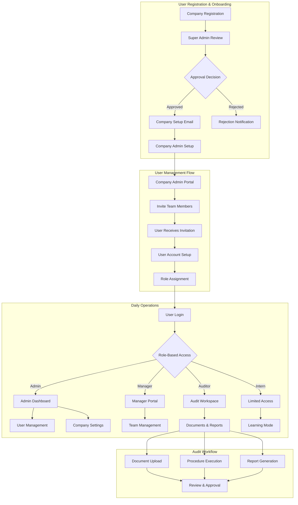
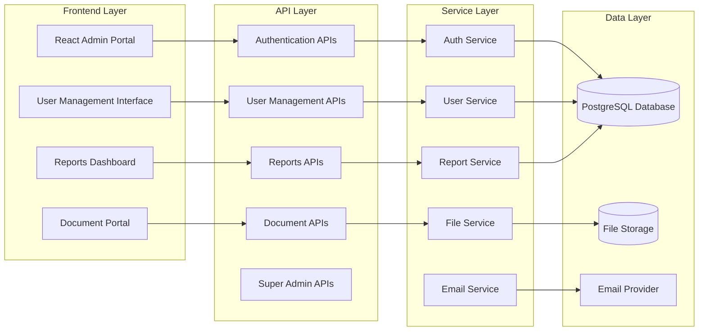
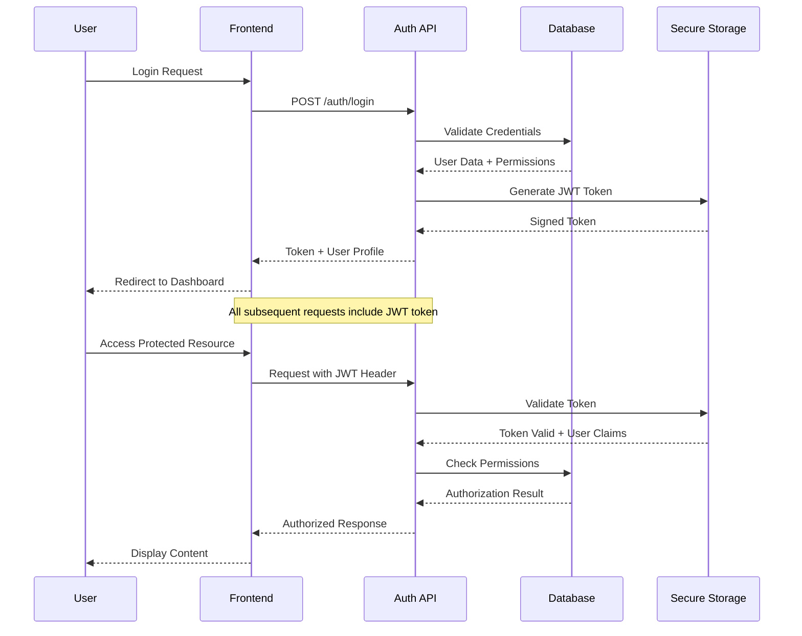

# CloudAudit Pro - Application Flow Overview

## System Architecture Overview

CloudAudit Pro is a multi-tenant SaaS audit management platform with a hierarchical user management system and comprehensive approval workflows.

## High-Level Application Flow



## Key System Components

### 1. **Authentication & Authorization System**
- JWT-based authentication
- Role-based access control (RBAC)
- Multi-tenant isolation
- Session management

### 2. **User Hierarchy & Roles**
```
SUPER_ADMIN (Platform Level)
    ├── ADMIN (Company Level)
    │   ├── MANAGER (Department Level)
    │   │   ├── SENIOR_AUDITOR
    │   │   │   ├── AUDITOR
    │   │   │   └── INTERN
```

### 3. **Core Modules**
- **Tenant Management**: Multi-company isolation
- **User Management**: Role-based user administration
- **Document Management**: File upload, storage, and organization
- **Audit Procedures**: Workflow automation
- **Reporting**: Analytics and financial reports
- **Email Notifications**: Automated communication

### 4. **Data Flow Architecture**


## Application States & Transitions

### User States
1. **Unregistered** → Registration → **Pending Approval**
2. **Pending Approval** → Super Admin Decision → **Approved/Rejected**
3. **Approved** → Setup → **Active**
4. **Active** → Normal Operations → **Active**
5. **Active** → Deactivation → **Inactive**

### Company States
1. **Registration** → **Pending Review**
2. **Pending Review** → **Approved/Rejected**
3. **Approved** → **Active**
4. **Active** → **Suspended** (if needed)

### Document States
1. **Draft** → **Submitted** → **Under Review** → **Approved/Rejected**
2. **Approved** → **Published**

## Security Flow



## Multi-Tenancy Implementation

### Tenant Isolation Strategy
1. **Database Level**: Tenant ID in every table
2. **API Level**: Automatic tenant context injection
3. **UI Level**: Tenant-specific branding and data

### Data Segregation
```sql
-- Every table includes tenantId for isolation
SELECT * FROM users WHERE tenantId = :currentTenantId;
SELECT * FROM documents WHERE tenantId = :currentTenantId;
SELECT * FROM procedures WHERE tenantId = :currentTenantId;
```

## Error Handling & Recovery

### Application Error States
1. **Authentication Failures**: Redirect to login
2. **Authorization Failures**: Show access denied
3. **Network Failures**: Retry mechanism
4. **Data Validation**: User-friendly error messages
5. **Server Errors**: Graceful degradation

### Backup & Recovery Flow
1. **Automatic Database Backups**: Daily incremental
2. **File Storage Redundancy**: Cloud storage replication
3. **Configuration Backup**: Environment settings
4. **Disaster Recovery**: Multi-region deployment ready

## Performance Considerations

### Optimization Strategies
1. **Database Indexing**: Optimized queries on tenant + user combinations
2. **Caching**: Redis for session and frequently accessed data
3. **File Storage**: CDN for document delivery
4. **API Pagination**: Large dataset handling
5. **Lazy Loading**: Frontend component optimization

### Scalability Design
- **Horizontal Scaling**: Stateless API design
- **Database Sharding**: Tenant-based partitioning ready
- **Microservice Ready**: Modular architecture
- **Load Balancing**: Session-aware distribution