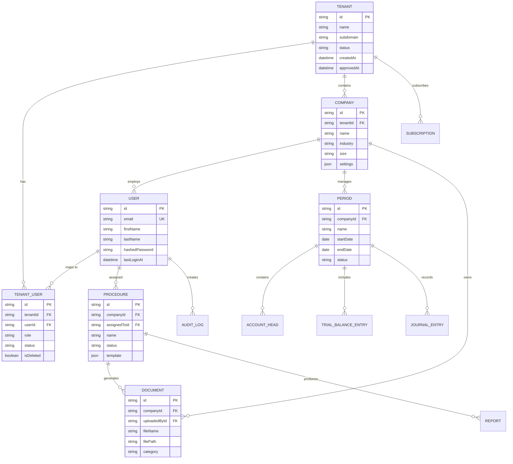
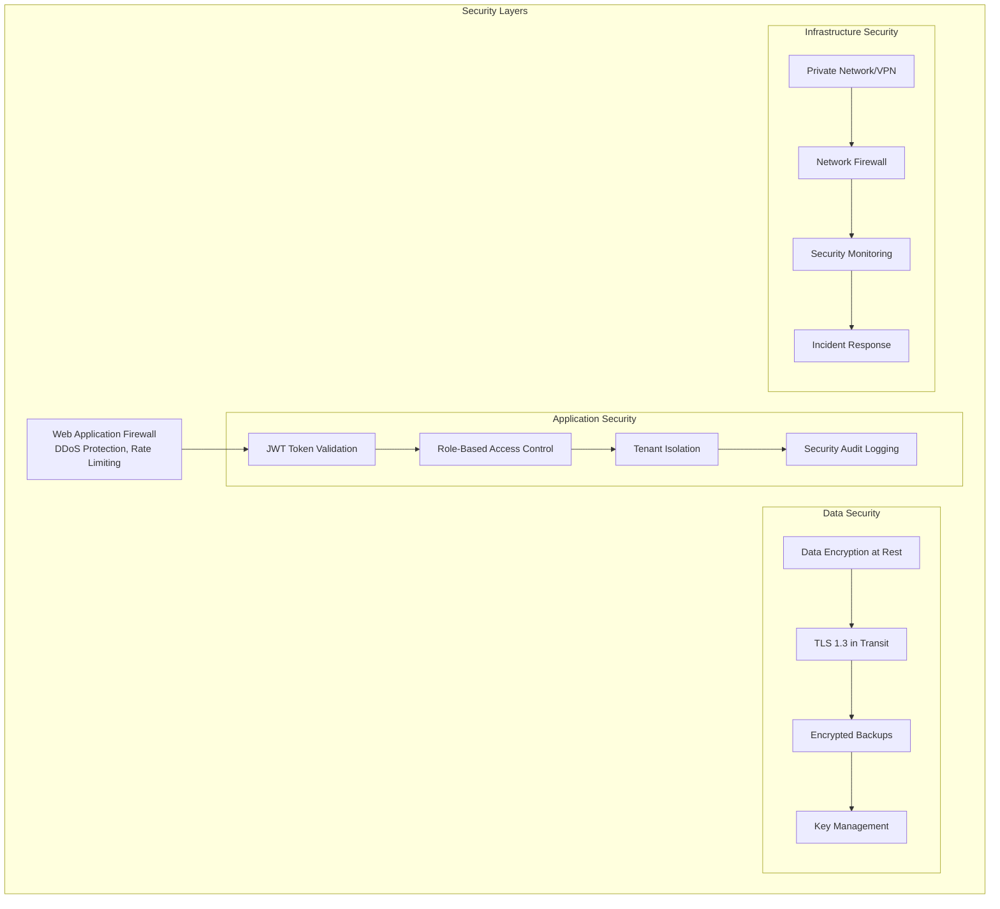
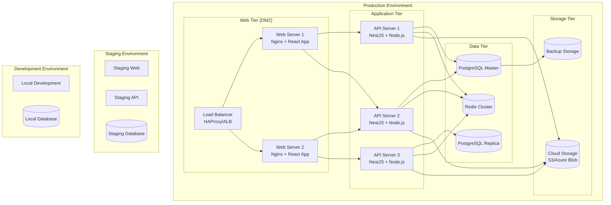
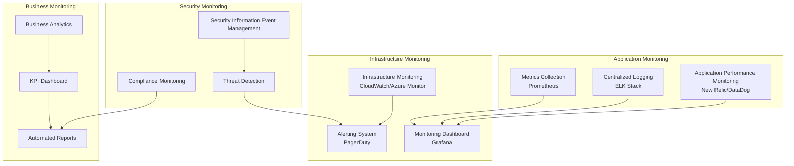
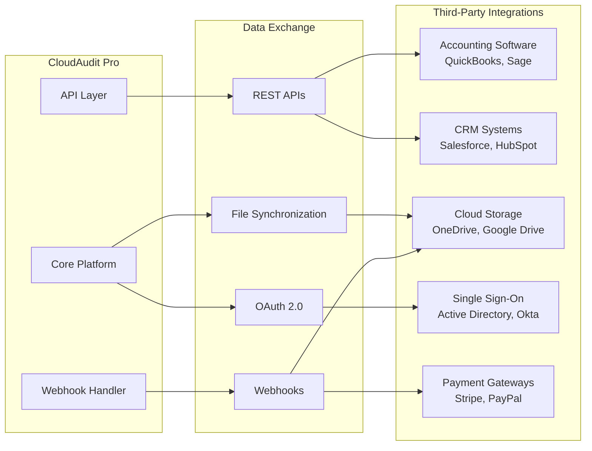

# CloudAudit Pro - System Architecture Diagrams

## Overall System Architecture

```mermaid
graph TB
    subgraph "Client Layer"
        WEB[Web Application<br/>React + TypeScript]
        MOB[Mobile App<br/>(Future)]
    end
    
    subgraph "Load Balancer & CDN"
        LB[Load Balancer]
        CDN[Content Delivery Network]
    end
    
    subgraph "Application Layer"
        API[NestJS API Server]
        AUTH[Authentication Service]
        EMAIL[Email Service]
        FILE[File Service]
    end
    
    subgraph "Data Layer"
        DB[(PostgreSQL<br/>Primary Database)]
        REDIS[(Redis Cache<br/>Sessions & Temp Data)]
        BLOB[File Storage<br/>Azure Blob/S3]
    end
    
    subgraph "External Services"
        SMTP[Email Provider<br/>SendGrid/SES]
        MONITOR[Monitoring<br/>New Relic/DataDog]
    end
    
    WEB --> LB
    MOB --> LB
    LB --> API
    CDN --> WEB
    
    API --> AUTH
    API --> EMAIL
    API --> FILE
    API --> DB
    API --> REDIS
    
    EMAIL --> SMTP
    FILE --> BLOB
    API --> MONITOR
```

## Database Architecture



## Microservices Architecture (Future State)

```mermaid
graph TB
    subgraph "API Gateway"
        GW[Kong/Nginx Gateway<br/>Rate Limiting, Auth]
    end
    
    subgraph "Core Services"
        AUTH_SVC[Authentication Service<br/>JWT, RBAC, Sessions]
        USER_SVC[User Management Service<br/>CRUD, Invitations, Roles]
        TENANT_SVC[Tenant Service<br/>Multi-tenancy, Isolation]
        COMPANY_SVC[Company Service<br/>Settings, Periods]
    end
    
    subgraph "Business Services"
        DOC_SVC[Document Service<br/>Upload, Storage, Metadata]
        PROC_SVC[Procedure Service<br/>Workflows, Templates]
        RPT_SVC[Report Service<br/>Generation, Analytics]
        AUDIT_SVC[Audit Service<br/>Trail, Compliance]
    end
    
    subgraph "Infrastructure Services"
        EMAIL_SVC[Email Service<br/>Templates, Notifications]
        FILE_SVC[File Service<br/>Storage, CDN]
        SEARCH_SVC[Search Service<br/>ElasticSearch]
        NOTIF_SVC[Notification Service<br/>Real-time Updates]
    end
    
    subgraph "Data Stores"
        MAIN_DB[(Main Database<br/>PostgreSQL)]
        DOC_DB[(Document Store<br/>MongoDB)]
        SEARCH_DB[(Search Index<br/>ElasticSearch)]
        CACHE[(Cache Layer<br/>Redis)]
        BLOB_STORAGE[(File Storage<br/>S3/Azure Blob)]
    end
    
    GW --> AUTH_SVC
    GW --> USER_SVC
    GW --> TENANT_SVC
    GW --> COMPANY_SVC
    GW --> DOC_SVC
    GW --> PROC_SVC
    GW --> RPT_SVC
    GW --> AUDIT_SVC
    
    AUTH_SVC --> MAIN_DB
    USER_SVC --> MAIN_DB
    TENANT_SVC --> MAIN_DB
    COMPANY_SVC --> MAIN_DB
    
    DOC_SVC --> DOC_DB
    DOC_SVC --> BLOB_STORAGE
    PROC_SVC --> MAIN_DB
    RPT_SVC --> MAIN_DB
    AUDIT_SVC --> MAIN_DB
    
    EMAIL_SVC --> CACHE
    FILE_SVC --> BLOB_STORAGE
    SEARCH_SVC --> SEARCH_DB
    NOTIF_SVC --> CACHE
```



## Security Architecture



## Deployment Architecture



## Monitoring & Observability Architecture



## Integration Architecture

