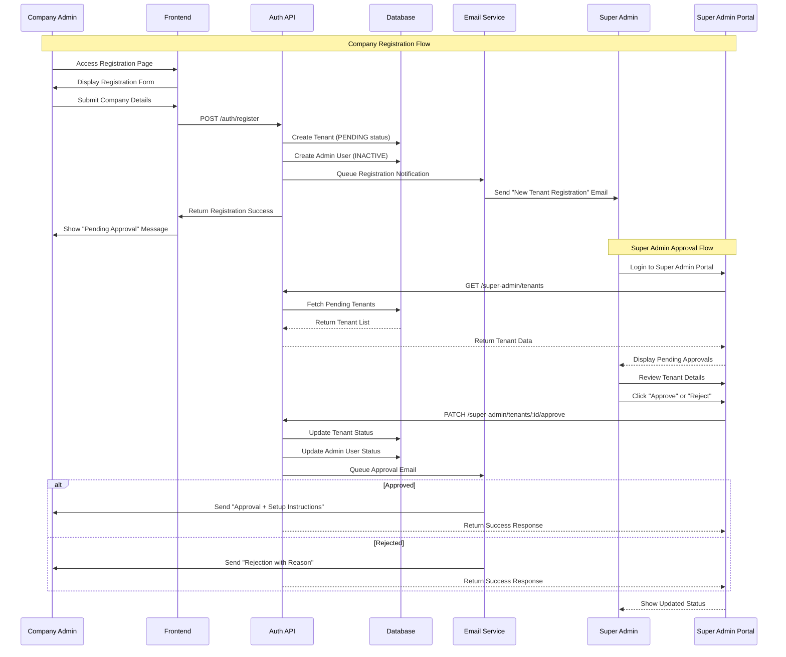
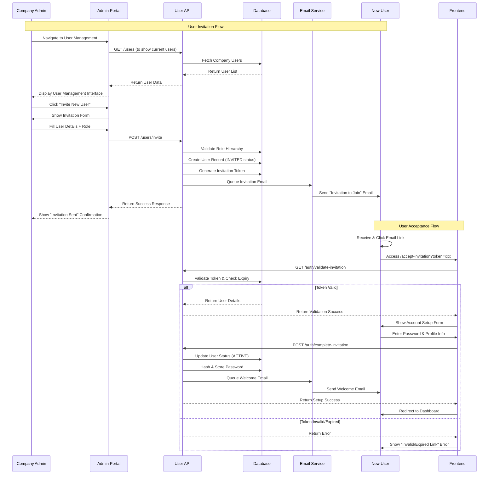
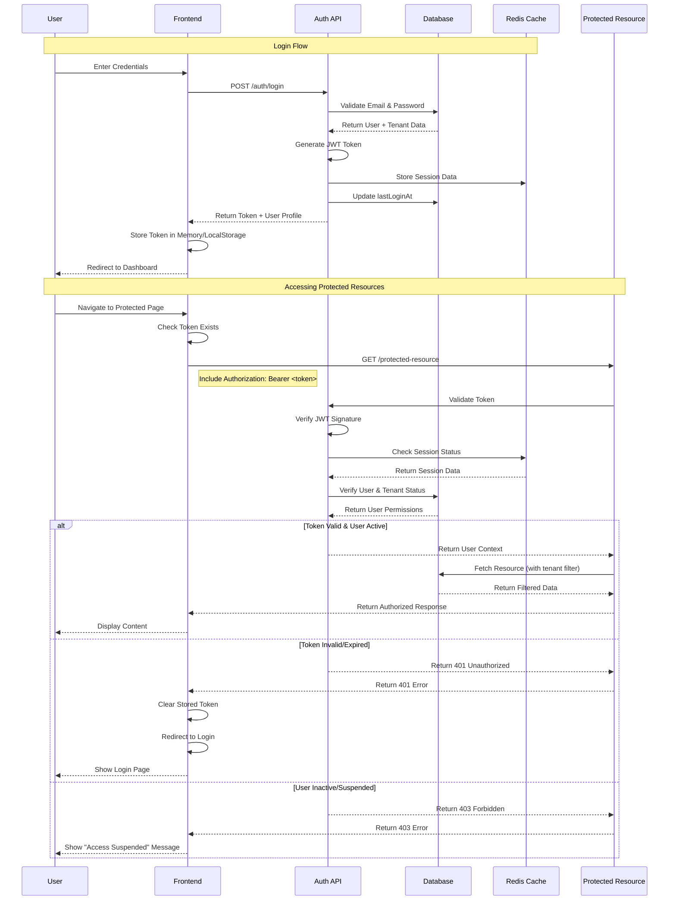
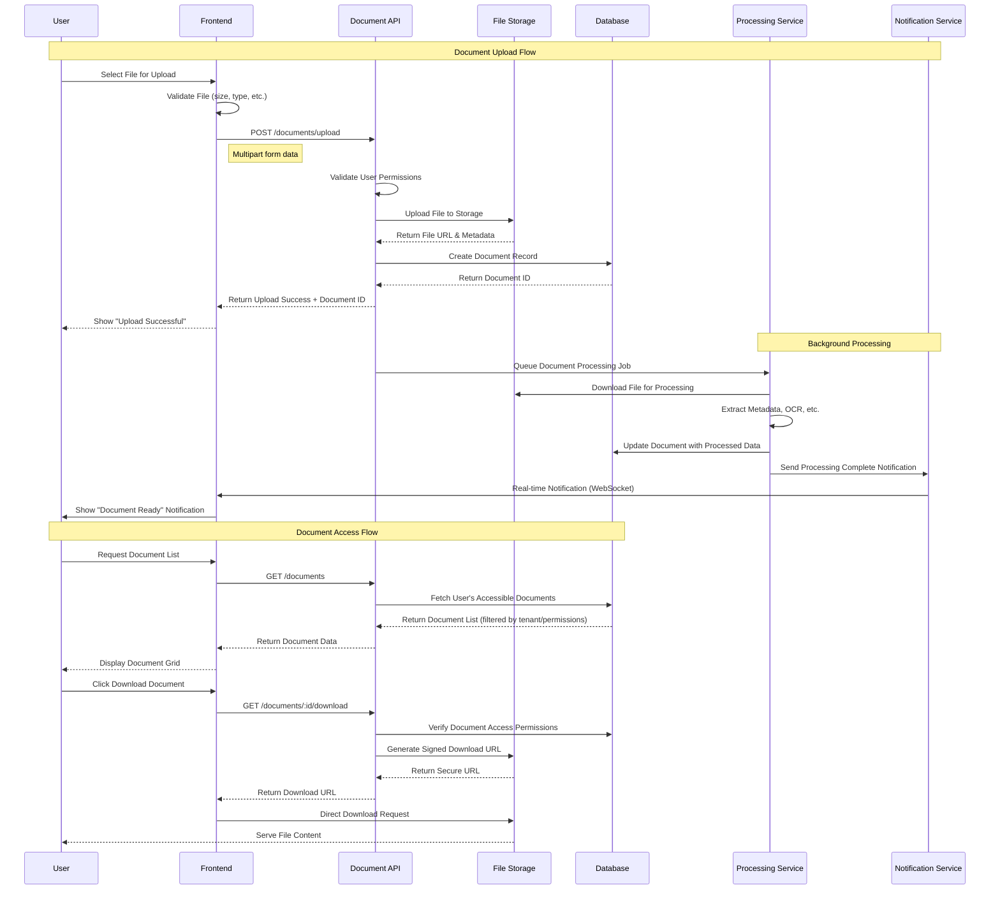
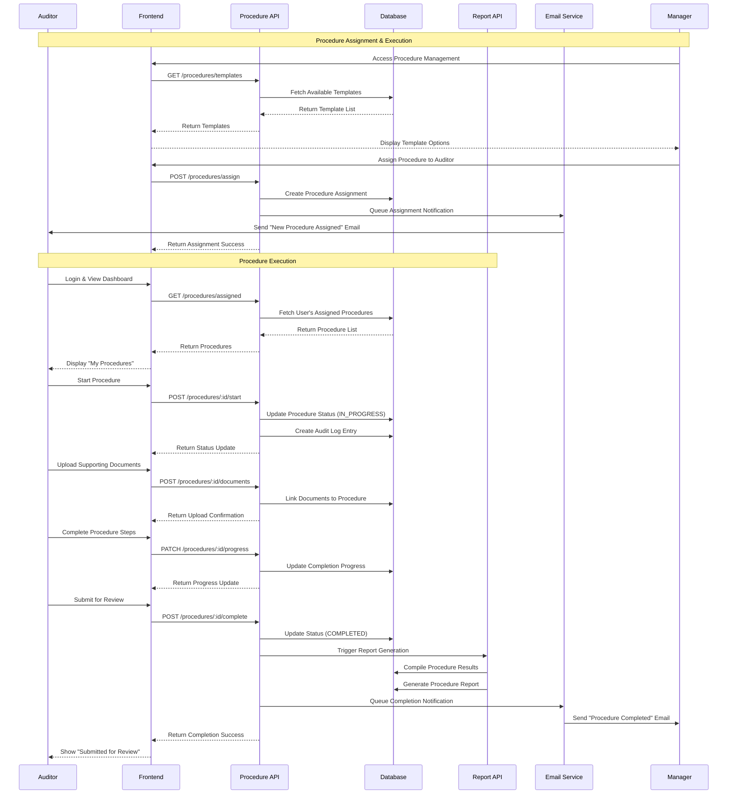
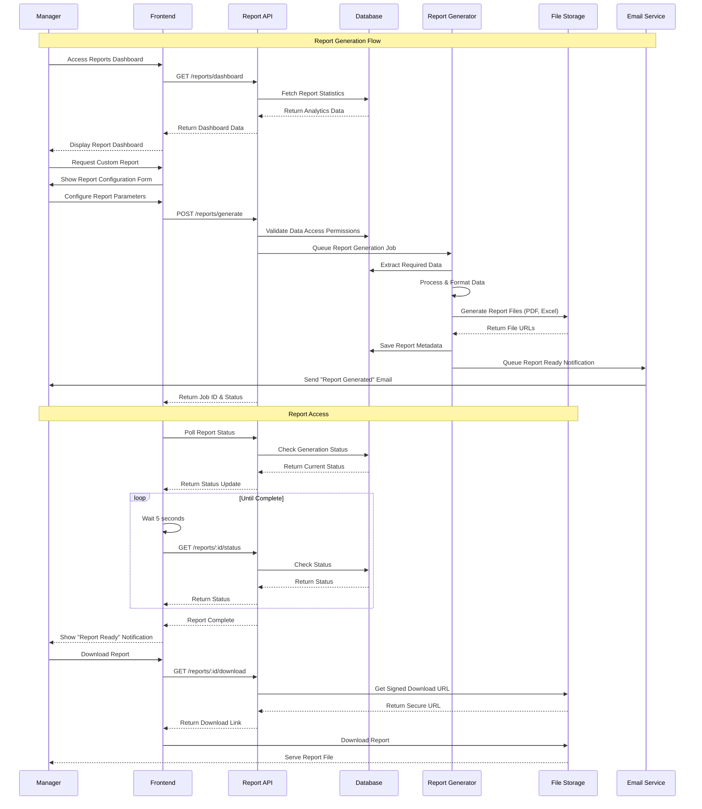
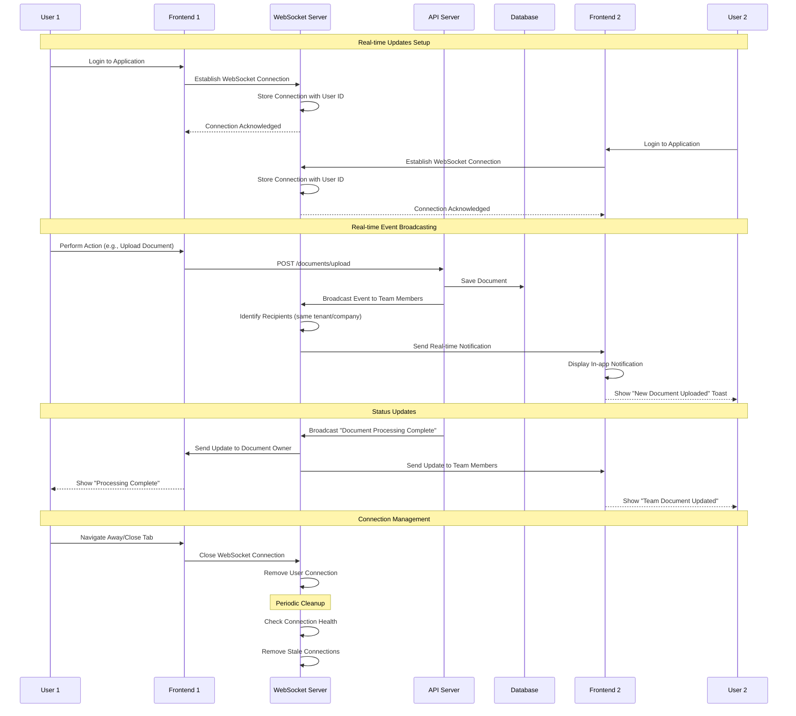

# CloudAudit Pro - Sequence Diagrams

## 1. User Registration & Tenant Approval Sequence

## 2. User Invitation & Onboarding Sequence

## 3. Authentication & Authorization Sequence

## 4. Document Upload & Processing Sequence

## 5. Audit Procedure Execution Sequence

## 6. Report Generation & Analytics Sequence

## 7. Real-time Notification & Updates Sequence

