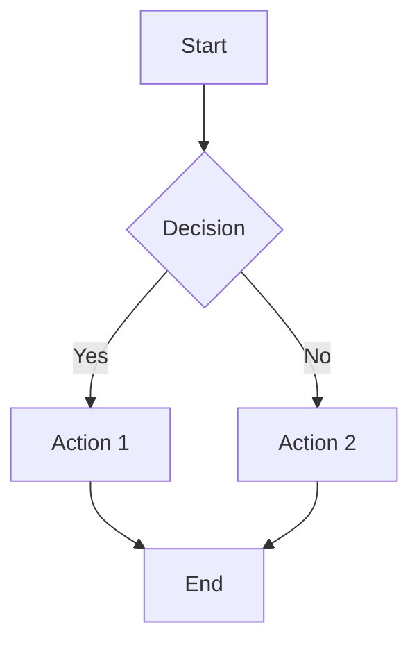
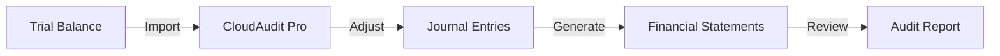

# 🚀 Quick Start Guide - CloudAudit Pro Learning Hub

## Welcome!

You now have a **professional Docusaurus-based learning documentation site** for CloudAudit Pro. This guide will help you get started immediately.

---

## ✅ What's Already Done

### Phase 1: Complete ✓ (100%)
- Docusaurus 3.0 project initialized
- React 18 components created
- Custom CSS with CloudAudit Pro branding
- Complete sidebar navigation structure (ready for 70+ pages)
- Homepage with learning paths
- Mobile-responsive design
- Dark mode support

### Phase 2: Partial ✓ (40%)
Created documentation:
- [Welcome Page](docs/intro.md) - Complete learning guide
- [What is Auditing?](docs/basics/what-is-auditing.md) - Beginner-friendly introduction
- [Audit Terminology](docs/basics/audit-terminology.md) - 50+ terms explained

---

## 🏃 Quick Start (5 Minutes)

### Step 1: Install Dependencies
```bash
cd c:\ADPorts\eAuditPro\audit-docs-learn
npm install
```

### Step 2: Start Development Server
```bash
npm start
```

The site will automatically open at: `http://localhost:3000`

### Step 3: Explore!
- Browse the homepage
- Check the sidebar navigation
- Read the intro and basics pages
- Try dark mode (top right toggle)
- Test search functionality

---

## 📝 Continue Building Content

### Option A: Complete Phase 2 (Next 30 mins)

Create these two files:

#### 1. System Overview (`docs/basics/system-overview.md`)
```markdown
---
sidebar_position: 3
title: System Overview
description: CloudAudit Pro at a glance
---

# CloudAudit Pro System Overview

[Your content here - explain what CloudAudit Pro is, features, etc.]
```

#### 2. Why CloudAudit Pro (`docs/basics/why-cloudaudit-pro.md`)
```markdown
---
sidebar_position: 4
title: Why CloudAudit Pro?
description: Benefits of using CloudAudit Pro
---

# Why Choose CloudAudit Pro?

[Your content here - benefits, comparison, success stories]
```

### Option B: Start Phase 3 - User Roles (Next 2-3 hours)

Create actor/role documentation:

**Template for each role:**
```markdown
---
sidebar_position: X
title: [Role Name]
description: Understanding the [Role] role
---

# [Role Name] - [One-line description]

## 👤 Meet [Persona Name]

<div className="persona-card">
  <div className="persona-avatar">👤</div>
  <div className="persona-info">
    <div className="persona-name">[Name], [Age]</div>
    <div className="persona-title">[Role Title]</div>
    <p><strong>Background:</strong> [Brief story]</p>
    <p><strong>Experience:</strong> [Years in role]</p>
  </div>
</div>

## 📋 Key Responsibilities
- Responsibility 1
- Responsibility 2
- Responsibility 3

## 🎯 Typical Day
1. Morning: [Tasks]
2. Afternoon: [Tasks]
3. Evening: [Tasks]

## 🔧 Tools & Features Used
- Feature 1
- Feature 2

## 📊 Sample Tasks
[Include real examples with sample data]

## 🔑 Permissions
[What they can/cannot do]
```

Files to create:
1. `docs/actors/overview.md`
2. `docs/actors/super-admin.md`
3. `docs/actors/admin.md`
4. `docs/actors/manager.md`
5. `docs/actors/senior-auditor.md`
6. `docs/actors/auditor.md`
7. `docs/actors/intern.md`
8. `docs/actors/client.md`

---

## 🎨 Using Custom Styles

### Role Badges
```markdown
<span className="role-badge super-admin">Super Admin</span>
<span className="role-badge admin">Admin</span>
<span className="role-badge manager">Manager</span>
<span className="role-badge senior-auditor">Senior Auditor</span>
<span className="role-badge auditor">Auditor</span>
<span className="role-badge intern">Intern</span>
<span className="role-badge client">Client</span>
```

### Status Badges
```markdown
<span className="status-badge not-started">Not Started</span>
<span className="status-badge in-progress">In Progress</span>
<span className="status-badge review">Review Required</span>
<span className="status-badge completed">Completed</span>
<span className="status-badge on-hold">On Hold</span>
```

### Persona Cards
```markdown
<div className="persona-card">
  <div className="persona-avatar">👨‍💼</div>
  <div className="persona-info">
    <div className="persona-name">John Smith</div>
    <div className="persona-title">Senior Auditor</div>
    <p>Details here...</p>
  </div>
</div>
```

### Feature Grid
```markdown
<div className="feature-grid">
  <div className="feature-item">
    <div className="feature-icon">🎯</div>
    <div className="feature-title">Feature Title</div>
    <p>Description...</p>
  </div>
</div>
```

### Download Button
```markdown
<a href="/downloads/sample.csv" className="download-button">Download Sample Data</a>
```

---

## 📊 Creating Diagrams

### Mermaid.js Flowcharts
````markdown

````

### More Complex Diagrams
````markdown

````

---

## 💡 Content Writing Tips

### 1. **Keep It Simple**
- Use everyday language
- Explain jargon
- Include examples
- Add analogies

### 2. **Be Visual**
- Add diagrams for processes
- Use tables for comparisons
- Include sample data
- Show before/after

### 3. **Make It Actionable**
- Step-by-step guides
- Real scenarios
- Sample workflows
- Practice exercises

### 4. **Use Admonitions**
```markdown
:::tip Helpful Tip
This will appear in a blue box with a lightbulb icon
:::

:::info Good to Know
Information box in blue
:::

:::warning Watch Out!
Yellow warning box
:::

:::danger Important!
Red danger/alert box
:::
```

---

## 📁 Folder Structure

```
docs/
├── intro.md                    ✅ Created
├── basics/                     
│   ├── what-is-auditing.md     ✅ Created
│   ├── audit-terminology.md    ✅ Created
│   ├── system-overview.md      ⏳ To create
│   └── why-cloudaudit-pro.md   ⏳ To create
├── actors/                     ⏳ To create (8 files)
├── processes/                  ⏳ To create (8 files)
├── modules/                    ⏳ To create (40+ files)
│   ├── company/
│   ├── periods/
│   ├── accounts/
│   ├── trial-balance/
│   ├── procedures/
│   ├── workpapers/
│   ├── journals/
│   ├── statements/
│   ├── documents/
│   ├── reporting/
│   ├── client-portal/
│   └── notifications/
├── data-flow/                  ⏳ To create (5 files)
├── examples/                   ⏳ To create (10+ files)
└── reference/                  ⏳ To create (5+ files)
```

---

## 🔧 Useful Commands

### Development
```bash
# Start dev server with live reload
npm start

# Build for production
npm run build

# Serve production build locally
npm run serve

# Clear cache (if issues)
npm run clear
```

### Adding New Pages
1. Create `.md` file in appropriate `docs/` subfolder
2. Add frontmatter:
   ```markdown
   ---
   sidebar_position: 1
   title: Page Title
   description: Page description
   ---
   ```
3. Content will automatically appear in sidebar (already configured!)

---

## 📚 Reference the Existing Documentation

Use these as templates/examples:
- **Main project docs**: `c:\ADPorts\eAuditPro\docs\`
- **Functionality docs**: `c:\ADPorts\eAuditPro\CloudAudit_Pro\functionalities\`
- **Already created**: Look at `docs/basics/what-is-auditing.md` for structure

---

## 🎯 Success Checklist

Before considering any phase complete:

- [ ] All planned files created
- [ ] Content is beginner-friendly
- [ ] Examples included
- [ ] Diagrams added where helpful
- [ ] Links between pages work
- [ ] Tested on `npm start`
- [ ] No broken links
- [ ] Consistent formatting

---

## 🚀 Next Steps

### Immediate (Today):
1. Run `npm install` and `npm start`
2. Browse what's created
3. Create 2 remaining Phase 2 files

### Short-term (This Week):
1. Complete Phase 3 (User Roles - 8 files)
2. Start Phase 4 (Business Processes - 8 files)

### Medium-term (This Month):
1. Complete Phase 5 (Modules - 40+ files)
2. Add Phase 6 (Data Flows)
3. Create Phase 7 (Examples)

---

## 💬 Need Help?

### Resources:
- **Docusaurus Docs**: https://docusaurus.io/docs
- **Markdown Guide**: https://www.markdownguide.org/
- **Mermaid Diagrams**: https://mermaid.js.org/
- **Material Icons**: https://fonts.google.com/icons

### Common Issues:
1. **Port 3000 in use**: `npx kill-port 3000` then `npm start`
2. **Build errors**: `npm run clear` then try again
3. **Styling issues**: Check `src/css/custom.css`

---

## 🎉 You're Ready!

You now have:
✅ A working Docusaurus site
✅ Custom branding and styles  
✅ Complete navigation structure  
✅ Sample content to use as templates  
✅ This guide to continue building  

**Time to create amazing learning content!** 🚀

---

*Quick Start Guide - CloudAudit Pro Learning Hub*
*Last Updated: January 1, 2026*
