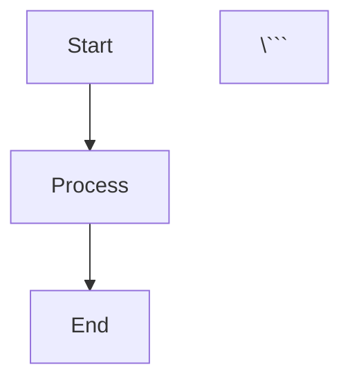

# CloudAudit Pro Learning Hub 📚

**A Comprehensive Learning Resource for Modern Audit Management**

Welcome to the CloudAudit Pro Learning Hub - your complete guide to understanding and mastering the CloudAudit Pro audit management platform. This documentation is designed to be accessible to everyone, regardless of your background in auditing or accounting.

## 🎯 What is This?

This is an interactive learning documentation built with **React** and **Docusaurus** that explains:
- What CloudAudit Pro is and why it exists
- How audit processes work in the real world
- Every feature and module in detail
- Complete data flows with sample data
- Real-world examples and scenarios
- Step-by-step guides for all user roles

## 👥 Who Is This For?

- **Non-Accountants/Auditors**: Learn audit concepts from scratch
- **New Auditors**: Understand modern audit workflows
- **Audit Managers**: See how to manage teams and engagements
- **Developers**: Understand the business domain
- **Anyone Curious**: Learn how professional audits work

## 🚀 Quick Start

### Prerequisites
- Node.js 18 or higher
- npm or yarn

### Installation

```bash
# Install dependencies
npm install

# Start the development server
npm start
```

The site will open at `http://localhost:3000`

### Building for Production

```bash
# Create production build
npm run build

# Serve the production build locally
npm run serve
```

## 📚 Documentation Structure

### 1. **Understanding the Basics**
Start here if you're new to auditing or CloudAudit Pro
- What is auditing?
- Audit terminology explained
- System overview
- Why CloudAudit Pro?

### 2. **Meet the Team - User Roles**
Learn about different user roles with real-world personas
- Super Admin
- Company Admin
- Manager
- Senior Auditor
- Auditor
- Intern
- Client

### 3. **The Audit Journey**
Follow the complete audit lifecycle from start to finish
- Setup Phase
- Planning Phase
- Trial Balance Import
- Execution Phase
- Review Phase
- Reporting Phase
- Completion Phase

### 4. **System Modules**
Deep dive into each feature with examples
- Company Management
- Period Management
- Chart of Accounts
- Trial Balance
- Audit Procedures
- Workpapers & Findings
- Journal Entries
- Financial Statements
- Document Management
- Reporting & Analytics
- Client Portal
- Notifications

### 5. **Data Flow & Transformations**
See how data moves through the system
- Trial Balance to Financial Statements
- Procedure to Report
- Document Flow
- Complete Lifecycle

### 6. **Real-World Examples**
Learn from realistic scenarios
- Sample Companies (ABC Manufacturing, XYZ Retail, Tech Startup)
- Complete Scenarios (Year-end audit, Interim review, etc.)
- Sample Data Sets

### 7. **Reference Materials**
Quick access to important information
- Glossary (100+ terms)
- Quick Guides
- FAQ
- Data Dictionary

## 🎨 Features

✅ **Beginner-Friendly**: No prior knowledge assumed  
✅ **Visual Learning**: Diagrams, flowcharts, and examples throughout  
✅ **Interactive**: Search, navigation, and collapsible sections  
✅ **Sample Data**: Real-world examples at every step  
✅ **Progressive**: Learn at your own pace  
✅ **Mobile-Friendly**: Access on any device  
✅ **Dark Mode**: Easy on the eyes  

## 🛠️ Technology Stack

- **React 18**: Modern UI framework
- **Docusaurus 3**: Documentation framework
- **Mermaid.js**: Diagram rendering
- **TypeScript**: Type-safe code examples
- **Markdown**: Easy-to-edit content

## 📁 Project Structure

```
audit-docs-learn/
├── docs/                    # All documentation content
│   ├── intro.md            # Welcome page
│   ├── basics/             # Fundamental concepts
│   ├── actors/             # User roles
│   ├── processes/          # Business processes
│   ├── modules/            # Feature documentation
│   ├── data-flow/          # Data transformations
│   ├── examples/           # Real-world scenarios
│   └── reference/          # Glossary, FAQ, guides
├── src/
│   ├── components/         # Custom React components
│   ├── css/               # Custom styling
│   └── pages/             # Custom pages
├── static/                # Static assets (images, files)
│   ├── img/               # Images and diagrams
│   └── downloads/         # Downloadable samples
├── docusaurus.config.js   # Docusaurus configuration
├── sidebars.js            # Sidebar navigation
└── package.json           # Dependencies

```

## 📖 Content Guidelines

### Writing Style
- **Simple Language**: Avoid jargon where possible
- **Define Terms**: Explain technical terms when used
- **Use Examples**: Provide real-world scenarios
- **Visual Aids**: Include diagrams and screenshots
- **Progressive Disclosure**: Start simple, add detail gradually

### Content Structure
Each document should include:
- Clear title and purpose
- Learning objectives
- Step-by-step explanations
- Sample data and examples
- Visual diagrams
- Related topics links

## 🤝 Contributing

### Adding New Documentation
1. Create a new `.md` file in the appropriate `docs/` subdirectory
2. Add front matter with title and description
3. Write content following the style guide
4. Add to `sidebars.js` for navigation
5. Test locally with `npm start`

### Creating Diagrams
Use Mermaid.js syntax for diagrams:

```markdown


## 📊 Progress Tracking

Documentation is organized into phases:
- ✅ Phase 1: Project initialization (Complete)
- 🚧 Phase 2: Introduction & basics (In Progress)
- ⏳ Phase 3: User roles (Planned)
- ⏳ Phase 4: Business processes (Planned)
- ⏳ Phase 5: Module documentation (Planned)
- ⏳ Phase 6: Data flows (Planned)
- ⏳ Phase 7: Examples (Planned)
- ⏳ Phase 8: Visual aids (Planned)
- ⏳ Phase 9: Reference materials (Planned)
- ⏳ Phase 10: Interactive features (Planned)

## 🎯 Learning Paths

### Path 1: Complete Beginner
1. Read "Understanding the Basics"
2. Explore "Meet the Team"
3. Follow "The Audit Journey"
4. Try a complete scenario from "Examples"

### Path 2: Technical User
1. System Overview
2. Architecture & Data Flow
3. Module Documentation
4. API Reference

### Path 3: Audit Professional
1. User Roles
2. Business Processes
3. Procedures & Workpapers
4. Reporting & Analytics

## 📞 Support

For questions or issues:
- Check the FAQ section
- Search the documentation
- Review examples and scenarios
- Contact support (if applicable)

## 📄 License

This documentation is part of the CloudAudit Pro project.

---

**Happy Learning! 🎓**

*Last Updated: January 1, 2026*
