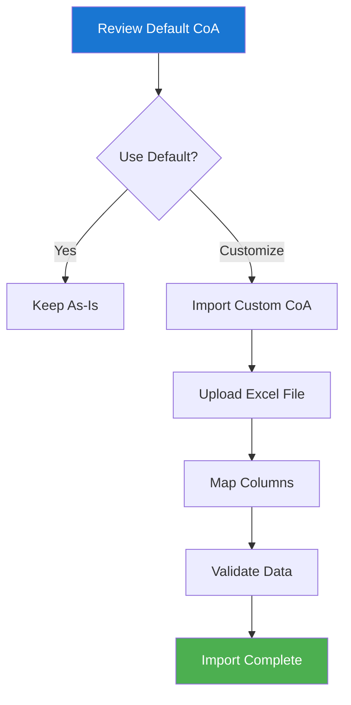
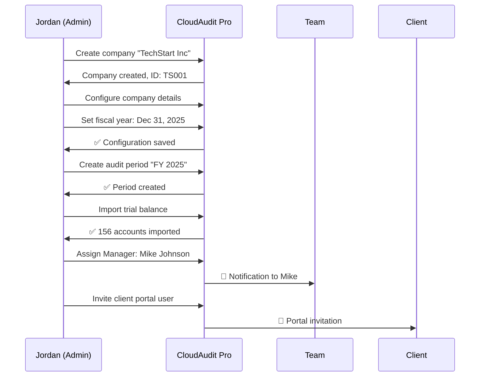
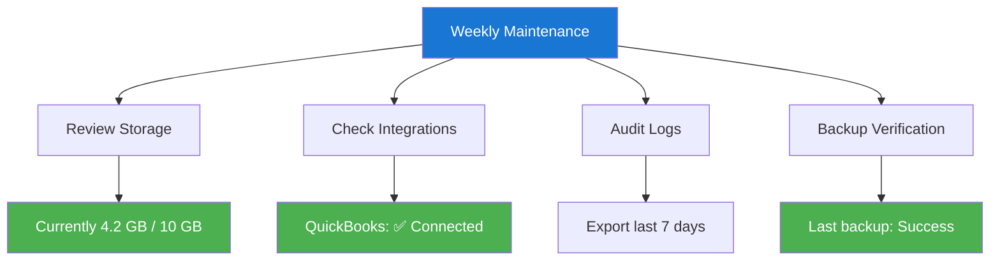

# <span className="role-badge admin">Company Admin</span> The Setup Manager

## 👤 Meet Jordan - Your Company Admin

<div className="persona-card">
  <div className="persona-avatar">
    <div className="avatar-circle admin">👔</div>
  </div>
  <div className="persona-info">
    <h3>Jordan Martinez</h3>
    <p className="persona-role">Managing Partner & IT Lead</p>
    <p><strong>Background:</strong> CPA with 15 years at Acme CPA Firm, handles both audit work and firm operations</p>
    <p><strong>Responsibility:</strong> Set up and maintain CloudAudit Pro for the entire firm</p>
    <p><strong>Daily Focus:</strong> Manage users, configure company settings, oversee all firm audits</p>
  </div>
</div>

---

## 🎯 What Does a Company Admin Do?

Think of the Company Admin as **the office manager** who:
- 🏢 Sets up the office (company configuration)
- 👥 Hires and manages staff (user management)
- 📋 Establishes processes (templates and workflows)
- 📊 Oversees all projects (all audits)

### Key Differences

| Aspect | Company Admin | Manager | Other Roles |
|--------|---------------|---------|-------------|
| **Scope** | Entire company | Assigned audits | Own work only |
| **Users** | Manage all users | View team only | No access |
| **Settings** | Full control | Limited | None |
| **Audits** | See all | See assigned | See assigned |
| **Setup** | Creates foundation | Uses foundation | Uses foundation |

---

## 📅 Jordan's First Week - Company Setup

### Day 1: Account Activation

**9:00 AM - Welcome Email Arrives**

```
📧 Welcome to CloudAudit Pro!

Hi Jordan,

Your account has been approved by our team!

🔗 Login: https://acmecpa.cloudaudit.com
📧 Email: jordan@acmecpa.com
🔑 Temporary Password: [Check separate email]

Next Steps:
1. Complete your profile
2. Set up company details
3. Invite your team
4. Import your first client

Need help? support@cloudaudit.com

- The CloudAudit Pro Team
```

**9:15 AM - First Login**

<div className="process-flow">

**Step 1: Change Password**
```
Old: TempPass123!
New: [Jordan's secure password]
✅ Password updated successfully
```

**Step 2: Setup Wizard Launches**
```
👋 Welcome Jordan!
Let's get Acme CPA Firm set up in 5 minutes

Progress: [▓░░░░] 1/5
```

**Step 3: Company Profile**
```
Company Name: Acme CPA Firm
Industry: Professional Services - Accounting
Firm Size: 10-25 employees
Primary Services: ☑️ Audit  ☑️ Tax  ☑️ Advisory
Fiscal Year End: December 31
```

**Step 4: Regional Settings**
```
Country: United States
Currency: USD ($)
Date Format: MM/DD/YYYY
Time Zone: Eastern Time (UTC-5)
Language: English
```

**Step 5: Branding (Optional)**
```
Logo: [Upload acme-logo.png]
Primary Color: #1E88E5
Report Footer: "Acme CPA Firm | Trusted Since 2010"
```

</div>

**10:00 AM - Setup Complete!**

```
✅ Company Setup Complete!

Your CloudAudit Pro workspace is ready:
- Company profile configured
- Default chart of accounts loaded
- Standard procedures imported
- Email templates ready

Next: Invite your team members
```

---

### Day 2: Setting Up Chart of Accounts

**Jordan's Task:** Configure the chart of accounts that all audits will use



**Jordan's Custom Chart of Accounts:**

```
📊 Acme CPA Firm - Chart of Accounts
Total Accounts: 247

Assets (1000-1999)
├── 1000-1199: Current Assets
│   ├── 1000: Cash - Operating
│   ├── 1010: Cash - Payroll
│   ├── 1020: Petty Cash
│   ├── 1100: Accounts Receivable
│   └── 1150: Allowance for Doubtful Accounts
├── 1200-1499: Fixed Assets
│   ├── 1200: Land
│   ├── 1210: Buildings
│   └── 1250: Accumulated Depreciation
└── 1500-1999: Other Assets
    ├── 1500: Intangible Assets
    └── 1600: Investments

Liabilities (2000-2999)
├── 2000-2199: Current Liabilities
│   ├── 2000: Accounts Payable
│   ├── 2100: Accrued Expenses
│   └── 2150: Payroll Liabilities
└── 2200-2999: Long-term Liabilities
    ├── 2200: Notes Payable
    └── 2300: Mortgage Payable

Equity (3000-3999)
├── 3000: Common Stock
├── 3100: Retained Earnings
└── 3900: Current Year Net Income

Revenue (4000-4999)
├── 4000: Service Revenue
├── 4100: Product Sales
└── 4900: Other Income

Expenses (5000-9999)
├── 5000-5999: Cost of Sales
├── 6000-6999: Operating Expenses
├── 7000-7999: Payroll Expenses
└── 8000-8999: Other Expenses
```

**Import Process:**

```javascript
// Jordan uploads: acme_chart_of_accounts.xlsx
{
  "file": "acme_chart_of_accounts.xlsx",
  "rows": 247,
  "mapping": {
    "column_a": "account_number",
    "column_b": "account_name",
    "column_c": "account_type",
    "column_d": "description"
  },
  "validation": {
    "duplicates": 0,
    "invalid_types": 0,
    "missing_required": 0
  },
  "status": "✅ Ready to import"
}

// Import Results:
✅ 247 accounts imported
✅ 5 account types configured
✅ Chart of accounts activated
```

---

### Day 3: Inviting the Team

**Jordan's Team Structure:**

```
Acme CPA Firm Team (10 people)
├── Jordan Martinez (Admin)
├── 2 Managers
│   ├── Mike Johnson
│   └── Lisa Chen
├── 3 Senior Auditors
│   ├── Sarah Williams
│   ├── David Brown
│   └── Emily Davis
└── 4 Staff Auditors
    ├── Emma Thompson
    ├── Tom Anderson
    ├── Chris Miller
    └── Alex Garcia
```

**Invitation Process:**

<div className="process-flow">

**Step 1: Navigate to User Management**
```
Settings → Users → Invite Users
```

**Step 2: Add Team Members**
```
📧 Email Address          | 👤 Role            | 📊 Access Level
mike@acmecpa.com         | Manager            | All Audits
lisa@acmecpa.com         | Manager            | All Audits
sarah@acmecpa.com        | Senior Auditor     | Assigned Audits
david@acmecpa.com        | Senior Auditor     | Assigned Audits
emily@acmecpa.com        | Senior Auditor     | Assigned Audits
emma@acmecpa.com         | Auditor            | Assigned Audits
tom@acmecpa.com          | Auditor            | Assigned Audits
chris@acmecpa.com        | Auditor            | Assigned Audits
alex@acmecpa.com         | Auditor            | Assigned Audits
```

**Step 3: Customize Invitation**
```
Email Subject: Join Acme CPA Firm on CloudAudit Pro!

Message:
Hi Team,

We're now using CloudAudit Pro for all our audits!
Please click the link below to set up your account.

Training session: Friday 2 PM
- Jordan
```

**Step 4: Send Invitations**
```
✅ 9 invitations sent
📧 Welcome emails delivered
⏳ Waiting for team to accept
```

</div>

**Tracking Acceptance:**

```
User Invitation Status
━━━━━━━━━━━━━━━━━━━━━━━━━━━━━━━━━━━━━━━━━━━━━━

✅ Mike Johnson        Accepted 10 mins ago
✅ Sarah Williams      Accepted 25 mins ago
✅ Emma Thompson       Accepted 1 hour ago
⏳ Lisa Chen          Invited 2 hours ago
⏳ David Brown        Invited 2 hours ago
✅ Emily Davis        Accepted 45 mins ago
✅ Tom Anderson       Accepted 30 mins ago
⏳ Chris Miller       Invited 2 hours ago
⏳ Alex Garcia        Invited 2 hours ago

Progress: 5/9 accepted (56%)
```

---

### Day 4: Creating First Client Company

**Jordan Sets Up First Client:**



**Company Details:**

```javascript
// TechStart Inc - Client Company
{
  "company_code": "TS001",
  "legal_name": "TechStart Inc.",
  "industry": "Technology - Software",
  "fiscal_year_end": "12/31",
  "incorporation_date": "2018-03-15",
  "entity_type": "C-Corporation",
  "contact": {
    "name": "Robert Tech",
    "title": "CFO",
    "email": "robert@techstart.com",
    "phone": "(555) 123-4567"
  },
  "address": {
    "street": "123 Innovation Drive",
    "city": "San Francisco",
    "state": "CA",
    "zip": "94105"
  },
  "audit_info": {
    "first_year": 2025,
    "audit_type": "Financial Statement Audit",
    "materiality": 50000,
    "risk_level": "Medium"
  }
}
```

**Initial Period Setup:**

```
📅 Audit Period: FY 2025
━━━━━━━━━━━━━━━━━━━━━━━━━━━━━━━━━━━━━━━━━━━━━━

Period Details:
  Start Date: January 1, 2025
  End Date: December 31, 2025
  Status: 🟡 In Progress
  
Financials:
  Assets: $2,450,000
  Liabilities: $890,000
  Equity: $1,560,000
  Revenue: $4,200,000
  Net Income: $425,000
  
Audit Team:
  Manager: Mike Johnson
  Seniors: Sarah Williams, David Brown
  Staff: Emma Thompson, Tom Anderson
  
Procedures:
  ✅ 47 standard procedures loaded
  ⏳ 0 procedures completed
  🎯 Target completion: March 31, 2026
```

---

### Day 5: Configuring Templates & Workflows

**Jordan Customizes Audit Templates:**

```
📋 Procedure Templates
━━━━━━━━━━━━━━━━━━━━━━━━━━━━━━━━━━━━━━━━━━━━━━

Standard Templates (47):
├── Cash & Cash Equivalents (5)
│   ├── Bank Reconciliation
│   ├── Confirm Bank Balances
│   ├── Test Cutoff
│   ├── Review Restrictions
│   └── Evaluate Presentation
│
├── Accounts Receivable (6)
│   ├── Aging Analysis
│   ├── Confirmations
│   ├── Collectibility Assessment
│   ├── Subsequent Collections
│   ├── Credit Memo Review
│   └── Allowance Adequacy
│
├── Inventory (7)
│   ├── Physical Count Observation
│   ├── Pricing Test
│   ├── Obsolescence Review
│   ├── Cutoff Testing
│   └── ...
│
└── [42 more procedures across all areas]

Custom Templates (Jordan added 5):
├── Tech Company Revenue Recognition
├── SaaS Subscription Analysis
├── R&D Capitalization Review
├── Stock Option Valuation
└── Cloud Infrastructure Costs
```

**Workflow Configuration:**


**Email Notification Settings:**

```javascript
// Jordan's notification configuration
{
  "notifications": {
    "procedure_assignment": {
      "enabled": true,
      "recipients": ["assigned_user"],
      "template": "You've been assigned: {{procedure_name}}"
    },
    "review_required": {
      "enabled": true,
      "recipients": ["reviewer"],
      "template": "Ready for review: {{procedure_name}}"
    },
    "deadline_approaching": {
      "enabled": true,
      "days_before": 3,
      "recipients": ["assigned_user", "manager"],
      "template": "⚠️ Due in {{days}} days: {{procedure_name}}"
    },
    "overdue": {
      "enabled": true,
      "recipients": ["assigned_user", "manager", "admin"],
      "template": "🚨 OVERDUE: {{procedure_name}}"
    }
  }
}
```

---

## 🔑 Company Admin Powers

### What Jordan Can Do

<div className="feature-grid">

<div className="card">
<h4>👥 User Management</h4>

**Full Control Over Users:**
- ✅ Invite new users
- ✅ Assign/change roles
- ✅ Deactivate users
- ✅ Reset passwords
- ✅ View all user activity
- ✅ Manage permissions

**Bulk Operations:**
- Import users from Excel
- Batch role updates
- Mass email to team
</div>

<div className="card">
<h4>🏢 Company Settings</h4>

**Configure Everything:**
- ✅ Company profile
- ✅ Chart of accounts
- ✅ Fiscal periods
- ✅ Branding/logo
- ✅ Regional settings
- ✅ Email templates

**Integrations:**
- QuickBooks sync
- Excel import/export
- Email server settings
</div>

<div className="card">
<h4>📊 Client Management</h4>

**All Client Companies:**
- ✅ Create clients
- ✅ Edit client details
- ✅ Archive old clients
- ✅ View all audits
- ✅ Manage client portal
- ✅ Document repository

**Client Portal:**
- Enable/disable access
- Invite client users
- Configure permissions
</div>

<div className="card">
<h4>📋 Template Management</h4>

**Procedure Templates:**
- ✅ Create templates
- ✅ Edit templates
- ✅ Import/export
- ✅ Set defaults
- ✅ Version control

**Document Templates:**
- Report templates
- Workpaper templates
- Email templates
</div>

<div className="card">
<h4>📈 Reporting & Analytics</h4>

**Firm-Wide Visibility:**
- ✅ All audit status
- ✅ Team utilization
- ✅ Time tracking
- ✅ Performance metrics
- ✅ Compliance reports

**Dashboards:**
- Real-time overview
- Custom reports
- Export to Excel
</div>

<div className="card">
<h4>🔒 Security & Compliance</h4>

**Security Controls:**
- ✅ 2FA enforcement
- ✅ Password policies
- ✅ Session management
- ✅ Audit logs
- ✅ Data export

**Compliance:**
- AICPA standards
- Data retention
- Backup management
</div>

</div>

---

## 📅 Jordan's Monthly Tasks

### Week 1: Review & Planning

**Monday Morning Routine:**

```
☕ Jordan's Monday Checklist
━━━━━━━━━━━━━━━━━━━━━━━━━━━━━━━━━━━━━━━━━━━━━━

📊 Dashboard Review:
  ✅ Check overall firm status
  ✅ Review active audits (currently 8)
  ✅ Check team capacity
  ✅ Review overdue items (3 procedures)
  
👥 Team Status:
  ✅ Verify all users active
  ✅ Check recent login times
  ✅ Review permission requests (1 pending)
  
🚨 Issues to Address:
  ⚠️  TechStart audit 15% over budget
  ⚠️  2 procedures overdue (RetailCo)
  ✅ All other audits on track
  
📅 This Week:
  • Tuesday: New client onboarding (ManufacCo)
  • Thursday: Team training on new features
  • Friday: Month-end reporting
```

**Dashboard View:**

```
╔══════════════════════════════════════════════════════════════╗
║  Acme CPA Firm - Admin Dashboard                            ║
╠══════════════════════════════════════════════════════════════╣
║                                                              ║
║  Team Status: ✅ 9/10 users active                          ║
║  Active Audits: 8 (3 planning, 4 fieldwork, 1 reporting)   ║
║  This Month: 67% procedures complete                        ║
║                                                              ║
║  ━━━━━━━━━━━━━━━━━━━━━━━━━━━━━━━━━━━━━━━━━━━━━━━━━━━━━━━  ║
║                                                              ║
║  🎯 QUICK STATS                                              ║
║   Companies:    12 active clients                           ║
║   Procedures:   156 total, 104 complete, 52 in progress    ║
║   Documents:    2,847 uploaded this month                   ║
║   Workpapers:   189 completed                               ║
║                                                              ║
║  ━━━━━━━━━━━━━━━━━━━━━━━━━━━━━━━━━━━━━━━━━━━━━━━━━━━━━━━  ║
║                                                              ║
║  ⚠️  ATTENTION NEEDED                                        ║
║   🔴 2 procedures overdue (RetailCo)                        ║
║   🟡 1 audit over budget (TechStart - 15%)                  ║
║   🟡 3 procedures due this week                             ║
║                                                              ║
║  ━━━━━━━━━━━━━━━━━━━━━━━━━━━━━━━━━━━━━━━━━━━━━━━━━━━━━━━  ║
║                                                              ║
║  📊 TEAM UTILIZATION (This Week)                             ║
║   Mike Johnson:     ████████░░ 85% (2 audits)              ║
║   Lisa Chen:        ██████░░░░ 60% (1 audit)               ║
║   Sarah Williams:   ██████████ 95% (3 audits)              ║
║   David Brown:      ████████░░ 80% (2 audits)              ║
║   Emily Davis:      ███████░░░ 70% (2 audits)              ║
║   Emma Thompson:    ██████░░░░ 65% (1 audit)               ║
║   Tom Anderson:     ████░░░░░░ 40% (1 audit)               ║
║   Chris Miller:     ████████░░ 75% (2 audits)              ║
║   Alex Garcia:      ██████░░░░ 55% (1 audit)               ║
║                                                              ║
╚══════════════════════════════════════════════════════════════╝
```

---

### Week 2: User Management

**Adding a New Team Member:**

<div className="process-flow">

**Scenario:** Hiring a new Senior Auditor

**Step 1: Create User Account**
```
👤 New User
Name: Jessica Taylor
Email: jessica@acmecpa.com
Role: Senior Auditor
Start Date: February 1, 2026
```

**Step 2: Configure Access**
```
Permissions:
  ✅ View all active audits
  ✅ Complete assigned procedures
  ✅ Review staff auditor work
  ❌ Cannot delete procedures
  ❌ Cannot manage users
  
Assigned Audits (initially):
  • RetailCo FY2025 (transitioning from David)
  • TechStart FY2025 (assisting Sarah)
```

**Step 3: Onboarding Checklist**
```
📋 Jessica's Onboarding
━━━━━━━━━━━━━━━━━━━━━━━━━━━━━━━━━━━━━━━━━━━━━━

Before Start Date:
  ✅ Send welcome email
  ✅ Create user account
  ✅ Assign training materials
  ✅ Schedule orientation (Jan 30)
  
First Day:
  ⏳ System walkthrough
  ⏳ Assign mentor (Sarah)
  ⏳ Review active audits
  ⏳ Introduce to clients
  
First Week:
  ⏳ Complete 2 simple procedures
  ⏳ Shadow senior on complex procedure
  ⏳ Review firm's audit methodology
  ⏳ One-on-one with Jordan
```

</div>

---

### Week 3: System Maintenance

**Jordan's Maintenance Tasks:**



**Storage Management:**

```
💾 Storage Usage Report
━━━━━━━━━━━━━━━━━━━━━━━━━━━━━━━━━━━━━━━━━━━━━━

Total: 4.2 GB / 10 GB (42%)

By Type:
  PDF Documents:     2.1 GB (50%)
  Excel Files:       0.9 GB (21%)
  Word Documents:    0.6 GB (14%)
  Images:            0.4 GB (10%)
  Other:             0.2 GB (5%)

Top 5 Audits by Size:
  1. TechStart FY2025:    847 MB
  2. RetailCo FY2025:     623 MB
  3. ManufacCo FY2024:    456 MB
  4. ServiceCo FY2025:    389 MB
  5. HealthCo FY2024:     312 MB

Recommendations:
  ✅ Usage healthy
  💡 Consider archiving FY2023 audits
  💡 Compress large PDF files
```

**Audit Log Review:**

```
📜 Recent System Activity
━━━━━━━━━━━━━━━━━━━━━━━━━━━━━━━━━━━━━━━━━━━━━━

Last 7 Days:
  Users logged in: 9/10 (Tom on vacation)
  Procedures completed: 23
  Documents uploaded: 347
  Client portal logins: 8
  Failed logins: 2 (wrong password, not suspicious)
  
Security Events:
  ✅ No suspicious activity
  ✅ All logins from expected IPs
  ✅ No data exports requested
  
System Events:
  ✅ Backup completed daily
  ✅ No system errors
  ⚠️  1 slow query detected (optimized)
```

---

### Week 4: Reporting & Analysis

**Month-End Report Jordan Generates:**

```markdown
# Acme CPA Firm - Monthly Report
## January 2026

### Executive Summary
- ✅ All audits on schedule
- ✅ Team utilization: 72% average
- ✅ 156 procedures completed
- ⚠️  1 audit over budget (TechStart)

### Active Audits (8)

| Client | Status | Progress | Team | Due Date |
|--------|--------|----------|------|----------|
| TechStart Inc | Fieldwork | 65% | Mike, Sarah, Emma | Mar 31 |
| RetailCo LLC | Fieldwork | 45% | Mike, David, Tom | Apr 15 |
| ManufacCo Inc | Planning | 15% | Lisa, Emily, Chris | May 30 |
| ServiceCo | Fieldwork | 80% | Lisa, Sarah, Alex | Feb 28 |
| HealthCo | Reporting | 95% | Mike, David | Feb 15 |
| TechTwo Inc | Planning | 25% | Lisa, Emily | Jun 30 |
| LocalRetail | Fieldwork | 55% | Mike, Chris, Tom | Mar 15 |
| StartupXYZ | Planning | 10% | Sarah, Emma | Jul 31 |

### Team Performance

Total Hours: 1,247 this month
  - Chargeable: 1,089 (87%)
  - Admin: 98 (8%)
  - Training: 60 (5%)

Top Performers:
  1. Sarah Williams - 178 hours, 95% chargeable
  2. Mike Johnson - 167 hours, 89% chargeable
  3. David Brown - 156 hours, 88% chargeable

### Budget Analysis

| Audit | Budget | Actual | Variance | Status |
|-------|--------|--------|----------|--------|
| TechStart | $25,000 | $28,750 | +15% | 🔴 Over |
| RetailCo | $18,000 | $16,200 | -10% | 🟢 Under |
| ServiceCo | $22,000 | $21,450 | -2.5% | 🟢 On track |
| HealthCo | $20,000 | $19,800 | -1% | 🟢 On track |

### Quality Metrics

Review Turnaround:
  - Senior to Staff: 1.2 days avg (target: 2 days) ✅
  - Manager to Senior: 2.8 days avg (target: 3 days) ✅
  
Rework Rate:
  - Staff procedures: 12% (within norm)
  - Senior procedures: 3% (excellent)

### Client Portal Activity

Portal Users: 12 active clients
Logins this month: 156
Documents uploaded by clients: 89
Messages exchanged: 47

Most Active: TechStart Inc (42 logins)
Least Active: LocalRetail (2 logins)

### Action Items

1. 🔴 Review TechStart budget overrun with Mike
2. 🟡 Follow up with Tom on RetailCo overdue procedures
3. 🟡 Increase portal training for LocalRetail
4. 🟢 Recognize Sarah for exceptional performance
5. 🟢 Schedule Q1 team meeting
```

---

## 🛠️ Common Admin Tasks

### Task 1: Import Trial Balance for New Audit


**Jordan's Process:**

```
1. Client emails: TechStart_TB_2025.xlsx

2. Jordan reviews file:
   ✅ Has account numbers
   ✅ Has account names
   ✅ Has debit/credit columns
   ✅ Balances are at year-end

3. Upload to CloudAudit Pro:
   📁 Navigate to: TechStart → FY 2025 → Trial Balance
   📤 Upload file

4. Map columns:
   Column A → Account Number
   Column B → Account Name  
   Column C → Debit Balance
   Column D → Credit Balance

5. Validation results:
   ✅ 156 accounts detected
   ✅ Debits = Credits ($2,450,000)
   ⚠️  3 accounts not in chart (new accounts)
   
6. Jordan resolves:
   • Adds 3 new accounts to chart
   • Re-validates: ✅ All accounts match

7. Import complete:
   ✅ 156 trial balance items imported
   ✅ Assets: $2,450,000
   ✅ Liabilities: $890,000
   ✅ Equity: $1,560,000
   ✅ In balance: Yes
```

---

### Task 2: Handle User Access Request

**Scenario:** Senior needs access to archived audit

<div className="message-thread">

**📧 From: Sarah Williams**
"Hi Jordan, I need access to TechStart's FY 2024 audit (archived) to reference last year's work for the current audit. Can you grant me access?"

**Jordan's Actions:**

1. **Verify request legitimacy**
   - ✅ Sarah is on current TechStart audit
   - ✅ Valid reason (reference prior year)
   - ✅ Sarah has Senior role (appropriate access)

2. **Grant access**
```
Settings → Archived Audits → TechStart FY2024
Grant Access To: Sarah Williams
Access Level: Read-Only
Duration: Until current audit completion
Reason: Reference for FY2025 audit
```

3. **Log the access**
```javascript
{
  "action": "grant_archived_access",
  "audit": "TechStart FY2024",
  "user": "sarah@acmecpa.com",
  "granted_by": "jordan@acmecpa.com",
  "access_level": "read_only",
  "reason": "Reference for FY2025 audit",
  "expires": "2026-03-31"
}
```

4. **Reply**
**📧 To: Sarah Williams**
"Done! You now have read-only access to TechStart FY 2024. Access will expire when the current audit is complete. Let me know if you need anything else."

</div>

---

### Task 3: Generate Firm Performance Report

**Board Meeting is Coming - Jordan Prepares Report:**

```
📊 Acme CPA Firm - Q1 2026 Performance Report
━━━━━━━━━━━━━━━━━━━━━━━━━━━━━━━━━━━━━━━━━━━━━━

FINANCIAL PERFORMANCE

Revenue (Audit Services):
  Q1 2026: $347,500
  Q1 2025: $298,200
  Growth: +16.5% YoY ✅

Profitability:
  Average margin: 42%
  Target margin: 40%
  Performance: +2% above target ✅

OPERATIONAL METRICS

Audits Completed:
  Q1 2026: 12 audits
  Q1 2025: 10 audits
  Growth: +20% ✅

Average Audit Cycle Time:
  Current: 47 days
  Target: 45 days
  Status: Slightly over (acceptable)

CLIENT METRICS

Client Satisfaction:
  Survey responses: 10/12 clients
  Avg rating: 4.6/5.0 ⭐⭐⭐⭐⭐
  NPS Score: 72 (Excellent)

Retention Rate:
  Current: 95%
  Industry avg: 88%
  Performance: +7% above industry ✅

TEAM METRICS

Team Size: 10
Utilization: 72% average
Turnover: 0% (no departures)
Training hours: 60 hours invested

Top Performers:
  1. Sarah Williams (178 hrs, 95% utilization)
  2. Mike Johnson (167 hrs, 89% utilization)
  3. David Brown (156 hrs, 88% utilization)

SYSTEM ADOPTION

CloudAudit Pro (Implemented Jan 1):
  User adoption: 100% ✅
  Avg logins/user/week: 12
  System uptime: 99.9%
  
Benefits Realized:
  • 30% faster procedure completion
  • 50% reduction in email back-and-forth
  • 100% paperless documentation
  • Real-time audit status visibility

AREAS FOR IMPROVEMENT

1. TechStart audit over budget (+15%)
   Action: Review scope with client

2. Tom's utilization low (40%)
   Action: Assign to more audits

3. Client portal adoption varies
   Action: Additional client training

GOALS FOR Q2

• Complete 14 audits (+17% from Q1)
• Achieve 75% team utilization
• Launch client self-service portal
• Zero audits over budget
• Maintain 100% system adoption
```

---

## 💡 Jordan's Pro Tips

:::tip Admin Wisdom

**1. Set Up Smart Defaults**
Don't recreate the wheel every time. Configure templates, workflows, and settings once - reuse forever.

**2. Invest in Training**
Spend time training the team properly. 1 hour of training saves 10 hours of questions later.

**3. Monitor Regularly**
Check dashboards weekly. Small problems are easy to fix; big problems are expensive.

**4. Document Everything**
Future Jordan will thank current Jordan. Document processes, decisions, and customizations.

**5. Communicate Proactively**
Tell the team about changes before they happen, not after they complain.

**6. Backup Before Big Changes**
Always export data before major imports or deletions. Better safe than sorry.

**7. Use Bulk Operations**
Inviting 10 users? Use batch import. It's faster and less error-prone.

**8. Review Permissions Quarterly**
People change roles. Keep permissions current to maintain security.

:::

---

## 🚨 Troubleshooting Common Issues

### Issue 1: User Can't Access Audit

```
🔍 Diagnostic Checklist:
  
1. Is user account active?
   → Check: Settings → Users → [User Name]
   
2. Is user assigned to the audit?
   → Check: Audit → Team → Assignments
   
3. Does user have correct role?
   → Auditors can only see assigned procedures
   → Managers can see all procedures
   
4. Is audit archived?
   → Archived audits require special access
   
5. Clear solution:
   → Add user to audit team OR
   → Grant archived audit access OR
   → Explain role limitations
```

---

### Issue 2: Trial Balance Won't Import

```
⚠️ Common Import Problems:

Problem: "Debits don't equal credits"
Solution: Check Excel formulas, verify totals

Problem: "Account not found in chart"
Solution: Add missing accounts first, then import

Problem: "Invalid characters in account number"
Solution: Remove special characters, use only letters/numbers

Problem: "Duplicate account numbers"
Solution: Ensure unique account numbers in source file

Pro Tip: Export a sample trial balance first to see
the expected format, then match your file to it.
```

---

### Issue 3: Team Member Locked Out

```
🔐 Account Locked - Quick Fix:

Reason: Too many failed password attempts

Jordan's Solution:
1. Go to Settings → Users
2. Find locked user
3. Click "Unlock Account"
4. Optional: Click "Reset Password"
5. Send new password securely (not via email!)
6. Remind user about 2FA setup

Prevention:
• Enforce password manager usage
• Set up 2FA for everyone
• Train on security best practices
```

---

## 📚 Admin Resources

### Quick Access

<div className="feature-grid">

<div className="card">
<h4>📖 Documentation</h4>

- [Company Setup Guide](#)
- [User Management Manual](#)
- [Import/Export Guide](#)
- [Template Configuration](#)
- [Reporting Guide](#)

</div>

<div className="card">
<h4>🎓 Training</h4>

- Admin Training Video Series
- Monthly Admin Webinars
- Best Practices Guide
- Community Forum
- Direct Support

</div>

<div className="card">
<h4>🛠️ Tools</h4>

- Data Import Templates
- User Invitation Templates
- Report Templates
- Backup/Restore Tools
- Migration Utilities

</div>

</div>

---

## 🎯 Admin Checklist

### Daily
- [ ] Check dashboard for issues
- [ ] Review overdue items
- [ ] Respond to team questions
- [ ] Monitor system notifications

### Weekly
- [ ] Review team utilization
- [ ] Check audit progress
- [ ] Verify backups completed
- [ ] Process access requests

### Monthly
- [ ] Generate performance reports
- [ ] Review storage usage
- [ ] Audit user permissions
- [ ] Plan for next month
- [ ] Team meeting

### Quarterly
- [ ] Strategic review with partners
- [ ] System optimization
- [ ] User permission audit
- [ ] Archive old audits
- [ ] Update templates

### Annually
- [ ] Renew subscriptions
- [ ] Year-end reporting
- [ ] Team performance reviews
- [ ] System upgrade planning
- [ ] Disaster recovery test

---

## 🚀 Next Steps

### New Company Admins

1. ✅ **Complete Setup Wizard** - Get company configured
2. ✅ **Configure Chart of Accounts** - Foundation for all audits
3. ✅ **Invite Team** - Get everyone onboarded
4. ✅ **Create First Client** - Start your first audit
5. ✅ **Customize Templates** - Make it yours

### Experienced Admins

- **Optimize Workflows** - Review and improve processes
- **Train Power Users** - Develop managers as trainers
- **Explore Advanced Features** - API access, integrations
- **Mentor New Admins** - Share your expertise

### Related Documentation

- [Manager Role](./manager) - Empower your managers
- [Security Framework](/docs/security/overview) - Keep data safe
- [Module Documentation](/docs/modules) - Deep dive features
- [API Reference](/docs/api) - Automate tasks

---

*Remember: As Company Admin, you're the backbone of your firm's audit practice. Set things up right, and everyone benefits!* 👔

---

*Last Updated: January 1, 2026*
