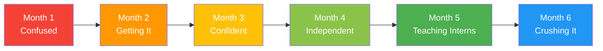
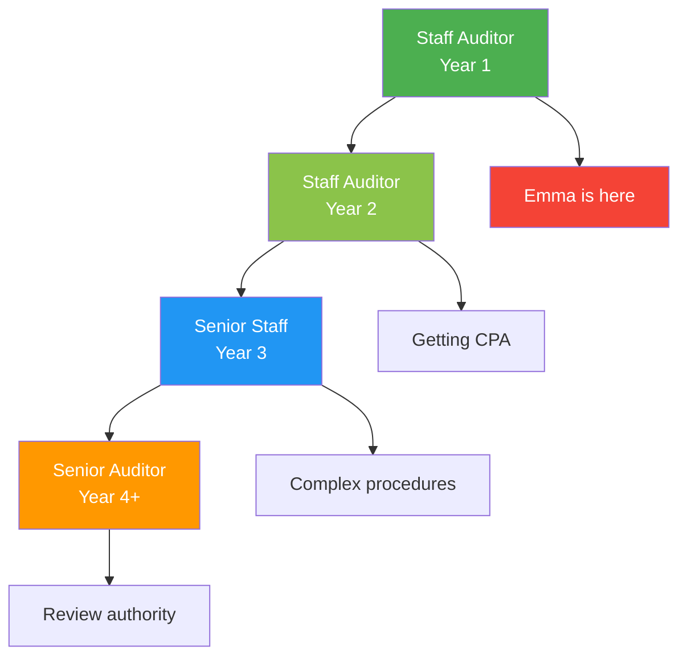

# <span className="role-badge auditor">Auditor</span> The Worker Bee

## 👤 Meet Emma - Your Staff Auditor

<div className="persona-card">
  <div className="persona-avatar">
    <div className="avatar-circle auditor">👨‍💼</div>
  </div>
  <div className="persona-info">
    <h3>Emma Thompson</h3>
    <p className="persona-role">Staff Auditor</p>
    <p><strong>Background:</strong> Recent accounting graduate, 1 year of audit experience, studying for CPA exam</p>
    <p><strong>Responsibility:</strong> Complete assigned audit procedures accurately and on time</p>
    <p><strong>Daily Focus:</strong> Execute procedures, document findings, ask questions, learn continuously</p>
  </div>
</div>

---

## 🎯 What Does an Auditor Do?

Think of the Auditor as **the hands-on worker** who:
- 🔨 Does the detailed work (procedures)
- 📝 Documents everything (workpapers)
- 🎓 Learns constantly (skill building)
- 🤝 Supports the team (collaboration)

### Auditor vs Other Roles

| Aspect | Auditor (Emma) | Senior Auditor (Sarah) | Manager (Mike) |
|--------|----------------|------------------------|----------------|
| **Work Type** | Standard procedures | Complex procedures | Planning & oversight |
| **Independence** | Guided | Independent | Fully autonomous |
| **Review** | No review authority | Reviews staff | Reviews all |
| **Client Contact** | Minimal | Technical discussions | Primary contact |
| **Decision Making** | Limited | Moderate | Full authority |
| **Learning** | Heavy learning curve | Specialized expertise | Strategic thinking |

---

## 📅 Emma's First Audit - Day by Day

### Day 1: Getting Started

**8:30 AM - Emma Arrives at Office**

```
☕ Emma's Morning Thoughts:
"Okay, first day on TechStart audit. Mike assigned 
me 23 procedures. Sarah is my senior. Don't mess this 
up! I can do this. I've done bank reconciliations 
before..."

✅ Emma's Checklist:
  ✅ Coffee acquired
  ✅ Laptop charged
  ✅ Prior year file downloaded
  ✅ Procedure list reviewed
  ⏳ Anxiety level: Moderate but manageable
```

**9:00 AM - Team Kickoff Meeting**

<div className="message-thread">

**Mike (Manager):** "Morning team! Let's kick off TechStart. Emma, you're on cash, AP, and expenses - 23 procedures total. These are straightforward, but ask Sarah if you get stuck."

**Emma:** "Got it. When do we start fieldwork?"

**Mike:** "February 1st, after we get the trial balance. Use this week to review prior year and prepare templates."

**Sarah (Senior):** "Emma, let's meet after this to go through your procedures in detail."

**Emma:** *[nods]* "Sounds good!"

</div>

**10:00 AM - One-on-One with Sarah**

```
📋 Sarah's Guidance to Emma
━━━━━━━━━━━━━━━━━━━━━━━━━━━━━━━━━━━━━━━━━━━━━━

YOUR PROCEDURES (23 total):

CASH (8 procedures) - PRIORITY 1
├── Bank reconciliation - Operating account
├── Bank reconciliation - Payroll account  
├── Bank reconciliation - Savings account
├── Bank confirmations (send to all 3 banks)
├── Cash cutoff testing
├── Review restrictions on cash
├── Analytical review - cash
└── Prepare cash leadsheet

ACCOUNTS PAYABLE (9 procedures) - PRIORITY 2
├── AP aging analysis
├── Vendor confirmations (sample 15)
├── Subsequent payment testing
├── Search for unrecorded liabilities
├── Cutoff testing
├── Analytical review - AP
├── Vendor statement reconciliations
├── Related party AP review
└── Prepare AP leadsheet

EXPENSES (6 procedures) - PRIORITY 3
├── Analytical review - expenses
├── Sample expense testing (25 items)
├── Payroll expense analysis
├── Credit card expense review
├── Unusual expense investigation
└── Prepare expense leadsheet

TIMELINE:
Week 1: Cash procedures (complete by Feb 7)
Week 2: AP procedures (complete by Feb 14)
Week 3: Expense procedures (complete by Feb 21)

QUALITY EXPECTATIONS:
✅ Neat workpapers
✅ Clear documentation
✅ All tick marks explained
✅ Calculations checked
✅ Conclusions stated
✅ Ask questions early!
```

**Emma's Reaction:**

```
😰 Initial Thought:
"23 procedures?! That's a lot..."

😌 After Sarah Explains:
"Oh, most of these are similar. Bank recs I've done 
before. I can handle this."

📝 Emma's Notes to Self:
1. Start with what I know (bank recs)
2. Ask Sarah BEFORE getting stuck
3. Review prior year first
4. Don't leave things until last minute
5. Document as I go, not at the end
```

---

### Day 2-3: Preparation & Learning

**Emma's Preparation Process:**

<div className="process-flow">

**Step 1: Review Prior Year File**
```
📁 Opens: TechStart FY 2024 > Cash Procedures

Emma's Notes:
"Last year:
- 2 bank accounts (now they have 3)
- Sarah did these procedures
- Clean, no issues
- Good documentation style to copy

Key things I notice:
✅ Tick marks are explained clearly
✅ Each step numbered and checked off
✅ Conclusion is bold and clear
✅ Source documents attached

I should do mine like this!"
```

**Step 2: Prepare Templates**
```
Emma creates workpaper templates:

Template: Bank Reconciliation
├── Account name/number
├── Balance per bank statement
├── Add: Deposits in transit
├── Less: Outstanding checks
├── Balance per books
├── Difference investigation
└── Conclusion

Emma's smart move:
"I'll create one template and copy it for 
all 3 bank accounts. Saves time!"
```

**Step 3: Prepare Document Request**
```
📧 Emma's Draft Email to Client

To: TechStart Accounting Team
Subject: Document Request - Cash Procedures

Hi,

I'm working on the cash section of your FY 2025 
audit. Could you please provide:

BANK STATEMENTS:
- December 2025 statements (all accounts)
- January 2026 statements (for cutoff testing)

BANK RECONCILIATIONS:
- December 31, 2025 reconciliations (all accounts)
- Supporting schedules (deposits in transit, 
  outstanding checks)

OTHER:
- Bank confirmations (we'll send directly to banks)
- Any restrictions on cash usage

Timeline: Need by Feb 1 for fieldwork start

Thank you!
Emma Thompson
Staff Auditor, Acme CPA Firm
```

**Step 4: Sarah Reviews Email Before Sending**
```
📧 Sarah's Feedback

"Good email Emma! Two suggestions:

1. Add specific account names/numbers so they 
   give you the right ones
   
2. Add 'Please upload to the Client Portal' 
   so we have organized access

Otherwise perfect! Send it."

Emma's Learning:
"Oh yeah, specifics are important. Good catch!"
```

</div>

---

### Day 4-10: Executing First Procedure

**Emma's First Procedure: Bank Reconciliation**

**Monday, Feb 1 - Documents Arrive**

```
📧 From: TechStart Accounting
Subject: Re: Document Request - Cash Procedures

Emma,

Attached are the requested documents. Let me know 
if you need anything else!

- TechStart Team

Attachments:
├── Bank_Statement_Operating_Dec2025.pdf
├── Bank_Statement_Payroll_Dec2025.pdf
├── Bank_Statement_Savings_Dec2025.pdf
├── Bank_Rec_Operating_Dec2025.xlsx
├── Bank_Rec_Payroll_Dec2025.xlsx
└── Bank_Rec_Savings_Dec2025.xlsx
```

**Emma's Procedure: Operating Account Reconciliation**

<div className="process-flow">

**Step 1: Obtain & Review Client's Reconciliation**
```
📊 Client's Bank Reconciliation - Operating Account
Account: 1000 - Cash Operating
Bank: First National Bank
Date: December 31, 2025

Balance per bank statement:      $247,350
Add: Deposits in transit:          12,500
Less: Outstanding checks:         (18,230)
                                 ─────────
Balance per books:               $241,620
                                 ═════════

Emma's Initial Review:
✅ Math adds up
✅ Looks reasonable
⏳ Now I need to verify each line...
```

**Step 2: Verify Bank Balance**
```
Emma's Work:

1. Open bank statement PDF
   Bank balance 12/31/25: $247,350 ✓
   
2. Check it matches reconciliation
   Reconciliation shows: $247,350 ✓
   
3. Add tick mark to workpaper
   "® = Agreed to bank statement"

Emma's Documentation:
"Balance per bank statement of $247,350 
agreed to December 2025 bank statement 
from First National Bank. ®"
```

**Step 3: Test Deposits in Transit**
```
Emma's Testing:

CLIENT'S LIST:
Deposit Date: 12/29/25 | Amount: $8,500
Deposit Date: 12/30/25 | Amount: $4,000
Total: $12,500

Emma's Verification:
1. Check these deposits are NOT on Dec statement ✓
2. Check they ARE on January statement ✓
   - $8,500 cleared Jan 2 ✓
   - $4,000 cleared Jan 2 ✓
3. Check dates are reasonable (within 3 days) ✓

Emma's Conclusion:
"Deposits in transit of $12,500 consist of 
two deposits dated 12/29 and 12/30 which 
cleared the bank on 1/2/26. Amounts and 
timing appear reasonable. ∂"

Tick mark: ∂ = Traced to January bank statement
```

**Step 4: Test Outstanding Checks**
```
CLIENT'S OUTSTANDING CHECK LIST:
Check #3847: $12,450
Check #3851: $3,200
Check #3852: $2,580
[... 8 more checks]
Total: $18,230

Emma's Risk Assessment:
"The largest check is $12,450. That's most of 
the outstanding total. I should definitely 
test that one."

Emma's Approach:
1. Select largest check (#3847)
2. Select random sample of others (3 more)
3. Trace to January statement

TESTING:
Check #3847: $12,450
✓ Appears on outstanding check list
✓ NOT on December bank statement
✓ Cleared January 5, 2026
✓ Amount matches

Check #3851: $3,200
✓ Cleared January 3, 2026

Check #3852: $2,580
✓ Cleared January 7, 2026

Check #3860: $1,125
✓ Cleared January 4, 2026

Emma's Documentation:
"Outstanding checks total $18,230. Tested 
4 checks totaling $19,355 (106% coverage) 
to January bank statement. All cleared 
within 7 days of year-end with no exceptions. 
Amounts agreed to check register. √"

Tick mark: √ = Traced to subsequent bank statement
```

**Step 5: Verify Book Balance**
```
Emma's Final Check:

Client's book balance: $241,620

Verify to:
1. General ledger account 1000 ✓
   Balance 12/31/25: $241,620 ✓
   
2. Trial balance ✓
   Cash - Operating: $241,620 ✓

Emma's Documentation:
"Book balance of $241,620 agreed to general 
ledger and trial balance. ∞"

Tick mark: ∞ = Agreed to trial balance
```

**Step 6: Overall Conclusion**
```
Emma's Workpaper Conclusion:

"Based on procedures performed, the bank 
reconciliation for the Operating account 
appears accurate as of December 31, 2025. 
No exceptions were noted."

Prepared by: Emma Thompson
Date: February 3, 2026
Status: Ready for review
```

</div>

**Emma Submits for Review:**

```
📧 To: Sarah Williams
Subject: Ready for Review - Bank Rec #1

Sarah,

I've completed the bank reconciliation for the 
Operating account. It's ready for your review in 
CloudAudit Pro.

Let me know if you have any questions or need 
revisions!

Emma
```

---

### Day 11: Receiving Review Comments

**Sarah's Review Comes Back:**

```
👀 REVIEW NOTES FROM SARAH
━━━━━━━━━━━━━━━━━━━━━━━━━━━━━━━━━━━━━━━━━━━━━━

Workpaper: Bank Reconciliation - Operating Account
Preparer: Emma Thompson
Reviewer: Sarah Williams
Review Date: February 4, 2026

OVERALL: Excellent work Emma! 🎉

WHAT YOU DID WELL:
✅ Math is correct
✅ Testing approach is appropriate
✅ Documentation is clear
✅ Tick marks explained
✅ Conclusion is well-stated
✅ Professional appearance

MINOR SUGGESTION (not required to fix):
💡 When you note 'cleared January 2,' consider 
   adding the specific reference like 'per Jan 
   bank statement, page 2.' Even more specific 
   documentation is always better.

STATUS: ✅ APPROVED

Great first procedure! This is exactly the quality 
we're looking for. Keep it up!

- Sarah
```

**Emma's Reaction:**

```
😊 Emma's Internal Celebration:
"YES! Approved on first try! Sarah said it was 
excellent! Okay, I can do this. Just 22 more to go..."

📝 Emma's Takeaway:
"Note to self: Be even more specific with references. 
'Per Jan bank statement, page 2' vs just 'Jan 
statement.' Got it."

💪 Emma's Confidence:
Before: 60%
After: 85%
```

---

### Day 12-20: Building Momentum

**Emma's Progress:**

```
📊 EMMA'S PROCEDURE STATUS - Week 2
━━━━━━━━━━━━━━━━━━━━━━━━━━━━━━━━━━━━━━━━━━━━━━

COMPLETED (8 procedures):
✅ Bank rec - Operating (approved by Sarah)
✅ Bank rec - Payroll (approved by Sarah)
✅ Bank rec - Savings (approved by Sarah)
✅ Bank confirmations sent (awaiting responses)
✅ Cash cutoff testing (approved by Sarah)
✅ Cash restrictions review (approved by Sarah)
✅ Cash analytical review (approved by Sarah)
✅ Cash leadsheet (approved by Sarah)

IN PROGRESS (3 procedures):
⏳ AP aging analysis (started today)
⏳ Vendor confirmations (preparing list)
⏳ Subsequent payments (need Feb statements)

NOT STARTED (12 procedures):
📋 Remaining AP and expense procedures

TIMELINE:
On track! ✅ Cash section done in Week 1!
Moving to AP this week.

REVIEW STATUS:
8 submitted, 7 approved first time
1 needed minor revision (forgot to explain one tick mark)
```

---

### Day 21: Learning from a Mistake

**Emma's AP Aging Procedure - First Attempt:**

```
📋 Emma's Workpaper: AP Aging Analysis
Account: 2000 - Accounts Payable
Date: December 31, 2025

Total AP per trial balance: $247,000

Sample selected: 10 invoices
Sample dollar amount: $87,000 (35%)

Testing Results:
All 10 invoices tested agreed to vendor invoices.
No exceptions noted.

Conclusion:
Based on testing performed, accounts payable 
appears fairly stated.

Prepared by: Emma Thompson
Date: February 12, 2026
```

**Sarah's Review:**

```
👀 REVIEW NOTES - AP AGING
━━━━━━━━━━━━━━━━━━━━━━━━━━━━━━━━━━━━━━━━━━━━━━

STATUS: ⏳ NEEDS REVISION

Emma, good start! A few things to address:

REQUIRED CHANGES:

1. **Sample size too small** ⚠️
   - Current: 10 items (35% $)
   - Need: 15 items (50%+ $)
   - Why: $247K is material, needs more coverage
   - Please select 5 more invoices

2. **Missing documentation** ❌
   - Invoice #3847 - I don't see the supporting PDF
   - Please attach or note if not available
   
3. **Strengthen conclusion** 💡
   - Current: "appears fairly stated"
   - Better: "Based on testing 50% of AP by dollar 
     value, no exceptions were noted. Balance appears 
     fairly stated."
   - More specific = better

TEACHING MOMENT:
For material accounts (above performance materiality), 
we want 50%+ dollar coverage. Think of it this way: 
If we only tested 35%, we're only 35% sure. We need 
to be more confident than that!

Estimated time to fix: 2 hours

Questions? Come find me! Don't spend hours stuck.

- Sarah
```

**Emma's Response:**

<div className="message-thread">

**Emma's Initial Reaction (to herself):**
```
😞 "Ugh, I messed up. Sarah's going to think I'm 
not good at this..."

😰 "Wait, I need to select MORE items? I thought 
10 was enough..."

🤔 "Okay, breathe. She said it's a 'teaching moment' 
not 'you screwed up.' I can fix this."
```

**Emma Goes to Sarah's Desk:**

**Emma:** "Hey Sarah, got your review notes on the AP procedure. Sorry I didn't get the sample size right."

**Sarah:** "No need to apologize! This is literally how you learn. I made the exact same mistake my first year."

**Emma:** "Really?"

**Sarah:** "Absolutely. Here's the trick: For any material account balance, aim for 50% or more dollar coverage. It's in our audit methodology guide, page 47. Did you get the memo when you started?"

**Emma:** "I think so... there was a lot of information in orientation."

**Sarah:** "I know. Here's what helps me: I keep a cheat sheet of common rules. Want to see mine?"

**Emma:** "That would be amazing!"

**Sarah:** *[shows her personal reference guide]* "See? Sample sizes, materiality thresholds, common tick marks. I still use this."

**Emma:** "Okay, so I'll select 5 more invoices to get over 50%, get that missing PDF from the client, and update my conclusion. Should take about 2 hours?"

**Sarah:** "Perfect. And Emma? Everyone gets review notes. Getting them and learning from them is how you get better. The best auditors are the ones who learn fast."

**Emma:** "Thanks Sarah. That actually makes me feel better."

</div>

---

**Emma's Revised Workpaper:**

```
📋 REVISED: AP Aging Analysis
Account: 2000 - Accounts Payable  
Date: December 31, 2025

Total AP per trial balance: $247,000

REVISED Sample: 15 invoices
Sample dollar amount: $127,450 (52%)

Sample Selection Method:
- Top 10 items by dollar amount
- 5 additional random selections
- Stratified to ensure coverage across vendors

Testing Results:
┌─────────┬──────────┬────────┬─────────────┐
│Invoice  │ Amount   │Vendor  │  Result     │
├─────────┼──────────┼────────┼─────────────┤
│#3847    │ $12,450  │VendorA │ ✓ Agreed    │
│#3851    │ $11,200  │VendorB │ ✓ Agreed    │
│#3855    │ $9,800   │VendorC │ ✓ Agreed    │
│...      │ ...      │...     │ ...         │
│Total    │$127,450  │        │ No except.  │
└─────────┴──────────┴────────┴─────────────┘

® = Agreed to vendor invoice (attached)

Procedures Performed:
1. Obtained AP aging from client
2. Footed aging and agreed total to TB ∞
3. Selected sample of 15 invoices (52% coverage)
4. Traced sample to vendor invoices ®
5. Verified amounts, dates, and vendors
6. No exceptions noted

Conclusion:
Based on testing 15 invoices representing 52% of 
total AP by dollar value, no exceptions were noted. 
Amounts agreed to supporting vendor invoices. 
Accounts payable balance of $247,000 appears 
fairly stated as of December 31, 2025.

Prepared by: Emma Thompson
Date: February 12, 2026 (revised)
```

**Sarah's Second Review:**

```
👀 SECOND REVIEW - AP AGING
━━━━━━━━━━━━━━━━━━━━━━━━━━━━━━━━━━━━━━━━━━━━━━

STATUS: ✅ APPROVED

Perfect Emma! This is exactly what I was looking for.

IMPROVEMENTS I SEE:
✅ Sample increased to 52% coverage
✅ All invoices attached
✅ Clear methodology explained
✅ Professional table format
✅ Specific, supported conclusion

This is A+ quality work. Nice job on the revisions!

- Sarah
```

---

## 🔑 Auditor Powers & Responsibilities

### What Emma Can Do

<div className="feature-grid">

<div className="card">
<h4>📝 Execute Procedures</h4>

**Assigned Work:**
- ✅ Complete assigned procedures
- ✅ Follow audit program
- ✅ Test samples
- ✅ Perform calculations
- ✅ Gather evidence

**Scope:**
- Standard procedures
- Clear instructions
- Defined samples
- Routine testing

</div>

<div className="card">
<h4>📊 Document Work</h4>

**Create Workpapers:**
- ✅ Professional appearance
- ✅ Clear documentation
- ✅ Explained tick marks
- ✅ Stated conclusions
- ✅ Attached support

**Quality Standards:**
- Neat and organized
- Complete and accurate
- Stand-alone quality
- Reviewable format

</div>

<div className="card">
<h4>🤝 Client Contact</h4>

**Limited Interaction:**
- ✅ Request documents
- ✅ Ask clarifying questions
- ✅ Schedule meetings
- ⚠️ Through senior/manager
- ❌ No technical discussions

**Communication:**
- Email requests
- Information gathering
- Logistical coordination

</div>

<div className="card">
<h4>❓ Ask Questions</h4>

**When Stuck:**
- ✅ Ask senior auditor
- ✅ Consult prior year
- ✅ Review methodology
- ✅ Research standards
- ❌ Don't guess!

**Best Practice:**
- Ask early
- Be specific
- Show what you tried
- Take notes

</div>

<div className="card">
<h4>📚 Learn & Develop</h4>

**Continuous Learning:**
- ✅ On-the-job training
- ✅ CPE courses
- ✅ CPA exam studying
- ✅ Mentorship
- ✅ Feedback incorporation

**Growth Areas:**
- Technical skills
- Software proficiency
- Industry knowledge
- Professional judgment

</div>

<div className="card">
<h4>⏰ Manage Time</h4>

**Time Tracking:**
- ✅ Log hours daily
- ✅ Track by procedure
- ✅ Monitor budget
- ✅ Report delays
- ✅ Prioritize tasks

**Efficiency:**
- Meet deadlines
- Work within budget
- Communicate early

</div>

</div>

---

## 📊 Emma's Typical Week

### Time Breakdown

```
📅 Emma's Weekly Schedule (40 hours)
━━━━━━━━━━━━━━━━━━━━━━━━━━━━━━━━━━━━━━━━━━━━━━

Executing Procedures:         32 hours (80%)
├── Research & planning         4 hours
├── Performing tests           20 hours
├── Documentation               6 hours
└── Revisions from review       2 hours

Meetings & Communication:      4 hours (10%)
├── Team check-ins              2 hours
├── Questions to Sarah          1.5 hours
└── Client coordination         0.5 hours

Learning & Development:        2 hours (5%)
├── CPE/Training                1 hour
└── CPA exam study              1 hour

Administrative:                2 hours (5%)
├── Time tracking               0.5 hours
├── Email/misc                  1 hour
└── File organization           0.5 hours

Total: 40 hours
```

---

## 💡 Emma's Pro Tips (Learned the Hard Way!)

:::tip Staff Auditor Wisdom

**1. Ask Questions EARLY**
Don't spend 4 hours stuck on something Sarah can explain in 5 minutes. I learned this the hard way!

**2. Review Prior Year FIRST**
Seriously. Before you start ANYTHING, look at last year's workpaper. It's your template.

**3. Document As You Go**
Don't do all the testing then document later. You'll forget what you did. Document each step immediately.

**4. Explain Your Tick Marks**
® ∂ √ ∞ don't mean anything if you don't explain them. Every. Single. Time.

**5. Check Your Math**
Then check it again. Math errors in workpapers are embarrassing and easily avoided.

**6. Save Constantly**
CloudAudit Pro auto-saves, but I still hit Ctrl+S every few minutes. Lost work = sadness.

**7. Keep a Personal Cheat Sheet**
Sample sizes, materiality thresholds, common procedures. Write them down for quick reference.

**8. Track Your Time DAILY**
Don't wait until Friday to remember what you did Monday. You won't remember correctly.

**9. Review Your Own Work First**
Before sending to Sarah, pretend YOU'RE the reviewer. Catch your own errors first.

**10. Learn from Review Notes**
Every review comment is a free lesson. Don't just fix it - understand WHY it needed fixing.

:::

---

## 🎓 Emma's Learning Journey

### First 6 Months Progress



**Month 1: The Struggle**
```
😰 Confidence: 40%
Questions asked: 47
Review notes: Many
Feeling: "Am I cut out for this?"

Key Learning:
- Bank reconciliations
- Basic sampling
- Documentation standards
- How to use CloudAudit Pro
```

**Month 3: Finding Rhythm**
```
😊 Confidence: 70%
Questions asked: 18
Review notes: Fewer
Feeling: "I'm getting this!"

Key Learning:
- Analytical procedures
- Confirmation processes
- Risk assessment basics
- Efficient documentation
```

**Month 6: Competent Auditor**
```
😎 Confidence: 85%
Questions asked: 6
Review notes: Minimal
Feeling: "I've got this!"

Key Learning:
- Complex procedures
- Professional judgment
- Client interaction
- Mentoring new interns
```

---

## 🚨 Common Challenges & Solutions

### Challenge 1: "I Don't Know What To Do"

**Emma's Approach:**

```
❌ WRONG APPROACH:
"I'll just guess and see what Sarah says..."

✅ RIGHT APPROACH:

Step 1: Check prior year file
  → 70% of questions answered here

Step 2: Check audit methodology guide  
  → Firm has documented procedures

Step 3: Ask specific question to Sarah
  → "I reviewed prior year and methodology, but 
     I'm unclear on [specific issue]. Can you help?"

Step 4: Take notes on answer
  → Add to personal reference guide
```

---

### Challenge 2: Running Behind Schedule

**Scenario:** Emma realizes she's 5 hours over budget

<div className="message-thread">

**Emma's Internal Panic:**
```
😰 "Oh no, I'm already 5 hours over budget and 
only 60% done. Mike is going to be mad. Should 
I just not log the extra hours?"
```

**Emma's Smart Decision:**
```
✅ Tell Sarah immediately
✅ Don't hide it
✅ Explain why (valid reason vs inefficiency)
```

**📧 Email to Sarah:**

"Sarah,

Quick heads up - I'm running over budget on the 
AP section. 

BUDGET: 15 hours
USED: 20 hours (so far)
REMAINING WORK: ~3 hours
TOTAL EXPECTED: 23 hours (+8 hours)

REASONS:
1. Sample needed to be expanded (5 hours)
2. Client delayed documents (2 hours)
3. Learning curve on confirmations (1 hour)

I should have flagged this earlier. How should 
I proceed?

Emma"

**Sarah's Response:**

"Thanks for telling me Emma. This is exactly 
what you should do.

The expanded sample and client delay are 
legitimate - not your fault. We'll absorb those.

The learning curve hour is normal - you're new 
to confirmations.

Going forward:
- Flag budget issues at 75%, not 100%
- We'd rather know early
- Never hide time - that creates bigger problems

Keep going, finish the procedures. We're good.

Sarah"

**Emma's Lesson:**
"Transparency is valued. Hiding problems makes 
them worse. Got it."

</div>

---

### Challenge 3: Client Pushback

**Scenario:** Client doesn't want to provide document

<div className="message-thread">

**📧 From: TechStart Controller**
"Emma, the document you requested (vendor contract) 
is confidential. We can't provide it."

**Emma's Mistake (almost):**
```
❌ "Okay, I'll just skip that test..."
❌ "Fine, I'll use something else..."
```

**Emma's Smart Move:**
```
✅ Don't agree to skip it
✅ Don't argue with client
✅ Escalate to Sarah immediately
```

**Emma to Sarah:**

"Sarah, the client is refusing to provide a vendor 
contract I need for AP testing. They say it's 
confidential. What should I do?"

**Sarah's Response:**

"Good - you escalated correctly. I'll handle this.

Rule: Never agree to skip a procedure on your own. 
If client pushes back, always involve senior or 
manager.

I'll talk to their CFO. It's likely just a 
misunderstanding - we can usually work something 
out (redacted version, review onsite, etc.).

Thanks for not just accepting 'no'!"

**Outcome:**
Sarah negotiates with CFO. Emma reviews contract 
onsite at client office (not removed). Problem solved.

**Emma's Lesson:**
"Don't have scope negotiations with client. That's 
above my pay grade. Escalate."

</div>

---

## 📚 Resources for Auditors

### Emma's Toolkit

<div className="feature-grid">

<div className="card">
<h4>📖 Essential References</h4>

**Daily Use:**
- Prior year files
- Audit program
- Firm methodology guide
- Template workpapers

**When Stuck:**
- Accounting standards
- Sample workpapers
- Sarah/other seniors
- Firm helpline

</div>

<div className="card">
<h4>🎓 Learning Resources</h4>

**Formal:**
- Firm training program
- CPE courses
- CPA review courses
- Industry webinars

**Informal:**
- Lunch & learns
- Shadowing seniors
- File reviews
- Peer learning

</div>

<div className="card">
<h4>🛠️ Software Skills</h4>

**Must Master:**
- CloudAudit Pro
- Excel (advanced)
- PDF tools
- Email/Calendar

**Nice to Have:**
- Data analytics tools
- PowerPoint
- Workflow software

</div>

</div>

---

## 📋 Daily Checklist

### Emma's Morning Routine

```
☑️ MORNING (8:00-9:00 AM)
━━━━━━━━━━━━━━━━━━━━━━━━━━━━━━━━━━━━━━━━━━━━━━

- [ ] Check email for urgent items
- [ ] Review today's procedure list
- [ ] Check for review notes from Sarah
- [ ] Check client portal for new documents
- [ ] Respond to any questions from team
- [ ] Set 3 priorities for today
- [ ] Estimate hours for each priority
```

### Emma's End-of-Day Routine

```
☑️ END OF DAY (4:30-5:00 PM)
━━━━━━━━━━━━━━━━━━━━━━━━━━━━━━━━━━━━━━━━━━━━━━

- [ ] Save all work
- [ ] Log time in CloudAudit Pro
- [ ] Update procedure status
- [ ] Flag any issues for tomorrow
- [ ] Email Sarah if anything stuck
- [ ] Prepare tomorrow's priority list
- [ ] File organize/cleanup
```

---

## 🎯 Career Development

### Path to Senior Auditor



**Year 1 Goals (Emma's Current Year):**
```
TECHNICAL SKILLS:
- [ ] Master basic procedures
- [ ] Learn firm methodology
- [ ] Understand GAAS basics
- [ ] Excel proficiency
- [ ] Software mastery

CPA PROGRESS:
- [ ] Pass 2-3 CPA exams
- [ ] Complete ethics course
- [ ] Log experience hours

PROFESSIONAL:
- [ ] Build strong work habits
- [ ] Demonstrate reliability
- [ ] Ask good questions
- [ ] Accept feedback well
- [ ] Meet deadlines
```

**Promotion Criteria to Senior:**

```
📊 PROMOTION CHECKLIST
━━━━━━━━━━━━━━━━━━━━━━━━━━━━━━━━━━━━━━━━━━━━━━

TECHNICAL (Required):
✅ CPA license (or all exams passed)
✅ 2-3 years experience
✅ Can work independently on standard procedures
✅ Minimal review notes
✅ Strong technical knowledge

PROFESSIONAL (Required):
✅ Reliable and deadline-oriented
✅ Strong documentation skills
✅ Good client interaction
✅ Team player
✅ Positive attitude

READINESS INDICATORS:
✅ Training new staff/interns
✅ Handling some complex procedures
✅ Asking sophisticated questions
✅ Showing leadership initiative
✅ Strong performance reviews

TIMELINE: Typically 2.5-3.5 years
```

---

## 🚀 Quick Reference

### Emma's Cheat Sheet

```
📝 SAMPLE SIZES (Quick Guide)
━━━━━━━━━━━━━━━━━━━━━━━━━━━━━━━━━━━━━━━━━━━━━━

Account Balance vs Sample Coverage:
  < $50K (immaterial):     25-35%
  $50K-$500K (material):   50%+
  > $500K (highly material): 60%+

When in doubt: Ask Sarah!

COMMON TICK MARKS:
━━━━━━━━━━━━━━━━━━━━━━━━━━━━━━━━━━━━━━━━━━━━━━

® = Agreed to source document
∂ = Traced to subsequent period
√ = Recalculated/Footed
∞ = Agreed to trial balance
† = Agreed to prior year
⊕ = Agreed to bank statement
# = Agreed to invoice
∆ = Verified by observation

ALWAYS explain tick marks on each workpaper!

DEADLINES:
━━━━━━━━━━━━━━━━━━━━━━━━━━━━━━━━━━━━━━━━━━━━━━

Flag issues at: 75% of budget
Complete work by: Assigned deadline
Time entry by: Daily (don't wait!)
Review revisions by: 24 hours

WHEN TO ESCALATE:
━━━━━━━━━━━━━━━━━━━━━━━━━━━━━━━━━━━━━━━━━━━━━━

✅ Stuck for > 30 minutes
✅ Client refuses document
✅ Found potential error
✅ Over budget significantly
✅ Deadline at risk
✅ Ethical concern
```

---

## 💬 Emma's FAQs

### "How do I know if my work is good enough?"

```
Ask yourself:

1. Can someone else understand my workpaper without 
   asking me questions? 
   → If yes, it's good.

2. Did I document WHAT I did, WHY I did it, and 
   what CONCLUSION I reached?
   → All three = complete workpaper

3. Would I be comfortable showing this to a partner?
   → Professional appearance matters

4. Are my tick marks explained?
   → Every. Single. One.

5. Is my math double-checked?
   → Always verify calculations

If you can answer yes to all = ready for review!
```

---

### "How much should I ask Sarah for help?"

```
TOO LITTLE:
- Spending hours stuck
- Guessing at procedures
- Making same mistakes repeatedly
→ Ask more!

TOO MUCH:
- Not trying prior year first
- Not reading methodology first
- Asking before thinking
→ Try first, then ask

JUST RIGHT:
- Tried prior year/methodology
- Spent 20-30 min trying
- Have specific question
- Can explain what you tried
→ Perfect!

Sarah's rule: "I'd rather you ask 20 questions than 
make 1 mistake we don't catch."
```

---

### "What if I make a mistake?"

```
EVERYONE MAKES MISTAKES. Including:
- Sarah (Senior Auditor)
- Mike (Manager)
- Jordan (Partner)
- Even the CPA who signs the audit report!

The key is:

1. ✅ Own it quickly
   "I made an error in my calculation"
   
2. ✅ Fix it completely
   Don't just patch - correct it properly
   
3. ✅ Learn from it
   Why did it happen? How to prevent next time?
   
4. ✅ Move on
   Don't dwell. Everyone understands.

NEVER:
❌ Hide mistakes
❌ Blame others
❌ Make excuses
❌ Repeat same mistake without learning

Emma's mistake rate:
Month 1: 25% of work needed revision
Month 6: 5% of work needed revision

Improvement happens!
```

---

## 🎯 Next Steps

### For New Staff Auditors

1. **Master the Basics** - Bank recs, AP testing, expense sampling
2. **Build Good Habits** - Documentation, time tracking, asking questions
3. **Study for CPA** - Don't delay, get it done early
4. **Find a Mentor** - Sarah is Emma's - find yours
5. **Be Patient** - You WILL get better every month

### Related Documentation

- [Senior Auditor Role](./senior-auditor) - Where you're headed
- [Intern Role](./intern) - Where you came from (maybe!)
- [Audit Procedures](/docs/modules/procedures) - Learn the procedures
- [Getting Started Guide](/docs/basics/system-overview) - Master the system

---

*Remember: Every expert was once a beginner. Sarah was in your shoes 4 years ago. Mike was there 8 years ago. You've got this!* 👨‍💼

---

*Last Updated: January 1, 2026*
