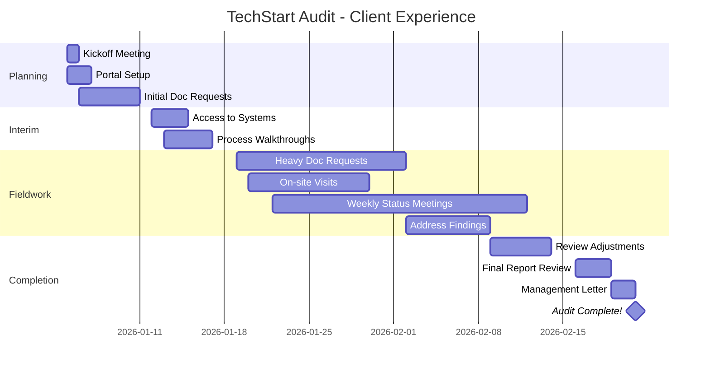

# <span className="role-badge client">Client</span> The Business Owner

## 👤 Meet Lisa - Your Client Contact

<div className="persona-card">
  <div className="persona-avatar">
    <div className="avatar-circle client">🏢</div>
  </div>
  <div className="persona-info">
    <h3>Lisa Chen</h3>
    <p className="persona-role">CFO, TechStart Inc</p>
    <p><strong>Background:</strong> 15 years finance experience, first time working with CloudAudit Pro portal</p>
    <p><strong>Responsibility:</strong> Provide audit information, respond to requests, review findings</p>
    <p><strong>Daily Focus:</strong> Run the business while supporting the audit process efficiently</p>
  </div>
</div>

---

## 🎯 What Does a Client Do?

Think of the Client as **the business partner** who:
- 📤 Provides requested information (documents, data, explanations)
- 💬 Communicates with auditors (answers questions, provides access)
- 📊 Reviews audit progress (understands what's happening)
- ✅ Responds to findings (addresses issues, implements recommendations)

### Client vs Other Roles

| Aspect | Client (Lisa) | Auditor (Emma) | Manager (Mike) |
|--------|---------------|----------------|----------------|
| **Organization** | TechStart Inc (being audited) | Acme CPA (auditing firm) | Acme CPA (auditing firm) |
| **Goal** | Get audit done efficiently | Perform quality audit | Lead audit engagement |
| **Main Activity** | Provide information | Test and verify | Oversee and review |
| **Portal Access** | Upload documents, view requests | Full audit access | Full audit access + admin |
| **Relationship** | Being served | Service provider | Service provider |
| **Success Metric** | Clean audit, minimal disruption | Quality procedures | Satisfied client |

---

## 📅 Lisa's First Day with CloudAudit Pro

### Background: TechStart Inc is Being Audited

```
📊 TECHSTART INC - Company Profile
━━━━━━━━━━━━━━━━━━━━━━━━━━━━━━━━━━━━━━━━━━━━━━

Company: TechStart Inc
Industry: SaaS Software
Founded: 2020
Revenue: $12M (FY 2025)
Employees: 45
Year-End: December 31, 2025

AUDIT DETAILS:
Audit Firm: Acme CPA
Type: Financial statement audit (first year!)
Manager: Mike Johnson
Senior: Sarah Williams
Staff: Emma Thompson

WHY THEY NEED AN AUDIT:
✅ Securing Series A funding ($10M)
✅ Investors require audited financials
✅ Planning for future growth/IPO
✅ Strengthen financial controls

LISA'S CONCERNS:
😰 "I've never been through an audit before"
😰 "Will this take a lot of my time?"
😰 "What if they find problems?"
😰 "How do I even use this CloudAudit portal?"
```

---

### Monday 9:00 AM - Kickoff Meeting

**Conference Room at TechStart:**

<div className="message-thread">

**Mike (Manager):** "Good morning Lisa! Thanks for having us. Excited to start TechStart's first audit."

**Lisa (CFO):** "Thanks Mike. I'm excited too... and a little nervous! I've never done this before."

**Mike:** "Totally normal! We'll walk you through everything. Think of us as partners helping you get through this smoothly."

**Sarah:** "And you'll have portal access to see exactly what we need, when we need it. No surprises."

**Lisa:** "Tell me about this portal. Do I need special software?"

**Emma:** "Nope! It's web-based. Just need internet and a browser. I'll give you a quick tour after this meeting."

**Mike:** "Here's how this will work:
1. We'll send document requests through the portal
2. You upload them when ready
3. We may have follow-up questions
4. We keep you updated on progress
5. We meet regularly to discuss any issues

Sound good?"

**Lisa:** "Sounds manageable. How much time should I expect to spend on this?"

**Mike:** "First few weeks: maybe 5-10 hours/week getting documents together. After that: 1-2 hours/week responding to questions. We try to minimize disruption to your business."

**Lisa:** "That's not bad. Okay, let's do this!"

</div>

---

### Monday 10:00 AM - Portal Training

**Emma's Screen Share with Lisa:**

```
💻 CLOUDAUDIT PRO CLIENT PORTAL
━━━━━━━━━━━━━━━━━━━━━━━━━━━━━━━━━━━━━━━━━━━━━━

🔐 LISA'S LOGIN
Username: lisa@techstartinc.com
Password: [secure password]

LISA'S DASHBOARD (Client View):

╔══════════════════════════════════════════════════╗
║  CloudAudit Pro - Client Portal                  ║
║  TechStart Inc - FY 2025 Audit                   ║
╠══════════════════════════════════════════════════╣
║                                                  ║
║  👋 Welcome, Lisa!                               ║
║                                                  ║
║  📊 AUDIT STATUS                                 ║
║   Phase: Planning (Week 1 of 8)                 ║
║   Progress: 5%                                  ║
║   Audit Team: Mike, Sarah, Emma                 ║
║                                                  ║
║  📋 DOCUMENT REQUESTS (15 total)                 ║
║   🔴 Urgent (3) - Due this week                 ║
║   🟡 Normal (8) - Due in 2 weeks                ║
║   🟢 Future (4) - Due later                     ║
║                                                  ║
║  📁 MY UPLOADS (0)                               ║
║   Nothing uploaded yet                          ║
║                                                  ║
║  💬 MESSAGES (1 unread)                          ║
║   Mike: "Welcome to the audit!"                 ║
║                                                  ║
║  🔔 NOTIFICATIONS                                ║
║   • Document request list posted                ║
║   • You've been invited to planning meeting     ║
║                                                  ║
╚══════════════════════════════════════════════════╝

WHAT LISA CAN DO:
✅ View document requests
✅ Upload files
✅ Send messages to audit team
✅ Track audit progress
✅ Download audit reports (when complete)
✅ View findings/recommendations

WHAT LISA CANNOT DO:
❌ See audit workpapers (confidential)
❌ Delete audit team's files
❌ Change audit settings
❌ Access other clients' audits

Emma: "See? Pretty simple! Think of it like a 
secure Dropbox just for your audit."

Lisa: "This is way easier than I expected!"
```

---

### Monday 11:00 AM - First Document Request

**Lisa Checks Her First Request:**

```
📋 DOCUMENT REQUEST #001
━━━━━━━━━━━━━━━━━━━━━━━━━━━━━━━━━━━━━━━━━━━━━━

REQUEST: Bank Statements - December 2025
PRIORITY: 🔴 Urgent
DUE DATE: January 8, 2026 (3 days!)
REQUESTED BY: Emma Thompson, Staff Auditor
PURPOSE: Cash reconciliation procedures

DESCRIPTION:
Please provide December 2025 bank statements for 
all company bank accounts.

REQUIRED ACCOUNTS:
1. Operating account (Wells Fargo - ending 4523)
2. Payroll account (Wells Fargo - ending 8891)
3. Savings account (Wells Fargo - ending 3367)

FORMAT:
- PDF format preferred
- Full statement (all pages including both sides)
- Must show beginning balance, transactions, ending balance

QUESTIONS?
Click "Ask Question" or message Emma directly

STATUS: ⏳ Pending (awaiting upload)
```

**Lisa's Process:**


**Lisa's Experience:**

```
LISA'S WORKFLOW:
━━━━━━━━━━━━━━━━━━━━━━━━━━━━━━━━━━━━━━━━━━━━━━

11:05 AM: Log into Wells Fargo online banking
  → Navigate to "Statements & Documents"

11:08 AM: Download December statements
  Operating:  WF_4523_Dec2025.pdf ✓
  Payroll:    WF_8891_Dec2025.pdf ✓
  Savings:    WF_3367_Dec2025.pdf ✓

11:12 AM: Back to CloudAudit Portal
  → Click "Upload Files" on Request #001
  → Drag and drop 3 PDF files
  → Add note: "All 3 Dec 2025 bank statements attached"
  → Click "Submit"

11:15 AM: Confirmation message
  ✅ "3 files uploaded successfully!"
  ✅ Emma Thompson has been notified
  
11:16 AM: Request status changed
  ⏳ Pending → ✅ Complete

Lisa's Thought:
"That was easy! 10 minutes start to finish. 
If they're all this simple, this won't be bad!"

TIME SPENT: 11 minutes
DIFFICULTY: ⭐☆☆☆☆ (very easy)
```

**Emma's Response (5 minutes later):**

```
📧 NOTIFICATION: Emma Thompson sent a message
━━━━━━━━━━━━━━━━━━━━━━━━━━━━━━━━━━━━━━━━━━━━━━

From: Emma Thompson
To: Lisa Chen
Subject: RE: Bank Statements - Received!

Hi Lisa,

Got the bank statements - thank you so much! 
Quick turnaround, really appreciated.

All 3 files are complete and exactly what I needed.

You're off to a great start! 🎉

Emma
Acme CPA

Lisa's Reaction:
😊 "Nice! Positive feedback already. I like this 
Emma person."
```

---

## 📊 Lisa's Typical Week During Audit

### Week 3 of 8 - Fieldwork

```
LISA'S AUDIT TIME - WEEK 3
━━━━━━━━━━━━━━━━━━━━━━━━━━━━━━━━━━━━━━━━━━━━━━

MONDAY (2 hours):
├── 9:00 AM: Check portal for new requests (15 min)
├── 9:15 AM: Upload revenue reports (30 min)
├── 10:00 AM: Answer questions from Sarah (20 min)
└── 2:00 PM: Prepare for client meeting (55 min)

TUESDAY (1 hour):
├── 8:30 AM: Provide access to accounts payable system (45 min)
└── 4:00 PM: Quick check-in with Emma on-site (15 min)

WEDNESDAY (3 hours):
├── 10:00 AM: Client meeting with Mike - review findings (90 min)
├── 2:00 PM: Gather additional docs requested in meeting (60 min)
└── 4:30 PM: Upload follow-up documents (30 min)

THURSDAY (30 minutes):
├── Morning: Check portal, no new requests (5 min)
└── Afternoon: Answer quick question via message (25 min)

FRIDAY (1 hour):
├── 9:00 AM: Weekly status review (30 min)
└── 11:00 AM: Coordinate next week's schedule (30 min)

TOTAL TIME THIS WEEK: 7.5 hours
PERCENTAGE OF WORK WEEK: ~19% (manageable!)

Lisa's Assessment:
"Definitely takes time, but Mike's team is 
organized and doesn't waste my time. The portal 
makes it way easier than emailing files back and 
forth."
```

---

## 💬 Common Client Scenarios

### Scenario 1: Unclear Request

**Lisa's Confusion:**

```
📋 REQUEST: Revenue Details by Customer
━━━━━━━━━━━━━━━━━━━━━━━━━━━━━━━━━━━━━━━━━━━━━━

Description: "Please provide revenue details"

Lisa's Reaction:
"Wait, what kind of revenue details? 
- Individual invoices?
- Summary by customer?
- By month? By quarter?
- What time period?
- What format?

I don't want to upload the wrong thing..."
```

**Lisa Uses "Ask Question" Feature:**

<div className="message-thread">

**Lisa's Question:**
"Hi Sarah, can you clarify what you need for 'revenue details'? Do you want:
- Individual invoices or summary?
- What time period?
- Any specific format?
Thanks!"

**Sarah's Response (15 min later):**
"Great question Lisa! Sorry I wasn't clear.

What I need:
- Summary report by customer for full year 2025
- Include: Customer name, total revenue, # of invoices
- Excel format if possible
- Doesn't need to be fancy

Something like your QuickBooks Customer Sales Summary 
would be perfect.

Does that help?"

**Lisa's Reply:**
"Perfect! I can pull that from QuickBooks in 2 minutes. 
Will upload shortly."

**Lisa's Learning:**
"When in doubt, ask! Sarah responded quickly and 
appreciated the question. Way better than guessing!"

</div>

---

### Scenario 2: Can't Find Requested Document

**The Problem:**

```
📋 REQUEST: Equipment Purchase Invoices
━━━━━━━━━━━━━━━━━━━━━━━━━━━━━━━━━━━━━━━━━━━━━━

Need invoices for 5 equipment purchases totaling $87,000

Lisa's Issue:
"We bought laptops, servers, and office furniture 
throughout the year. I have SOME invoices but I 
can't find all of them. Our filing system is... 
not great. 😬

What do I do?"
```

**Lisa's Communication:**

<div className="message-thread">

**Lisa to Emma:**
"Emma, I'm working on the equipment invoices request. 
I found 3 of the 5 invoices you listed, but I can't 
locate 2 of them:
- Dell servers ($42,000)
- Office furniture ($8,500)

I have:
- Laptop purchases (3 invoices)
- Monitor purchases (1 invoice)
- Conference room AV (1 invoice)

Can I:
1. Upload what I have now?
2. Keep looking for the other 2?
3. Or is there another way to document these purchases?

Sorry for the delay!"

**Emma's Response:**
"No problem Lisa! This happens.

Yes, please upload the 3 you have right now.

For the missing 2:
- Can you pull credit card statements showing the charges?
- Or bank statements showing the payments?
- Or purchase orders/emails discussing the purchases?

We can work with alternative documentation. The key 
is showing the purchases happened and for how much.

Let me know what you can find!"

**Lisa's Relief:**
"Oh good! I definitely have the credit card statements. 
I'll grab those today.

Uploading the 3 I found now. Will send card statements 
by tomorrow.

Thanks for being flexible!"

**Emma:**
"Perfect! That works great. See you tomorrow when we're 
on-site 👍"

</div>

**Lisa's Reflection:**

```
📝 LESSON LEARNED:
━━━━━━━━━━━━━━━━━━━━━━━━━━━━━━━━━━━━━━━━━━━━━━

DON'T:
❌ Panic and hide the problem
❌ Make up documents
❌ Guess what they want
❌ Ignore the request
❌ Wait until last minute to mention it

DO:
✅ Communicate early
✅ Explain the situation
✅ Provide what you CAN find
✅ Ask for alternatives
✅ Stay responsive

Result: Emma was totally understanding and gave 
me options. Crisis averted!

Note to self: Fix our document filing system 
after the audit! 📁
```

---

### Scenario 3: Discovering an Error

**The Uncomfortable Finding:**

```
💬 MESSAGE FROM SARAH
━━━━━━━━━━━━━━━━━━━━━━━━━━━━━━━━━━━━━━━━━━━━━━

Hi Lisa,

While testing revenue, I found something we need 
to discuss. Can we schedule a call today?

It's about some revenue that might be recognized 
in the wrong period. Not huge, but we should talk 
through it.

Available this afternoon?

Sarah

Lisa's Reaction:
😰 "Oh no. They found a problem. Is this bad? 
Are we in trouble? Will this delay the audit?"
```

**The Call:**

<div className="message-thread">

**Sarah:** "Thanks for getting on the call quickly, Lisa. So here's what I found..."

**[Sarah shares screen showing workpaper]**

**Sarah:** "You recorded a $78,000 contract as December 2025 revenue, but the contract started January 2, 2026. Under GAAP, this revenue belongs in 2026, not 2025."

**Lisa:** *[heart sinking]* "Oh no. That's a significant amount. How did I miss that?"

**Sarah:** "It happens! The contract was SIGNED in December, so it's an easy mistake. But revenue recognition is based on when services are delivered, not when the contract is signed."

**Lisa:** "So what does this mean? Do we have to restate our financials?"

**Sarah:** "We'll need to make an audit adjustment to move the revenue to 2026. The good news: it doesn't change your annual revenue, just the timing. And we caught it BEFORE the financials were finalized."

**Lisa:** "Will this delay the audit?"

**Sarah:** "Nope! This is exactly what audits are for - catching these things. We'll document the adjustment, you'll approve it, and we move forward. Pretty standard."

**Lisa:** *[relieved]* "Okay, that's not as bad as I thought. What do I need to do?"

**Sarah:** "I'll prepare a proposed adjustment entry:
- Debit: Deferred Revenue $78,000
- Credit: Revenue $78,000

You review it, approve it in the portal, and make the entry in your books. Maybe 30 minutes of work total."

**Lisa:** "I can do that today. And Sarah... thanks for explaining this so clearly. I was panicking for a second there."

**Sarah:** "Of course! Finding things like this is literally my job. You're doing great - most clients have way more adjustments than this."

</div>

**Lisa's Portal Action:**

```
🔔 NEW NOTIFICATION: Proposed Audit Adjustment
━━━━━━━━━━━━━━━━━━━━━━━━━━━━━━━━━━━━━━━━━━━━━━

ADJUSTMENT #1
Impact: Decrease 2025 Revenue by $78,000

ENTRY:
Dr. Deferred Revenue        $78,000
    Cr. Revenue                        $78,000

REASON:
Contract effective date is Jan 2026, not Dec 2025.
Revenue should be recognized when services delivered.

SUPPORTING DOCUMENTATION:
- Customer contract (see attachment)
- Service delivery dates (see attachment)
- ASC 606 revenue recognition guidance

YOUR ACTION REQUIRED:
□ Review adjustment and documentation
□ Approve or discuss with audit team
□ Make entry in your accounting system
□ Provide confirmation when posted

Lisa's Response:
✅ "Adjustment reviewed and approved. 
    Entry posted in QuickBooks.
    Updated financials attached.
    Thanks Sarah!"

STATUS: ✅ Resolved
```

**Lisa's Learning:**

```
📚 WHAT LISA LEARNED:
━━━━━━━━━━━━━━━━━━━━━━━━━━━━━━━━━━━━━━━━━━━━━━

BEFORE:
😰 "Audit findings = disaster"

AFTER:
✅ "Audit findings = valuable quality control"

KEY INSIGHTS:
1. Auditors aren't trying to "catch" you
2. Finding errors BEFORE publishing is good!
3. Most issues are timing/classification, not fraud
4. Adjustments are normal and expected
5. Communication makes everything easier
6. This is why we pay for audits!

ACTION ITEMS FOR LISA:
□ Train accounting staff on revenue recognition
□ Create contract review checklist
□ Document revenue recognition policy
□ Implement quarterly self-review process

Silver Lining:
"This error would have been embarrassing to 
discover AFTER showing financials to investors. 
Sarah just saved us from that! Worth the audit 
fee right there."
```

---

## 🎯 Lisa's Portal Dashboard

### Client Portal Features

<div className="feature-grid">

<div className="card">
<h4>📋 Document Requests</h4>

**What Lisa Sees:**
```
ACTIVE REQUESTS (12):
🔴 Urgent: 2
🟡 Normal: 7
🟢 Future: 3

COMPLETED: 18
TOTAL: 30

BY CATEGORY:
├── Cash & Bank: 6
├── Revenue: 5
├── Expenses: 8
├── Payroll: 3
├── Fixed Assets: 4
└── Other: 4
```

**Features:**
- Priority indicators
- Due dates
- Search/filter
- Status tracking
- Upload interface

</div>

<div className="card">
<h4>💬 Communication</h4>

**Message Center:**
```
UNREAD: 3

Recent Messages:
├── Emma: Bank rec question
├── Sarah: Revenue testing update
└── Mike: Next week schedule

SENT: 24
RECEIVED: 31
RESPONSE TIME: < 4 hours avg
```

**Tools:**
- Direct messaging
- Team notifications
- Question on requests
- File attachments
- Read receipts

</div>

<div className="card">
<h4>📊 Progress Tracking</h4>

**Audit Status:**
```
OVERALL: 65% Complete

BY PHASE:
✅ Planning: 100%
✅ Interim: 100%
⏳ Fieldwork: 65%
⏹️ Completion: 0%

TIMELINE:
Started: Jan 5, 2026
Target: Feb 28, 2026
Status: On Track ✓
```

**Visibility:**
- Real-time updates
- Phase tracking
- Timeline view
- Team activity
- Milestone alerts

</div>

<div className="card">
<h4>📁 Document Library</h4>

**Lisa's Uploads:**
```
TOTAL FILES: 87

BY TYPE:
├── Bank Statements: 12
├── Financial Reports: 15
├── Contracts: 22
├── Invoices: 28
└── Other: 10

STORAGE: 247 MB
```

**Organization:**
- Folder structure
- Version control
- Download anytime
- Search function
- Audit trail

</div>

</div>

---

## 📅 Audit Timeline from Lisa's Perspective

### 8-Week Journey



**Lisa's Time Investment by Phase:**

```
LISA'S TIME TRACKING
━━━━━━━━━━━━━━━━━━━━━━━━━━━━━━━━━━━━━━━━━━━━━━

PHASE 1: Planning (Week 1-2)
Hours: 12 hours
Activities:
- Kickoff meeting (2 hrs)
- Portal training (1 hr)
- Initial document gathering (6 hrs)
- Team introductions (1 hr)
- Contract signing (2 hrs)

PHASE 2: Interim (Week 3)
Hours: 8 hours
Activities:
- System access setup (3 hrs)
- Process walkthroughs (4 hrs)
- Documentation (1 hr)

PHASE 3: Fieldwork (Week 4-6)
Hours: 28 hours (heaviest phase!)
Activities:
- Document requests (12 hrs)
- On-site meetings (8 hrs)
- Answer questions (5 hrs)
- Address findings (3 hrs)

PHASE 4: Completion (Week 7-8)
Hours: 10 hours
Activities:
- Review adjustments (3 hrs)
- Review draft report (2 hrs)
- Final meetings (3 hrs)
- Management letter discussion (2 hrs)

TOTAL TIME: 58 hours over 8 weeks
AVERAGE: 7.25 hours/week
PEAK WEEK: 14 hours (Week 5)
LIGHTEST WEEK: 3 hours (Week 7)

Lisa's Assessment:
"Definitely an investment, but Mike's team was 
efficient. The portal saved me tons of time vs. 
email/paper. Would have been 80+ hours without it!"
```

---

## 💡 Lisa's Client Tips

:::tip Hard-Won Wisdom from the Client Side

**1. Organize Documents BEFORE Audit Starts**
I spent hours hunting for files Week 1. Next year, I'm creating an "Audit Folder" in October and gathering common requests early. Save yourself the stress!

**2. Respond Quickly to Questions**
When I responded same-day, the audit flowed smoothly. When I delayed, it created bottlenecks. Fast responses = faster audit = less disruption.

**3. Check Portal Daily**
I checked every morning (5 minutes). Caught requests early, never missed deadlines, felt in control. Made HUGE difference.

**4. Use the "Ask Question" Feature**
Saved me from uploading wrong documents multiple times. When in doubt, ask! Sarah and Emma appreciated it.

**5. Don't Take Findings Personally**
My first reaction to the revenue error: "How could I mess up?!"  
Reality: Errors happen. Audits catch them. That's the point! Don't panic, just fix it.

**6. Assign One Point Person**
I was the sole contact. Kept communication clean and consistent. Don't have 5 people from your company uploading randomly - chaos!

**7. Set Expectations with Your Team**
I told my staff: "Auditors will need X hours of your time. Make it a priority." Prevented scheduling conflicts and resentment.

**8. Think of Them as Consultants, Not Police**
Mike's team gave great advice on improving our processes. I took notes and implemented their suggestions. Free consulting!

:::

---

## 🎬 Post-Audit: Lisa's Outcome

### The Final Report

```
📊 FINAL DELIVERABLE
━━━━━━━━━━━━━━━━━━━━━━━━━━━━━━━━━━━━━━━━━━━━━━

DATE: February 21, 2026

Mike's Email to Lisa:
"Attached is your final audit report. 
Congratulations on a successful first audit!"

📄 REPORT CONTENTS:
├── Independent Auditor's Opinion (unmodified! ✅)
├── Audited Financial Statements
│   ├── Balance Sheet
│   ├── Income Statement
│   ├── Cash Flow Statement
│   └── Statement of Equity
├── Notes to Financial Statements
└── Management's Responsibility Statement

📝 MANAGEMENT LETTER (separate document):
Key Recommendations:
1. Improve revenue recognition documentation
2. Strengthen fixed asset tracking
3. Formalize IT security policies
4. Enhance account reconciliation process
5. Document internal control procedures

Lisa's Reaction:
"Clean opinion! Our investors are going to be 
thrilled! And the management letter has great 
suggestions we can actually use."
```

---

### Meeting with Investors

**Two Weeks Later:**

```
💼 SERIES A PITCH MEETING
━━━━━━━━━━━━━━━━━━━━━━━━━━━━━━━━━━━━━━━━━━━━━━

ATTENDEES:
- TechStart: CEO, CFO (Lisa)
- Investors: 3 VC partners

INVESTOR QUESTION:
"Can you walk us through your financial controls?"

LISA'S ANSWER:
"Absolutely. We just completed our first financial 
statement audit with Acme CPA Firm.

We received an unmodified opinion - that means the 
auditors found our financials are fairly stated in 
all material respects.

They identified a few areas for improvement, which 
we're already implementing:
- Enhanced revenue recognition procedures
- Strengthened IT controls
- Formalized documentation processes

We view this audit not just as a requirement, but 
as a valuable quality control process. The auditors 
found one timing issue we corrected before finalizing 
financials.

Our books are solid and we have strong processes 
in place."

INVESTOR RESPONSE:
"Impressive that you proactively got audited before 
it was required. Shows maturity and transparency. 
That gives us confidence."

OUTCOME:
✅ $10M Series A funding secured!
✅ Audit was key credibility factor
✅ Lisa's preparation paid off
```

**Lisa's Reflection:**

```
📝 LOOKING BACK
━━━━━━━━━━━━━━━━━━━━━━━━━━━━━━━━━━━━━━━━━━━━━━

Initial Fear:
"This audit is going to be painful, expensive, 
and find all kinds of problems."

Reality:
✅ Well-organized (thanks to portal!)
✅ Reasonable time investment (58 hours)
✅ Found ONE timing issue (minor)
✅ Got valuable recommendations
✅ Helped us secure $10M funding
✅ Improved our processes
✅ Built confidence with investors

ROI on Audit:
Cost: $45,000
Value: 
- Enabled $10M raise
- Improved internal controls
- Enhanced credibility
- Documented processes
- Peace of mind

Worth every penny! ✅

Next Year:
- Will be easier (we know the drill now)
- Documents already organized
- Processes improved
- Team knows expectations
- Portal feels familiar

Looking Forward:
Planning to continue annual audits even if not 
required. The value is clear!
```

---

## 📋 Client Best Practices

### Lisa's Year 2 Preparation

**What Lisa Does Differently:**

```
LISA'S YEAR 2 IMPROVEMENTS
━━━━━━━━━━━━━━━━━━━━━━━━━━━━━━━━━━━━━━━━━━━━━━

OCTOBER (3 months before audit):
✅ Create "FY 2026 Audit" folder
✅ Begin collecting common documents
✅ Review prior year PBC list
✅ Fix items from management letter
✅ Update documentation

NOVEMBER:
✅ Organize bank statements monthly
✅ File contracts and invoices properly
✅ Run reconciliations current
✅ Document significant transactions
✅ Schedule tentative audit dates

DECEMBER (year-end):
✅ Final reconciliations
✅ Review unusual transactions
✅ Prepare account analysis
✅ Update fixed asset records
✅ Document revenue recognition

JANUARY (audit starts):
✅ 80% of docs already ready!
✅ Portal access confirmed
✅ Team briefed and ready
✅ Calendar blocked
✅ Questions prepared

RESULTS:
Year 1: 58 hours, some stress
Year 2: 35 hours, minimal stress! ✅

Mike's comment:
"Lisa, you're one of our most organized clients 
now. This was smooth!"

Lisa's Pride:
"I learned from last year. Being prepared saves 
so much time and stress!"
```

---

## 🎯 Client Portal Quick Reference

### Common Actions

<div className="feature-grid">

<div className="card">
<h4>📤 Upload Documents</h4>

```
STEPS:
1. Click document request
2. "Upload Files" button
3. Drag & drop or browse
4. Add description/notes
5. Submit

TIPS:
- Use descriptive names
- Check files open properly
- Upload promptly
- Add context in notes
```

</div>

<div className="card">
<h4>💬 Send Message</h4>

```
WHEN TO MESSAGE:
- Questions on requests
- Can't find document
- Need deadline extension
- Schedule meetings
- Provide context

BEST PRACTICES:
- Be specific
- Include request #
- Respond promptly
- Professional tone
```

</div>

<div className="card">
<h4>📊 Check Status</h4>

```
DASHBOARD SHOWS:
- Overall progress %
- Requests pending
- Recent activity
- Upcoming deadlines
- Team updates

CHECK FREQUENCY:
Daily during fieldwork
2-3x/week other times
```

</div>

<div className="card">
<h4>✅ Review Findings</h4>

```
PROPOSED ADJUSTMENTS:
1. Read description
2. Review support
3. Ask questions
4. Approve/discuss
5. Make entry
6. Confirm posted

MANAGEMENT LETTER:
- Read recommendations
- Discuss with team
- Plan implementations
- Track improvements
```

</div>

</div>

---

## 🚀 Advanced Client Tips

### For Seasoned Clients

```
PRO CLIENT STRATEGIES
━━━━━━━━━━━━━━━━━━━━━━━━━━━━━━━━━━━━━━━━━━━━━━

CONTINUOUS ORGANIZATION:
Don't just organize for audit - maintain organized 
systems year-round. File documents when you receive 
them. "Future you" will thank you!

QUARTERLY SELF-REVIEWS:
Perform mini-audits quarterly:
- Reconcile major accounts
- Review significant transactions
- Check revenue recognition
- Verify accruals
- Document unusual items

Catch issues early = easier audit!

AUDIT COMMITTEE:
Larger companies: Form audit committee
- Review findings
- Oversee processes
- Liaison with auditors
- Continuous improvement

PROCESS DOCUMENTATION:
Document your:
- Accounting policies
- Month-end procedures
- Control activities
- System access
- Approval workflows

Makes walkthroughs easier!

TECHNOLOGY INTEGRATION:
Ask auditors about:
- API integrations
- Automated data exports
- Real-time access
- Continuous auditing
- Efficiency opportunities

BUILD RELATIONSHIPS:
Your auditors are partners:
- Ask questions year-round
- Seek advice on accounting issues
- Use them as sounding board
- Build trust and rapport
- Make their job easier

TRACK METRICS:
Measure your efficiency:
- Hours spent per audit
- Response time to requests
- # of adjustments
- Recommendations implemented
- Process improvements

Continuous improvement mindset!
```

---

## 📞 When to Contact Your Auditors

### Communication Guide

```
🔴 URGENT - CALL IMMEDIATELY:
━━━━━━━━━━━━━━━━━━━━━━━━━━━━━━━━━━━━━━━━━━━━━━

- Discovered fraud or theft
- Major system failure/data loss
- Significant error in published financials
- Legal/regulatory action
- Material litigation
- Key employee departure (CEO/CFO)

Contact: Mike (Manager) or Jordan (Partner)

🟡 IMPORTANT - EMAIL WITHIN 24 HOURS:
━━━━━━━━━━━━━━━━━━━━━━━━━━━━━━━━━━━━━━━━━━━━━━

- Can't meet deadline
- Missing key documents
- Questions on complex transactions
- Need deadline extension
- Material transaction occurred
- Significant estimate changes

Contact: Sarah (Senior) or Emma (Staff)

🟢 ROUTINE - USE PORTAL:
━━━━━━━━━━━━━━━━━━━━━━━━━━━━━━━━━━━━━━━━━━━━━━

- Questions on requests
- Document uploads
- Status updates
- Scheduling
- Minor clarifications
- General communication

Use: Portal messaging or email
```

---

## 📚 Resources for Clients

### Helpful Materials

<div className="feature-grid">

<div className="card">
<h4>📖 Client Guides</h4>

**Available:**
- Portal User Manual
- Common Requests Guide
- Timeline & Expectations
- Communication Best Practices
- Adjustment Process
- Management Letter FAQ

**Where:**
Portal → Resources → Client Guides

</div>

<div className="card">
<h4>🎥 Video Tutorials</h4>

**Topics:**
- Portal navigation (5 min)
- Uploading documents (3 min)
- Reading audit reports (8 min)
- Understanding findings (6 min)
- Year-end preparation (10 min)

**Access:**
Portal → Help → Videos

</div>

<div className="card">
<h4>📞 Support Contacts</h4>

**Portal/Technical:**
support@acmecpa.com
(855) 555-ACME

**Audit Questions:**
Your audit team via portal
or direct email/phone

**Urgent Issues:**
Mike: (555) 123-4567
Jordan: (555) 123-4568

</div>

<div className="card">
<h4>📅 Important Dates</h4>

**Typical Timeline:**
- Dec: Year-end prep
- Jan: Audit starts
- Feb: Fieldwork
- Mar: Report delivery
- Apr: Tax returns (if needed)

**Your Calendar:**
Portal → Timeline
Syncs to your calendar!

</div>

</div>

---

## ✅ Client Checklist

### Audit Preparation

```
☑️ PRE-AUDIT CHECKLIST (October-December)
━━━━━━━━━━━━━━━━━━━━━━━━━━━━━━━━━━━━━━━━━━━━━━

DOCUMENTATION:
□ Create audit folder structure
□ Organize monthly bank statements
□ File contracts and agreements
□ Collect invoices and receipts
□ Gather payroll records
□ Save email documentation

ACCOUNTING TASKS:
□ Complete all account reconciliations
□ Review accruals and estimates
□ Update fixed asset records
□ Reconcile intercompany accounts
□ Document unusual transactions
□ Run trial balance report

SYSTEM PREPARATION:
□ Update accounting software
□ Backup all data
□ Test report generation
□ Clean up old/duplicate data
□ Document system changes
□ Prepare user access

TEAM READINESS:
□ Identify key personnel
□ Block calendars for audit
□ Brief staff on expectations
□ Assign responsibilities
□ Train on portal (if new users)
□ Set communication protocols

PRIOR YEAR REVIEW:
□ Review last year's PBC list
□ Address prior findings
□ Implement recommendations
□ Update policies/procedures
□ Note changes from prior year

LOGISTICS:
□ Schedule kickoff meeting
□ Reserve workspace for auditors
□ Arrange system access
□ Confirm contact information
□ Review engagement letter
□ Understand timeline

☑️ DURING AUDIT CHECKLIST
━━━━━━━━━━━━━━━━━━━━━━━━━━━━━━━━━━━━━━━━━━━━━━

DAILY:
□ Check portal for new requests
□ Respond to messages promptly
□ Upload requested documents
□ Answer questions
□ Monitor progress

WEEKLY:
□ Status meeting with audit team
□ Review completed sections
□ Prioritize upcoming requests
□ Coordinate team schedules
□ Address any issues

AS NEEDED:
□ Provide system access
□ Facilitate client interviews
□ Gather additional documentation
□ Review proposed adjustments
□ Coordinate with external parties

☑️ POST-AUDIT CHECKLIST
━━━━━━━━━━━━━━━━━━━━━━━━━━━━━━━━━━━━━━━━━━━━━━

IMMEDIATE:
□ Review draft audit report
□ Approve final adjustments
□ Sign management representation letter
□ Review management letter
□ Provide feedback to auditors

SHORT-TERM (30 days):
□ Implement critical recommendations
□ Update accounting policies
□ Train staff on new procedures
□ Document process improvements
□ Plan for next year

LONG-TERM (Year-round):
□ Maintain organized documentation
□ Perform quarterly reviews
□ Track recommendation implementation
□ Build continuous improvement mindset
□ Stay in touch with audit team
```

---

## 🎯 Related Documentation

### For Clients

- [System Overview](/docs/basics/system-overview) - Understanding audit process
- [Manager Role](./manager) - Who's leading your audit
- [Senior Auditor Role](./senior-auditor) - Who's performing complex procedures
- [Auditor Role](./auditor) - Who's executing day-to-day work

---

## 📝 Lisa's Final Thoughts

```
💭 REFLECTION: One Year Later
━━━━━━━━━━━━━━━━━━━━━━━━━━━━━━━━━━━━━━━━━━━━━━

From: Lisa Chen, CFO
To: Other CFOs considering first audit

Subject: What I Wish I Knew Before My First Audit

Hey there,

If you're about to go through your first audit and 
feeling nervous - I totally get it. I was terrified.

Here's what I learned:

1. IT'S NOT ADVERSARIAL
   Your auditors want you to succeed. They're partners,
   not police. Mike's team was helpful, patient, and
   professional throughout.

2. THE PORTAL IS A GAME-CHANGER
   CloudAudit Pro made everything SO much easier than
   the horror stories I heard about email chains and
   lost documents. Embrace it!

3. PREPARATION MATTERS
   Year 1: Scrambled to find documents, stressful
   Year 2: Organized in advance, smooth sailing
   
   Do the prep work!

4. FINDINGS AREN'T FAILURES
   We had a revenue timing issue. My first thought:
   "I'm a terrible CFO!" Reality: It's why audits
   exist. They caught it, we fixed it, move on.

5. ASK QUESTIONS
   I was afraid to look dumb. But Emma and Sarah
   APPRECIATED my questions. Cleared up confusion
   and saved time.

6. THE ROI IS REAL
   $45K seemed expensive until:
   - We secured $10M funding
   - Improved our processes
   - Gained investor confidence
   - Caught errors early
   - Documented everything properly
   
   Worth every penny!

7. IT GETS EASIER
   Year 1: Scary and time-consuming
   Year 2: Routine and efficient
   Year 3: Actually looking forward to it!

MY ADVICE:
- Choose auditors you trust
- Be responsive and organized
- View it as quality control, not punishment
- Learn from the recommendations
- Build a relationship with the team
- Stay positive!

You've got this!

Lisa Chen
CFO, TechStart Inc
lisa@techstartinc.com

P.S. We're hiring an accounting manager - partly
because the audit helped us see we needed more
capacity. Everything builds on itself!
```

---

*Remember: The audit process is a partnership. Your engagement and communication directly impact the efficiency and value you receive. Treat your auditors as trusted advisors, and they'll help you build a stronger, more credible business!* 🤝

---

*Last Updated: January 1, 2026*
