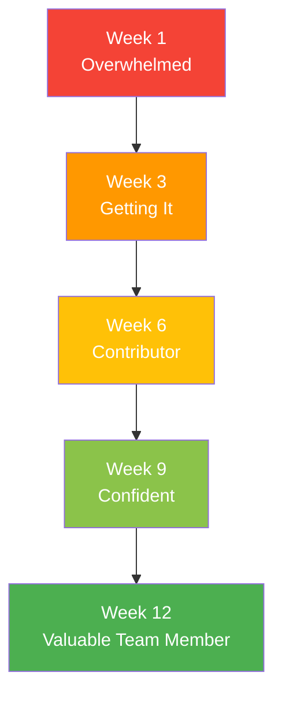

# <span className="role-badge intern">Intern</span> The Learner

## 👤 Meet Tom - Your Audit Intern

<div className="persona-card">
  <div className="persona-avatar">
    <div className="avatar-circle intern">📚</div>
  </div>
  <div className="persona-info">
    <h3>Tom Anderson</h3>
    <p className="persona-role">Audit Intern</p>
    <p><strong>Background:</strong> Junior in accounting at State University, 3.7 GPA, first professional experience</p>
    <p><strong>Responsibility:</strong> Learn audit fundamentals while assisting the team with basic tasks</p>
    <p><strong>Daily Focus:</strong> Observe, learn, ask questions, complete simple tasks, absorb everything</p>
  </div>
</div>

---

## 🎯 What Does an Intern Do?

Think of the Intern as **the apprentice** who:
- 👀 Observes everything (learning mode)
- 🎓 Learns fundamentals (building foundation)
- 🤝 Assists the team (helpful tasks)
- 📝 Completes simple work (gaining experience)

### Intern vs Other Roles

| Aspect | Intern (Tom) | Auditor (Emma) | Senior (Sarah) |
|--------|--------------|----------------|----------------|
| **Primary Goal** | Learn | Execute | Expert work |
| **Work Type** | Simple/Supervised | Standard procedures | Complex procedures |
| **Independence** | Heavily supervised | Guided | Independent |
| **Responsibility** | Limited | Moderate | High |
| **Expectations** | Ask questions! | Meet deadlines | Quality control |
| **Learning Curve** | Steep (everything is new) | Moderate | Specialized |

---

## 📅 Tom's First Day

### Morning: Welcome to Acme CPA Firm!

**8:00 AM - Tom Arrives (30 Minutes Early)**

```
😰 Tom's Inner Thoughts:
"Okay, first day of my first real job. Don't mess 
this up. What do I even wear to an accounting firm? 
Is this tie too much? Should I have brought a 
notebook? Why am I so nervous??"

✅ What Tom Did Right:
  ✅ Arrived early (good impression!)
  ✅ Dressed professionally
  ✅ Brought notebook and pen
  ✅ Ready to learn
```

**8:30 AM - Meet Jordan (Company Admin)**

<div className="message-thread">

**Jordan:** "Good morning! You must be Tom, our summer intern. Welcome to Acme CPA!"

**Tom:** "Yes, thank you! Excited to be here."

**Jordan:** "Great! Let me give you the tour, set up your workspace, and we'll do some orientation. Sound good?"

**Tom:** "Perfect!"

**THE TOUR:**
```
Office Tour - Acme CPA Firm
├── Workstation area (Tom gets a desk by the window!)
├── Conference rooms ("Where we have client meetings")
├── Break room ("Coffee is free, help yourself")
├── Filing room ("Mostly cloud now, but some physical files")
└── Partner offices ("Mike and I work here")

Tom's desk:
├── Computer (login info provided)
├── Dual monitors (wow!)
├── Phone extension
├── Office supplies
└── Welcome packet
```

</div>

**9:30 AM - Orientation with Jordan**

```
📋 TOM'S ORIENTATION CHECKLIST
━━━━━━━━━━━━━━━━━━━━━━━━━━━━━━━━━━━━━━━━━━━━━━

COMPLETED:
✅ Office tour
✅ Workstation setup
✅ Computer login (TomA@acmecpa.com)
✅ CloudAudit Pro access
✅ Email setup
✅ Phone training
✅ Security badge
✅ Parking pass

REVIEWED:
✅ Office policies
✅ Dress code (business casual most days)
✅ Work hours (8:30-5:00, some flexibility)
✅ Timesheet procedures
✅ Confidentiality agreement (SIGNED)

TO DO THIS WEEK:
⏳ Complete online training modules
⏳ Shadow Emma (Staff Auditor)
⏳ Learn CloudAudit Pro basics
⏳ Read audit methodology guide (first 3 chapters)
⏳ Meet the full team

ASSIGNED MENTOR: Emma Thompson (Staff Auditor)
```

**10:30 AM - CloudAudit Pro Training**

```
💻 Tom's First Login
━━━━━━━━━━━━━━━━━━━━━━━━━━━━━━━━━━━━━━━━━━━━━━

Username: tom@acmecpa.com
Password: [temporary - must change]

TOM'S DASHBOARD (Limited View):

╔══════════════════════════════════════════════════╗
║  CloudAudit Pro - Intern Dashboard               ║
╠══════════════════════════════════════════════════╣
║                                                  ║
║  Welcome, Tom!                                   ║
║                                                  ║
║  📚 TRAINING (Recommended)                       ║
║   ⏳ CloudAudit Pro Basics (30 min)             ║
║   ⏳ Audit Fundamentals (60 min)                ║
║   ⏳ Documentation Standards (45 min)           ║
║                                                  ║
║  🎯 MY TASKS (0 assigned)                        ║
║   No tasks yet - training mode                  ║
║                                                  ║
║  👀 AUDITS I CAN VIEW                            ║
║   • TechStart FY2025 (Read-only)                ║
║     Progress: 45% | Team: Mike, Sarah, Emma     ║
║                                                  ║
║  📊 MY ACTIVITY                                  ║
║   Hours this week: 0                            ║
║   Tasks completed: 0                            ║
║   Training: 0/3 modules                         ║
║                                                  ║
╚══════════════════════════════════════════════════╝

Tom's Permissions:
✅ View assigned audits (read-only)
✅ Complete assigned simple tasks
✅ Upload documents
✅ Log time
❌ Cannot delete anything
❌ Cannot approve procedures
❌ Cannot change audit settings
❌ Limited access (by design - for learning)
```

---

### Afternoon: Meeting the Team

**1:00 PM - Lunch with Emma (Mentor)**

<div className="message-thread">

**Emma:** "So Tom, tell me about yourself. What made you want to do audit?"

**Tom:** "Honestly? I wasn't sure what area of accounting I wanted. My professor said auditing was a great way to learn about different businesses and get broad experience."

**Emma:** "That's exactly why I started! Best decision I made. You get to see how so many different companies work - tech, retail, manufacturing. Way more interesting than I expected."

**Tom:** "That's good to hear. I'm nervous though. I don't really know what auditors DO all day."

**Emma:** "Oh man, I was the SAME way a year ago. Here's the secret: Nobody expects you to know anything. Your job is to ask questions and learn. The more questions you ask, the better. Trust me on this."

**Tom:** "Really? I was worried I'd look dumb asking too many questions."

**Emma:** "Opposite! I ask Sarah questions every day, and I've been here a year. Questions mean you're engaged and want to learn. The people who don't ask questions? Those are the ones who mess things up because they guessed."

**Tom:** *[visibly relieved]* "Okay, that makes me feel better."

**Emma:** "Here's what I wish someone told me day one: You're going to feel overwhelmed for about 2 weeks. That's normal. Then it clicks. Give it time."

**Tom:** "Thanks Emma. I appreciate that."

**Emma:** "No problem! Oh, and download the mobile CloudAudit app. Super helpful when you're traveling to client sites."

</div>

**2:00 PM - Team Introductions**

```
👥 MEET THE TEAM
━━━━━━━━━━━━━━━━━━━━━━━━━━━━━━━━━━━━━━━━━━━━━━

JORDAN (Admin/Partner):
"Welcome Tom! My door is always open. 
Literally - see? Open right now! If you 
need anything, just ask."
Tom's note: Seems very friendly and approachable

MIKE (Manager):
"Good to have you, Tom. You'll be helping 
Emma on some of my audits. Work hard, ask 
questions, and you'll learn a ton."
Tom's note: Direct but friendly. Seems busy but nice.

SARAH (Senior Auditor):
"Hey Tom! Emma speaks highly of you already. 
Feel free to shadow me anytime - I'll explain 
what I'm doing."
Tom's note: Really nice! Offered to teach me stuff.

EMMA (Staff Auditor - Tom's Mentor):
"Glad to have you on the team! We'll work 
together a lot. I'll show you the ropes."
Tom's note: My mentor - she's awesome and helpful

DAVID, CHRIS, ALEX (Other Auditors):
Quick introductions, seem nice
Tom's note: Lots of names to remember!
```

**3:00 PM - First Training Module**

```
📚 TRAINING: CloudAudit Pro Basics
━━━━━━━━━━━━━━━━━━━━━━━━━━━━━━━━━━━━━━━━━━━━━━

Module 1: Navigation (10 minutes)
├── Dashboard overview
├── Finding audits
├── Viewing procedures
└── Checking notifications
✅ Quiz: 9/10 (passed!)

Module 2: Basic Tasks (15 minutes)  
├── Uploading documents
├── Time tracking
├── Viewing workpapers
└── Communication tools
✅ Quiz: 10/10 (perfect!)

Module 3: Documentation Standards (25 minutes)
├── Workpaper requirements
├── Tick marks
├── Professional appearance
└── Review process
✅ Quiz: 8/10 (passed!)

TOTAL TIME: 50 minutes
STATUS: ✅ Basic training complete!
CERTIFICATE: Downloaded

Tom's Reaction:
"Okay, this is actually pretty intuitive once you 
click around. I can do this!"
```

**4:00 PM - First Assignment!**

<div className="message-thread">

**📧 From: Emma Thompson**  
**To: Tom Anderson**  
**Subject: Your First Task - TechStart Audit**

Hey Tom,

Welcome to the team! Ready for your first assignment?

**TASK:** Organize TechStart's bank statements

**WHAT TO DO:**
1. Go to Client Portal → TechStart Inc
2. Download all bank statements in the "December 2025" folder
3. Rename them consistently: 
   - "TechStart_BankStmt_Operating_Dec2025.pdf"
   - "TechStart_BankStmt_Payroll_Dec2025.pdf"
   - "TechStart_BankStmt_Savings_Dec2025.pdf"
4. Upload to CloudAudit Pro → TechStart FY2025 → Cash → Bank Statements folder
5. Check that they're readable and complete

**WHY WE'RE DOING THIS:**
We need organized bank statements for the cash procedures I'm working on. Good file organization makes everything easier.

**TIME ESTIMATE:** 30 minutes

**IF YOU GET STUCK:** Come find me! I'm at my desk.

Thanks!
Emma

</div>

**Tom's First Task:**


**Tom's Experience:**

```
TOM'S PROCESS:
━━━━━━━━━━━━━━━━━━━━━━━━━━━━━━━━━━━━━━━━━━━━━━

4:05 PM: Open Client Portal
  → "Okay, where's TechStart... Found it!"

4:07 PM: Find December 2025 folder
  → "4 files here... wait, Emma said 3?"

4:10 PM: Ask Emma
  Tom: "Emma, quick question - there are 4 bank 
        statements but you mentioned 3 accounts?"
  Emma: "Good catch! The 4th is from January, 
        ignore that one for now."
  Tom: "Got it, thanks!"
  
4:12 PM: Download 3 correct files
  → Files saved to Downloads folder

4:15 PM: Rename files
  Before: "Dec_stmt_1234.pdf", "statement_5678.pdf"
  After: Consistent naming per Emma's format
  → "This makes so much more sense!"

4:22 PM: Upload to CloudAudit Pro
  → Navigate to correct folder (took a minute to find)
  → Upload all 3 files
  → ✅ All uploaded successfully

4:25 PM: Verify files
  → Open each one to make sure they're readable
  → Check they're the right month (December 2025)
  → All good!

4:27 PM: Email Emma
  ✅ Task complete!

ACTUAL TIME: 22 minutes
ESTIMATED TIME: 30 minutes
Result: Under budget! ✅
```

**Emma's Response:**

```
📧 From: Emma
To: Tom

Perfect Tom! Files look great - exactly what I needed.

Quick feedback:
✅ You asked about the 4th file (great!)
✅ Naming is consistent (nice work)
✅ All files verified and readable
✅ Under estimated time

One tip for next time: When you upload files, 
add a note in the description field like "Bank 
statements for Dec 2025 cash procedures." Helps 
everyone know what they are!

Great first task! 🎉

Emma
```

**Tom's Reaction:**

```
😊 Tom's Thoughts:
"I did it! And Emma said 'perfect'! Okay, maybe 
I CAN do this job. That wasn't so bad.

Note to self: Add descriptions when uploading. 
Good tip."

📝 Tom's Learnings - Day 1:
1. Ask questions early (don't guess)
2. Double-check work before submitting
3. Add context/descriptions to help team
4. Under-promise, over-deliver on time
5. Everyone here is nice and helpful!

Confidence level:
  Morning: 30% 😰
  Afternoon: 65% 😊
```

---

## 📚 Tom's Learning Plan - First Month

### Week 1: Orientation & Basics

**Goals:**
- ✅ Complete all training modules
- ✅ Learn CloudAudit Pro navigation
- ✅ Understand basic audit concepts
- ✅ Meet entire team
- ✅ Shadow Emma for 1 full day

**Typical Tasks:**
```
WEEK 1 ASSIGNMENTS (All supervised)
━━━━━━━━━━━━━━━━━━━━━━━━━━━━━━━━━━━━━━━━━━━━━━

✅ File organization (bank statements)
✅ Document uploads (client documents to portal)
✅ Data entry (trial balance import assistance)
✅ Scanning/PDF creation (physical documents)
✅ Formatting (Excel schedules cleanup)
✅ Shadowing Emma (observe bank reconciliation)
✅ Reading (prior year audit file review)

Learning Focus:
- How audits are organized
- What different procedures are
- Basic audit terminology
- Firm culture and expectations
```

---

### Week 2: Simple Procedures

**Tom's First Real Procedure:**

<div className="process-flow">

**Assignment from Emma:**

```
📋 TASK: Foot the Trial Balance
━━━━━━━━━━━━━━━━━━━━━━━━━━━━━━━━━━━━━━━━━━━━━━

CLIENT: TechStart Inc
PROCEDURE: Verify trial balance math

WHAT "FOOT" MEANS:
Add up a column of numbers to verify the total

WHAT TO DO:
1. Open trial balance in Excel
2. Sum the debit column (use Excel formula)
3. Sum the credit column (use Excel formula)
4. Verify debits = credits
5. Verify total matches what client provided
6. Document your work

WHY THIS MATTERS:
If the trial balance doesn't foot (balance), all 
our subsequent work will be wrong. This is a 
critical first step!

ESTIMATED TIME: 15 minutes
```

**Tom's Work:**

```
📊 Tom's Workpaper: Trial Balance Footing
Client: TechStart Inc
Period: FY 2025
Date Prepared: June 10, 2026

PROCEDURE PERFORMED:
Footed (summed) the trial balance to verify mathematical 
accuracy.

STEPS:
1. Obtained trial balance from client ®
   File: TechStart_TB_Dec2025.xlsx

2. Footed debit column using Excel SUM formula
   =SUM(C2:C157)
   Result: $8,147,250 √

3. Footed credit column using Excel SUM formula
   =SUM(D2:D157)
   Result: $8,147,250 √

4. Compared debits to credits
   Debits:  $8,147,250
   Credits: $8,147,250
   Difference: $0 ✓

5. Agreed total to client's total ∞
   Client total: $8,147,250
   My total: $8,147,250
   Match: Yes ✓

TICK MARKS:
® = Obtained from client
√ = Footed (calculated sum)
∞ = Agreed to client total
✓ = Verified/checked

CONCLUSION:
The trial balance foots correctly with total debits of 
$8,147,250 equaling total credits of $8,147,250. No 
mathematical errors noted.

Prepared by: Tom Anderson, Intern
Date: June 10, 2026
Time: 0.25 hours (15 minutes)
```

</div>

**Emma's Review:**

```
👀 EMMA'S REVIEW NOTES
━━━━━━━━━━━━━━━━━━━━━━━━━━━━━━━━━━━━━━━━━━━━━━

STATUS: ✅ APPROVED (with teaching comments)

Tom - this is EXCELLENT work for your first procedure!

WHAT YOU DID GREAT:
✅ Clear step-by-step documentation
✅ Tick marks explained (perfect!)
✅ Used Excel formulas (not manual math)
✅ Verified in multiple ways
✅ Professional appearance
✅ Clear conclusion
✅ Accurate time tracking

TEACHING MOMENTS (not errors, just tips):

💡 Add the formula you used in your documentation:
   "Used =SUM(C2:C157) formula in Excel"
   This shows exactly what you did

💡 Include row count:
   "Trial balance contains 156 accounts"
   Gives context for the work

💡 Note any unusual items:
   "Reviewed account names for reasonableness. 
    No unusual accounts noted."
   Shows you looked at more than just math

OVERALL:
This is A+ quality for an intern! You're documenting 
better than some first-year staff. Seriously impressive.

Keep it up!
Emma

Approved by: Emma Thompson, Staff Auditor
Reviewed by: Sarah Williams, Senior Auditor
Date: June 10, 2026
```

**Tom's Reaction:**

```
🎉 Tom's Excitement:
"APPROVED! And Emma said 'A+ quality'! This is 
amazing! I actually did a real audit procedure!"

📝 Tom's Notes:
- Include formulas in documentation
- Add context (like row count)
- Look for unusual items, not just math
- Keep doing what I'm doing!

Confidence Level:
Week 1: 65%
After first approval: 80%! 😊
```

---

### Week 3-4: Building Skills

**Tom's Growing Responsibilities:**

```
TOM'S PROGRESSION - WEEKS 3-4
━━━━━━━━━━━━━━━━━━━━━━━━━━━━━━━━━━━━━━━━━━━━━━

WEEK 3:
✅ Foot trial balance (APPROVED!)
✅ Prepare account leadsheets (5 accounts)
✅ Scan client documents (organize files)
✅ Assist with confirmation mailings
✅ Simple analytical procedures (calculate ratios)
✅ Shadow Sarah on complex procedure

WEEK 4:
✅ Tie-out procedures (TB to financial statements)
✅ Document organization (client portal cleanup)
✅ PBC list tracking (document request status)
✅ Bank confirmation follow-up (phone calls!)
✅ First client site visit!
✅ Expense sample testing (assisted Emma)

SKILLS DEVELOPED:
├── Excel proficiency (formulas, formatting, pivot tables)
├── CloudAudit Pro navigation (expert now!)
├── Basic audit procedures (footing, tie-outs, leadsheets)
├── Client interaction (phone calls, emails)
├── Professional communication
└── Time management

HOURS LOGGED: 158 hours (over 4 weeks)
TASKS COMPLETED: 23
APPROVAL RATE: 95% (21/22 approved first time)
REVIEW NOTES: Minimal
```

---

## 🎯 Typical Intern Tasks

### What Tom Does Daily

<div className="feature-grid">

<div className="card">
<h4>📊 Simple Procedures</h4>

**Math & Verification:**
- ✅ Foot schedules
- ✅ Tie-out amounts
- ✅ Recalculate totals
- ✅ Verify extensions
- ✅ Check formulas

**Why Interns Do These:**
- Low risk if wrong
- Good learning foundation
- Builds attention to detail
- Easy to review

</div>

<div className="card">
<h4>📁 Organization</h4>

**File Management:**
- ✅ Organize documents
- ✅ Rename files consistently
- ✅ Create folder structures
- ✅ Upload to cloud
- ✅ Maintain document logs

**Importance:**
- Saves team hours
- Ensures findability
- Maintains audit trail
- Professional standards

</div>

<div className="card">
<h4>📝 Data Entry</h4>

**Input & Processing:**
- ✅ Enter trial balance data
- ✅ Input confirmation responses
- ✅ Update tracking spreadsheets
- ✅ Create summary schedules
- ✅ Format presentations

**Learning Value:**
- Understand data flow
- See how everything connects
- Practice accuracy
- Learn software

</div>

<div className="card">
<h4>🤝 Client Interaction</h4>

**Communication Tasks:**
- ✅ Request documents
- ✅ Follow up on items
- ✅ Schedule meetings
- ✅ Deliver materials
- ✅ Thank you notes

**Skill Building:**
- Professional communication
- Client service mindset
- Business etiquette
- Relationship building

</div>

<div className="card">
<h4>👀 Observation</h4>

**Shadow & Learn:**
- ✅ Attend client meetings
- ✅ Observe procedures
- ✅ Watch reviews
- ✅ Sit in on planning
- ✅ Learn by watching

**Why This Matters:**
- See complete process
- Understand context
- Ask questions
- Career exposure

</div>

<div className="card">
<h4>📚 Training</h4>

**Continuous Learning:**
- ✅ Complete CPE courses
- ✅ Study audit standards
- ✅ Learn industry topics
- ✅ Software training
- ✅ Professional development

**Investment:**
- Foundation for career
- CPA exam prep
- Professional credentials
- Industry knowledge

</div>

</div>

---

## 💡 Tom's Learning Tips

:::tip Intern Wisdom (Hard-Won!)

**1. Write EVERYTHING Down**
You think you'll remember. You won't. I carry a notebook everywhere now.

**2. Ask "Why" Not Just "What"**
Don't just ask "what do I do?" Ask "why are we doing this?" Understanding context makes everything click.

**3. Shadow Different People**
I learned something different from Emma, Sarah, and Mike. Each has a different approach.

**4. Mistakes Are Tuition**
I made a mistake in Week 2 (mixed up two files). Emma said "congratulations, you just paid tuition for a lesson you'll never forget." She was right!

**5. Volunteer for the Boring Stuff**
Footing schedules seems boring, but it taught me how everything ties together. The "boring" stuff is actually important.

**6. Come Early, Stay a Little Late**
I arrive 15 minutes early to organize my day. I stay 15 minutes late to wrap up. It shows dedication and I'm never rushed.

**7. LinkedIn Connections**
Connect with everyone you work with. You're building a professional network!

**8. Be a Sponge**
Everything is a learning opportunity. Client calls? Listen and learn. Lunch conversations? Learn how the business works.

:::

---

## 🎓 Tom's Growth Timeline

### 12-Week Internship Journey



**Week 1: Drinking from Fire Hose**
```
Confidence: 40%
Feeling: "So much to learn!"
Main Activity: Training & orientation
Key Learning: Basic navigation
Tasks Completed: 5 simple tasks
```

**Week 6: Contributing Member**
```
Confidence: 70%
Feeling: "I'm actually helping!"
Main Activity: Simple procedures independently
Key Learning: How procedures connect
Tasks Completed: 18 tasks
```

**Week 12: Prepared for Full-Time**
```
Confidence: 85%
Feeling: "I want to come back!"
Main Activity: Training new intern!
Key Learning: Big picture understanding
Tasks Completed: 47 tasks total
Outcome: Full-time offer received! 🎉
```

---

## 🚨 Common Intern Challenges

### Challenge 1: Feeling Useless

**Tom's Week 2 Crisis:**

```
😞 Tom's Frustration:
"All I do is scan documents and foot schedules. 
I'm not learning real audit work. Am I just the 
office intern doing busy work?"

😊 Emma's Perspective:
"Tom, let me show you something..."

[Emma opens her workpaper]

"See this trial balance I'm working on? You footed 
it and verified it. If you hadn't caught that it 
balanced, I would have spent HOURS testing the 
wrong numbers.

And those scanned documents? Sarah needed them 
TODAY for a complex procedure. You saved her 2 
hours of scanning time she doesn't have.

You're not doing 'busy work' - you're doing the 
FOUNDATION work that everything else builds on. 
Without you, we'd all be slower.

Plus, you're learning how everything connects. 
In 6 months when you're a full-time staff, you'll 
understand the big picture because you did all 
these foundational pieces."

💡 Tom's Realization:
"Oh. I never thought about it that way. I AM 
contributing!"
```

---

### Challenge 2: Made a Mistake

**Tom's Error:**

```
❌ THE MISTAKE:
Tom uploaded 20 bank statements to the wrong audit.
Put TechStart's statements in RetailCo's file.

😰 Tom's Panic:
"Oh no oh no oh no. I messed up. Should I just 
fix it quietly? Should I tell someone? What if 
I get fired?"

✅ Tom's Decision:
Tell Emma immediately (right choice!)
```

<div className="message-thread">

**Tom:** "Emma, I messed up. I uploaded TechStart's bank statements to RetailCo's audit by accident. I'm really sorry."

**Emma:** "Okay, no problem. Did you delete them from TechStart?"

**Tom:** "No, I uploaded copies, so they're in both places now."

**Emma:** "Perfect. So just delete them from RetailCo. Easy fix."

**Tom:** "That's it? You're not mad?"

**Emma:** "Mad? Tom, I literally did the same thing my first month. Everyone does. The important thing is you told me RIGHT AWAY instead of hiding it or hoping nobody noticed."

**Tom:** "I almost didn't tell you..."

**Emma:** "But you did, and that's what matters. Here's a secret: we can fix almost any mistake if we know about it early. The only mistakes that cause real problems are the ones people hide.

Plus, now you'll never make THIS mistake again, right?"

**Tom:** "Never!"

**Emma:** "Congrats - you just learned a lesson! Now go fix it and move on."

</div>

**Tom's Lesson:**

```
📝 Key Takeaways:
1. Tell someone immediately when you make a mistake
2. Most mistakes are easily fixable
3. Hiding problems makes them worse
4. Everyone makes mistakes
5. Learn and move forward

Tom never uploaded to wrong audit again ✅
```

---

### Challenge 3: First Client Visit

**Tom's First Client Site Experience:**

```
📅 EVENT: TechStart Inc Physical Inventory Count
DATE: December 15, 2025
TIME: 8:00 AM (at client warehouse)
TEAM: Sarah (Senior), Emma (Staff), Tom (Intern)

TOM'S PREPARATION PANIC:
━━━━━━━━━━━━━━━━━━━━━━━━━━━━━━━━━━━━━━━━━━━━━━

😰 Day Before:
"I've never been to a client site! What do I wear? 
What do I bring? What if I mess up in front of 
the client? What's a physical inventory count??"

📧 Email to Emma:
"Quick question - what should I bring to the 
inventory count tomorrow?"

Emma's Response:
"Good question! Bring:
- Laptop
- Clipboard & pen
- Phone (for photos)
- Count sheets (I'll print)
- Comfortable shoes (lots of walking!)
- Water bottle

Dress: Business casual (no suit needed for warehouse)

You'll shadow me - just observe and help count.
It's actually fun! See you at 7:30 AM."
```

**The Experience:**

<div className="process-flow">

**7:30 AM - Arrive at TechStart Warehouse**
```
Tom's Observation:
"Wow, this is way bigger than I expected. 
Rows and rows of inventory..."

Sarah's Briefing:
"Okay team, here's the plan:
- TechStart will do the counting
- We observe and test-count samples
- Tom, you'll shadow Emma and help with test counts
- Document anything unusual
- Questions?"

Tom: "What's a test count?"
Sarah: "We independently count a few items to 
verify their counts are accurate. Emma will show you."
```

**8:00 AM - Counting Begins**
```
Emma to Tom:
"See that pallet of routers? Client counted 247.
Let's verify."

Tom's First Test Count:
[Nervously counting...]
"...245, 246, 247. Confirmed!"

Emma: "Perfect! Write it on the count sheet:
- Item: Cisco Router Model XR200
- Location: Aisle 3, Bin 12
- Client Count: 247
- Our Count: 247
- Difference: 0
- Initials: TA
- Date: 12/15/25

Good job!"

Tom's Thought:
"Hey, I'm actually doing audit work in the field!"
```

**12:00 PM - Lunch with Client Team**
```
Client Warehouse Manager:
"You guys want to grab lunch with us? 
Pizza in the break room."

Tom's Internal Panic:
"Are we allowed to eat with the client? What do 
I talk about? Help!"

Emma [whispers]: "It's fine - good for relationships. 
Just be friendly and professional. Don't discuss 
their financials or audit findings."

Tom at Lunch:
[Actually had a normal conversation about sports 
and the local area. Client team was friendly!]

Tom's Realization:
"Clients are just regular people. This isn't scary!"
```

**3:00 PM - Wrap Up**
```
Sarah's Debrief:
"Great work team! Tom, how was your first count?"

Tom: "Really interesting! I counted like 30 items 
and only found 2 small differences."

Sarah: "And you documented everything well. The 
photos you took will be helpful. Nice job!"

Tom's Stats:
- Items test-counted: 32
- Differences found: 2 (both immaterial)
- Photos taken: 47
- Pages of notes: 8
- Coffee consumed: 3 cups
- New experience: Priceless ✅
```

</div>

**Tom's Reflection:**

```
📝 What Tom Learned at Client Site:
━━━━━━━━━━━━━━━━━━━━━━━━━━━━━━━━━━━━━━━━━━━━━━

AUDIT SKILLS:
✅ How physical inventory counts work
✅ How to test-count and document
✅ Why observation matters (saw processes firsthand)
✅ How audit evidence is gathered in real life

PROFESSIONAL SKILLS:
✅ Client interaction isn't scary
✅ Business casual in warehouse = appropriate
✅ How to be professional but personable
✅ Teamwork in the field

CONFIDENCE:
Before client visit: 60%
After client visit: 80%

Tom's Takeaway:
"This is way more interesting than sitting at a 
desk! I want to do more client visits!"
```

---

## 📚 Resources for Interns

### Tom's Toolkit

<div className="feature-grid">

<div className="card">
<h4>📖 Learning Materials</h4>

**Must Read:**
- Firm audit methodology (first 5 chapters)
- CloudAudit Pro user guide
- Professional standards intro
- Industry overviews

**Helpful:**
- Prior year files
- Template workpapers
- Emma's personal notes
- Audit terminology guide

</div>

<div className="card">
<h4>👥 People Resources</h4>

**Direct Support:**
- Emma (assigned mentor)
- Jordan (admin/questions)
- Sarah (learning opportunities)
- Other interns (peer support)

**When to Ask Who:**
- Technical: Emma/Sarah
- Administrative: Jordan
- Career: Mike
- Software: Anyone!

</div>

<div className="card">
<h4>🛠️ Tools to Master</h4>

**Priority 1:**
- CloudAudit Pro
- Excel (formulas, pivot tables)
- Email/calendar
- PDF tools

**Priority 2:**
- Mobile apps
- Presentation software
- Collaboration tools
- Time tracking

</div>

</div>

---

## 🎯 Tom's Success Metrics

### How Interns Are Evaluated

```
📊 INTERN EVALUATION CRITERIA
━━━━━━━━━━━━━━━━━━━━━━━━━━━━━━━━━━━━━━━━━━━━━━

TECHNICAL COMPETENCE (30%):
□ Completes assigned tasks accurately
□ Learns quickly from instruction
□ Applies feedback effectively
□ Shows attention to detail
□ Asks appropriate questions

PROFESSIONAL BEHAVIOR (30%):
□ Punctuality and attendance
□ Professional appearance
□ Communication skills
□ Attitude and enthusiasm
□ Team collaboration

LEARNING & GROWTH (20%):
□ Seeks learning opportunities
□ Takes initiative
□ Accepts feedback positively
□ Shows improvement over time
□ Demonstrates curiosity

WORK QUALITY (20%):
□ Accuracy of work product
□ Timeliness of deliverables
□ Organization and neatness
□ Follows instructions
□ Double-checks work

TOTAL SCORE: ____ / 100

RECOMMENDATION:
□ Strong hire for full-time
□ Consider for full-time
□ Not recommended

Tom's Mid-Summer Review: 92/100 ✅
Jordan's Comment: "Exceptional intern. Strong 
candidate for full-time offer."
```

---

## 🚀 Next Steps

### From Intern to Full-Time

**Tom's Timeline:**

```
JUNE 2026: Start internship
↓
AUGUST 2026: Mid-summer review (92/100!)
↓
SEPTEMBER 2026: Return to school (senior year)
↓
OCTOBER 2026: Full-time offer received! 🎉
↓
MAY 2027: Graduate college
↓
JUNE 2027: Start as Staff Auditor
↓
FUTURE: CPA exam, promotions, career!
```

**Tom's Offer Letter:**

```
📄 ACME CPA FIRM
Full-Time Employment Offer

Dear Tom,

We're pleased to offer you a position as Staff 
Auditor at Acme CPA Firm starting June 2027.

POSITION: Staff Auditor
START DATE: June 15, 2027
SALARY: $58,000/year
BENEFITS: Health, dental, 401k, CPE support

YOUR INTERNSHIP:
Your performance this summer was exceptional. You 
demonstrated strong technical skills, professional 
maturity, and a genuine enthusiasm for audit work.

Emma specifically mentioned your attention to detail 
and willingness to learn. Sarah noted your excellent 
client interaction at the TechStart inventory count.

We're excited to have you join our team full-time!

Please confirm acceptance by October 15, 2026.

Congratulations!

Jordan Martinez
Managing Partner, Acme CPA Firm
```

**Tom's Response:**

```
😊 Tom's Reaction:
"YES! They offered me a job! I'm coming back!"

📧 Tom's Acceptance:
"Jordan,

I'm thrilled to accept the Staff Auditor position! 
Thank you for this opportunity.

This internship was the best learning experience 
I've had. I can't wait to rejoin the team full-time 
after graduation.

Thank you to you, Emma, Sarah, Mike, and everyone 
for teaching me so much this summer.

See you in June 2027!

Tom Anderson"
```

---

## 💼 Intern Final Checklist

### Last Week Tasks

```
☑️ EXIT CHECKLIST - Tom's Final Week
━━━━━━━━━━━━━━━━━━━━━━━━━━━━━━━━━━━━━━━━━━━━━━

WRAP UP WORK:
- [ ] Complete all assigned tasks
- [ ] Submit final time sheets
- [ ] Organize files created
- [ ] Document work in progress
- [ ] Hand off pending items to Emma

KNOWLEDGE TRANSFER:
- [ ] Write summary of learnings
- [ ] Create tips for next intern
- [ ] Document any new processes
- [ ] Update procedure templates

ADMINISTRATIVE:
- [ ] Return equipment
- [ ] Clear desk
- [ ] Update contact info
- [ ] Exit interview with Jordan
- [ ] Final evaluation review

RELATIONSHIPS:
- [ ] Thank you notes to team
- [ ] LinkedIn connections
- [ ] Exchange contact info
- [ ] Request recommendation letter
- [ ] Maintain relationships!

REFLECTION:
- [ ] Update resume
- [ ] Document achievements
- [ ] Note skills gained
- [ ] Plan for senior year
- [ ] Prepare for full-time role
```

---

## 📝 Tom's Final Reflection

### What I Learned This Summer

```markdown
# My Internship Experience
## By Tom Anderson

### Technical Skills Gained:
- CloudAudit Pro proficiency (expert level!)
- Excel skills (formulas, pivot tables, VLOOKUP)
- Basic audit procedures (footing, tie-outs, confirmations)
- Documentation standards (professional workpapers)
- Understanding of audit lifecycle

### Professional Skills Developed:
- Client communication (email, phone, in-person)
- Time management (multi-tasking, deadlines)
- Attention to detail (catching errors)
- Professional presence (dress, demeanor, attitude)
- Team collaboration (working with all levels)

### Favorite Moments:
1. First procedure approved by Emma (trial balance footing)
2. TechStart inventory count (so cool!)
3. Receiving full-time offer (best day ever!)
4. Training the new intern in Week 11 (I knew enough to teach!)
5. Team celebration lunch (felt like part of the family)

### Biggest Challenges:
- Week 1: Information overload
- Week 2: Feeling useless (until Emma explained my value)
- Week 5: Made document upload error (learned to speak up)
- Week 8: First client meeting (nervous but went well!)

### Advice for Future Interns:
- Ask questions early and often
- Write everything down
- Shadow different people
- Volunteer for new experiences
- Build relationships with everyone
- Take feedback as learning opportunities
- Be patient with yourself - learning takes time

### What's Next:
- Senior year of college (graduate May 2027)
- CPA exam study (start this fall)
- Stay in touch with Acme team
- Part-time work during school (if possible)
- Join professional organizations
- Return to Acme as Staff Auditor June 2027!

### Thank You:
To Emma - best mentor ever. Patient, kind, and taught me so much.
To Sarah - showed me how seniors think and work. Inspiring!
To Mike - gave me real responsibilities. Trusted me.
To Jordan - created welcoming environment. Believed in me.
To entire team - made this the best summer of my life!

Can't wait to come back!

Tom Anderson
Audit Intern, Summer 2026
Future Staff Auditor, 2027! 🎉
```

---

## 🎯 Related Documentation

### For Interns

- [Auditor Role](./auditor) - Where you're headed!
- [Getting Started](/docs/basics/what-is-auditing) - Audit fundamentals
- [System Overview](/docs/basics/system-overview) - CloudAudit Pro guide
- [Procedures Module](/docs/modules/procedures) - Learn procedures

---

*Remember: Everyone starts somewhere. Your questions aren't stupid - they're smart. Your mistakes aren't failures - they're lessons. Your internship isn't just work - it's your launching pad for an amazing career!* 📚

---

*Last Updated: January 1, 2026*
