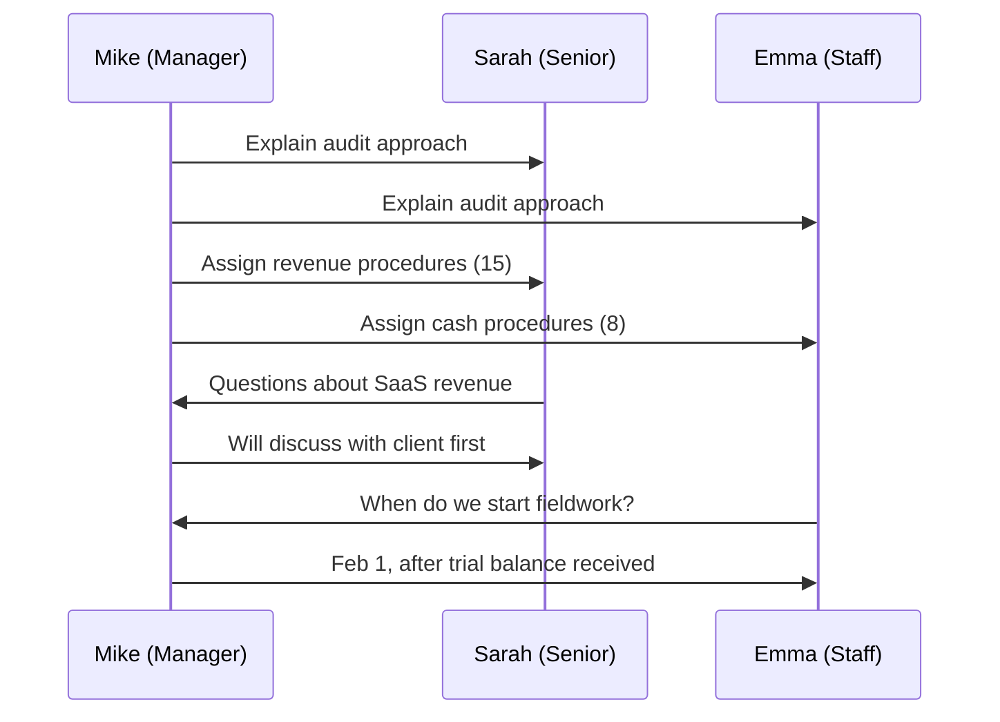
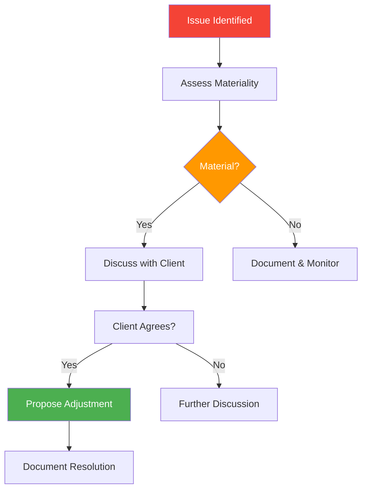
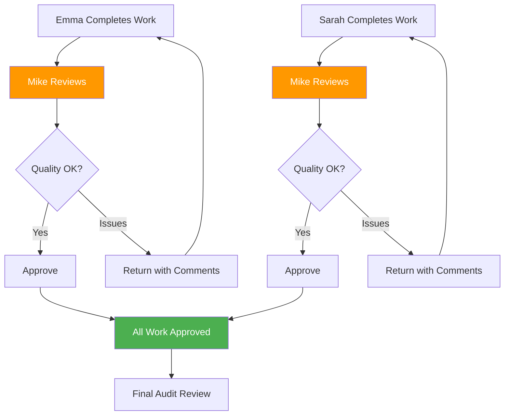
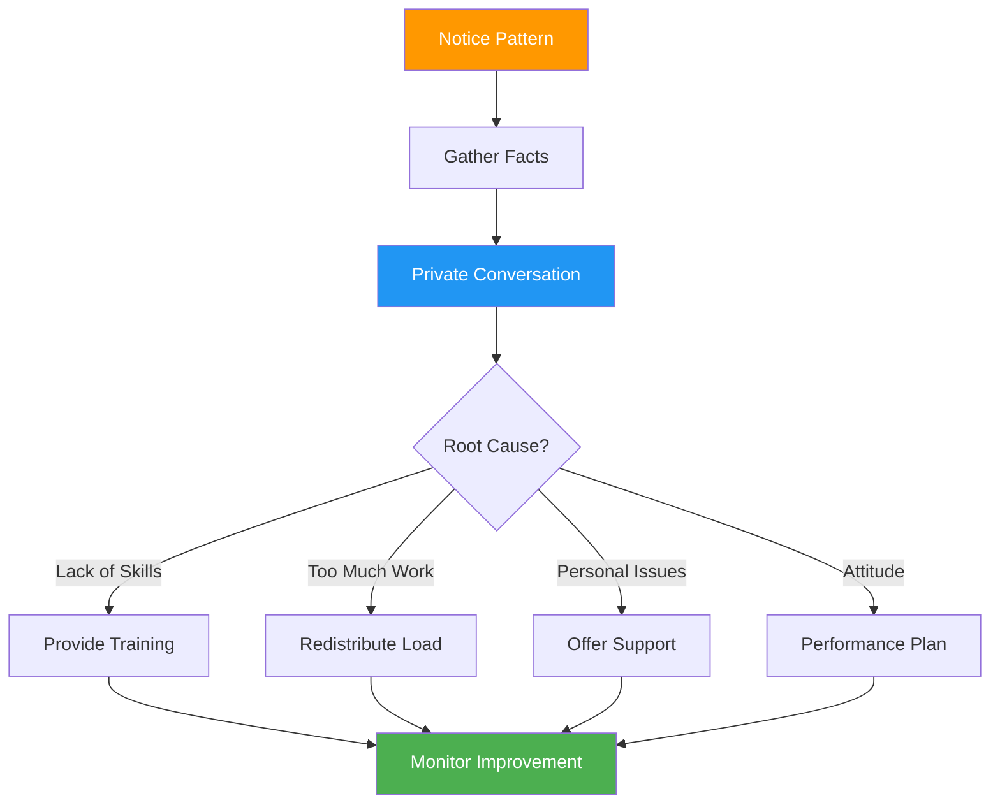
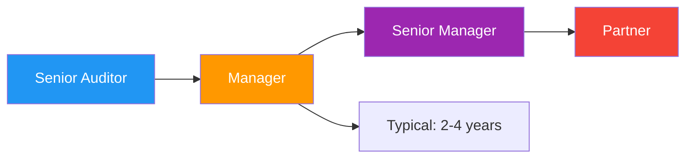

# <span className="role-badge manager">Manager</span> The Team Leader

## 👤 Meet Mike - Your Audit Manager

<div className="persona-card">
  <div className="persona-avatar">
    <div className="avatar-circle manager">📊</div>
  </div>
  <div className="persona-info">
    <h3>Mike Johnson</h3>
    <p className="persona-role">Audit Manager</p>
    <p><strong>Background:</strong> CPA with 8 years of audit experience, managed 50+ audits</p>
    <p><strong>Responsibility:</strong> Plan, execute, and complete audit engagements on time and within budget</p>
    <p><strong>Daily Focus:</strong> Team coordination, client relationships, quality control, final approvals</p>
  </div>
</div>

---

## 🎯 What Does a Manager Do?

Think of the Manager as **the project manager** who:
- 🎬 Directs the audit (like a film director)
- 👥 Coordinates the team
- 🎯 Ensures quality and deadlines
- 🤝 Manages client relationships
- ✅ Gives final approvals

### Manager vs Other Roles

| Aspect | Manager | Senior Auditor | Auditor |
|--------|---------|----------------|---------|
| **Planning** | Creates audit plan | Helps plan | Follows plan |
| **Assignment** | Assigns work | Assigns some work | Receives work |
| **Review** | Final review | First review | Completes work |
| **Client Contact** | Primary contact | Technical discussions | Minimal |
| **Budget** | Responsible | Monitors | Tracks time |
| **Sign-off** | Final approval | Section approval | No approval |

---

## 📅 Mike's Audit Journey - TechStart Inc FY 2025

### Phase 1: Planning (Weeks 1-2)

**Week 1, Monday - Audit Assignment**

```
📧 From: Jordan (Admin)
Subject: New Audit - TechStart Inc FY 2025

Hi Mike,

You've been assigned as Manager for:
Client: TechStart Inc
Period: FY 2025 (Jan-Dec)
Budget: $25,000 (150 hours)
Deadline: March 31, 2026

Client Contact:
Robert Tech, CFO
robert@techstart.com
(555) 123-4567

Prior Year File: Available (FY 2024)
Team: To be assigned by you

Let's discuss this week.
- Jordan
```

**Mike's First Steps:**

<div className="process-flow">

**Step 1: Review Prior Year**
```
📁 Opens: TechStart FY 2024 Audit
Key Info:
  ✅ Clean opinion issued
  ✅ No significant findings
  ✅ Assets: $2.1M → Now $2.5M (+19%)
  ⚠️  New: SaaS revenue stream (complex)
  ⚠️  Issue: Late trial balance last year
```

**Step 2: Analyze Current Year**
```
📊 TechStart Inc - FY 2025 Quick Facts
Revenue: $4.2M (up from $3.5M)
Net Income: $425K (10% margin)
New This Year:
  • Subscription revenue model
  • Stock options issued
  • Cloud infrastructure costs
  
Risk Areas:
  🔴 Revenue recognition (new model)
  🟡 Stock option valuation
  🟡 R&D capitalization
  🟢 Cash - straightforward
```

**Step 3: Build Team**
```
👥 Mike's Team Selection:

Senior Auditor: Sarah Williams
  Why: Has tech company experience
  Assigned: 40 hours
  Responsibilities: Revenue & equity sections

Staff Auditor: Emma Thompson  
  Why: Strong in basic procedures
  Assigned: 60 hours
  Responsibilities: Cash, AP, expenses

Mike's Time: 50 hours
  Focus: Planning, review, client meetings
  
Total Budget: 150 hours ✅
```

</div>

**Week 1, Wednesday - Planning Meeting**



**Team Kickoff Meeting Notes:**

```markdown
# TechStart Inc FY 2025 - Team Kickoff
Date: January 15, 2026
Attendees: Mike (Manager), Sarah (Senior), Emma (Staff)

## Audit Overview
- Client: TechStart Inc (tech company, 3rd year audit)
- Period: Jan 1 - Dec 31, 2025
- Materiality: $50,000 (based on 12% of pre-tax income)
- Audit risk: Medium (new revenue model = higher risk)

## Team Assignments

**Sarah - Revenue & Equity (40 hrs)**
- SaaS subscription revenue testing
- Deferred revenue analysis
- Stock option valuation
- Equity transactions

**Emma - Cash & Expenses (60 hrs)**
- Cash reconciliations
- Accounts payable testing
- Expense analysis
- Vendor confirmations

**Mike - Planning, Review, Client (50 hrs)**
- Planning and risk assessment
- Review all procedures
- Client meetings
- Financial statement review

## Timeline
- Jan 15-31: Planning & setup
- Feb 1-28: Fieldwork
- Mar 1-15: Completion & review
- Mar 16-31: Report drafting & finalization

## Key Dates
- Jan 20: Client planning meeting
- Jan 25: Trial balance due from client
- Feb 1: Fieldwork begins
- Mar 15: Target for procedures complete
- Mar 31: Final report due

## Risk Areas
1. 🔴 Revenue recognition (new SaaS model)
2. 🟡 Stock options (first year)
3. 🟡 R&D costs (capitalization decisions)
4. 🟢 Rest - low risk

## Client Expectations
- Weekly status updates
- Minimal disruption to operations
- Clear document requests
- Professional communication

## Action Items
- [ ] Mike: Schedule client planning meeting
- [ ] Mike: Request trial balance
- [ ] Sarah: Review SaaS revenue accounting standards
- [ ] Emma: Prepare cash confirmation templates
- [ ] All: Review prior year file
```

---

**Week 1, Friday - Client Planning Meeting**

**Mike's Preparation:**

```
✅ Mike's Pre-Meeting Checklist:
  ✅ Reviewed prior year file
  ✅ Analyzed financial trends
  ✅ Prepared document request list
  ✅ Drafted agenda
  ✅ Coordinated team schedules
```

**Meeting with Client:**

<div className="message-thread">

**Location:** TechStart Inc Office  
**Attendees:** Robert (CFO), Mike (Manager), Sarah (Senior)

**Mike:** "Thanks for meeting with us, Robert. This is our third year together, so we know your business well. I see you've grown 20% - congratulations!"

**Robert (CFO):** "Thanks! It's been a good year. We launched our subscription model in Q2."

**Mike:** "That's actually what I wanted to discuss. The subscription revenue will need special attention for proper revenue recognition. Can you walk us through how it works?"

**Robert:** "Sure. Customers pay annually upfront for our software. We recognize revenue monthly over the subscription period."

**Mike:** "Perfect - that's the right approach. We'll need to test the deferred revenue calculation. Also, I see you issued stock options?"

**Robert:** "Yes, to 5 key employees. Our attorney valued them."

**Mike:** "We'll need the valuation report. Now, for timing - can you provide the trial balance by January 25?"

**Robert:** *[laughs]* "Last year we were late. I promise this year will be better!"

**Mike:** "I appreciate that. Here's our document request list. Same as last year, plus a few new items for the subscription revenue and stock options."

**Robert:** "Looks reasonable. We'll have most of this ready when you start fieldwork Feb 1."

**Mike:** "Excellent. We'll do weekly check-ins via email, and I'll let you know if we need anything else. Our goal is March 31 for the final report."

**Robert:** "Works for us. Looking forward to working together again."

</div>

**Document Request List Mike Provided:**

```markdown
# TechStart Inc - FY 2025 Audit
## Document Request List

### General
- [ ] Final trial balance (12/31/2025)
- [ ] General ledger detail
- [ ] Bank statements (all accounts, Dec 2025 & Jan 2026)
- [ ] Bank reconciliations (12/31/2025)
- [ ] Reconciliation of book-to-tax differences

### Revenue (NEW - Subscription Model)
- [ ] SaaS subscription contracts (sample)
- [ ] Deferred revenue schedule
- [ ] Monthly revenue recognition calculations
- [ ] Customer listing with subscription details
- [ ] Revenue by month analysis

### Accounts Receivable
- [ ] AR aging report (12/31/2025)
- [ ] Subsequent collections report (through Feb 2026)
- [ ] Bad debt analysis
- [ ] Credit memo listing

### Inventory
- [ ] Physical inventory count sheets
- [ ] Pricing support for sampled items
- [ ] Obsolete inventory analysis

### Fixed Assets
- [ ] Fixed asset roll forward
- [ ] Depreciation schedule
- [ ] Asset additions/disposals documentation

### Equity (NEW - Stock Options)
- [ ] Stock option plan document
- [ ] Stock option grants listing
- [ ] Valuation report for stock options
- [ ] Board minutes approving grants

### Liabilities
- [ ] AP aging report (12/31/2025)
- [ ] Accrued expenses schedule
- [ ] Loan agreements
- [ ] Lease agreements

### Payroll
- [ ] Payroll summary by month
- [ ] 941 forms
- [ ] W-2/W-3 when available

### Other
- [ ] Board minutes (all 2025)
- [ ] Management representation letter (at completion)
- [ ] Legal inquiry letter (at completion)
- [ ] Subsequent events memo (through report date)

---
Please provide electronically via Client Portal by Jan 31, 2026.
Contact Sarah (sarah@acmecpa.com) with questions.
```

---

### Phase 2: Fieldwork (Weeks 3-6)

**Week 3 - Trial Balance & Assignment**

**Monday, Jan 25 - Trial Balance Arrives**

```
📧 From: Robert (Client CFO)
Subject: Trial Balance - As Promised!

Mike,

Attached is the FY 2025 trial balance. On time this year! 😊

Let me know if you need anything else.

Robert
---
Attachment: TechStart_TB_Dec2025.xlsx
```

**Mike's Actions:**


**Mike Imports & Reviews:**

```
📊 Trial Balance Import Results
━━━━━━━━━━━━━━━━━━━━━━━━━━━━━━━━━━━━━━━━━━━━━━

✅ 156 accounts imported
✅ Total debits: $8,147,250
✅ Total credits: $8,147,250
✅ In balance: Yes

Financial Position:
  Assets: $2,450,000
  Liabilities: $890,000
  Equity: $1,560,000
  
Income Statement:
  Revenue: $4,200,000
  Expenses: $3,775,000
  Net Income: $425,000

Mike's Initial Assessment:
  ✅ Reasonable growth (20%)
  ✅ Margins stable (~10%)
  ✅ Balance sheet ratios healthy
  ⚠️  Deferred revenue: $840K (significant)
  ⚠️  Stock compensation expense: $125K (new)
```

**Mike Assigns Procedures:**

```
📋 Procedure Assignments - TechStart FY 2025
━━━━━━━━━━━━━━━━━━━━━━━━━━━━━━━━━━━━━━━━━━━━━━

Emma Thompson (Staff) - 23 procedures
├── Cash
│   ├── Bank reconciliation (3 accounts)
│   ├── Confirm bank balances
│   └── Test cutoff
├── Accounts Payable
│   ├── AP aging analysis
│   ├── Vendor confirmations (sample)
│   └── Subsequent payments testing
└── Expenses
    ├── Analytical procedures
    ├── Sample expense testing
    └── Credit card review

Sarah Williams (Senior) - 15 procedures
├── Revenue (SaaS Model) - HIGH RISK
│   ├── Revenue recognition policy review
│   ├── Subscription contracts testing
│   ├── Deferred revenue calculation
│   ├── Revenue cutoff testing
│   └── Analytical review
├── Accounts Receivable
│   ├── AR confirmations
│   ├── Subsequent collections
│   └── Bad debt analysis
└── Equity
    ├── Stock option valuation review
    ├── Stock compensation expense
    └── Equity rollforward

Mike Johnson (Manager) - 9 procedures
├── Planning & Risk Assessment
├── Materiality calculations
├── Analytical procedures (overall)
├── Subsequent events review
├── Going concern assessment
├── Related party transactions
├── Management representation letter
├── Legal inquiry letter
└── Financial statement review

Total: 47 procedures
```

**Email to Team:**

<div className="message-thread">

**From:** Mike Johnson  
**To:** Sarah Williams, Emma Thompson  
**Subject:** TechStart Procedures Assigned - Let's Go!

Hey team,

Trial balance is in and I've assigned your procedures. You can see them all in CloudAudit Pro now.

**Emma** - You have 23 procedures focused on cash, AP, and expenses. These are straightforward. Start with the bank reconciliations and work your way through. Target: Complete by Feb 15.

**Sarah** - You have 15 procedures, including the high-risk revenue area. The subscription model is new, so take your time and document thoroughly. I'll be reviewing closely. Let's chat about the revenue approach before you dive in. Target: Complete by Feb 20.

**Deadlines:**
- Feb 15: Emma's procedures complete
- Feb 20: Sarah's procedures complete  
- Feb 25: All my reviews complete
- Mar 15: Procedures finalized after client follow-up

**Weekly Check-ins:** Every Monday 10 AM

Let me know if you have questions. Great work last year - let's do it again!

Mike

</div>

---

**Week 4-5 - Fieldwork Execution**

**Mike's Monday Check-in (Week 4):**

```
📊 TechStart Audit - Week 4 Status
━━━━━━━━━━━━━━━━━━━━━━━━━━━━━━━━━━━━━━━━━━━━━━

Overall Progress: 35% complete

Emma's Progress: 45% (10/23 procedures)
  ✅ Cash reconciliations complete
  ✅ Bank confirmations sent
  ⏳ AP testing in progress
  📅 On track for Feb 15 deadline

Sarah's Progress: 20% (3/15 procedures)
  ✅ Revenue policy reviewed
  ⏳ Deferred revenue testing (complex!)
  ⏳ AR confirmations sent, awaiting responses
  ⚠️  Behind schedule - may need 2 extra days

Mike's Progress: 30% (3/9 procedures)
  ✅ Planning complete
  ✅ Materiality set ($50K)
  ✅ Risk assessment documented
  ⏳ Overall analytics in progress

Client Responsiveness: ✅ Excellent
Documents Provided: 89/95 requested

Issues:
  🟡 Sarah needs more time on complex revenue
  🟡 Missing 6 documents (followed up with client)
```

**Mike's Decision:**

<div className="process-flow">

**Issue:** Sarah behind on complex revenue procedures

**Mike's Analysis:**
- Revenue is high-risk area
- Better to be thorough than fast
- Budget has some flex

**Action:**
```
📧 To: Sarah
Subject: Take the Time You Need

Sarah,

I see you're going deep on the revenue procedures - 
perfect! This is our highest risk area.

Take the 2 extra days you need. I'd rather have it 
done right than done fast. New deadline for you: Feb 22.

Let me know if you hit any roadblocks.

Mike
```

**Budget Adjustment:**
```
Original: 40 hours (Sarah)
Revised: 48 hours (Sarah)
Impact: +$800 (acceptable given risk)
```

</div>

---

**Week 5, Wednesday - Issue Identified**

**Sarah Escalates Finding:**

<div className="message-thread">

**📧 From: Sarah Williams**  
**To: Mike Johnson**  
**Subject: 🚨 Potential Issue - TechStart Revenue**

Mike,

I found something concerning in the deferred revenue testing.

**Issue:** TechStart is recognizing subscription revenue over 12 months, but some contracts are actually 18-month subscriptions. They're recognizing revenue too fast.

**Amount:** ~$78,000 over-stated revenue (material!)

**Sample:**
- Contract #347: 18-month term, $90K upfront
- Should recognize: $5K/month over 18 months
- Actually recognizing: $7.5K/month over 12 months
- Over-statement in 2025: ~$15K

Found similar pattern in 5 other contracts.

**Next Steps?**

Sarah

</div>

**Mike's Response:**



**Mike's Actions:**

```
1. Review Sarah's work
   ✅ Sample size: Appropriate
   ✅ Math: Correct
   ✅ Conclusion: Valid

2. Assess materiality
   Error: $78,000
   Materiality: $50,000
   Result: MATERIAL ⚠️

3. Prepare for client discussion
   - Document the issue clearly
   - Prepare proposed adjustment
   - Schedule call with Robert (CFO)

4. Email to Sarah:
   "Great catch! This is material. I'll discuss 
   with Robert tomorrow. Excellent work on this."
```

**Mike's Call with Client:**

<div className="message-thread">

**📞 Phone Call - Mike & Robert**

**Mike:** "Robert, we found an issue with revenue recognition I need to discuss."

**Robert:** "Okay, what's going on?"

**Mike:** "Your team is recognizing all subscriptions over 12 months, but some are 18-month contracts. You're recognizing revenue too fast."

**Robert:** *[pause]* "Oh no. How much?"

**Mike:** "We sampled 30 contracts and found it in 6. Extrapolating, it's about $78,000 overstated for 2025."

**Robert:** "That's above your materiality threshold, right?"

**Mike:** "Yes, materiality is $50K. This needs to be adjusted."

**Robert:** "I'll talk to our finance team. This was an oversight - we updated our billing system but didn't update the revenue recognition schedule."

**Mike:** "Happens more often than you'd think. The fix is straightforward - adjust the deferred revenue and recognize properly going forward."

**Robert:** "Will this delay the audit?"

**Mike:** "Slightly. You'll need to provide a corrected deferred revenue schedule. We'll need to re-test. Maybe a week delay."

**Robert:** "Understood. I'll get the corrected schedule to you by Friday."

**Mike:** "Perfect. I appreciate your quick response on this."

</div>

**Proposed Audit Adjustment:**

```
📝 Audit Adjustment #1 - TechStart FY 2025
━━━━━━━━━━━━━━━━━━━━━━━━━━━━━━━━━━━━━━━━━━━━━━

Description: Revenue recognized too quickly on 18-month
             subscription contracts

DR: Revenue                        $78,000
    CR: Deferred Revenue                      $78,000

To adjust revenue recognition to proper period for
18-month subscription contracts.

Impact:
  Before Adjustment:
    Revenue: $4,200,000
    Net Income: $425,000
  
  After Adjustment:
    Revenue: $4,122,000
    Net Income: $347,000
  
  Change: -18% to net income (SIGNIFICANT)

Materiality: $50,000
Adjustment Amount: $78,000 (156% of materiality)
Recommendation: MUST adjust

Client Response: Agreed to adjust
Status: ⏳ Awaiting corrected schedule
```

---

### Phase 3: Review & Completion (Weeks 7-8)

**Week 7 - Manager Review**

**Mike's Review Process:**



**Mike's Review Checklist:**

```markdown
# Manager Review Checklist - TechStart FY 2025

## Emma's Cash Procedures

✅ Bank Reconciliation - Account #1000
  - Math: ✅ Correct
  - Outstanding items: ✅ Cleared in Jan
  - Documentation: ✅ Adequate
  - Conclusion: ✅ Clear
  - **Approved**

✅ Bank Reconciliation - Account #1010
  - Math: ✅ Correct
  - Outstanding items: ✅ Reasonable
  - Documentation: ✅ Good
  - Conclusion: ✅ Clear
  - **Approved**

⚠️ Accounts Payable Aging
  - Analysis: ✅ Good
  - Sample size: ⚠️ Too small
  - Documentation: ✅ Good
  - **Action:** Increase sample from 10 to 15 items
  - Status: ⏳ Returned to Emma

✅ Expense Testing
  - Sample: ✅ Appropriate
  - Documentation: ✅ Excellent
  - Conclusion: ✅ Clear
  - **Approved**

## Sarah's Revenue Procedures

✅ Revenue Recognition Review
  - Policy: ✅ Appropriate (ASC 606)
  - Application: ⚠️ Issue identified (18-mo contracts)
  - Testing: ✅ Thorough
  - Conclusion: ✅ Clear with adjustment
  - **Approved** (after adjustment)

✅ Deferred Revenue Testing
  - Calculation: ✅ Correct (after adjustment)
  - Sample: ✅ Robust (30 contracts)
  - Documentation: ✅ Excellent
  - Follow-up: ✅ Complete
  - **Approved**

✅ AR Confirmations
  - Sent: 25
  - Received: 23 (92%)
  - Exceptions: 2 (resolved with alt procedures)
  - **Approved**

✅ Stock Option Valuation
  - Valuation report: ✅ Reviewed
  - Assumptions: ✅ Reasonable
  - Expense calculation: ✅ Correct
  - **Approved**
```

**Review Comments to Emma:**

<div className="message-thread">

**📧 From: Mike Johnson**  
**To: Emma Thompson**  
**CC:** Sarah Williams  
**Subject:** Review Comments - TechStart

Emma,

Great work overall! Most procedures look excellent.

**✅ Approved (20 procedures):**
All cash and expense procedures look good - nice job!

**⏳ Needs Revision (3 procedures):**

1. **AP Aging - Needs larger sample**
   - Current sample: 10 items
   - Increase to: 15 items
   - Why: Total AP is material ($247K)

2. **Expense Sample - Missing one receipt**
   - Invoice #3481 - need supporting documentation
   - Check with client

3. **Credit Card Review - Explain variance**
   - Dec vs Nov: +45% increase
   - Need explanation in workpaper

These are minor. Should take you 2-3 hours. Let's have them done by tomorrow EOD.

Overall: Really solid work! 🎉

Mike

</div>

---

**Week 8 - Final Review & Report**

**Mike's Final Steps:**

<div className="process-flow">

**Step 1: Verify All Procedures Complete**
```
📊 Procedure Status
━━━━━━━━━━━━━━━━━━━━━━━━━━━━━━━━━━━━━━━━━━━━━━

Total Procedures: 47
Completed: 47 (100%)
Approved by Manager: 47 (100%)

✅ Ready for final review
```

**Step 2: Review Audit Adjustments**
```
📝 Summary of Audit Adjustments
━━━━━━━━━━━━━━━━━━━━━━━━━━━━━━━━━━━━━━━━━━━━━━

#1: Revenue Recognition Error
    DR: Revenue $78,000
        CR: Deferred Revenue $78,000
    Status: ✅ Client adjusted

Total Impact on Net Income: -$78,000 (-18%)

Final Numbers:
  Revenue: $4,122,000
  Net Income: $347,000
  Margin: 8.4% (down from 10.1%)
```

**Step 3: Financial Statement Review**
```
✅ Balance Sheet: Balanced
✅ Income Statement: Reasonable
✅ Cash Flow Statement: Ties to BS/IS
✅ Notes: Complete and accurate
✅ Disclosures: All required items present
```

**Step 4: Obtain Management Letter**
```
📧 Request sent to Robert (CFO)
📄 Management Representation Letter
⏳ Awaiting signature
```

**Step 5: Draft Audit Report**
```
📝 Independent Auditor's Report
━━━━━━━━━━━━━━━━━━━━━━━━━━━━━━━━━━━━━━━━━━━━━━

Opinion: ✅ Unmodified (Clean)

"In our opinion, the financial statements present
fairly, in all material respects, the financial
position of TechStart Inc as of December 31, 2025..."

Basis: Review of procedures, tests performed
Scope: No limitations
Emphasis: None required
```

</div>

**Final Client Meeting:**

```
📅 Date: March 28, 2026
📍 Location: TechStart Inc Office
👥 Attendees: Robert (CFO), Mike (Manager), Sarah (Senior)

AGENDA:
1. Audit results summary
2. Review audit adjustments
3. Discuss findings
4. Management letter items
5. Next year planning

MIKE'S PRESENTATION:
"Robert, I'm pleased to report we're issuing a clean 
opinion. The audit went well overall.

KEY POINTS:
✅ Clean opinion - no qualifications
✅ Financial statements fairly presented
✅ Internal controls generally effective

ADJUSTMENTS:
⚠️  One material adjustment: Revenue recognition
    Impact: -$78K to net income
    Reason: 18-month contracts recognized too fast
    Going forward: Fixed in your system

RECOMMENDATIONS:
💡 Enhance revenue recognition process
💡 Consider more frequent account reconciliations
💡 Document stock option grants better

NEXT YEAR:
📅 Planning meeting: December 2026
📈 Expected growth: Consider larger sample sizes
🔄 Same team (if you're happy with us!)

Questions?"
```

---

## 🔑 Manager Powers & Responsibilities

### What Mike Can Do

<div className="feature-grid">

<div className="card">
<h4>📋 Planning</h4>

**Set the Direction:**
- ✅ Create audit plan
- ✅ Set materiality
- ✅ Assess risks
- ✅ Build team
- ✅ Set timeline
- ✅ Create budget

**Documents:**
- Planning memo
- Risk assessment
- Audit program
</div>

<div className="card">
<h4>👥 Team Management</h4>

**Lead the Team:**
- ✅ Assign procedures
- ✅ Monitor progress
- ✅ Provide guidance
- ✅ Resolve issues
- ✅ Conduct reviews
- ✅ Give feedback

**Communication:**
- Weekly check-ins
- Real-time support
- Performance reviews
</div>

<div className="card">
<h4>🤝 Client Relations</h4>

**Primary Contact:**
- ✅ Planning meetings
- ✅ Status updates
- ✅ Issue discussion
- ✅ Final presentation
- ✅ Relationship building

**Deliverables:**
- Audit report
- Management letter
- Status reports
</div>

<div className="card">
<h4>✅ Quality Control</h4>

**Final Review:**
- ✅ Review all procedures
- ✅ Approve adjustments
- ✅ Sign off workpapers
- ✅ Review financials
- ✅ Approve report

**Standards:**
- GAAS compliance
- Firm methodology
- Professional skepticism
</div>

<div className="card">
<h4>💰 Budget Management</h4>

**Financial Oversight:**
- ✅ Monitor time
- ✅ Track costs
- ✅ Manage budget
- ✅ Approve overruns
- ✅ Analyze profitability

**Reporting:**
- Time tracking
- Budget variance
- Profitability analysis
</div>

<div className="card">
<h4>📊 Reporting</h4>

**Deliverables:**
- ✅ Draft audit report
- ✅ Management letter
- ✅ Financial statements
- ✅ Tax items summary
- ✅ Board presentation

**Quality:**
- Technical accuracy
- Clear communication
- Timely delivery
</div>

</div>

---

## 📊 Mike's Dashboard

### What Managers See

```
╔══════════════════════════════════════════════════════════════╗
║  CloudAudit Pro - Manager Dashboard                         ║
╠══════════════════════════════════════════════════════════════╣
║                                                              ║
║  My Audits: 3 active                                        ║
║  Team: 6 people across audits                               ║
║  This Week: 127 hours logged                                ║
║                                                              ║
║  ━━━━━━━━━━━━━━━━━━━━━━━━━━━━━━━━━━━━━━━━━━━━━━━━━━━━━━━  ║
║                                                              ║
║  📊 AUDIT STATUS                                             ║
║                                                              ║
║  TechStart FY2025                                           ║
║    Progress: ████████████████░░░░ 80%                      ║
║    Status: 🟢 On track                                      ║
║    Budget: $28,750 / $25,000 (115%) 🟡                     ║
║    Due: Mar 31 (3 days remaining)                          ║
║    Team: Sarah, Emma                                        ║
║    Issues: 1 material adjustment (resolved)                ║
║                                                              ║
║  RetailCo FY2025                                            ║
║    Progress: ████████░░░░░░░░░░░░ 40%                      ║
║    Status: ⚠️  Behind schedule                             ║
║    Budget: $16,200 / $18,000 (90%) 🟢                      ║
║    Due: Apr 15 (18 days remaining)                         ║
║    Team: David, Tom                                         ║
║    Issues: 2 procedures overdue                            ║
║                                                              ║
║  ServiceCo FY2025                                           ║
║    Progress: ████████████████████ 95%                      ║
║    Status: 🟢 Nearly complete                              ║
║    Budget: $21,450 / $22,000 (97%) 🟢                      ║
║    Due: Feb 28 (TOMORROW!)                                 ║
║    Team: Chris, Alex                                        ║
║    Issues: None                                             ║
║                                                              ║
║  ━━━━━━━━━━━━━━━━━━━━━━━━━━━━━━━━━━━━━━━━━━━━━━━━━━━━━━━  ║
║                                                              ║
║  🎯 TODAY'S PRIORITIES                                       ║
║   1. 🔴 Finish ServiceCo final review (due tomorrow!)      ║
║   2. 🟡 Follow up on RetailCo overdue procedures           ║
║   3. 🟢 Review TechStart draft report                      ║
║   4. 📧 Client call: TechStart final meeting (2 PM)        ║
║                                                              ║
║  ━━━━━━━━━━━━━━━━━━━━━━━━━━━━━━━━━━━━━━━━━━━━━━━━━━━━━━━  ║
║                                                              ║
║  ⚠️  ATTENTION NEEDED                                        ║
║   🔴 RetailCo: 2 procedures overdue (Tom)                  ║
║   🟡 TechStart: Over budget by $3,750 (15%)                ║
║   🟢 All reviews current                                    ║
║                                                              ║
╚══════════════════════════════════════════════════════════════╝
```

---

## 🎯 Manager Success Metrics

### How Mike is Measured

| Metric | Target | Mike's Current | Status |
|--------|--------|----------------|--------|
| **Quality** ||||
| Clean opinions | >95% | 100% (12/12) | ✅ Exceeds |
| Rework rate | <15% | 12% | ✅ Meets |
| Client satisfaction | >4.0/5 | 4.6/5 | ✅ Exceeds |
| **Efficiency** ||||
| On-time delivery | >90% | 92% (11/12) | ✅ Meets |
| Budget performance | ±10% | +5% avg | ✅ Meets |
| Team utilization | 70-85% | 78% avg | ✅ Optimal |
| **Leadership** ||||
| Team satisfaction | >4.0/5 | 4.4/5 | ✅ Exceeds |
| Staff development | 2+ trained | 3 promoted | ✅ Exceeds |
| Retention | >80% | 100% | ✅ Exceeds |

---

## 💡 Mike's Pro Tips

:::tip Manager Wisdom

**1. Plan More Than You Think You Need**
Spend 15-20% of budget on planning. It pays off 10x during fieldwork.

**2. Communicate Early and Often**
Don't wait for weekly check-ins. Real-time communication prevents surprises.

**3. Trust But Verify**
Give your team autonomy, but review thoroughly. Quality is your responsibility.

**4. Manage Client Expectations**
Underpromise and overdeliver. If you say March 31, deliver March 28.

**5. Document Everything**
If it's not documented, it didn't happen. This protects you and the client.

**6. Develop Your Team**
Your success depends on their success. Invest in training and feedback.

**7. Know When to Escalate**
Don't try to solve every problem yourself. Know when to involve partners.

**8. Balance Budget vs Quality**
Never sacrifice quality for budget. A redo costs more than doing it right.

:::

---

## 🚨 Handling Common Challenges

### Challenge 1: Team Member Underperforming

**Scenario:** Tom's procedures are consistently late and need rework

**Mike's Approach:**



**Mike's Conversation:**

<div className="message-thread">

**Setting:** Private meeting, 1-on-1

**Mike:** "Tom, thanks for meeting. I wanted to check in on RetailCo. I've noticed you're behind on a few procedures. What's going on?"

**Tom:** "Yeah, I'm struggling with the inventory procedures. I've never done them before."

**Mike:** "Ah, I should have caught that. This is your first inventory observation, right?"

**Tom:** "Yes. I'm not sure what I'm looking for."

**Mike:** "My fault - I should have paired you with David for training. Here's what we'll do:

1. David will walk you through inventory procedures tomorrow
2. You'll shadow him on the next count
3. Then you'll do one together
4. Then you'll do one solo with his review

Sound good?"

**Tom:** "That would really help. Thanks."

**Mike:** "No problem. Communication goes both ways - next time, speak up sooner if you're stuck. Deal?"

**Tom:** "Deal."

</div>

---

### Challenge 2: Client Pushback on Finding

**Scenario:** Client doesn't want to adjust for material error

**Mike's Response:**

```
📞 Client Call - Mike's Approach

CLIENT: "This $78K adjustment will tank our bonuses.
         Can't we just fix it next year?"

MIKE (Calm & Professional):
"I understand the impact, Robert. Let me explain why
we can't do that:

1. **Materiality:** It's above our threshold ($50K)
   
2. **Professional Standards:** GAAS requires us to
   propose adjustments for material errors
   
3. **Audit Opinion:** We can't issue a clean opinion
   with a known material error
   
4. **Your Credibility:** Investors/lenders trust your
   financials. An error undermines that trust

OPTIONS:
A. Adjust and explain to stakeholders (recommended)
B. We issue a qualified opinion (not recommended)
C. You find other auditors (really not recommended)

I know it's painful, but it's the right thing to do.
Let's discuss how to communicate this to your board."

RESULT: Client agrees to adjust
```

---

### Challenge 3: Running Over Budget

**Scenario:** TechStart audit is 15% over budget

**Mike's Analysis:**

```markdown
## Budget Variance Analysis - TechStart FY2025

### Original Budget
- Planning: 10 hours
- Fieldwork: 120 hours  
- Completion: 20 hours
- **Total: 150 hours @ $167/hr = $25,000**

### Actual Hours
- Planning: 11 hours (+1)
- Fieldwork: 138 hours (+18)
- Completion: 23 hours (+3)
- **Total: 172 hours = $28,750 (+$3,750 / +15%)**

### Reasons for Overrun

1. **Revenue Issue (10 hours)**
   - Discovery: 4 hours
   - Additional testing: 4 hours
   - Client discussion: 2 hours
   - **Justifiable:** Material finding

2. **New SaaS Model (6 hours)**
   - Complex revenue recognition
   - More research needed
   - **Justifiable:** Higher risk

3. **Inefficiency (6 hours)**
   - Emma's AP sample too small (rework)
   - Miscommunication on procedures
   - **Unjustifiable:** Our fault

### Decision
- **Bill client:** 166 hours ($27,750)
- **Absorb:** 6 hours ($1,000)
- **Reason:** Justify material work, eat inefficiency

### Lessons Learned
1. Budget more for first-year SaaS clients
2. Clearer communication on expectations
3. Larger samples upfront to avoid rework

### Future
- Next year: Budget 160 hours (+10 hours)
- Rationale: Revenue complexity will continue
```

---

## 📚 Manager Resources

### Essential Tools

<div className="feature-grid">

<div className="card">
<h4>📖 Reference Materials</h4>

- GAAS standards
- Audit methodology guide
- Industry guides
- Technical Q&A library
- Prior year files

</div>

<div className="card">
<h4>🎓 Training</h4>

- Manager development program
- Technical CPE courses
- Leadership training
- Client management
- Quality review training

</div>

<div className="card">
<h4>🤝 Support Network</h4>

- Partner consultation
- Technical review team
- Quality control department
- Industry specialists
- Peer managers

</div>

</div>

---

## 📋 Manager Checklists

### Audit Start Checklist

```markdown
# Audit Planning Checklist

## Pre-Planning
- [ ] Review prior year file
- [ ] Review client financial statements
- [ ] Check for related parties
- [ ] Research industry issues
- [ ] Review independence confirmations

## Planning Meeting
- [ ] Meet with client management
- [ ] Understand business changes
- [ ] Identify risk areas
- [ ] Set timeline expectations
- [ ] Provide document request list

## Team & Budget
- [ ] Assign team members
- [ ] Communicate roles clearly
- [ ] Set budget by procedure area
- [ ] Schedule kickoff meeting
- [ ] Set review milestones

## Technical
- [ ] Calculate materiality
- [ ] Assess risk (Low/Medium/High)
- [ ] Determine audit approach
- [ ] Prepare planning memo
- [ ] Get partner approval on plan
```

### Audit Completion Checklist

```markdown
# Audit Completion Checklist

## Procedures
- [ ] All procedures complete
- [ ] All procedures reviewed
- [ ] All review notes cleared
- [ ] Working papers organized
- [ ] Cross-references complete

## Client Deliverables
- [ ] Obtain management representation letter
- [ ] Obtain legal inquiry response
- [ ] Review subsequent events
- [ ] Obtain signed financials
- [ ] Finalize audit adjustments

## Quality Review
- [ ] Financial statements reviewed
- [ ] Audit report drafted
- [ ] Management letter prepared
- [ ] Partner quality review complete
- [ ] All deficiencies resolved

## Closeout
- [ ] Final client meeting held
- [ ] Final invoice prepared
- [ ] File archived
- [ ] Lessons learned documented
- [ ] Next year planning scheduled
```

---

## 🎯 Career Path

### Manager Development Journey



**Manager Level Expectations:**

```
Years 1-2: Learning Manager Role
├── Lead 5-8 audits per year
├── Develop review skills
├── Build client relationships
└── Mentor staff/seniors

Years 3-4: Advanced Manager
├── Lead 8-12 audits per year
├── Handle complex audits
├── Business development
└── Train new managers

Promotion to Senior Manager:
├── Consistent quality
├── Strong client relationships
├── Team development record
└── Business development success
```

---

## 🚀 Quick Reference

### Manager's Daily Routine

```
☕ Morning (8:00-12:00)
├── Check dashboard for red flags
├── Review overnight team questions
├── Conduct procedure reviews
└── Client communications

🍔 Midday (12:00-1:00)
└── Lunch + catch up on emails

⚙️ Afternoon (1:00-5:00)
├── Team meetings/check-ins
├── Client calls
├── Continue reviews
└── Planning for tomorrow

📊 End of Day (5:00-5:30)
├── Update time tracking
├── Tomorrow's priority list
└── Quick status to Jordan (Admin)
```

---

## 🎯 Next Steps

### Related Documentation

- [Senior Auditor Role](./senior-auditor) - Your review partners
- [Staff Auditor Role](./auditor) - Your team members
- [Business Processes](/docs/processes/audit-lifecycle) - Complete audit flow
- [Procedures Module](/docs/modules/procedures) - Managing procedures

---

*Remember: As Manager, you're the conductor of the orchestra. Every person plays their part, but you create the harmony that makes great audits!* 📊

---

*Last Updated: January 1, 2026*

