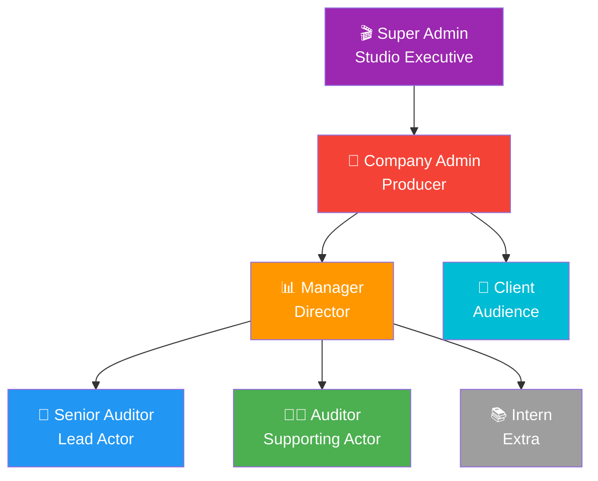
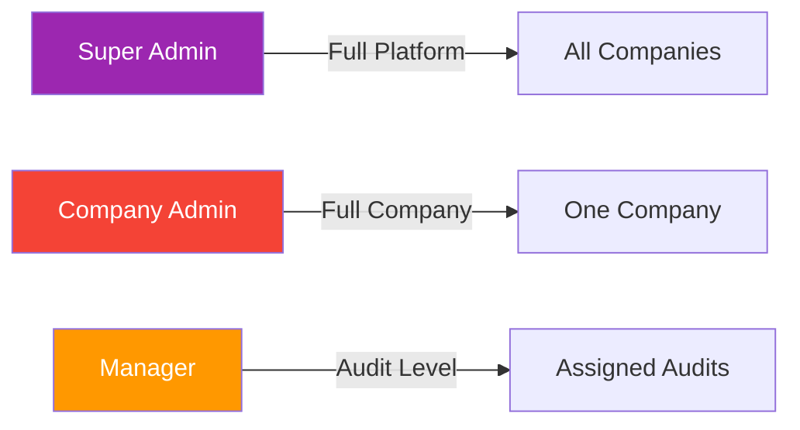
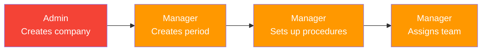
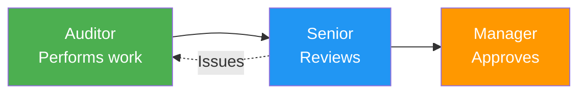
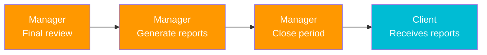

# User Roles Overview 👥

CloudAudit Pro is designed to support everyone involved in the audit process, from platform administrators to clients. Each role has specific permissions and responsibilities tailored to their needs.

## 🎭 The Team Structure

Think of an audit engagement like producing a movie:



## 👤 All User Roles

### <span className="role-badge super-admin">Super Admin</span>

**The Platform Overseer**

- 🎯 **Purpose**: Manages the entire CloudAudit Pro platform
- 👥 **Who**: Platform administrators, system owners
- 🔑 **Key Power**: Approve new companies, manage system-wide settings
- 📊 **Scope**: All tenants/companies

**Think of them as**: The landlord who manages the entire building

**Learn more**: [Super Admin Role →](./super-admin.md)

---

### <span className="role-badge admin">Company Admin</span>

**The Setup Manager**

- 🎯 **Purpose**: Sets up and manages a specific company
- 👥 **Who**: Firm partners, IT managers, operations leads
- 🔑 **Key Power**: Create users, configure company settings
- 📊 **Scope**: One company (tenant)

**Think of them as**: The office manager who runs the daily operations

**Learn more**: [Company Admin Role →](./admin.md)

---

### <span className="role-badge manager">Manager</span>

**The Team Leader**

- 🎯 **Purpose**: Oversees audit engagements and team
- 👥 **Who**: Audit managers, senior managers, partners
- 🔑 **Key Power**: Final approvals, resource allocation, client relationships
- 📊 **Scope**: Multiple audits, team oversight

**Think of them as**: The project manager who ensures everything gets done

**Learn more**: [Manager Role →](./manager.md)

---

### <span className="role-badge senior-auditor">Senior Auditor</span>

**The Expert Practitioner**

- 🎯 **Purpose**: Handles complex procedures and reviews junior work
- 👥 **Who**: Senior auditors, supervisors
- 🔑 **Key Power**: Review and approve auditor work, handle technical issues
- 📊 **Scope**: Assigned procedures, team mentoring

**Think of them as**: The experienced craftsperson who mentors apprentices

**Learn more**: [Senior Auditor Role →](./senior-auditor.md)

---

### <span className="role-badge auditor">Auditor</span>

**The Worker Bee**

- 🎯 **Purpose**: Performs day-to-day audit procedures
- 👥 **Who**: Staff auditors, associates
- 🔑 **Key Power**: Complete procedures, document findings
- 📊 **Scope**: Assigned procedures

**Think of them as**: The hands-on worker doing the detailed work

**Learn more**: [Auditor Role →](./auditor.md)

---

### <span className="role-badge intern">Intern</span>

**The Learner**

- 🎯 **Purpose**: Learn audit processes while assisting team
- 👥 **Who**: Interns, trainees, new hires
- 🔑 **Key Power**: View and assist with simple tasks
- 📊 **Scope**: Limited, supervised access

**Think of them as**: The apprentice learning the trade

**Learn more**: [Intern Role →](./intern.md)

---

### <span className="role-badge client">Client</span>

**The Portal User**

- 🎯 **Purpose**: Interact with audit team, provide information
- 👥 **Who**: Client company staff, CFOs, controllers
- 🔑 **Key Power**: Upload documents, communicate with auditors
- 📊 **Scope**: Their own company's audit

**Think of them as**: The customer receiving the service

**Learn more**: [Client Role →](./client.md)

---

## 📊 Quick Comparison

| Role | Create Audits | Assign Work | Complete Procedures | Review Work | Final Approval | Manage Users |
|------|--------------|-------------|---------------------|-------------|----------------|--------------|
| **Super Admin** | ✅ | ✅ | ✅ | ✅ | ✅ | ✅ All |
| **Admin** | ✅ | ✅ | ✅ | ✅ | ✅ | ✅ Company |
| **Manager** | ✅ | ✅ | ✅ | ✅ | ✅ | ❌ |
| **Senior Auditor** | ⚠️ Limited | ⚠️ Limited | ✅ | ✅ | ❌ | ❌ |
| **Auditor** | ❌ | ❌ | ✅ | ❌ | ❌ | ❌ |
| **Intern** | ❌ | ❌ | ⚠️ Simple only | ❌ | ❌ | ❌ |
| **Client** | ❌ | ❌ | ❌ | ❌ | ❌ | ❌ |

## 🔐 Permission Levels

### Administrative Permissions



### Audit Work Permissions

| Permission | Manager | Senior | Auditor | Intern |
|------------|---------|--------|---------|--------|
| View all procedures | ✅ | ✅ | ⚠️ Assigned | ⚠️ Assigned |
| Create procedures | ✅ | ⚠️ Limited | ❌ | ❌ |
| Assign procedures | ✅ | ⚠️ Limited | ❌ | ❌ |
| Complete work | ✅ | ✅ | ✅ | ⚠️ Simple |
| Review work | ✅ | ✅ | ❌ | ❌ |
| Approve final | ✅ | ❌ | ❌ | ❌ |

### Document Permissions

| Permission | All Roles | Manager Only | Senior Only |
|------------|-----------|--------------|-------------|
| Upload documents | ✅ | - | - |
| View documents | ✅ | - | - |
| Delete documents | - | ✅ | ⚠️ Own only |
| Manage repository | - | ✅ | - |

## 🎯 Typical Team Composition

### Small Audit Firm (5 people)
```
👔 1 Partner (Admin + Manager)
👨‍💼 2 Senior Auditors
👩‍💼 2 Staff Auditors
```

### Medium Audit Firm (15 people)
```
🎯 1 Managing Partner (Admin)
👔 3 Audit Managers
👨‍💼 5 Senior Auditors
👩‍💼 6 Staff Auditors
```

### Large Audit Firm (50+ people)
```
🎬 1 IT Admin (Super Admin)
🎯 Firm Admin (Company Admin)
👔 10+ Managers
👨‍💼 20+ Seniors
👩‍💼 30+ Staff
📚 Seasonal Interns
```

### Internal Audit Department
```
🎯 1 Chief Audit Executive (Admin + Manager)
👨‍💼 2-3 Senior Auditors
👩‍💼 3-5 Internal Auditors
```

## 🔄 Workflow by Role

### Audit Setup (Beginning)



### Audit Execution (Middle)



### Audit Completion (End)



## 📱 Access Levels

### What Each Role Sees on Dashboard

**Manager Dashboard**:
- 📊 All audits progress
- 👥 Team workload
- ⚠️ Risk areas
- 📈 Performance metrics
- 📅 Upcoming deadlines

**Senior Auditor Dashboard**:
- 📋 Assigned procedures (own + team's for review)
- ⏰ My deadlines
- 🔍 Pending reviews
- 👥 Junior team members' work

**Auditor Dashboard**:
- 📝 My assigned procedures
- ⏰ My deadlines
- 📎 Documents to review
- ✅ Recently completed

**Intern Dashboard**:
- 📚 Learning materials
- 📝 Simple assigned tasks
- ✅ Training completions
- 👀 Read-only audit view

**Client Dashboard**:
- 📋 Document requests
- 📊 Audit progress
- 💬 Messages
- ✅ Outstanding items

## 🎓 Learning Paths by Role

### For Managers
1. [Audit Lifecycle](/docs/processes/audit-lifecycle) - Understand the big picture
2. [Team Management](#) - Assign and track work
3. [Reporting](/docs/modules/reporting/overview) - Generate insights

### For Seniors
1. [Audit Procedures](/docs/modules/procedures/overview) - Master procedure management
2. [Review Process](/docs/processes/05-review) - Quality control
3. [Workpapers](/docs/modules/workpapers/overview) - Documentation

### For Auditors
1. [Getting Started](#) - First audit walkthrough
2. [Procedures](/docs/modules/procedures/workflow) - Your daily work
3. [Document Management](/docs/modules/documents/overview) - Organizing evidence

### For Interns
1. [Audit Basics](/docs/basics/what-is-auditing) - Learn the fundamentals
2. [Terminology](/docs/basics/audit-terminology) - Build vocabulary
3. [Simple Tasks](#) - Start contributing

## 🚀 Getting Started

### I'm a... What do I do first?

<div className="feature-grid">
  <div className="card">
    <h4>🎬 Super Admin</h4>
    <p>Review platform settings, approve pending companies, monitor system health</p>
    <a href="./super-admin">Learn More →</a>
  </div>
  
  <div className="card">
    <h4>👔 Company Admin</h4>
    <p>Complete company setup, invite users, configure chart of accounts</p>
    <a href="./admin">Learn More →</a>
  </div>
  
  <div className="card">
    <h4>📊 Manager</h4>
    <p>Create first audit period, set up procedures, assign team</p>
    <a href="./manager">Learn More →</a>
  </div>
  
  <div className="card">
    <h4>🎯 Senior Auditor</h4>
    <p>Review assigned procedures, familiarize with templates, set up review workflow</p>
    <a href="./senior-auditor">Learn More →</a>
  </div>
  
  <div className="card">
    <h4>👨‍💼 Auditor</h4>
    <p>Check "My Work" dashboard, review assigned procedures, start first task</p>
    <a href="./auditor">Learn More →</a>
  </div>
  
  <div className="card">
    <h4>📚 Intern</h4>
    <p>Complete training materials, shadow experienced team members, ask questions</p>
    <a href="./intern">Learn More →</a>
  </div>
  
  <div className="card">
    <h4>🤝 Client</h4>
    <p>Complete registration, review document requests, explore portal</p>
    <a href="./client">Learn More →</a>
  </div>
</div>

---

## 💡 Role Tips

:::tip For Everyone
- **Explore the system** - Click around to learn
- **Use search** - Find anything instantly with Ctrl+K
- **Check notifications** - Stay updated on changes
- **Ask for help** - Use the help icon (?) anywhere
:::

:::info Security Reminder
Each role has access only to what they need. This keeps data secure and workflows clean. If you need different permissions, contact your Company Admin.
:::

---

## 📚 Next Steps

Ready to learn about your specific role? Choose from the menu:

1. [Super Admin](./super-admin) - Platform management
2. [Company Admin](./admin) - Company setup
3. [Manager](./manager) - Team leadership
4. [Senior Auditor](./senior-auditor) - Expert work & review
5. [Auditor](./auditor) - Daily audit tasks
6. [Intern](./intern) - Learning & assisting
7. [Client](./client) - Portal usage

Or continue with [Business Processes](/docs/processes/audit-lifecycle) to see how all roles work together!

---

*Last Updated: January 1, 2026*
