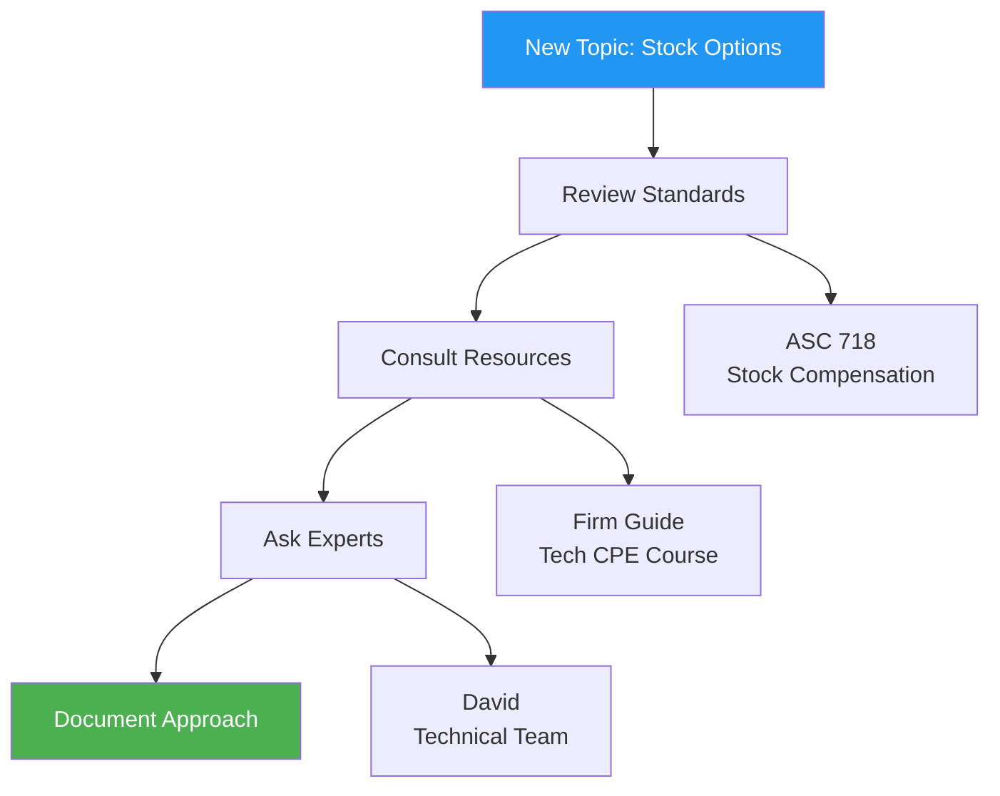
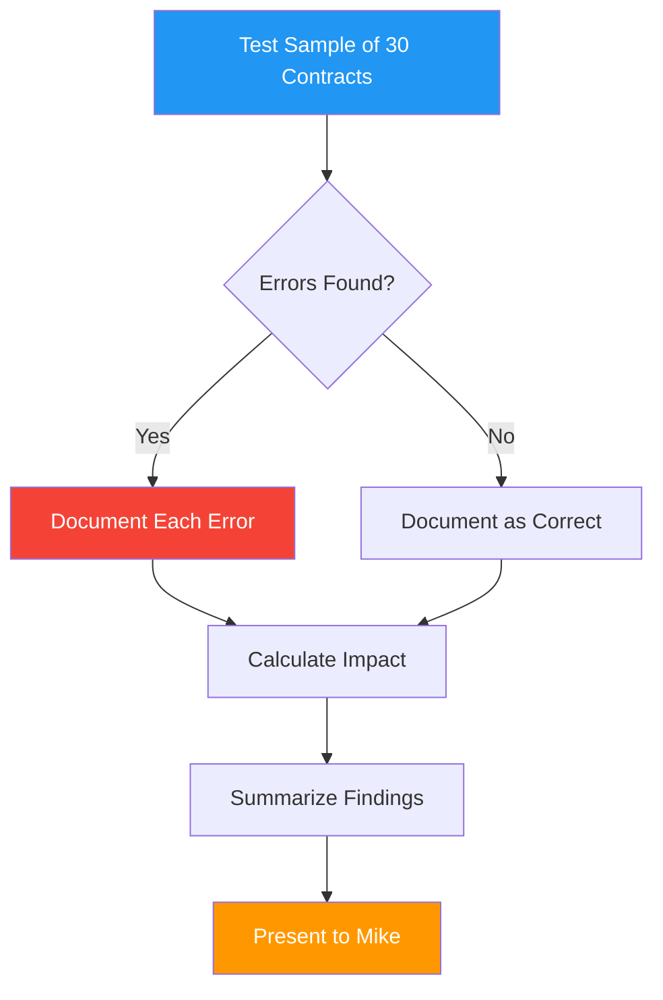
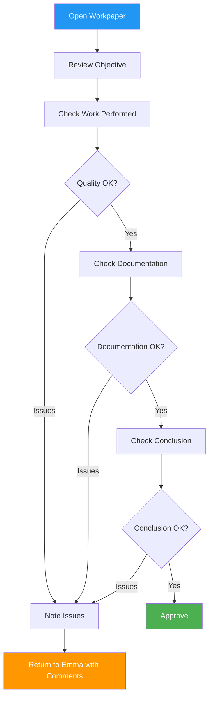
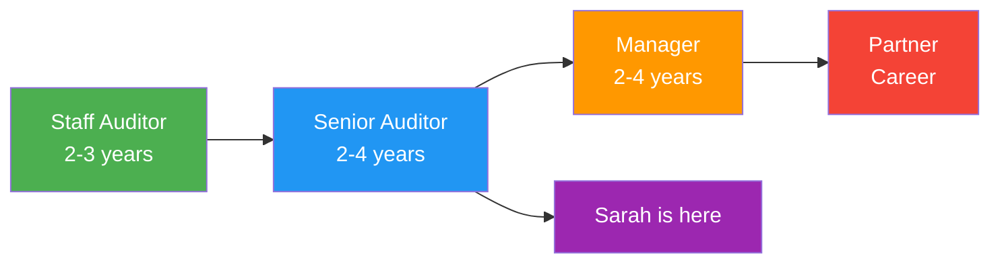

# <span className="role-badge senior-auditor">Senior Auditor</span> The Expert Practitioner

## 👤 Meet Sarah - Your Senior Auditor

<div className="persona-card">
  <div className="persona-avatar">
    <div className="avatar-circle senior-auditor">🎯</div>
  </div>
  <div className="persona-info">
    <h3>Sarah Williams</h3>
    <p className="persona-role">Senior Auditor</p>
    <p><strong>Background:</strong> CPA with 5 years audit experience, specialized in tech companies</p>
    <p><strong>Responsibility:</strong> Execute complex procedures, review staff work, mentor junior team</p>
    <p><strong>Daily Focus:</strong> High-risk areas, technical accounting, quality review, teaching</p>
  </div>
</div>

---

## 🎯 What Does a Senior Auditor Do?

Think of the Senior Auditor as **the experienced craftsperson** who:
- 🔧 Handles the complex work (high-risk areas)
- 👀 Reviews junior work (quality control)
- 👨‍🏫 Mentors staff (teaching)
- 🎯 Solves technical problems (expertise)

### Senior vs Other Roles

| Aspect | Senior Auditor | Auditor | Manager |
|--------|----------------|---------|---------|
| **Complexity** | High-risk procedures | Standard procedures | Oversight |
| **Review** | Reviews staff work | No review authority | Reviews all work |
| **Independence** | Works independently | Needs guidance | Fully autonomous |
| **Mentoring** | Teaches juniors | Learns from seniors | Coaches team |
| **Technical** | Deep expertise | Learning | Strategic view |

---

## 📅 Sarah's Week on TechStart Audit

### Monday: Planning & Assignment

**9:00 AM - Team Meeting**

```
📧 Meeting Invite from Mike (Manager)
Subject: TechStart Audit Kickoff

Agenda:
1. Audit overview
2. Team assignments
3. Risk areas discussion
4. Timeline & deadlines
5. Q&A
```

**Sarah's Assignment from Mike:**

```
👤 Sarah Williams - Assignment Details
━━━━━━━━━━━━━━━━━━━━━━━━━━━━━━━━━━━━━━━━━━━━━━

PROCEDURES: 15 total (40 hours budgeted)

HIGH-RISK AREAS:
├── Revenue (SaaS Model) - NEW THIS YEAR
│   ├── Revenue recognition policy review
│   ├── Subscription contract testing
│   ├── Deferred revenue calculation
│   ├── Revenue cutoff testing
│   └── Analytical procedures
│
├── Accounts Receivable
│   ├── AR confirmations (25 customers)
│   ├── Subsequent collections testing
│   └── Bad debt analysis
│
└── Equity - NEW THIS YEAR
    ├── Stock option valuation review
    ├── Stock compensation expense
    └── Equity rollforward

ADDITIONAL RESPONSIBILITIES:
├── Review Emma's work (3 procedures)
├── Mentor Emma on complex areas
└── Escalate issues to Mike

DEADLINE: February 22, 2026
```

**Sarah's Reaction:**

<div className="process-flow">

**Sarah's Assessment:**
```
✅ Good: I've done SaaS revenue before
⚠️  Challenge: Stock options - new to me
✅ Manageable: 40 hours is reasonable
👍 Positive: Working with Emma (she's learning fast)
```

**Sarah's Plan:**
```
Week 1: Research stock option accounting
Week 2-3: Execute revenue procedures
Week 4: AR confirmations & equity
Week 5: Reviews & wrap-up
```

**Sarah's Questions for Mike:**
```
📧 To: Mike Johnson
Subject: TechStart Assignment - Quick Questions

Mike,

Got my assignment - looks good! Few questions:

1. Stock options: Can I consult with David? 
   He did stock comp last month.
   
2. Revenue: Do we have their ASC 606 memo?
   
3. Emma's reviews: Which 3 procedures?

Thanks!
Sarah
```

</div>

---

### Tuesday: Research & Preparation

**Sarah's Research Process:**



**Sarah's Research Notes:**

```markdown
# Stock Options Research - TechStart Audit

## Standards
- ASC 718: Compensation - Stock Compensation
- Applies to: Stock options granted to employees
- Key: Fair value on grant date

## TechStart Specifics
- 5 employees received options
- Grant date: March 15, 2025
- Exercise price: $10/share
- Fair value per option: $4.25 (per valuation report)
- Total expense: $125,000 (to be recognized over vesting period)

## Audit Procedures Needed
1. Review option plan document
2. Review grant agreements
3. Review valuation report
4. Test expense calculation
5. Verify vesting schedule
6. Check disclosure adequacy

## Questions for Valuation Review
- [ ] Who prepared valuation? (Internal vs external)
- [ ] What method used? (Black-Scholes? Monte Carlo?)
- [ ] What assumptions? (Volatility, risk-free rate, etc.)
- [ ] Are assumptions reasonable?

## Consulted
- David Brown (he reviewed options last month)
- Tech industry guide
- Firm's stock comp training materials

## Confidence Level
Before research: 40% 😰
After research: 85% 😊
```

**Conversation with David:**

<div className="message-thread">

**Sarah:** "Hey David, quick question about stock options. Mike assigned me the equity section for TechStart. You did stock comp on your last audit, right?"

**David:** "Yeah, ManufacCo had employee stock purchase plan. Similar concept."

**Sarah:** "What did you focus on in your review?"

**David:** "Three main things:
1. Valuation report - make sure it's from a credible source and assumptions are reasonable
2. Expense calculation - trace to the grant details
3. Disclosures - ASC 718 requires specific disclosures

Need the workpaper template I used?"

**Sarah:** "That would be amazing! Thanks!"

**David:** "Sent. Let me know if you have questions when you dig in."

**Sarah:** "Will do. Buy you coffee later! ☕"

</div>

---

### Wednesday: Starting Revenue Procedures

**Sarah's First Procedure: Revenue Policy Review**

```
📋 Procedure: Revenue Recognition Policy Review
━━━━━━━━━━━━━━━━━━━━━━━━━━━━━━━━━━━━━━━━━━━━━━

Objective: Verify TechStart's revenue recognition policy
           complies with ASC 606 for SaaS subscriptions

Risk Level: 🔴 HIGH (new business model this year)

Steps:
1. Obtain revenue recognition policy memo
2. Review against ASC 606 requirements
3. Test application to sample contracts
4. Document conclusion
```

**Sarah's Work:**

<div className="process-flow">

**Step 1: Request Policy from Client**
```
📧 To: Robert (CFO)
Subject: Revenue Recognition Policy - TechStart Audit

Hi Robert,

Starting on revenue procedures this week. Can you 
provide:

1. Written revenue recognition policy for SaaS 
   subscriptions
2. Sample subscription contracts (5-10)
3. Schedule showing how you calculate monthly 
   revenue recognition

Thanks!
Sarah Williams
Acme CPA Firm
```

**Step 2: Review Client's Policy**
```
📄 TechStart Inc - Revenue Recognition Policy
Effective: April 1, 2025 (SaaS launch)

POLICY:
Customer pays annual subscription fee upfront.
Revenue recognized evenly over subscription term.

EXAMPLE:
Customer pays $12,000 for 12-month subscription
Recognize: $1,000/month for 12 months

ACCOUNTING:
Dr: Cash $12,000
    Cr: Deferred Revenue $12,000
    
Monthly:
Dr: Deferred Revenue $1,000
    Cr: Revenue $1,000
```

**Step 3: Sarah's Analysis**
```
✅ Policy aligns with ASC 606
✅ Subscription is "distinct" performance obligation
✅ Transaction price is fixed (upfront payment)
✅ Recognition over time is appropriate
✅ Even recognition matches transfer of service

CONCLUSION: Policy is appropriate ✅
```

**Step 4: Test Application**
```
Sample: Contract #347
Customer: BigCorp Inc
Contract date: June 1, 2025
Amount: $90,000
Term: 18 months (!!!)

Sarah's Testing:
Expected recognition: $5,000/month for 18 months
Client's recognition: $7,500/month for 12 months

❌ ERROR FOUND!
```

</div>

**Sarah's Discovery:**

```
🚨 POTENTIAL ISSUE IDENTIFIED
━━━━━━━━━━━━━━━━━━━━━━━━━━━━━━━━━━━━━━━━━━━━━━

Contract #347:
- Term: 18 months (not 12!)
- Should recognize: $5,000/month × 18 months
- Actually recognizing: $7,500/month × 12 months

Impact:
- Over-stated revenue in 2025
- Under-stated deferred revenue

Sarah's Next Steps:
1. Test more contracts (expand sample)
2. Quantify total impact
3. Escalate to Mike immediately
```

**Sarah's Email to Mike:**

<div className="message-thread">

**📧 From: Sarah Williams**  
**To: Mike Johnson**  
**Subject: 🚨 Potential Issue - TechStart Revenue**  
**Priority: HIGH**

Mike,

I found something concerning in the revenue testing.

**Issue:** TechStart is recognizing subscription revenue 
over 12 months, but some contracts are actually 18-month 
subscriptions. They're recognizing revenue too fast.

**Initial Sample:**
- Contract #347: 18-month term, recognizing over 12 months
- Over-statement: ~$15,000 on this one contract

**My Plan:**
1. Expand sample to quantify full impact
2. Document all errors found
3. Prepare summary for your review

Should I continue with expanded testing or wait for 
your direction?

Sarah

</div>

---

### Thursday: Expanding Sample & Quantifying Error

**Sarah's Expanded Testing:**



**Sarah's Testing Summary:**

```
📊 Revenue Testing Results - TechStart FY 2025
━━━━━━━━━━━━━━━━━━━━━━━━━━━━━━━━━━━━━━━━━━━━━━

SAMPLE:
Total contracts: 120
Sample size: 30 (25%)
Selection: Random, stratified by $ amount

RESULTS:
Correct: 24 contracts (80%)
Errors: 6 contracts (20%)

ERROR DETAILS:

Contract #347: BigCorp Inc
  Amount: $90,000 | Term: 18 months
  Error: +$15,000 revenue overstated

Contract #412: TechTwo LLC  
  Amount: $72,000 | Term: 18 months
  Error: +$12,000 revenue overstated

Contract #489: StartupXYZ
  Amount: $54,000 | Term: 24 months
  Error: +$13,500 revenue overstated

Contract #501: MediumCo
  Amount: $108,000 | Term: 18 months
  Error: +$18,000 revenue overstated

Contract #567: DataCorp
  Amount: $90,000 | Term: 18 months
  Error: +$15,000 revenue overstated

Contract #623: ServiceInc
  Amount: $36,000 | Term: 18 months
  Error: +$6,000 revenue overstated

TOTAL SAMPLE ERROR: $79,500
EXTRAPOLATED ERROR: ~$78,000 (adjusted for population)

MATERIALITY: $50,000
CONCLUSION: MATERIAL ERROR ⚠️
```

**Sarah's Workpaper:**

```markdown
# Workpaper: Revenue Recognition Testing
## TechStart Inc - FY 2025
### Prepared by: Sarah Williams, CPA
### Date: February 4, 2026

## Objective
Test revenue recognition for SaaS subscriptions to verify 
compliance with ASC 606 and company policy.

## Procedure Performed
Selected 30 subscription contracts (25% of population) and:
1. Verified contract terms (start date, amount, duration)
2. Recalculated monthly revenue recognition
3. Compared to company's actual recognition
4. Investigated variances

## Population
- Total contracts: 120
- Total revenue: $4,200,000
- Average contract: $35,000

## Sample Selection
Used random sampling, stratified by amount:
- Large (>$75K): 10 contracts
- Medium ($35K-$75K): 12 contracts
- Small (<$35K): 8 contracts

## Findings
| Contract | Amount | Term | Correct | Actual | Variance |
|----------|--------|------|---------|--------|----------|
| #347 | $90,000 | 18mo | $5,000/mo | $7,500/mo | +$15,000 |
| #412 | $72,000 | 18mo | $4,000/mo | $6,000/mo | +$12,000 |
| #489 | $54,000 | 24mo | $2,250/mo | $4,500/mo | +$13,500 |
| #501 | $108,000 | 18mo | $6,000/mo | $9,000/mo | +$18,000 |
| #567 | $90,000 | 18mo | $5,000/mo | $7,500/mo | +$15,000 |
| #623 | $36,000 | 18mo | $2,000/mo | $3,000/mo | +$6,000 |

## Root Cause Analysis
Per discussion with client's Controller:
- Billing system defaults to 12-month recognition
- System not updated when contract terms vary
- Manual override process not consistently applied
- Affects approximately 20% of contracts

## Quantification
Sample error: $79,500
Error rate: 20%
Extrapolated to population: ~$78,000
Materiality: $50,000
**Conclusion: MATERIAL**

## Proposed Adjustment
DR: Revenue $78,000
    CR: Deferred Revenue $78,000

To correct revenue recognition for contracts with terms 
longer than 12 months.

## Client Discussion
- Discussed with CFO Robert (Feb 5)
- Client acknowledged error
- Client agreed to adjust
- Client will fix billing system going forward

## Conclusion
Revenue was materially overstated due to system error in 
recognizing multi-year contracts. Client has agreed to 
proposed adjustment. No further exceptions noted.

---
Reviewed by: Mike Johnson, Manager
Date: February 6, 2026
Status: ✅ Approved
```

---

### Friday: Reviewing Emma's Work

**Sarah's Review Responsibility:**

```
👀 REVIEW QUEUE - Sarah Williams
━━━━━━━━━━━━━━━━━━━━━━━━━━━━━━━━━━━━━━━━━━━━━━

Emma Thompson's Procedures (Ready for Review):

1. ✅ Bank Reconciliation - Cash Operating
   Status: Complete, awaiting review
   Estimated review time: 15 minutes

2. ✅ Bank Reconciliation - Cash Payroll  
   Status: Complete, awaiting review
   Estimated review time: 15 minutes

3. ✅ Accounts Payable Aging
   Status: Complete, awaiting review
   Estimated review time: 20 minutes

Total review time: ~50 minutes
```

**Sarah's Review Process:**



**Review #1: Cash Operating - Bank Reconciliation**

```
📄 Emma's Workpaper: Bank Reconciliation
Account: 1000 - Cash Operating  
Bank: First National Bank
Date: December 31, 2025

RECONCILIATION:
Bank balance per statement: $247,350
Add: Deposits in transit     12,500
Less: Outstanding checks     (18,230)
Balance per books:          $241,620 ✅

SARAH'S REVIEW:

✅ Math: Correct
✅ Bank statement: Attached and matches
✅ Deposits in transit: Cleared in Jan ✅
✅ Outstanding checks: Largest checked cleared in Jan ✅
✅ No unusual items: Correct
✅ Conclusion: Clear and appropriate
✅ Tick marks explained: Yes
✅ Source documents: Attached

REVIEW NOTES:
"Excellent work Emma! Reconciliation is clean, 
documentation is thorough, and conclusion is clear.

One minor suggestion: When you note 'cleared in 
January,' include the specific date (e.g., 'cleared 
Jan 5'). More precise = better documentation.

Overall: Great job! 🎉

Approved: Sarah Williams, Senior Auditor
Date: Feb 5, 2026"
```

**Review #2: AP Aging - Needs Revision**

```
📄 Emma's Workpaper: AP Aging Analysis
Account: 2000 - Accounts Payable
Date: December 31, 2025

EMMA'S WORK:
Total AP: $247,000
Sample: 10 invoices ($87,000 = 35%)

SARAH'S REVIEW:

✅ Sample selection: Appropriate
⚠️  Sample size: Too small for this balance
❌ Documentation: Missing 1 invoice support
✅ Testing: Correct where performed
⚠️  Conclusion: Doesn't address population

REVIEW COMMENTS TO EMMA:

"Good start Emma! A few things to address:

REQUIRED CHANGES:

1. **Expand sample** ⚠️
   - Current: 10 items (35% $)
   - Need: 15 items (50%+ $)
   - Why: $247K is material, needs more coverage
   
2. **Missing support** ❌
   - Invoice #3847 - need PDF from client
   
3. **Strengthen conclusion** ⚠️
   - Current: 'Sample was correct'
   - Better: 'Based on testing 50% of AP, balances 
     appear fairly stated. No exceptions noted.'

TEACHING MOMENT:
For material account balances, we typically want 50%+ 
dollar coverage. Think: 'If I only tested this sample, 
would I catch a problem?' More coverage = more confidence.

Estimated time to fix: 2 hours

Let me know when you've revised - happy to answer questions!

Sarah"

STATUS: ⏳ RETURNED TO EMMA
```

---

## 🔑 Senior Auditor Powers

### What Sarah Can Do

<div className="feature-grid">

<div className="card">
<h4>🎯 Complex Procedures</h4>

**High-Risk Areas:**
- ✅ Revenue recognition
- ✅ Complex estimates
- ✅ Technical accounting
- ✅ Specialized industries
- ✅ New transactions

**Why Seniors:**
Experience + judgment needed

</div>

<div className="card">
<h4>👀 Review Authority</h4>

**Can Review:**
- ✅ Staff auditor work
- ✅ Intern work
- ⚠️ Other senior work (peer review)
- ❌ Manager work

**Review Focus:**
- Technical accuracy
- Documentation quality
- Conclusion appropriateness

</div>

<div className="card">
<h4>👨‍🏫 Mentoring</h4>

**Teaching Responsibilities:**
- ✅ Train staff auditors
- ✅ Answer technical questions
- ✅ Demonstrate procedures
- ✅ Provide feedback
- ✅ Develop talent

**Methods:**
- On-the-job training
- Formal instruction
- Constructive feedback

</div>

<div className="card">
<h4>🔍 Problem Solving</h4>

**Independent Resolution:**
- ✅ Technical accounting questions
- ✅ Audit approach decisions
- ✅ Sampling methodology
- ✅ Testing strategies

**When to Escalate:**
- Material findings
- Scope changes
- Client disputes
- Ethical concerns

</div>

<div className="card">
<h4>📊 Judgment Calls</h4>

**Areas of Judgment:**
- ✅ Sample sizes
- ✅ Testing approach
- ✅ Reasonableness
- ✅ Significance assessment
- ⚠️ Escalate material items

**Backed By:**
- Professional standards
- Firm methodology
- Experience
- Manager review

</div>

<div className="card">
<h4>🤝 Client Interaction</h4>

**Technical Discussions:**
- ✅ Request information
- ✅ Discuss procedures
- ✅ Explain findings (minor)
- ✅ Technical questions
- ⚠️ Manager leads on issues

**Communication:**
- Email requests
- Technical calls
- Procedure walkthroughs

</div>

</div>

---

## 📊 Sarah's Typical Week

### Time Allocation

```
📅 Sarah's Weekly Time Budget (40 hours)
━━━━━━━━━━━━━━━━━━━━━━━━━━━━━━━━━━━━━━━━━━━━━━

Performing Procedures:     24 hours (60%)
├── Complex procedures      18 hours
└── Supporting procedures    6 hours

Reviewing Work:             8 hours (20%)
├── Emma's procedures        5 hours
└── Documentation review     3 hours

Meetings & Communication:   4 hours (10%)
├── Team check-ins           2 hours
├── Client calls             1 hour
└── Technical research       1 hour

Administrative:             4 hours (10%)
├── Time tracking            1 hour
├── Status updates           1 hour
├── Training/CPE             2 hours

Total: 40 hours
```

**Actual Weekly Schedule:**

```
MONDAY
8:00-9:00   Review weekend emails, prioritize week
9:00-10:00  Team meeting with Mike
10:00-12:00 Revenue procedure - contract testing
12:00-1:00  Lunch
1:00-3:00   Continue revenue procedure
3:00-4:00   Review Emma's bank reconciliation
4:00-5:00   Answer Emma's questions, plan tomorrow

TUESDAY  
8:00-10:00  Revenue procedure - deferred revenue calc
10:00-12:00 Technical research - stock options
12:00-1:00  Lunch  
1:00-3:00   Consult with David on stock options
3:00-4:30   Revenue procedure - analytical review
4:30-5:00   Update status, time tracking

WEDNESDAY
8:00-10:00  Start AR confirmations (prepare & send)
10:00-11:00 Client call - document requests
11:00-12:00 Review Emma's AP aging (needs revision)
12:00-1:00  Lunch
1:00-3:00   Equity procedure - stock option review
3:00-5:00   Continue stock option valuation analysis

THURSDAY
8:00-10:00  Expand revenue sample (error found!)
10:00-12:00 Quantify revenue error
12:00-1:00  Lunch
1:00-2:00   Document revenue finding
2:00-3:00   Present finding to Mike
3:00-5:00   AR confirmations - follow up

FRIDAY
8:00-10:00  Complete stock compensation testing
10:00-11:00 Review Emma's revised AP work
11:00-12:00 Team check-in with Emma
12:00-1:00  Lunch
1:00-3:00   Finalize equity procedures
3:00-4:00   Week-end status update to Mike
4:00-5:00   CPE course - ASC 606 update
```

---

## 💡 Sarah's Pro Tips

:::tip Senior Auditor Wisdom

**1. Document Like You'll Be Sued**
Your workpapers should stand alone. If you got hit by a bus tomorrow, could someone else understand your work?

**2. Review with Fresh Eyes**
Don't review Emma's work right after lunch when you're tired. Morning brain = better catches.

**3. Teach Don't Just Fix**
When Emma makes a mistake, explain WHY it's wrong, not just WHAT to fix. Teaching creates better auditors.

**4. Know When to Escalate**
Finding a $78K error = tell Mike immediately. Don't wait days trying to figure it out alone.

**5. Stay Current on Standards**
Revenue recognition changed with ASC 606. Leases changed with ASC 842. If you're not learning, you're falling behind.

**6. Build Your Reputation**
Every workpaper is a reflection of you. Excellent work = more interesting assignments = faster promotions.

**7. Master One Complex Area**
I became the "SaaS revenue expert." Being THE person for something makes you invaluable.

**8. Be Kind to Staff**
We were all new once. Patience + encouragement > criticism.

:::

---

## 🎓 Senior Auditor Development

### Skills Sarah Needs

<div className="skill-grid">

**Technical Skills:**
- ✅ GAAP/GAAS mastery
- ✅ Industry expertise
- ✅ Complex accounting
- ✅ Audit methodology
- ✅ Technology tools
- ✅ Research skills

**Review Skills:**
- ✅ Attention to detail
- ✅ Pattern recognition
- ✅ Risk assessment
- ✅ Documentation standards
- ✅ Constructive feedback

**Soft Skills:**
- ✅ Communication
- ✅ Teaching ability
- ✅ Time management
- ✅ Professional skepticism
- ✅ Emotional intelligence
- ✅ Problem solving

**Leadership:**
- ✅ Mentoring
- ✅ Delegation
- ✅ Conflict resolution
- ✅ Initiative
- ✅ Accountability
- ✅ Team building

</div>

### Career Path



**Promotion to Manager - What Sarah Needs:**

```
📊 Manager Readiness Checklist
━━━━━━━━━━━━━━━━━━━━━━━━━━━━━━━━━━━━━━━━━━━━━━

TECHNICAL COMPETENCE:
✅ Can handle most complex procedures independently
✅ Minimal review notes from manager
✅ Expert in 1-2 specialized areas
⏳ Developing broader industry knowledge

CLIENT SKILLS:
✅ Comfortable in client meetings
✅ Can explain technical issues clearly
⏳ Building direct client relationships
⏳ Starting to identify new opportunities

LEADERSHIP:
✅ Effectively mentors 2-3 staff
✅ Provides quality reviews
⏳ Needs more practice delegating
⏳ Developing project management skills

BUSINESS DEVELOPMENT:
⏳ Beginning to network
⏳ Attending industry events  
⏳ Building personal brand
⏳ Learning business development

TIMELINE: 2-3 more years to Manager
FOCUS AREAS: Client relationship building, business development
```

---

## 🚨 Common Challenges

### Challenge 1: Finding Material Error

**Sarah's Experience:**

```
😰 Initial Reaction:
"Oh no, I found a big error. This is going to delay 
everything and upset the client and Mike will think 
I did something wrong..."

😌 Experienced Sarah Knows:
"This is literally my job. Finding errors protects 
the client and users of their financials. Mike will 
be pleased I caught it."

📋 Proper Response:
1. ✅ Document thoroughly
2. ✅ Quantify completely  
3. ✅ Inform manager immediately
4. ✅ Propose solution
5. ✅ Continue other work

💬 Sarah to Emma later:
"Finding errors doesn't mean you did something wrong - 
it means you did something RIGHT. That's what audits 
are for!"
```

---

### Challenge 2: Staff Needs Lots of Help

**Scenario:** Emma asks questions constantly

**Wrong Approach:**
```
❌ "Just figure it out yourself"
❌ "I'm too busy"
❌ Do Emma's work for her
❌ Get frustrated and show it
```

**Sarah's Approach:**

```
✅ ASSESS THE SITUATION:
Is Emma:
a) New to this procedure? → Teach it
b) Not trying? → Redirect
c) Overwhelmed? → Help prioritize
d) Missing foundational knowledge? → Training needed

✅ SARAH'S TECHNIQUE:
"Emma, I notice you're asking a lot of questions on 
bank reconciliations. Let's do one together - I'll 
walk you through it step-by-step. Then you do the 
next one, and I'll review it with you immediately. 
Then you do the rest on your own. Sound good?"

✅ RESULT:
- Emma learns the procedure
- Future questions decrease
- Sarah's time investment pays off
- Emma feels supported not criticized
```

---

### Challenge 3: Disagreeing with Manager

**Scenario:** Mike wants smaller sample, Sarah thinks it's too small

**Sarah's Approach:**

<div className="message-thread">

**Sarah (to herself):**
"Mike said 10 items is enough, but I think we need 15 
given the balance is material. Do I just do what he says 
or do I push back?"

**Sarah's Decision:**
Professional obligation to speak up, but do it respectfully.

**📧 Sarah to Mike:**

"Mike,

Quick question on the AP sample size. You mentioned 
10 items, but I wanted to discuss:

- AP balance: $247K (material)
- 10 items = 35% $ coverage
- Firm guidance suggests 50%+ for material balances

Would 15 items be better to meet our coverage target?

I'm happy to do either - just want to make sure we're 
consistent with methodology.

Sarah"

**📧 Mike's Response:**

"Good catch Sarah - you're right. I was thinking of 
the prior year balance ($150K) which was lower. 15 is 
appropriate here.

Thanks for speaking up!
Mike"

**LESSON:**
- Respectfully questioning judgment is professional
- Back up your position with facts
- Defer if overruled (it's manager's call)
- Document if significant disagreement

</div>

---

## 📚 Resources for Seniors

### Daily Tools

<div className="feature-grid">

<div className="card">
<h4>📖 Technical References</h4>

**Always Open:**
- FASB Codification
- AICPA Audit Guide
- Firm methodology manual
- Industry guides

**Frequent Use:**
- Prior year files
- Template workpapers
- Technical memos

</div>

<div className="card">
<h4>🎓 Learning</h4>

**Required:**
- 40 CPE hours/year
- Technical updates
- Industry training

**Recommended:**
- Specialized certifications
- Industry conferences
- Lunch & learns

</div>

<div className="card">
<h4>🤝 Support Network</h4>

**Go-To People:**
- Manager (Mike)
- Technical review team
- Other seniors
- Industry specialists

**When Stuck:**
- Firm helpline
- Technical library
- External experts

</div>

</div>

---

## 🎯 Review Quality Checklist

### Sarah's Review Template

```markdown
# Senior Auditor Review Checklist

## BEFORE REVIEWING
- [ ] Understand procedure objective
- [ ] Review prior year workpaper
- [ ] Check what manager expects

## DURING REVIEW
- [ ] Objective clearly stated?
- [ ] Procedures performed match plan?
- [ ] Sample size appropriate?
- [ ] Calculations correct?
- [ ] Source documents attached?
- [ ] Exceptions investigated?
- [ ] Cross-references complete?
- [ ] Tick marks explained?
- [ ] Conclusion clear and supported?

## DOCUMENTATION QUALITY
- [ ] Can stand alone?
- [ ] Professional appearance?
- [ ] Free of typos?
- [ ] Neat and organized?

## TECHNICAL CORRECTNESS
- [ ] Complies with GAAS?
- [ ] Follows firm methodology?
- [ ] Risk addressed?
- [ ] Assertions tested?

## IF ISSUES FOUND
- [ ] Note specifically what needs fixing
- [ ] Explain why it's wrong
- [ ] Provide guidance on how to fix
- [ ] Set realistic deadline
- [ ] Offer to answer questions

## APPROVAL
- [ ] If perfect: Approve immediately
- [ ] If minor: Return with comments
- [ ] If major: Discuss in person first
```

---

## 🚀 Quick Reference

### Sarah's Daily Routine

```
Morning Routine:
├── Check emails (urgent items first)
├── Review dashboard (procedures due soon)
├── Prioritize today's work
└── Respond to team questions

During the Day:
├── Execute complex procedures
├── Review staff work
├── Answer technical questions
└── Document thoroughly

End of Day:
├── Update status in CloudAudit Pro
├── Track time accurately
├── Tomorrow's priority list
└── Clear review queue
```

---

## 📋 Next Steps

### For New Seniors

1. **Master Complex Areas** - Pick 1-2 specialized topics
2. **Develop Review Skills** - Quality control is critical
3. **Build Teaching Ability** - Mentoring makes you invaluable
4. **Stay Current** - Standards change constantly
5. **Think About Management** - Start developing those skills

### Related Documentation

- [Auditor Role](./auditor) - Understand who you're reviewing
- [Manager Role](./manager) - See where you're headed
- [Procedure Module](/docs/modules/procedures) - Master procedures
- [Review & Quality Control](/docs/processes/review-quality-control) - Review workflows

---

*Remember: As Senior Auditor, you're the bridge between doing the work and managing the engagement. Excellence here sets you up for management!* 🎯

---

*Last Updated: January 1, 2026*
