# <span className="role-badge super-admin">Super Admin</span> The Platform Overseer

## 👤 Meet Alex - Your Super Admin

<div className="persona-card">
  <div className="persona-avatar">
    <div className="avatar-circle super-admin">🎬</div>
  </div>
  <div className="persona-info">
    <h3>Alex Thompson</h3>
    <p className="persona-role">Platform Administrator</p>
    <p><strong>Background:</strong> IT Manager with 10 years experience in enterprise systems</p>
    <p><strong>Responsibility:</strong> Ensures CloudAudit Pro runs smoothly for all companies</p>
    <p><strong>Daily Focus:</strong> Monitor system health, approve new tenants, manage platform settings</p>
  </div>
</div>

---

## 🎯 What Does a Super Admin Do?

Think of the Super Admin as **the building superintendent** who:
- 🏢 Manages the entire building (platform)
- 🔑 Approves new tenants (companies)
- 🛠️ Maintains infrastructure
- 👀 Monitors everything

### Key Differences from Other Roles

| Aspect | Super Admin | Company Admin | Everyone Else |
|--------|-------------|---------------|---------------|
| **Scope** | All companies | One company | Limited to assignments |
| **Can see** | Everything | Company data only | Assigned work only |
| **Manages** | Platform itself | Company users/settings | Own work |
| **Approves** | New companies | New users | N/A |

---

## 📅 A Typical Day for Alex

### Morning (8:00 AM - 12:00 PM)

**8:00 AM - Check System Health**
```
☕ Coffee + Dashboard Review
├── Server status: ✅ All green
├── Database performance: ✅ 99.9% uptime
├── Active users: 247 across 15 companies
└── Pending company requests: 2 new
```

**8:30 AM - Review New Company Request**

<div className="process-flow">

**Step 1: Request Arrives**
```
📧 New Company Request
From: jordan@acmecpa.com
Company: Acme CPA Firm
Plan: Professional (10 users)
Status: 🟡 Pending Approval
```

**Step 2: Alex Reviews**
```
✅ Valid business email
✅ Payment verified
✅ No duplicate names
⚠️ Custom subdomain requested: acmecpa.cloudaudit.com
```

**Step 3: Alex Approves & Configures**
```sql
-- What happens behind the scenes
CREATE DATABASE acmecpa_tenant;
CREATE SCHEMA company_1015;
INSERT INTO companies (name, subdomain, status) 
VALUES ('Acme CPA Firm', 'acmecpa', 'active');
```

**Step 4: Welcome Email Sent**
```
👋 Welcome to CloudAudit Pro!
Your company is ready: https://acmecpa.cloudaudit.com
First Admin: jordan@acmecpa.com
Next Steps: Complete company setup wizard
```

</div>

**10:00 AM - Performance Monitoring**


**Key Metrics Alex Tracks:**

| Metric | Current | Target | Status |
|--------|---------|--------|--------|
| System Uptime | 99.95% | 99.9% | ✅ |
| Avg Response Time | 245ms | < 500ms | ✅ |
| Database Size | 47 GB | < 100 GB | ✅ |
| Active Companies | 15 | N/A | 📊 |
| Total Users | 247 | N/A | 📊 |
| Storage Used | 185 GB | < 500 GB | ✅ |

**11:00 AM - Platform Updates**

Alex reviews and schedules updates:

```
📦 Pending Updates
├── CloudAudit Pro v2.3.1 (Security patch)
│   └── Schedule: Tonight 2:00 AM
├── Database optimization script
│   └── Schedule: Saturday maintenance window
└── New feature: Client Portal v2
    └── Schedule: Staged rollout next week
```

### Afternoon (1:00 PM - 5:00 PM)

**1:00 PM - User Support Escalation**

Company Admin from "BigAudit Inc" needs help:

<div className="message-thread">

**👔 Jordan (Company Admin):** "Hi Alex, I accidentally deleted our trial balance import. Can you restore it?"

**🎬 Alex (Super Admin):** "Let me check the backup. Which period?"

**👔 Jordan:** "December 2025, Company Code: BIGAUD"

**🎬 Alex:** 
```sql
-- Alex runs restore from backup
RESTORE TABLE trial_balance_items 
FROM BACKUP '2025-12-15_02-00'
WHERE company_id = 'BIGAUD' 
  AND period = '2025-12';
```
"✅ Restored! You should see 1,247 trial balance entries back."

**👔 Jordan:** "Perfect! Thank you!"

</div>

**2:00 PM - Platform Configuration**

Alex adjusts global settings:

```javascript
// Platform-wide settings Alex can control
{
  "platform": {
    "maintenance_mode": false,
    "allow_new_signups": true,
    "max_companies": 100,
    "session_timeout": 30, // minutes
    "file_upload_limit": 50, // MB per file
    "storage_quota_per_company": 10 // GB
  },
  "security": {
    "enforce_2fa": true,
    "min_password_length": 12,
    "password_expiry_days": 90,
    "max_login_attempts": 5,
    "ip_whitelist": ["203.0.113.0/24"]
  },
  "features": {
    "client_portal": true,
    "email_notifications": true,
    "api_access": true,
    "advanced_reporting": true
  }
}
```

**3:30 PM - Analytics Review**

Alex reviews platform usage:


**4:30 PM - Documentation & Planning**

Alex updates runbooks for the team:

```markdown
## Disaster Recovery Plan
Last Updated: Jan 15, 2026

### Daily Backups
- Database: 2:00 AM UTC (automated)
- File Storage: 3:00 AM UTC (automated)
- Retention: 30 days

### Recovery Time Objectives
- Database restore: < 2 hours
- Full system: < 4 hours
- Individual company: < 30 minutes

### Recent Test
- Last DR test: Jan 1, 2026
- Result: ✅ Successful
- Time: 1 hour 45 minutes
```

---

## 🔑 Super Admin Powers

### What Only Super Admins Can Do

<div className="feature-grid">

<div className="card">
<h4>🏢 Company Management</h4>

- ✅ Approve new companies
- ✅ Suspend/reactivate companies
- ✅ Delete companies
- ✅ Modify company quotas
- ✅ View all company data

</div>

<div className="card">
<h4>👥 User Management</h4>

- ✅ View all users across companies
- ✅ Reset any password
- ✅ Unlock accounts
- ✅ Impersonate users (for support)
- ✅ Audit user activity

</div>

<div className="card">
<h4>⚙️ Platform Settings</h4>

- ✅ Configure global settings
- ✅ Enable/disable features
- ✅ Set security policies
- ✅ Manage integrations
- ✅ Configure backups

</div>

<div className="card">
<h4>📊 System Monitoring</h4>

- ✅ View system health
- ✅ Check performance metrics
- ✅ Monitor storage usage
- ✅ Track API usage
- ✅ Review error logs

</div>

<div className="card">
<h4>🛠️ Maintenance</h4>

- ✅ Schedule downtime
- ✅ Run database maintenance
- ✅ Apply system updates
- ✅ Optimize performance
- ✅ Manage backups

</div>

<div className="card">
<h4>🔒 Security</h4>

- ✅ Review security logs
- ✅ Manage SSL certificates
- ✅ Configure firewalls
- ✅ Set IP restrictions
- ✅ Enforce 2FA policies

</div>

</div>

---

## 📱 Super Admin Dashboard

### What Alex Sees When Logging In

```
╔══════════════════════════════════════════════════════════════╗
║  CloudAudit Pro - Super Admin Console                        ║
╠══════════════════════════════════════════════════════════════╣
║                                                              ║
║  System Status: ✅ Healthy                                   ║
║  Uptime: 45 days, 7 hours                                    ║
║  Active Users: 247 / 250 licenses                           ║
║                                                              ║
║  ━━━━━━━━━━━━━━━━━━━━━━━━━━━━━━━━━━━━━━━━━━━━━━━━━━━━━━━  ║
║                                                              ║
║  🚨 ALERTS (2)                                               ║
║   ⚠️  BigAudit Inc approaching storage limit (9.2/10 GB)    ║
║   ⚠️  Backup completed 15 min late last night               ║
║                                                              ║
║  ━━━━━━━━━━━━━━━━━━━━━━━━━━━━━━━━━━━━━━━━━━━━━━━━━━━━━━━  ║
║                                                              ║
║  📊 QUICK STATS                                              ║
║   Companies:    15 active, 2 trial, 1 suspended             ║
║   Users:        247 active, 18 invited, 5 inactive          ║
║   Storage:      185 GB / 500 GB (37%)                       ║
║   Bandwidth:    2.3 TB this month                           ║
║                                                              ║
║  ━━━━━━━━━━━━━━━━━━━━━━━━━━━━━━━━━━━━━━━━━━━━━━━━━━━━━━━  ║
║                                                              ║
║  ⏳ PENDING ACTIONS                                          ║
║   🟡 2 company approvals waiting                            ║
║   🟢 1 scheduled maintenance (tonight 2 AM)                 ║
║   🔵 3 support tickets assigned to you                      ║
║                                                              ║
╚══════════════════════════════════════════════════════════════╝
```

---

## 🛠️ Common Super Admin Tasks

### Task 1: Approve a New Company

```mermaid
sequenceDiagram
    participant User as New User
    participant System as CloudAudit Pro
    participant Alex as Super Admin
    participant DB as Database
    
    User->>System: Sign up for new company
    System->>Alex: 📧 New company request
    Alex->>System: Review details
    Alex->>System: Click "Approve"
    System->>DB: Create new tenant database
    DB-->>System: ✅ Database created
    System->>DB: Initialize default data
    System->>User: 📧 Welcome email + login link
    System->>Alex: ✅ Company activated
```



**Steps:**
1. Navigate to **Admin Console → Pending Companies**
2. Click on company request to review
3. Verify:
   - Valid email domain
   - Payment confirmed
   - No name conflicts
   - Subdomain available
4. Click **Approve** or **Reject**
5. If approved: System creates tenant database automatically
6. User receives welcome email

**Data Created:**
```javascript
// New company record
{
  "company_id": "COMP1015",
  "name": "Acme CPA Firm",
  "subdomain": "acmecpa",
  "plan": "professional",
  "max_users": 10,
  "storage_quota_gb": 10,
  "status": "active",
  "created_date": "2026-01-15T08:30:00Z",
  "admin_email": "jordan@acmecpa.com"
}

// Tenant database
Database: acmecpa_tenant
Schema: company_1015
Tables: 47 initialized with default data
```

---

### Task 2: Monitor System Performance

**Alex's Monitoring Checklist:**

<div className="process-flow">

**Every Morning:**
- [ ] Check system status dashboard
- [ ] Review overnight backups
- [ ] Scan error logs for anomalies
- [ ] Verify all scheduled jobs ran

**Every Week:**
- [ ] Generate performance report
- [ ] Review storage growth trends
- [ ] Check for pending updates
- [ ] Test disaster recovery

**Every Month:**
- [ ] Review security audit logs
- [ ] Update documentation
- [ ] Plan capacity upgrades
- [ ] Meet with stakeholders

</div>

**Performance Dashboard:**

```
┌─────────────────────────────────────────────────┐
│ System Performance - Last 24 Hours             │
├─────────────────────────────────────────────────┤
│                                                 │
│ CPU Usage:      [████████░░] 42% avg           │
│ Memory:         [██████░░░░] 62% avg           │
│ Disk I/O:       [███░░░░░░░] 28% avg           │
│                                                 │
│ Response Times:                                 │
│   p50: 125ms  p95: 380ms  p99: 640ms          │
│                                                 │
│ Database:                                       │
│   Queries/sec: 1,247                           │
│   Slow queries: 3 (below threshold)            │
│   Connection pool: 45/100 used                 │
│                                                 │
│ Errors:                                         │
│   4xx errors: 12 (mostly 404s - not critical)  │
│   5xx errors: 0 ✅                             │
│                                                 │
└─────────────────────────────────────────────────┘
```

---

### Task 3: Handle Company Data Request

**Scenario:** BigAudit Inc wants to export all their data

**Process:**


**Alex's Steps:**

1. **Verify request**
   - Email from authorized admin: ✅
   - Company ID: BIGAUD
   - Reason: "Moving to different server"

2. **Run export script**
```bash
# Alex runs from admin console
./scripts/export-company-data.sh \
  --company-id=BIGAUD \
  --format=json \
  --include=all \
  --encrypt=aes256
```

3. **Export includes:**
   - ✅ All company settings
   - ✅ All users (passwords hashed)
   - ✅ All audit periods
   - ✅ All procedures and workpapers
   - ✅ All documents and files
   - ✅ All financial data

4. **Package details:**
```
📦 Export Package: BIGAUD_export_2026-01-15.tar.gz.enc
Size: 4.2 GB
Files: 12,457
Encryption: AES-256
Password: Sent via separate channel
Expiry: Download link valid 7 days
```

5. **Send to admin:**
```
✉️ Email to: admin@bigaudit.com
Subject: Your CloudAudit Pro Data Export

Your data export is ready:
Download: https://exports.cloudaudit.com/BIGAUD_xxxx
Password: [Sent via SMS]
Valid until: Jan 22, 2026
Size: 4.2 GB

Please verify the download integrity:
SHA256: a3f5c9d8e2b1...
```

6. **Audit trail:**
```javascript
{
  "action": "company_data_export",
  "company_id": "BIGAUD",
  "performed_by": "alex@cloudaudit.com",
  "timestamp": "2026-01-15T14:30:00Z",
  "export_size_bytes": 4506550272,
  "export_files": 12457,
  "reason": "Company request - server migration",
  "download_expires": "2026-01-22T14:30:00Z"
}
```

---

## 🔒 Security Responsibilities

### What Alex Protects

<div className="security-grid">

**1. Platform Access**
- Manages master authentication
- Enforces 2FA for all admins
- Monitors failed login attempts
- Maintains IP whitelists

**2. Data Isolation**
- Ensures tenant separation
- Verifies database-per-tenant
- Audits cross-company access (should be zero)
- Monitors data export requests

**3. Infrastructure**
- SSL/TLS certificate management
- Firewall configuration
- DDoS protection
- Intrusion detection

**4. Compliance**
- SOC 2 compliance monitoring
- GDPR data handling
- Audit log retention
- Incident response planning

</div>

### Security Incident Response


**Example Alert:**

```
🚨 SECURITY ALERT - High Priority
━━━━━━━━━━━━━━━━━━━━━━━━━━━━━━━━━

Alert: Multiple failed login attempts
User: admin@bigaudit.com
Attempts: 27 in 5 minutes
IPs: 15 different countries
Time: 2026-01-15 03:47:22 UTC

ALEX'S RESPONSE:
1. ✅ Account locked automatically (system)
2. ✅ IPs blocked at firewall (Alex - 03:48)
3. ✅ Admin notified via SMS (Alex - 03:50)
4. ✅ Password reset required (System)
5. ✅ 2FA enforced (Alex - 03:52)
6. ✅ Incident logged (System)

Status: ✅ Resolved
Duration: 5 minutes
Impact: None - attack blocked
```

---

## 📊 Reporting & Analytics

### Monthly Platform Report

Alex generates this for stakeholders:

```markdown
# CloudAudit Pro - Monthly Report
## January 2026

### Executive Summary
- 🟢 System health: Excellent (99.97% uptime)
- 📈 Growth: +2 new companies, +31 users
- 💾 Storage: 37% utilized, on track
- 🚀 Performance: All metrics within SLA

### Key Metrics

| Metric | This Month | Last Month | Change |
|--------|------------|------------|--------|
| Companies | 15 | 13 | +15% |
| Active Users | 247 | 216 | +14% |
| Audit Periods | 89 | 81 | +10% |
| Documents Stored | 47,582 | 43,100 | +10% |
| Storage Used | 185 GB | 168 GB | +10% |
| API Calls | 1.2M | 1.1M | +9% |

### Top 5 Companies by Activity

1. **BigAudit Inc** - 89 active users, 23 audits
2. **Acme CPA** - 34 active users, 12 audits
3. **SmallFirm CPA** - 28 active users, 8 audits
4. **Regional Audit** - 25 active users, 11 audits
5. **Local CPA** - 18 active users, 6 audits

### System Performance

- Avg response time: 245ms (target: <500ms) ✅
- Database queries/sec: 1,247 avg
- Zero critical errors ✅
- 3 minor incidents (all resolved < 1 hour)

### Security

- No breaches ✅
- 97% of users using 2FA
- 0 unauthorized access attempts
- All security patches applied

### Upcoming

- Feb 1: Deploy Client Portal v2
- Feb 15: Storage capacity review
- Feb 28: SOC 2 audit preparation
```

---

## 🎓 Skills Needed

### Technical Skills

<div className="skill-grid">

**Must Have:**
- 🖥️ Linux/Windows server administration
- 🗄️ Database management (PostgreSQL/SQL Server)
- 🔒 Security best practices
- 📊 System monitoring tools
- 🛠️ Scripting (Bash, Python, PowerShell)

**Nice to Have:**
- ☁️ Cloud infrastructure (AWS, Azure)
- 🐳 Container orchestration (Docker, Kubernetes)
- 📈 Analytics and reporting
- 🔧 DevOps practices
- 🌐 Networking fundamentals

</div>

### Soft Skills

- 🧠 Problem-solving under pressure
- 📞 Clear communication
- 📚 Documentation habits
- ⏰ Time management
- 🤝 Customer service orientation

---

## ⚠️ Common Challenges

### Challenge 1: Storage Running Out

**Scenario:** Company approaching quota

```
⚠️ Alert: BigAudit Inc at 92% storage (9.2/10 GB)
```

**Alex's Options:**

1. **Increase quota** (if they're on a plan that allows it)
```javascript
// Update company settings
UPDATE companies 
SET storage_quota_gb = 20 
WHERE company_id = 'BIGAUD';
```

2. **Contact admin** to clean up
```
📧 To: admin@bigaudit.com
Subject: Storage Quota Alert

Your company is using 9.2 GB of your 10 GB quota.

Recommendations:
- Delete old/unnecessary documents
- Archive completed audits
- Compress large files
- Upgrade to higher plan

Current usage breakdown:
- Documents: 6.2 GB
- Workpapers: 2.1 GB
- Backups: 0.9 GB
```

3. **Archive old data**
```bash
# Archive audits older than 2 years
./scripts/archive-old-audits.sh \
  --company=BIGAUD \
  --older-than=2years \
  --move-to-cold-storage
```

---

### Challenge 2: Performance Degradation

**Scenario:** System slow during peak hours

**Alex Investigates:**


**Root Cause Found:**

```sql
-- Alex finds slow query
SELECT * FROM workpapers w
JOIN procedures p ON w.procedure_id = p.id
WHERE p.status != 'completed'
ORDER BY w.modified_date DESC;

-- Problem: No index on modified_date
-- Query time: 8.5 seconds (!!!)

-- Alex's Fix:
CREATE INDEX idx_workpapers_modified 
ON workpapers(modified_date DESC);

-- Query time after: 0.12 seconds ✅
```

---

## 📚 Resources for Super Admins

### Documentation

- 📖 [System Architecture](#) - Understanding the infrastructure
- 🔧 [Admin API Reference](#) - Automation scripts
- 🚨 [Incident Playbooks](#) - Response procedures
- 📊 [Monitoring Guide](#) - What to watch
- 🔒 [Security Policies](#) - Compliance requirements

### Tools Alex Uses

```
Essential Tools:
├── Monitoring: Grafana + Prometheus
├── Logs: ELK Stack (Elasticsearch, Logstash, Kibana)
├── Database: pgAdmin / SQL Server Management Studio
├── Automation: Python scripts + cron jobs
├── Communication: Slack (for alerts)
└── Documentation: Confluence + Runbooks
```

---

## 💡 Pro Tips from Alex

:::tip Super Admin Wisdom

**1. Automate Everything**
- Don't manually run backups - schedule them
- Use scripts for repetitive tasks
- Set up alerts, don't check manually

**2. Document As You Go**
- Future you will thank present you
- Keep runbooks updated
- Share knowledge with the team

**3. Plan for Disasters**
- Test backups regularly (monthly)
- Have rollback plans for updates
- Know who to call at 3 AM

**4. Monitor Proactively**
- Catch issues before users do
- Watch trends, not just current state
- Set up early warning alerts

**5. Communicate Clearly**
- Explain downtime in advance
- Update stakeholders regularly
- Be transparent about issues

:::

---

## 🚀 Quick Reference

### Emergency Contacts

```
🚨 EMERGENCY PROCEDURES
━━━━━━━━━━━━━━━━━━━━━━━━━━━━━━

System Down:
1. Check status dashboard
2. Review error logs
3. Call: Dev Team Lead
4. Escalate: CTO if > 30 min

Data Loss:
1. Stop all writes
2. Identify last good backup
3. Call: Database Admin
4. Begin restore procedure

Security Breach:
1. Isolate affected systems
2. Call: Security Team
3. Notify: Legal & Compliance
4. Start incident response

Performance Issues:
1. Check monitoring
2. Identify bottleneck
3. Apply quick fixes
4. Schedule deep investigation
```

### Most Used Commands

```bash
# Check system status
systemctl status cloudaudit-api
systemctl status cloudaudit-worker

# View logs
tail -f /var/log/cloudaudit/api.log
tail -f /var/log/cloudaudit/errors.log

# Database backup
pg_dump cloudaudit_platform > backup_$(date +%Y%m%d).sql

# Clear cache
redis-cli FLUSHALL

# Restart services
systemctl restart cloudaudit-*
```

---

## 🎯 Next Steps

As a Super Admin, you should:

1. **Complete Security Training** - Understand all security policies
2. **Review Disaster Recovery Plan** - Know the procedures
3. **Set Up Your Monitoring** - Customize alerts for your needs
4. **Meet the Team** - Know who does what
5. **Test Your Access** - Verify all permissions work

### Related Documentation

- [Security Framework](/docs/security/overview) - Platform security
- [Performance Guide](/docs/performance/monitoring) - Optimization
- [Backup Procedures](#) - Data protection
- [API Documentation](#) - Automation

---

*Remember: With great power comes great responsibility. As Super Admin, you keep the entire platform running smoothly!* 🎬

---

*Last Updated: January 1, 2026*
