# CloudAudit Pro System Overview 🌐

Now that you understand the basics of auditing, let's explore CloudAudit Pro - the modern platform that makes audit management efficient, collaborative, and accessible from anywhere.

## 🎯 What is CloudAudit Pro?

**CloudAudit Pro** is a cloud-native, multi-tenant audit management platform that transforms traditional desktop-based audit tools into a powerful, collaborative web application.

### The Simple Explanation

Think of CloudAudit Pro as:
- **Google Docs for Audits** - Multiple people can work together in real-time
- **Your Audit Control Center** - Everything in one place, accessible anywhere
- **An Intelligent Assistant** - Automates repetitive tasks and guides workflows

### The Technical Explanation

CloudAudit Pro is a SaaS (Software as a Service) platform built with modern web technologies that provides:
- Multi-tenant architecture for complete data isolation
- Real-time collaboration capabilities
- Automated workflow management
- Comprehensive audit lifecycle support
- Cloud-native scalability and security

## 🏗️ System Architecture (Simplified)


### What This Means for You

1. **Access from Anywhere** 🌍
   - Work from office, home, or client site
   - Use any device (computer, tablet, phone)
   - No software installation needed

2. **Always Up-to-Date** ✨
   - Automatic updates
   - No version conflicts
   - Latest features immediately available

3. **Secure & Reliable** 🔒
   - Enterprise-grade security
   - Automatic backups
   - 99.9% uptime

4. **Collaborative** 👥
   - Real-time updates
   - Multiple users simultaneously
   - Instant notifications

## 🧩 Core Components

### 1. **Frontend - What You See**

The user interface you interact with:

**Technology**: React 18 (Modern JavaScript framework)

**Features**:
- 📱 **Responsive Design** - Works on any screen size
- 🌙 **Dark Mode** - Easy on the eyes
- ⚡ **Fast & Smooth** - No page reloads needed
- 🔍 **Powerful Search** - Find anything instantly
- 📊 **Rich Visualizations** - Charts, graphs, dashboards

**Views**:
- **List View** - Traditional table format
- **Kanban Board** - Visual workflow management
- **Calendar View** - Timeline-based planning
- **Dashboard** - At-a-glance metrics

### 2. **Backend - The Brain**

The server that processes requests and manages data:

**Technology**: NestJS (Node.js TypeScript framework)

**Responsibilities**:
- Processing your requests
- Managing business rules
- Coordinating workflows
- Generating reports
- Sending notifications

**Services**:


### 3. **Database - The Memory**

Where all your data is stored:

**Technology**: PostgreSQL (Enterprise database)

**Architecture**: Database-per-Tenant


**What "Database-per-Tenant" Means**:
- Each company gets its own separate database
- Complete data isolation for security
- Your data never mixes with other companies
- Meets strict compliance requirements

### 4. **File Storage - The File Cabinet**

Where documents and files are kept:

**Technology**: Azure Blob Storage (Cloud storage)

**Stores**:
- Uploaded audit evidence documents
- Generated reports (PDF, Excel)
- Scanned receipts and invoices
- Working papers
- Photos and images

**Benefits**:
- ♾️ Unlimited storage capacity
- 🔐 Encrypted at rest
- ⚡ Fast access from anywhere
- 🔄 Version history maintained

## 🎭 Multi-Tenancy Explained

### What is a "Tenant"?

A **tenant** is an independent company/organization using CloudAudit Pro.

**Real-World Analogy**: Think of an apartment building
- The building is CloudAudit Pro (shared infrastructure)
- Each apartment is a tenant (separate company)
- You have your own space (database)
- You can't access other apartments (data isolation)
- Building provides utilities (shared services)

### How It Works


### Benefits for You

1. **Cost Efficient** 💰
   - Share infrastructure costs
   - Pay only for what you use
   - No server management needed

2. **Secure** 🔒
   - Your data completely isolated
   - Other tenants can't access your information
   - Meets compliance requirements

3. **Scalable** 📈
   - Grow without infrastructure worries
   - Add users as needed
   - Handle seasonal workload spikes

## 🔄 How It All Works Together

### Example: Completing an Audit Procedure

Let's follow what happens when an auditor completes a procedure:

```mermaid
sequenceDiagram
    participant User as 👤 Auditor (You)
    participant UI as 💻 React Frontend
    participant API as 🔧 Backend API
    participant DB as 🗄️ Database
    participant Email as 📧 Email Service
    participant Manager as 👔 Manager
    
    User->>UI: Click "Mark Complete"
    UI->>API: Send completion request
    API->>DB: Update procedure status
    DB->>API: Confirm saved
    API->>Email: Send notification
    Email->>Manager: "Procedure ready for review"
    API->>UI: Return success
    UI->>User: Show "Completed" badge
    
    Note over User,Manager: All happens in under 1 second!
```



**Step-by-Step**:
1. You click "Mark Complete" button
2. Frontend sends request to backend
3. Backend validates and saves to database
4. Backend triggers notification service
5. Manager receives email notification
6. Your screen updates with new status
7. Procedure appears in manager's review queue

**Total Time**: Less than 1 second ⚡

## 🎯 Key Features

### 1. **Company & Period Management**

Manage multiple audit clients and periods:

<div className="feature-grid">
  <div className="card">
    <h4>🏢 Multi-Company</h4>
    <p>Manage unlimited client companies in one system</p>
  </div>
  
  <div className="card">
    <h4>📅 Multiple Periods</h4>
    <p>Track different audit periods per company (annual, interim, quarterly)</p>
  </div>
  
  <div className="card">
    <h4>📊 Period Lifecycle</h4>
    <p>Status tracking: Draft → Active → Under Review → Completed</p>
  </div>
</div>

### 2. **Audit Procedures & Workflows**

Complete procedure management system:

**Status Flow**:


**Features**:
- ✅ Template library for common procedures
- 👥 Bulk assignment to team members
- 📎 Attach evidence and documents
- 💬 Comments and collaboration
- 🔔 Automatic notifications
- 📊 Progress tracking

### 3. **Trial Balance Management**

Import and manage financial data:

**Import Process**:

```mermaid
graph LR
    A[📄 Excel/CSV File] -->|Upload| B[🔍 Validate]
    B -->|Check Format| C[✅ Import]
    C -->|Store| D[🗄️ Trial Balance]
    D -->|Generate| E[📊 Reports]
    
    style A fill:#e3f2fd
    style B fill:#fff3e0
    style C fill:#e8f5e9
    style D fill:#f3e5f5
    style E fill:#fce4ec
```


**Capabilities**:
- Import from Excel, CSV, or manual entry
- Automatic validation and error detection
- Drill-down to account details
- Link to supporting documents
- Export to various formats

### 4. **Document Management**

Centralized file storage and organization:

**Document Lifecycle**:
1. **Upload** - Drag & drop or browse
2. **Organize** - Tag and categorize
3. **Link** - Connect to procedures/findings
4. **Search** - Find by name, tags, or content
5. **Download** - Retrieve when needed

**Supported File Types**:
- 📄 PDF, Word, Excel
- 📷 Images (JPG, PNG)
- 📊 Spreadsheets
- 📝 Text files
- 🗜️ ZIP archives

### 5. **Financial Statement Generation**

Automated report creation:

**Available Statements**:
- Balance Sheet
- Income Statement (P&L)
- Cash Flow Statement
- Statement of Changes in Equity
- Notes to Financial Statements

**Features**:
- Automatic calculation from trial balance
- Prior year comparisons
- Multiple format options
- Export to PDF/Excel
- Customizable templates

### 6. **Reporting & Analytics**

Comprehensive dashboards and reports:

<div className="feature-grid">
  <div className="card">
    <h4>📊 Dashboards</h4>
    <p>Real-time audit progress, team workload, completion metrics</p>
  </div>
  
  <div className="card">
    <h4>📈 Analytics</h4>
    <p>Trends, efficiency metrics, time tracking, resource utilization</p>
  </div>
  
  <div className="card">
    <h4>📋 Reports</h4>
    <p>Status reports, finding summaries, management letters</p>
  </div>
</div>

### 7. **Client Portal**

Secure portal for client interaction:

**Client Features**:
- 📥 Upload requested documents
- 💬 Communicate with audit team
- 📊 View audit progress
- ✅ Track outstanding items
- 🔔 Receive notifications

**Benefits**:
- Reduces email back-and-forth
- Streamlines document collection
- Improves transparency
- Faster response times

### 8. **Collaboration Tools**

Work together efficiently:

**Real-Time Features**:
- 👥 See who's working on what
- 💬 Comments and discussions
- 🔔 Instant notifications
- 📧 Email integration
- 📱 Mobile notifications

## 🔐 Security & Compliance

### Enterprise-Grade Security

<div className="feature-grid">
  <div className="card">
    <h4>🔒 Data Encryption</h4>
    <p>AES-256 encryption at rest, TLS 1.3 in transit</p>
  </div>
  
  <div className="card">
    <h4>👤 Authentication</h4>
    <p>JWT tokens, password policies, optional 2FA</p>
  </div>
  
  <div className="card">
    <h4>🛡️ Authorization</h4>
    <p>Role-based access control (RBAC), granular permissions</p>
  </div>
  
  <div className="card">
    <h4>📝 Audit Trails</h4>
    <p>Complete activity logging, who did what when</p>
  </div>
  
  <div className="card">
    <h4>🔄 Backups</h4>
    <p>Automatic daily backups, point-in-time recovery</p>
  </div>
  
  <div className="card">
    <h4>✅ Compliance</h4>
    <p>SOC 2, GDPR, HIPAA-ready infrastructure</p>
  </div>
</div>

### Data Privacy

- **Isolation**: Each tenant's data completely separated
- **Ownership**: You own your data, always
- **Portability**: Export your data anytime
- **Deletion**: Right to be forgotten (GDPR compliant)

## 📱 Access & Compatibility

### Supported Platforms

<div className="feature-grid">
  <div className="card">
    <h4>💻 Desktop Browsers</h4>
    <p>Chrome, Firefox, Safari, Edge (latest versions)</p>
  </div>
  
  <div className="card">
    <h4>📱 Mobile Devices</h4>
    <p>iOS, Android - Responsive web app</p>
  </div>
  
  <div className="card">
    <h4>💾 Progressive Web App</h4>
    <p>Install on device, works offline</p>
  </div>
</div>

### System Requirements

**Minimum**:
- Modern web browser (updated in last 12 months)
- Internet connection (broadband recommended)
- 1280x720 screen resolution

**Recommended**:
- Desktop/laptop for optimal experience
- 1920x1080 or higher resolution
- Stable internet connection

**No Installation Required!** Just open your browser and go.

## 🎨 User Interface Highlights

### Clean, Modern Design

- **Intuitive Navigation** - Find what you need quickly
- **Consistent Layout** - Same patterns throughout
- **Visual Feedback** - Know what's happening
- **Keyboard Shortcuts** - Work faster
- **Dark Mode** - Reduce eye strain

### Responsive Design

The interface adapts to your screen:

```
📱 Phone (Portrait)       📱 Tablet (Landscape)    💻 Desktop
[≡] CloudAudit Pro       CloudAudit Pro [≡]       CloudAudit Pro    [User]
                         
┌─────────────┐          ┌──────┬─────────┐       ┌────┬──────────┬───┐
│   Content   │          │ Nav  │ Content │       │Nav │ Content  │Inf│
│   Full      │          │      │         │       │    │          │o  │
│   Width     │          │      │         │       │    │          │   │
└─────────────┘          └──────┴─────────┘       └────┴──────────┴───┘
```

## 🚀 Performance

### Fast & Efficient

- **Page Load**: < 2 seconds
- **Actions**: < 500ms response
- **Search**: Instant results
- **Reports**: Generated in seconds
- **File Upload**: Parallel processing

### Scalability

Can handle:
- 1000+ concurrent users
- Millions of records
- Terabytes of documents
- Complex calculations
- Large file uploads

## 🔄 Integration Capabilities

### Import/Export

**Import From**:
- Excel spreadsheets
- CSV files
- QuickBooks exports
- Generic accounting software

**Export To**:
- Excel workbooks
- PDF reports
- CSV data files
- JSON (for developers)

### API Access

**Future**: RESTful API for custom integrations
- Connect to other systems
- Automate data exchange
- Build custom tools

## 📚 Support & Resources

### Built-in Help

- **Contextual Help** - Click ? icons for guidance
- **Tooltips** - Hover for quick explanations
- **Onboarding** - Guided tours for new users
- **Documentation** - This comprehensive guide!

### Training Materials

- Step-by-step video tutorials
- User guides by role
- Best practices documentation
- FAQ and troubleshooting

## 🎯 Why CloudAudit Pro is Different

### Comparison with Traditional Tools

| Feature | Traditional Desktop Tool | CloudAudit Pro |
|---------|--------------------------|----------------|
| **Access** | Office computer only | Anywhere, any device |
| **Collaboration** | Email files back & forth | Real-time collaboration |
| **Updates** | Manual installation | Automatic |
| **Backup** | Manual, if you remember | Automatic, continuous |
| **Scalability** | Buy more licenses | Scale up/down instantly |
| **Maintenance** | Your IT department | Handled for you |
| **Data Security** | Your responsibility | Enterprise-grade |
| **Cost** | Large upfront + annual | Predictable monthly |

## 🎓 Learning Path

Now that you understand the system, here's how to learn more:

1. **[User Roles](/docs/actors/overview)** - See who does what
2. **[Audit Lifecycle](/docs/processes/audit-lifecycle)** - Follow the complete process
3. **[Modules](/docs/modules/company/overview)** - Deep dive into each feature
4. **[Examples](/docs/examples/overview)** - Try real scenarios

---

## 🔍 Quick Facts

<div className="feature-grid">
  <div className="card">
    <h4>🏗️ Built With</h4>
    <p>React, NestJS, PostgreSQL, Azure Cloud</p>
  </div>
  
  <div className="card">
    <h4>🌍 Availability</h4>
    <p>99.9% uptime SLA, 24/7 accessible</p>
  </div>
  
  <div className="card">
    <h4>🔐 Security</h4>
    <p>SOC 2, encryption, daily backups</p>
  </div>
  
  <div className="card">
    <h4>👥 Users</h4>
    <p>Unlimited users, role-based access</p>
  </div>
  
  <div className="card">
    <h4>📊 Data</h4>
    <p>Unlimited companies, periods, procedures</p>
  </div>
  
  <div className="card">
    <h4>💻 Platforms</h4>
    <p>Web, mobile, tablet, PWA</p>
  </div>
</div>

---

:::tip Ready to Learn More?
Now that you understand how CloudAudit Pro works, explore why it's the best choice for modern audit teams! → [Why CloudAudit Pro?](./why-cloudaudit-pro.md)
:::

*Last Updated: January 1, 2026*
