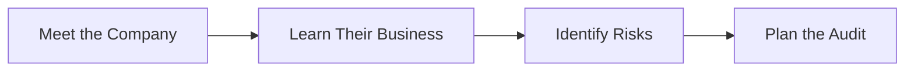

# What is Auditing? 🔍

Let's start from the very beginning. If you've never heard of auditing before, or only have a vague idea, this page is for you!

## 🎯 The Simple Answer

**Auditing is like being a detective for financial information.** 

Imagine you're buying a used car. You wouldn't just trust the seller's word that it's in great condition, right? You'd probably:
- Check the odometer
- Look under the hood
- Take it for a test drive
- Maybe get a mechanic to inspect it

**That's essentially what an audit is** - but instead of checking a car, auditors check a company's financial information to make sure it's accurate and trustworthy.

## 🏢 Why Do Companies Get Audited?

Companies get audited for several important reasons:

### 1. **Building Trust** 🤝
- **Investors** want to know their money is safe
- **Banks** need confidence before lending money
- **Shareholders** want honest financial reports
- **Customers** and **suppliers** want to know the company is stable

### 2. **Legal Requirements** ⚖️
- Many countries require public companies to be audited
- Government regulations demand it
- Stock exchanges require audited financial statements

### 3. **Finding Problems Early** 🔍
- Catch errors before they become big issues
- Identify fraud or mismanagement
- Improve financial processes
- Ensure compliance with rules and regulations

### 4. **Better Business Decisions** 📊
- Management gets an independent view of finances
- Identifies areas for improvement
- Validates that systems are working correctly

## 📝 What Do Auditors Actually Do?

Let's break down the audit process into simple steps:

### Step 1: Understanding the Business


**Example**: If auditing a retail store, the auditor would:
- Learn how they track inventory
- Understand their sales process
- Identify where errors might occur (e.g., shoplifting, pricing mistakes)

### Step 2: Gathering Evidence
Auditors collect proof that numbers are correct:

- **Documents**: Invoices, receipts, contracts
- **Bank Statements**: Verify cash balances
- **Inventory Counts**: Physically count items
- **Confirmations**: Ask banks or customers to confirm balances
- **Observations**: Watch processes in action

**Real-World Example:**
```
Company says: "We have $100,000 in the bank"
Auditor does: Gets bank statement directly from the bank
Result: Confirms the $100,000 is really there ✅
```

### Step 3: Testing the Numbers
Auditors don't check everything (that would take forever!). Instead, they:
- **Sample**: Check a representative selection
- **Test**: Verify calculations and processes
- **Compare**: Look for unusual patterns or changes

**Example:**
```
Total Invoices to Check: 10,000
Auditor's Sample: 50 invoices
If 48 out of 50 are correct → Good sign ✅
If 10 out of 50 have errors → Red flag! 🚩
```

### Step 4: Reporting Findings
After all the checking, auditors write a report:
- **Clean Opinion**: "Everything looks good!" ✅
- **Qualified Opinion**: "Mostly good, but we found some issues" ⚠️
- **Adverse Opinion**: "Significant problems found" ❌
- **Disclaimer**: "We couldn't get enough information to form an opinion" ❓

## 🔄 Types of Audits

### 1. Financial Statement Audit (Most Common)
```
Purpose: Verify financial statements are accurate
Who needs it: Public companies, organizations seeking loans
Frequency: Usually annual
```

**What they check:**
- Balance Sheet (What the company owns and owes)
- Income Statement (Profit and loss)
- Cash Flow Statement (Money in and out)

### 2. Internal Audit
```
Purpose: Help company improve operations
Who does it: Company's own audit team
Frequency: Ongoing throughout the year
```

**What they check:**
- Internal controls
- Efficiency of processes
- Compliance with policies
- Risk management

### 3. Compliance Audit
```
Purpose: Ensure following specific rules/regulations
Who needs it: Regulated industries (banks, healthcare, etc.)
Frequency: As required by regulations
```

### 4. Operational Audit
```
Purpose: Improve efficiency and effectiveness
Who needs it: Companies wanting to optimize
Frequency: As needed
```

## 💼 Meet the Audit Team

A typical audit involves several people with different roles:

<div className="persona-card">
  <div className="persona-avatar">👔</div>
  <div className="persona-info">
    <div className="persona-name">Audit Partner/Manager</div>
    <div className="persona-title">The Leader</div>
    <div>
      <strong>Responsibilities:</strong>
      <ul>
        <li>Overall audit strategy</li>
        <li>Client relationship</li>
        <li>Final review and sign-off</li>
        <li>Quality control</li>
      </ul>
    </div>
  </div>
</div>

<div className="persona-card">
  <div className="persona-avatar">👨‍💼</div>
  <div className="persona-info">
    <div className="persona-name">Senior Auditor</div>
    <div className="persona-title">The Specialist</div>
    <div>
      <strong>Responsibilities:</strong>
      <ul>
        <li>Complex audit areas</li>
        <li>Reviewing junior work</li>
        <li>Client communication</li>
        <li>Technical accounting issues</li>
      </ul>
    </div>
  </div>
</div>

<div className="persona-card">
  <div className="persona-avatar">👩‍💼</div>
  <div className="persona-info">
    <div className="persona-name">Staff Auditor</div>
    <div className="persona-title">The Worker Bee</div>
    <div>
      <strong>Responsibilities:</strong>
      <ul>
        <li>Detailed testing</li>
        <li>Documentation</li>
        <li>Gathering evidence</li>
        <li>Preparing workpapers</li>
      </ul>
    </div>
  </div>
</div>

<div className="persona-card">
  <div className="persona-avatar">📚</div>
  <div className="persona-info">
    <div className="persona-name">Intern/Trainee</div>
    <div className="persona-title">The Learner</div>
    <div>
      <strong>Responsibilities:</strong>
      <ul>
        <li>Simple testing tasks</li>
        <li>Data entry</li>
        <li>Organizing documents</li>
        <li>Learning audit procedures</li>
      </ul>
    </div>
  </div>
</div>

## 📊 A Simple Audit Example

Let's walk through a mini-audit of a lemonade stand:

### The Lemonade Stand's Claims:
```
Revenue (Sales): $500
Expenses:
  - Lemons: $100
  - Sugar: $50
  - Cups: $30
  - Total Expenses: $180
  
Profit: $320
Cash in Register: $320
```

### The Audit Process:

1. **Count the Cash** 💰
   - Expected: $320
   - Actually counted: $320 ✅

2. **Check the Receipts** 🧾
   - Count sales receipts
   - Total: $500 ✅

3. **Verify Expenses** 📝
   - Check lemon purchase invoice: $100 ✅
   - Check sugar receipt: $50 ✅
   - Check cups receipt: $30 ✅

4. **Test the Math** 🧮
   - Revenue ($500) - Expenses ($180) = Profit ($320) ✅

5. **Issue Opinion** 📄
   - **Result**: "Clean opinion - numbers are accurate!" ✅

## 🎓 Key Audit Concepts

### 1. **Materiality**
*Not all errors are equally important*

```
Small error: $5 missing from $1,000,000 → Probably OK
Large error: $500,000 missing from $1,000,000 → Big problem!
```

### 2. **Audit Risk**
*The chance of missing a significant error*

**Three types:**
- **Inherent Risk**: Risk in the business itself
- **Control Risk**: Risk that controls won't catch errors
- **Detection Risk**: Risk that auditor won't find errors

### 3. **Audit Evidence**
*Proof that supports the numbers*

**Quality hierarchy (most to least reliable):**
1. Direct observation (auditor sees it themselves)
2. External confirmation (third party confirms)
3. Internal documentation (company's own records)
4. Oral statements (someone says it's true)

### 4. **Independence**
*Auditors must be objective and unbiased*

Auditors CANNOT:
- ❌ Have financial interest in the company
- ❌ Be friends/family with management
- ❌ Make decisions for the company
- ❌ Prepare the financial statements they're auditing

## 🌟 Why Auditing Matters

### For Society:
- **Trust in Markets**: Investors can trust financial information
- **Economic Stability**: Early detection of problems prevents bigger crashes
- **Accountability**: Keeps management honest

### For Companies:
- **Access to Capital**: Banks more willing to lend
- **Better Decisions**: Management gets independent feedback
- **Fraud Prevention**: Regular audits deter dishonest behavior

### For Individuals:
- **Job Security**: Investors know company is stable
- **Fair Treatment**: Ensures proper accounting of wages, benefits
- **Retirement Funds**: Pension investments are properly managed

## 🎯 Now You Know!

You now understand:
- ✅ What auditing is and why it exists
- ✅ What auditors actually do all day
- ✅ Different types of audits
- ✅ Key concepts like materiality and evidence
- ✅ Why audits matter for everyone

## 🚀 Next Steps

Ready to learn more? Here's where to go next:

1. **[Audit Terminology](./audit-terminology.md)** - Learn the language auditors use
2. **[System Overview](./system-overview.md)** - See how CloudAudit Pro helps with all this
3. **[The Audit Journey](/docs/processes/audit-lifecycle.md)** - Follow a complete audit from start to finish

---

:::tip Remember
Auditing isn't about finding fault - it's about providing assurance and building trust! Think of auditors as financial quality inspectors. 🔍✅
:::

*Last Updated: January 1, 2026*
