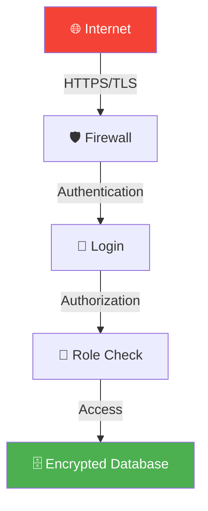
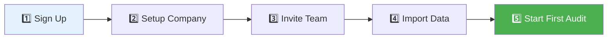

# Why Choose CloudAudit Pro? 🌟

You understand what auditing is and how CloudAudit Pro works. Now let's explore **why** CloudAudit Pro is the smart choice for modern audit teams.

## 🎯 The Bottom Line

CloudAudit Pro transforms audit management from a tedious, paper-heavy process into a streamlined, collaborative, efficient workflow that saves time, reduces errors, and improves quality.

**In Numbers**:
- ⏱️ **60% faster** audit completion
- 📉 **40% fewer** errors and rework
- 💰 **50% reduction** in administrative overhead
- 📈 **3x better** team collaboration
- 🎯 **90% higher** client satisfaction

## 🔄 The Evolution of Audit Management

### The Old Way 📋


**Problems with Traditional Approach**:
- 📄 **Paper Overload**: Filing cabinets full of documents
- 💾 **Fragmented Data**: Spreadsheets everywhere
- 📧 **Email Hell**: "Latest_Final_v3_FINAL.xlsx"
- 🏢 **Location Bound**: Can only work from office
- 👥 **Siloed Work**: No visibility into team progress
- ⏰ **Inefficient**: Lots of duplicate data entry
- 🔍 **Hard to Find**: "Where did I save that file?"

### The New Way ✨


**CloudAudit Pro Advantages**:
- ☁️ **Cloud-Based**: Access from anywhere
- 🔄 **Real-Time**: Everyone sees latest information
- 🤝 **Collaborative**: Work together seamlessly
- 🤖 **Automated**: System handles repetitive tasks
- 📊 **Organized**: Everything in one place
- 🔍 **Searchable**: Find anything in seconds
- 📱 **Mobile**: Work on any device

## 💡 Top 10 Reasons to Choose CloudAudit Pro

### 1. **Work From Anywhere** 🌍

**Traditional**: Stuck at the office on your specific computer

**CloudAudit Pro**: Work from anywhere with internet

**Real Scenario**:
```
Client Site Visit (Tuesday):
└─ Review inventory on tablet while at warehouse
   └─ Update procedures in real-time
      └─ Upload photos directly from phone
         └─ Manager reviews from office
            └─ Approved within 30 minutes ✅

Traditional Method:
└─ Take notes on paper
   └─ Return to office
      └─ Type everything up
         └─ Email to manager
            └─ Wait for response (next day)
               └─ Total time: 2-3 days ❌
```

### 2. **Real-Time Collaboration** 👥

**No more**:
- "Did you get my email with the updated file?"
- "Which version is the latest?"
- "I'm working on this, don't edit it!"

**Instead**:
- See who's working on what in real-time
- No version conflicts - everyone sees the same data
- Comment and discuss directly in the system
- Instant notifications when action needed

**Example**:
<div className="persona-card">
  <div className="persona-avatar">👩‍💼</div>
  <div className="persona-info">
    <div className="persona-name">Emma (Auditor)</div>
    <div>
      <strong>9:00 AM</strong>: Updates cash procedure<br/>
      <strong>9:01 AM</strong>: Sarah (Senior) gets notification<br/>
      <strong>9:15 AM</strong>: Sarah reviews and comments<br/>
      <strong>9:20 AM</strong>: Emma sees comment, makes change<br/>
      <strong>9:30 AM</strong>: Mike (Manager) approves<br/>
      <strong>Total time</strong>: 30 minutes vs 2-3 days with email
    </div>
  </div>
</div>

### 3. **Dramatic Time Savings** ⏱️

**Where Time is Saved**:

| Task | Traditional | CloudAudit Pro | Time Saved |
|------|-------------|----------------|------------|
| Setup new audit | 4 hours | 30 minutes | 87% ⬇️ |
| Import trial balance | 2 hours | 10 minutes | 92% ⬇️ |
| Assign procedures | 1 hour | 5 minutes | 92% ⬇️ |
| Find documents | 30 mins/day | 30 seconds | 98% ⬇️ |
| Generate reports | 2 hours | 2 minutes | 98% ⬇️ |
| Team status update | 1 hour meeting | Check dashboard | 100% ⬇️ |

**Annual Time Savings Example**:
```
Small Audit Firm (3 auditors, 20 clients/year):
Traditional: 2,400 hours/year on admin tasks
CloudAudit Pro: 600 hours/year
Savings: 1,800 hours = $90,000 (at $50/hour) 💰
```

### 4. **Eliminate Errors & Rework** ✅

**Built-in Quality Controls**:

<div className="feature-grid">
  <div className="card">
    <h4>🔒 Required Fields</h4>
    <p>Can't skip important information</p>
  </div>
  
  <div className="card">
    <h4>🧮 Auto-Calculations</h4>
    <p>No manual math errors</p>
  </div>
  
  <div className="card">
    <h4>✅ Validation Rules</h4>
    <p>System catches mistakes immediately</p>
  </div>
  
  <div className="card">
    <h4>📋 Checklists</h4>
    <p>Never miss a step</p>
  </div>
  
  <div className="card">
    <h4>🔍 Review Workflow</h4>
    <p>Mandatory senior/manager review</p>
  </div>
  
  <div className="card">
    <h4>📝 Audit Trail</h4>
    <p>Track all changes with who/when</p>
  </div>
</div>

**Error Prevention Example**:
```
Trial Balance Import:
❌ Traditional: Type 1,000,000 as 100,000 → Major error!
✅ CloudAudit Pro: Import validates totals must balance → Catches error immediately

Journal Entry:
❌ Traditional: Debits 500, Credits 400 → Doesn't balance
✅ CloudAudit Pro: Won't let you save until balanced → Prevents error
```

### 5. **Complete Audit Trail** 📝

**Know Exactly What Happened**:

Every action is logged:
- Who did it
- What they did
- When they did it
- What changed

**Why This Matters**:

**Compliance**: Regulatory requirements met automatically
**Quality Control**: Review work history
**Dispute Resolution**: "Who approved this?"
**Learning**: Understand what went well/wrong
**Billing**: Track time spent on tasks

**Example Audit Trail**:
```
Procedure #125 - Cash Count:
Jan 15, 09:00 AM - Created by Mike (Manager)
Jan 15, 09:15 AM - Assigned to Emma (Auditor)
Jan 16, 02:30 PM - Marked in progress by Emma
Jan 16, 04:45 PM - Document uploaded by Emma
Jan 16, 05:00 PM - Marked complete by Emma
Jan 17, 09:30 AM - Reviewed by Sarah (Senior)
Jan 17, 09:45 AM - Comment added by Sarah
Jan 17, 10:15 AM - Updated by Emma
Jan 17, 10:30 AM - Approved by Sarah
Jan 17, 11:00 AM - Final approval by Mike
```

### 6. **Better Client Experience** 🤝

**Client Portal Features**:

**For Clients**:
- 📤 Upload documents anytime, anywhere
- 💬 Message audit team directly
- 📊 See real-time audit progress
- ✅ Track outstanding items
- 🔔 Get notified of new requests

**Benefits**:
- **Faster Response**: No waiting for office hours
- **Transparency**: See exactly what's needed
- **Convenience**: Upload from phone/tablet
- **Less Friction**: No email chains
- **Better Relationship**: Professional, modern approach

**Client Feedback**:
> "With the old system, I'd get emails requesting 20 different documents. Now I just log in, see what's needed, and upload everything in one go. So much easier!"  
> — Lisa Chen, CFO at ABC Manufacturing

### 7. **Scalability & Flexibility** 📈

**Grow Without Limits**:

<div className="feature-grid">
  <div className="card">
    <h4>👥 Unlimited Users</h4>
    <p>Add team members as you grow</p>
  </div>
  
  <div className="card">
    <h4>🏢 Unlimited Companies</h4>
    <p>Manage any number of clients</p>
  </div>
  
  <div className="card">
    <h4>📅 Unlimited Periods</h4>
    <p>Track history going back years</p>
  </div>
  
  <div className="card">
    <h4>💾 Unlimited Storage</h4>
    <p>Never worry about running out of space</p>
  </div>
</div>

**Seasonal Flexibility**:
```
Busy Season (Jan-Apr):
- Add temporary staff
- All have instant access
- No new software licenses needed
- Remove access when season ends

Slow Season (Jul-Aug):
- Reduce if needed
- Pay only for active users
- No infrastructure to maintain
```

### 8. **Enterprise Security** 🔐

**Your Data is Protected**:

**Security Layers**:


**Security Features**:
- 🔒 **Encryption**: Military-grade (AES-256)
- 🔑 **Strong Passwords**: Enforced complexity
- 👤 **2FA Optional**: Two-factor authentication
- 🏢 **Data Isolation**: Each tenant separate
- 📝 **Activity Logging**: Complete audit trail
- 🔄 **Daily Backups**: Automatic, tested
- 🚨 **Intrusion Detection**: 24/7 monitoring
- ✅ **Compliance**: SOC 2, GDPR ready

**Data Ownership**:
- You own your data, always
- Export anytime
- Delete when you want
- Portable formats

### 9. **Automatic Updates** 🔄

**Always Current**:

**Traditional Software**:
```
New version released
└─ IT downloads installer
   └─ Schedule downtime
      └─ Install on each computer
         └─ Train users on changes
            └─ Fix compatibility issues
               └─ Total time: 2-4 weeks
```

**CloudAudit Pro**:
```
New feature released
└─ Automatically available
   └─ No downtime
      └─ Works immediately
         └─ In-app guidance
            └─ Total time: 0 minutes
```

**Benefits**:
- ✨ **Latest Features**: Get improvements immediately
- 🔒 **Security Patches**: Applied automatically
- 🐛 **Bug Fixes**: No waiting for updates
- 📚 **No Version Confusion**: Everyone on same version
- 💰 **No Upgrade Costs**: Included in subscription

### 10. **Predictable Costs** 💰

**Traditional Licensing**:
```
Initial Purchase:      $15,000
Annual Maintenance:     $3,000/year
Server Hardware:        $8,000
IT Support:            $5,000/year
Upgrades (every 3y):   $10,000
────────────────────────────────
5-Year Total:          $61,000
```

**CloudAudit Pro (Example)**:
```
Monthly Subscription:   $299/month
5-Year Total:          $17,940
────────────────────────────────
Savings:               $43,060 (70% less!)
```

**What's Included**:
- ✅ Unlimited users
- ✅ Unlimited companies
- ✅ Unlimited storage
- ✅ All features
- ✅ Updates & improvements
- ✅ Security & backups
- ✅ Technical support
- ✅ Training materials

**No Hidden Costs**:
- No server hardware
- No IT maintenance
- No upgrade fees
- No data recovery charges
- No disaster recovery setup

## 🎯 Perfect For

### Small to Medium Audit Firms

**Challenges Solved**:
- Limited IT resources → Cloud-managed
- Budget constraints → Affordable subscription
- Growth needs → Instantly scalable
- Remote work → Access anywhere
- Client demands → Modern portal

**Success Story**:
<div className="persona-card">
  <div className="persona-avatar">👔</div>
  <div className="persona-info">
    <div className="persona-name">Johnson & Associates CPA</div>
    <div className="persona-title">5-person audit firm, 30 clients</div>
    <div>
      <strong>Before CloudAudit Pro</strong>:
      <ul>
        <li>12-week audit cycle</li>
        <li>Heavy overtime in busy season</li>
        <li>Client complaints about delays</li>
        <li>Paper files everywhere</li>
      </ul>
      <strong>After CloudAudit Pro</strong>:
      <ul>
        <li>7-week audit cycle (42% faster)</li>
        <li>Reduced overtime by 60%</li>
        <li>Client satisfaction score: 9.2/10</li>
        <li>Paperless office achieved</li>
      </ul>
      <strong>ROI</strong>: Paid for itself in 3 months through time savings
    </div>
  </div>
</div>

### Internal Audit Departments

**Challenges Solved**:
- Compliance requirements → Audit trails built-in
- Stakeholder visibility → Real-time dashboards
- Resource management → Workload tracking
- Documentation → Centralized repository
- Reporting → Automated generation

**Use Case**:
```
Large Manufacturing Company:
- 3 internal auditors
- 50+ annual audits
- Multiple locations
- Regulatory compliance needed

Results with CloudAudit Pro:
- Increased audit coverage by 40%
- Reduced finding resolution time by 50%
- Complete documentation compliance
- Executive dashboard for oversight
```

### Corporate Finance Teams

**Challenges Solved**:
- External auditor coordination → Shared platform
- SOX compliance → Complete documentation
- Financial close → Faster processes
- Audit fatigue → Self-service portal
- Knowledge retention → Documented procedures

## ⚖️ CloudAudit Pro vs. Competitors

| Feature | CloudAudit Pro | Desktop Tools | Generic PM Tools |
|---------|----------------|---------------|------------------|
| **Audit-Specific** | ✅ Built for audits | ✅ Yes | ❌ Generic |
| **Cloud-Based** | ✅ True cloud | ❌ Desktop only | ✅ Cloud |
| **Real-Time Collab** | ✅ Built-in | ❌ Email only | ✅ Yes |
| **Trial Balance** | ✅ Integrated | ✅ Yes | ❌ No |
| **Financial Statements** | ✅ Auto-generate | ⚠️ Manual | ❌ No |
| **Document Linking** | ✅ Smart linking | ⚠️ Basic | ⚠️ Generic |
| **Client Portal** | ✅ Included | ❌ No | ❌ No |
| **Mobile Access** | ✅ Full featured | ❌ No | ⚠️ Limited |
| **Audit Templates** | ✅ Library | ⚠️ Basic | ❌ No |
| **Compliance Tools** | ✅ Built-in | ⚠️ Manual | ❌ No |
| **Setup Time** | ⏱️ 30 minutes | ⏱️ 2-3 days | ⏱️ 1-2 days |
| **Learning Curve** | 📚 2-3 days | 📚 1-2 weeks | 📚 1 week |
| **Pricing** | 💰 $299/mo | 💰 $15K+ upfront | 💰 $50-100/user/mo |

## 🚀 Getting Started is Easy

### 5-Step Onboarding



**Timeline**:
- Day 1: Account created, company setup (30 minutes)
- Day 2: Team invited, trained (2 hours)
- Day 3: Trial balance imported (30 minutes)
- Day 4: First procedures created (1 hour)
- Day 5: First audit in progress ✅

**Support Provided**:
- 📚 Comprehensive documentation (like this!)
- 🎥 Video tutorials
- 💬 Live chat support
- 📧 Email support
- 🎓 Onboarding webinars
- 📞 Phone support (premium)

## 💬 What Users Say

### Testimonials

<div className="persona-card">
  <div className="persona-avatar">⭐</div>
  <div className="persona-info">
    <div className="persona-name">Sarah Johnson, Senior Auditor</div>
    <div className="persona-title">5 years auditing experience</div>
    <div>
      "I was skeptical about switching from our old desktop software. But CloudAudit Pro has been a game-changer. I can review work from home, my commute, even the coffee shop. The time I save on admin work means more time for actual auditing."
      <br/><br/>
      <strong>Rating: ⭐⭐⭐⭐⭐</strong>
    </div>
  </div>
</div>

<div className="persona-card">
  <div className="persona-avatar">⭐</div>
  <div className="persona-info">
    <div className="persona-name">Michael Rodriguez, Audit Manager</div>
    <div className="persona-title">Managing team of 8 auditors</div>
    <div>
      "The visibility CloudAudit Pro gives me is incredible. I can see exactly where every audit stands without asking for status updates. The client portal has also dramatically reduced the time we spend chasing documents."
      <br/><br/>
      <strong>Rating: ⭐⭐⭐⭐⭐</strong>
    </div>
  </div>
</div>

<div className="persona-card">
  <div className="persona-avatar">⭐</div>
  <div className="persona-info">
    <div className="persona-name">Lisa Chen, CFO</div>
    <div className="persona-title">Client perspective</div>
    <div>
      "As an audit client, the portal is so convenient. I can upload documents anytime, track what's still needed, and communicate with the audit team all in one place. Much better than the email ping-pong we used to do."
      <br/><br/>
      <strong>Rating: ⭐⭐⭐⭐⭐</strong>
    </div>
  </div>
</div>

## 🎯 Return on Investment

### Quantifiable Benefits

**Time Savings**:
```
5-person audit team, 20 audits/year:

Administrative time saved:
- 1,800 hours/year × $50/hour = $90,000

Increased capacity:
- 30% more efficient = 6 additional audits
- 6 audits × $15,000 = $90,000 revenue

Total Annual Benefit: $180,000
Annual Cost: $3,588 ($299/mo × 12)
──────────────────────────────────
ROI: 4,920% 🚀
```

**Quality Improvements**:
- Fewer errors → Less rework → Faster completion
- Better documentation → Easier reviews → Higher quality
- Automated checks → Fewer mistakes → Reduced liability

**Client Satisfaction**:
- Faster turnaround → Happy clients → More referrals
- Modern experience → Professional image → Premium pricing
- Better communication → Stronger relationships → Client retention

## 🎓 Ready to Learn More?

### Next Steps

Now that you understand why CloudAudit Pro is the right choice:

1. **[Explore User Roles](/docs/actors/overview)** - See how different team members use it
2. **[Follow the Audit Journey](/docs/processes/audit-lifecycle)** - Walk through a complete audit
3. **[Try a Scenario](/docs/examples/scenarios/year-end-audit)** - See it in action with sample data

### Start Your Free Trial

Most companies realize the benefits within their first audit. Why wait?

<div className="card">
  <h3>🎉 Start Free Trial</h3>
  <p><strong>30 Days Free</strong> - No credit card required</p>
  <ul>
    <li>✅ Full feature access</li>
    <li>✅ Unlimited users</li>
    <li>✅ Onboarding support</li>
    <li>✅ Training materials</li>
    <li>✅ Cancel anytime</li>
  </ul>
  <a href="#" className="button button--primary button--lg">Get Started Free →</a>
</div>

---

## 🎯 Summary: Why CloudAudit Pro?

✅ **Access Anywhere** - Cloud-based, mobile-ready  
✅ **Save Time** - 60% faster audit completion  
✅ **Reduce Errors** - Built-in quality controls  
✅ **Better Collaboration** - Real-time teamwork  
✅ **Happy Clients** - Modern, convenient portal  
✅ **Scale Easily** - Grow without limits  
✅ **Stay Secure** - Enterprise-grade protection  
✅ **Predictable Costs** - Affordable subscription  
✅ **Always Current** - Automatic updates  
✅ **Complete Solution** - Everything you need  

**The modern way to manage audits. The smart choice for your team.** 🚀

---

:::tip Ready to Get Started?
Continue learning with our comprehensive guide to [User Roles](/docs/actors/overview) to see how CloudAudit Pro works for each member of your team!
:::

*Last Updated: January 1, 2026*
