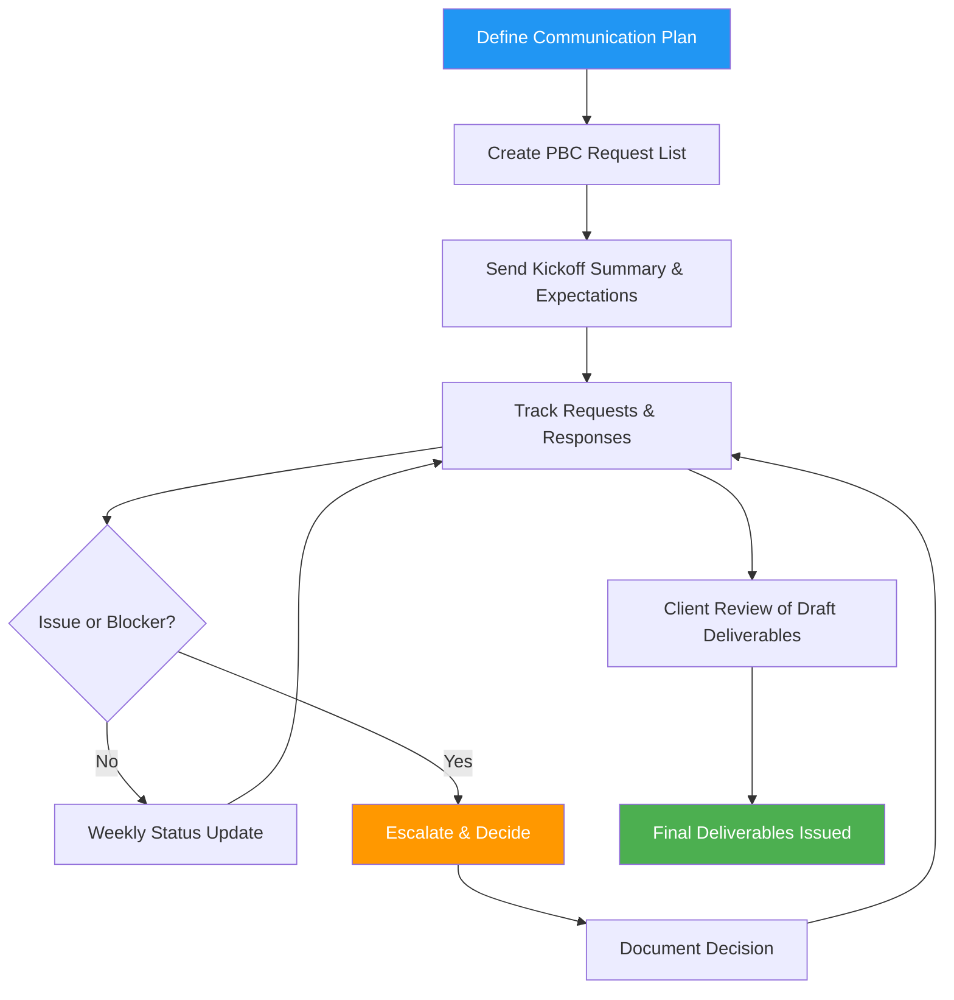

# 💬 Client Communication Process

## Overview

Client communication is the operational backbone of a smooth audit. This process defines how the audit team and client coordinate requests (PBC), questions, status updates, issue escalation, and deliverable reviews—using consistent channels, clear ownership, and traceable records.

Well-executed communication:
- Reduces delays and rework
- Prevents misunderstandings about scope, timing, and responsibilities
- Improves evidence quality (right document, right time)
- Creates an auditable trail of key decisions and approvals

:::info Process Duration
**Timeline:** Ongoing throughout the engagement  \
**Primary Role:** Manager  \
**Day-to-day Owner:** Senior Auditor  \
**Client Participants:** Client (CFO/Controller + process owners)  \
**Support:** Admin (scheduling, portal help)
:::

---

## 🎯 Communication Objectives

By following this process, you will:

✅ **Keep a single source of truth** for requests, responses, and due dates  \
✅ **Provide predictable status updates** the client can rely on  \
✅ **Escalate blockers early** with clear options and decisions  \
✅ **Document key judgments and agreements** (scope changes, deadlines, adjustments)  \
✅ **Protect confidentiality and integrity** of exchanged documents

---

## 🧭 Communication Principles

- **Clarity over volume:** Fewer, well-structured messages beat frequent vague pings.
- **One request, one owner:** Every request has a single client owner and due date.
- **Evidence is attached, not described:** Link/upload the actual support; avoid “it’s in the system.”
- **Decisions are recorded:** If it affects scope, timing, or reporting, capture it in the engagement record.
- **Professional tone always:** Assume messages may be read later by reviewers.

---

## 📊 Process Flow

---

## 🗂️ Communication Channels (When to Use What)

- **Client Portal (preferred for evidence/PBC):**
  - Document uploads, responses to PBC requests, request comments
  - Maintains timestamps, version history, and completeness

- **Email (for summaries and formal requests):**
  - Kickoff summary, weekly status recap, meeting agendas, key decisions
  - Avoid sending sensitive attachments if the portal is available

- **Meetings (for alignment and decision-making):**
  - Planning meeting, weekly check-in, issues/adjustments discussion, exit meeting

- **Phone/Chat (for urgent blockers only):**
  - Follow up with a written recap in email/portal notes

---

## 📋 Step-by-Step Communication Guide

### Step 1 — Define a Communication Plan (Start of Engagement)

**Owner:** Manager

1. Define:
   - Primary client contact (CFO/Controller)
   - Backup contact
   - Preferred channels and response expectations
   - Weekly status cadence and meeting rhythm
2. Confirm:
   - Who can approve entries/adjustments
   - Who can sign letters (rep letter)
   - Who can provide access to systems and reports

**Output:** Communication Plan (short memo or kickoff email).

---

### Step 2 — Build and Assign the PBC Request List

**Owner:** Senior (reviewed by Manager)

Create requests that are:
- Specific (exact report name, period, format)
- Actionable (who provides it, by when)
- Traceable (linked to procedures and workpapers)

**Examples:**
- Final trial balance export (FY2025) + prior year comparative TB
- Bank statements and reconciliations for all accounts (Dec 2025)
- AR aging as of year-end + subsequent cash receipts report (Jan–Feb 2026)
- Revenue listing + contract population for sampling

---

### Step 3 — Kickoff Summary & Expectations

**Owner:** Manager

Send a kickoff summary that includes:
- Timeline (interim + year-end dates)
- PBC expectations (how to upload, due dates, completeness)
- Meeting cadence
- How to ask questions and how quickly you’ll respond

---

### Step 4 — Daily/Weekly Request Management

**Owner:** Senior

Run a consistent loop:

1. Review open requests daily during fieldwork.
2. For each request:
   - Confirm it was received (acknowledge within 1 business day)
   - Validate completeness and format
   - Ask targeted follow-ups (avoid “please resend everything”)
3. Update request status:
   - Not started / In progress / Received / Needs follow-up / Complete
4. Link the evidence to the related procedure/workpaper.

**Tip:** If the evidence is incomplete, document what is missing and why it matters.

---

### Step 5 — Weekly Status Update (Predictable Cadence)

**Owner:** Manager

A weekly status update should include:
- What was completed this week (procedures/workstreams)
- Top 5 open PBC items (owner + due date)
- Issues/risks needing decisions
- Next week’s plan
- Upcoming meetings

**Recommended format:** bullet list, one screen, no attachments unless needed.

---

### Step 6 — Issue Escalation & Decision Logging

**Owner:** Manager

Escalate when:
- A key request is overdue and blocks audit completion
- Evidence indicates a potential misstatement or control issue
- Scope changes are needed (new component, new entity, new system)
- Timing changes threaten report issuance

**Escalation packet should include:**
- Clear issue statement
- Evidence summary
- Options (A/B/C) with timeline impact
- Required decision-maker

**Decision logging:**
- Record the decision and who approved it
- Note any scope/budget/timing changes
- Update the audit plan if needed

---

### Step 7 — Adjustments Discussion (If Applicable)

**Owner:** Manager

When proposing an adjustment:
- Explain the issue in plain language
- Provide the quantified impact and basis
- Clarify whether it’s required vs recommended
- Confirm posting status and timing

**Best practice:** Keep proposed entries in a controlled “adjustments” tracker, not scattered across emails.

---

### Step 8 — Client Review of Draft Deliverables

**Owner:** Manager

Before issuance:
- Provide drafts for factual review (names, dates, classifications)
- Set clear boundaries (no re-auditing the audit)
- Track requested changes and dispositions

---

### Step 9 — Exit Meeting & Closeout Communication

**Owner:** Partner/Manager

Hold an exit meeting to cover:
- Summary of procedures performed
- Significant findings and how addressed
- Unadjusted differences (if any)
- Final deliverables and dates
- Recommendations (if separate letter/report)

Send a written recap and confirm next steps.

---

## ✅ Communication Checklist

- [ ] Communication plan agreed (contacts, cadence, channels)
- [ ] PBC list created with owners and due dates
- [ ] Kickoff summary sent
- [ ] Requests tracked in a single system (portal/task list)
- [ ] Evidence validated for completeness and linked to procedures
- [ ] Weekly status updates sent consistently
- [ ] Issues escalated early with options and decisions documented
- [ ] Adjustments communicated with clear rationale and tracking
- [ ] Draft deliverables reviewed and changes dispositioned
- [ ] Exit meeting completed and recap sent

---

## 🧠 Common Pitfalls (And How to Avoid Them)

- **Pitfall: Unstructured PBC requests** → Use precise request wording and required format.
- **Pitfall: “Chasing” without visibility** → One tracker + weekly recap prevents surprises.
- **Pitfall: Decisions made in calls but not recorded** → Always send a short written recap.
- **Pitfall: Sensitive docs sent over email** → Prefer portal uploads and controlled access.

---

## 🔗 Related Process Docs

- Engagement Planning Process
- Year-End Fieldwork Process
- Review & Quality Control Process
- Finalization & Reporting Process

## 📎 Message Templates (Copy/Paste)

### Template A — Weekly Status Update

**Subject:** Audit Status Update — Week of [DATE]

- Completed this week:
  - [Item]
  - [Item]
- Top open PBC items:
  - [PBC #] — Owner: [Name] — Due: [Date] — Status: [Status]
- Decisions needed:
  - [Decision + deadline]
- Next week plan:
  - [Item]
- Upcoming meetings:
  - [Meeting + time]

### Template B — Targeted Follow-Up on Missing Evidence

Hi [Name],

Thanks for uploading [Document]. To complete our testing, we also need:
- [Specific missing item]
- [Specific missing item]

If it’s easier, a screenshot/export showing [fields] for the period [dates] is sufficient.

Thanks,  \
[Your Name]
