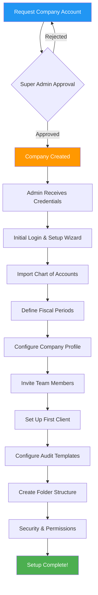

# 🏢 Company Setup Process

## Overview

Setting up a new company in CloudAudit Pro is the foundation of your audit practice. This process transforms a blank slate into a fully configured audit environment with chart of accounts, periods, team members, and client information ready for audit work.

:::info Process Duration
**Timeline:** 2-5 days for complete setup  
**Primary Role:** <span className="role-badge admin">Company Admin</span>  
**Supporting Roles:** <span className="role-badge super-admin">Super Admin</span> (approval), <span className="role-badge manager">Manager</span> (planning)
:::

---

## 🎯 Process Goals

By the end of this process, you will have:

✅ **Company account** created and activated  
✅ **Chart of accounts** imported and configured  
✅ **Fiscal periods** defined and locked appropriately  
✅ **Team members** invited and assigned roles  
✅ **Client information** entered and organized  
✅ **Audit templates** configured for the company  
✅ **Document storage** organized with folder structure  
✅ **Security settings** configured properly

---

## 📊 Process Flow



---

## 📋 Step-by-Step Guide

### Step 1: Request Company Account

**Actor:** <span className="role-badge admin">Company Admin</span> (Future)

**What Happens:**

```
🌐 CloudAudit Pro Website
━━━━━━━━━━━━━━━━━━━━━━━━━━━━━━━━━━━━━━━━━━━━━━

SIGN UP FORM:

Company Information:
├── Company Name: Acme CPA Firm
├── Business Type: CPA Firm
├── Number of Professionals: 15
├── Expected Annual Audits: 50
└── Country: United States

Admin Contact:
├── Name: Jordan Martinez
├── Email: jordan@acmecpa.com
├── Phone: (555) 123-4567
├── Title: Managing Partner
└── License #: CPA-12345

Billing Information:
├── Plan: Professional ($299/month)
├── Payment Method: Credit Card
└── Billing Email: billing@acmecpa.com

Additional Information:
├── Referral Source: Google Search
├── Industry Focus: Technology, Manufacturing
└── Special Requirements: SOC 2 compliance needed

[Submit Request]
```

**Result:**

```
✅ REQUEST SUBMITTED

Confirmation Email:
━━━━━━━━━━━━━━━━━━━━━━━━━━━━━━━━━━━━━━━━━━━━━━

From: CloudAudit Pro <support@cloudauditpro.com>
To: jordan@acmecpa.com
Subject: Company Account Request Received

Hi Jordan,

Thank you for your interest in CloudAudit Pro!

Your company account request has been submitted and is 
under review. Our team will verify your information and 
activate your account within 24-48 hours.

REQUEST DETAILS:
Company: Acme CPA Firm
Plan: Professional
Submitted: January 1, 2026 9:30 AM

NEXT STEPS:
1. We'll verify your CPA license
2. Review your account details
3. Create your company account
4. Send activation credentials

Questions? Reply to this email or call (855) 555-AUDIT

Best regards,
CloudAudit Pro Team

Request ID: REQ-2026-0001
```

---

### Step 2: Super Admin Approval

**Actor:** <span className="role-badge super-admin">Super Admin</span> (Alex)

**Alex's Review Process:**

```
👀 ALEX'S APPROVAL QUEUE
━━━━━━━━━━━━━━━━━━━━━━━━━━━━━━━━━━━━━━━━━━━━━━

NEW REQUEST: REQ-2026-0001
Company: Acme CPA Firm
Submitted: Jan 1, 2026 9:30 AM
Status: Pending Review

VERIFICATION CHECKLIST:
✅ Valid CPA license (verified with state board)
✅ Business email domain (@acmecpa.com)
✅ Phone number verified
✅ Payment method valid
✅ No duplicate accounts
✅ All required fields complete

RISK ASSESSMENT:
├── Fraud Risk: Low ✓
├── Payment Risk: Low ✓
├── Compliance Risk: Low ✓
└── Overall: APPROVED ✓

APPROVAL NOTES:
"Legitimate CPA firm, 15 staff, technology focus.
Standard professional plan. No red flags.
APPROVED for activation."

[APPROVE ACCOUNT]
```

**Result:**

```
✅ ACCOUNT APPROVED

System Actions:
━━━━━━━━━━━━━━━━━━━━━━━━━━━━━━━━━━━━━━━━━━━━━━

1. Company database created
2. Admin user account created
3. Default settings configured
4. Storage allocation assigned (100 GB)
5. License keys generated
6. Activation email queued

COMPANY DETAILS:
Company ID: COMP-1234
Database: acmecpa_prod
Storage: /data/companies/acmecpa/
Admin User: jordan@acmecpa.com
Plan: Professional
Status: Active
Created: Jan 1, 2026 2:15 PM
```

---

### Step 3: Admin Receives Credentials

**Actor:** <span className="role-badge admin">Company Admin</span> (Jordan)

**Activation Email:**

```
📧 WELCOME EMAIL
━━━━━━━━━━━━━━━━━━━━━━━━━━━━━━━━━━━━━━━━━━━━━━

From: CloudAudit Pro <support@cloudauditpro.com>
To: jordan@acmecpa.com
Subject: Welcome to CloudAudit Pro! 🎉

Hi Jordan,

Your CloudAudit Pro account is ready!

🔐 LOGIN CREDENTIALS:
URL: https://app.cloudauditpro.com
Username: jordan@acmecpa.com
Temporary Password: TempPass2026!
(You'll be prompted to change this on first login)

📊 ACCOUNT DETAILS:
Company: Acme CPA Firm
Company ID: COMP-1234
Plan: Professional ($299/month)
Storage: 100 GB
User Licenses: Unlimited

🚀 GETTING STARTED:
1. Log in and change your password
2. Complete the Setup Wizard (15 minutes)
3. Import your chart of accounts
4. Invite your team members
5. Set up your first client

📚 RESOURCES:
- Setup Guide: [Link]
- Video Tutorials: [Link]
- Help Center: [Link]
- Schedule Training Call: [Link]

💬 SUPPORT:
Phone: (855) 555-AUDIT
Email: support@cloudauditpro.com
Live Chat: Available in-app

We're excited to have you on board!

Best regards,
The CloudAudit Pro Team

P.S. Need help getting started? Schedule a free 
1-on-1 onboarding call with our team!
```

---

### Step 4: Initial Login & Setup Wizard

**Jordan's First Login:**

```
💻 FIRST LOGIN EXPERIENCE
━━━━━━━━━━━━━━━━━━━━━━━━━━━━━━━━━━━━━━━━━━━━━━

[Login Screen]
Email: jordan@acmecpa.com
Password: TempPass2026!

[Password Change Required]
New Password: [secure password]
Confirm: [secure password]
✅ Password updated successfully

[Setup Wizard Launched]

╔══════════════════════════════════════════════════╗
║  Welcome to CloudAudit Pro Setup Wizard          ║
║  Let's get your account configured! (Step 1/7)   ║
╠══════════════════════════════════════════════════╣
║                                                  ║
║  STEP 1: Company Profile                         ║
║                                                  ║
║  Company Name: Acme CPA Firm                     ║
║  [✓] Already set                                 ║
║                                                  ║
║  Physical Address:                               ║
║  Street: [123 Main Street]                       ║
║  City: [San Francisco]                           ║
║  State: [CA]  ZIP: [94105]                       ║
║                                                  ║
║  Phone: [(555) 123-4567]                         ║
║  Website: [www.acmecpa.com]                      ║
║  Tax ID: [12-3456789]                            ║
║                                                  ║
║  Logo: [Upload]                                  ║
║  ┌─────────────────┐                             ║
║  │  ACME CPA FIRM  │                             ║
║  │    [LOGO]       │                             ║
║  └─────────────────┘                             ║
║                                                  ║
║            [Skip]         [Next Step →]          ║
║                                                  ║
╚══════════════════════════════════════════════════╝
```

**Wizard Progression:**


---

### Step 5: Import Chart of Accounts

**Actor:** <span className="role-badge admin">Company Admin</span> (Jordan)

**Import Process:**

```
📊 CHART OF ACCOUNTS IMPORT
━━━━━━━━━━━━━━━━━━━━━━━━━━━━━━━━━━━━━━━━━━━━━━

STEP 2 of 7: Chart of Accounts

Option 1: Use Standard Template ⭐ RECOMMENDED
┌─────────────────────────────────────────┐
│ □ Manufacturing Company                 │
│ □ Retail/E-commerce                     │
│ □ Technology/SaaS                       │
│ □ Professional Services                 │
│ ☑ CPA Firm (Selected)                   │
│ □ Non-Profit Organization               │
└─────────────────────────────────────────┘

Option 2: Import from File
┌─────────────────────────────────────────┐
│ Upload Excel or CSV file                │
│ [Browse...] acme_coa.xlsx               │
│                                         │
│ Format Requirements:                    │
│ - Account Number (required)             │
│ - Account Name (required)               │
│ - Account Type (required)               │
│ - Normal Balance (required)             │
│ - Active/Inactive (optional)            │
└─────────────────────────────────────────┘

Option 3: Import from QuickBooks
┌─────────────────────────────────────────┐
│ [Connect to QuickBooks]                 │
└─────────────────────────────────────────┘

Jordan selects: Import from File
```

**File Upload:**

```
📁 IMPORT PREVIEW
━━━━━━━━━━━━━━━━━━━━━━━━━━━━━━━━━━━━━━━━━━━━━━

File: acme_coa.xlsx
Rows Detected: 127 accounts

MAPPING COLUMNS:
Excel Column         → System Field
─────────────────────────────────────────
Column A "Acct #"    → Account Number ✓
Column B "Name"      → Account Name ✓
Column C "Type"      → Account Type ✓
Column D "Balance"   → Normal Balance ✓
Column E "Status"    → Active Status ✓

PREVIEW (First 5 rows):
┌──────┬─────────────────────┬────────┬─────────┬────────┐
│ Acct │ Name                │ Type   │ Balance │ Status │
├──────┼─────────────────────┼────────┼─────────┼────────┤
│ 1000 │ Cash - Operating    │ Asset  │ Debit   │ Active │
│ 1010 │ Cash - Payroll      │ Asset  │ Debit   │ Active │
│ 1020 │ Cash - Savings      │ Asset  │ Debit   │ Active │
│ 1100 │ Accounts Receivable │ Asset  │ Debit   │ Active │
│ 1200 │ Prepaid Expenses    │ Asset  │ Debit   │ Active │
└──────┴─────────────────────┴────────┴─────────┴────────┘

VALIDATION RESULTS:
✅ All required fields present
✅ No duplicate account numbers
✅ Valid account types
✅ Valid normal balances
⚠️  3 accounts missing descriptions (optional)

Ready to import 127 accounts.

[Cancel]  [Import Accounts →]
```

**Import Results:**

```
✅ IMPORT SUCCESSFUL
━━━━━━━━━━━━━━━━━━━━━━━━━━━━━━━━━━━━━━━━━━━━━━

127 accounts imported successfully!

SUMMARY BY TYPE:
├── Assets: 42 accounts
├── Liabilities: 18 accounts
├── Equity: 8 accounts
├── Revenue: 35 accounts
└── Expenses: 24 accounts

ACCOUNT NUMBER RANGES:
├── 1000-1999: Assets
├── 2000-2999: Liabilities
├── 3000-3999: Equity
├── 4000-4999: Revenue
└── 5000-9999: Expenses

You can modify these accounts anytime in:
Settings → Chart of Accounts

[Continue to Next Step →]
```

---

### Step 6: Define Fiscal Periods

**Actor:** <span className="role-badge admin">Company Admin</span> (Jordan)

**Period Setup:**

```
📅 FISCAL PERIODS CONFIGURATION
━━━━━━━━━━━━━━━━━━━━━━━━━━━━━━━━━━━━━━━━━━━━━━

STEP 3 of 7: Fiscal Periods

Fiscal Year End:
┌─────────────────────────────────────────┐
│ Month: [December ▼]                     │
│ Day: [31]                               │
└─────────────────────────────────────────┘

Period Structure:
┌─────────────────────────────────────────┐
│ ○ Monthly (12 periods)                  │
│ ● Quarterly (4 periods)                 │
│ ○ Semi-Annual (2 periods)               │
│ ○ Annual (1 period)                     │
│ ○ Custom                                │
└─────────────────────────────────────────┘

Jordan selects: Monthly (12 periods)

Create Periods For:
┌─────────────────────────────────────────┐
│ Fiscal Year: [2025 ▼]                   │
│                                         │
│ ☑ Create 2024 periods (prior year)      │
│ ☑ Create 2025 periods (current year)    │
│ ☑ Create 2026 periods (future year)     │
└─────────────────────────────────────────┘

[Generate Periods]
```

**Generated Periods:**

```
📊 PERIOD STRUCTURE
━━━━━━━━━━━━━━━━━━━━━━━━━━━━━━━━━━━━━━━━━━━━━━

FISCAL YEAR 2024 (Prior Year):
┌────────┬────────────┬──────────┬──────────┬──────────┐
│ Period │ Name       │ Start    │ End      │ Status   │
├────────┼────────────┼──────────┼──────────┼──────────┤
│ 202401 │ Jan 2024   │ 01/01/24 │ 01/31/24 │ 🔒 Locked│
│ 202402 │ Feb 2024   │ 02/01/24 │ 02/29/24 │ 🔒 Locked│
│ 202403 │ Mar 2024   │ 03/01/24 │ 03/31/24 │ 🔒 Locked│
│ ...    │ ...        │ ...      │ ...      │ ...      │
│ 202412 │ Dec 2024   │ 12/01/24 │ 12/31/24 │ 🔒 Locked│
└────────┴────────────┴──────────┴──────────┴──────────┘

FISCAL YEAR 2025 (Current Year):
┌────────┬────────────┬──────────┬──────────┬──────────┐
│ Period │ Name       │ Start    │ End      │ Status   │
├────────┼────────────┼──────────┼──────────┼──────────┤
│ 202501 │ Jan 2025   │ 01/01/25 │ 01/31/25 │ 🔒 Locked│
│ 202502 │ Feb 2025   │ 02/01/25 │ 02/28/25 │ 🔒 Locked│
│ ...    │ ...        │ ...      │ ...      │ ...      │
│ 202512 │ Dec 2025   │ 12/01/25 │ 12/31/25 │ 🔓 Open  │
└────────┴────────────┴──────────┴──────────┴──────────┘

FISCAL YEAR 2026 (Future Year):
┌────────┬────────────┬──────────┬──────────┬──────────┐
│ Period │ Name       │ Start    │ End      │ Status   │
├────────┼────────────┼──────────┼──────────┼──────────┤
│ 202601 │ Jan 2026   │ 01/01/26 │ 01/31/26 │ 🔓 Open  │
│ 202602 │ Feb 2026   │ 02/01/26 │ 02/28/26 │ 🔓 Open  │
│ ...    │ ...        │ ...      │ ...      │ ...      │
│ 202612 │ Dec 2026   │ 12/01/26 │ 12/31/26 │ 🔓 Open  │
└────────┴────────────┴──────────┴──────────┴──────────┘

TOTAL: 36 periods created

NOTE: 2024 and 2025 periods through November are 
automatically locked. December 2025 and all 2026 
periods are open for data entry.

[Continue →]
```

---

### Step 7: Configure Company Profile

**Actor:** <span className="role-badge admin">Company Admin</span> (Jordan)

**Complete Profile:**

```
🏢 COMPANY PROFILE (Complete)
━━━━━━━━━━━━━━━━━━━━━━━━━━━━━━━━━━━━━━━━━━━━━━

STEP 4 of 7: Company Details

BASIC INFORMATION:
├── Company Name: Acme CPA Firm
├── Legal Name: Acme Certified Public Accountants LLP
├── DBA: (none)
├── Tax ID: 12-3456789
├── Year Established: 2010
└── State of Formation: California

CONTACT INFORMATION:
├── Main Office:
│   ├── 123 Main Street
│   ├── San Francisco, CA 94105
│   └── United States
├── Phone: (555) 123-4567
├── Fax: (555) 123-4568
├── Email: info@acmecpa.com
└── Website: www.acmecpa.com

PROFESSIONAL DETAILS:
├── Firm License #: CPA-FIRM-12345
├── AICPA Member #: 7654321
├── Peer Review Status: Pass (2025)
├── Professional Liability Insurance: $5M coverage
└── Quality Control Manual: On file

INDUSTRY FOCUS:
☑ Technology/Software
☑ Manufacturing
☑ Professional Services
□ Healthcare
□ Non-Profit
□ Government
□ Financial Services
□ Real Estate

SERVICES OFFERED:
☑ Financial Statement Audits
☑ Review Engagements
☑ Compilation Services
☑ Tax Preparation
☑ Consulting
□ Forensic Accounting
□ Valuation Services

BRANDING:
├── Logo: [acme-logo.png] ✓ Uploaded
├── Primary Color: #1976d2 (Blue)
├── Secondary Color: #424242 (Gray)
└── Header Image: [office-photo.jpg] ✓ Uploaded

[Save & Continue →]
```

---

### Step 8: Invite Team Members

**Actor:** <span className="role-badge admin">Company Admin</span> (Jordan)

**Team Invitation Process:**

```
👥 TEAM MEMBER SETUP
━━━━━━━━━━━━━━━━━━━━━━━━━━━━━━━━━━━━━━━━━━━━━━

STEP 5 of 7: Invite Your Team

ADD TEAM MEMBERS:

┌─────────────────────────────────────────────────┐
│ Name: Mike Johnson                              │
│ Email: mike@acmecpa.com                         │
│ Role: [Manager ▼]                               │
│ Department: Audit                               │
│ Phone: (555) 123-4570                           │
│ Start Date: 01/01/2026                          │
│ [+ Add Member]                                  │
└─────────────────────────────────────────────────┘

┌─────────────────────────────────────────────────┐
│ Name: Sarah Williams                            │
│ Email: sarah@acmecpa.com                        │
│ Role: [Senior Auditor ▼]                        │
│ Department: Audit                               │
│ Phone: (555) 123-4571                           │
│ Start Date: 01/01/2026                          │
│ [+ Add Member]                                  │
└─────────────────────────────────────────────────┘

┌─────────────────────────────────────────────────┐
│ Name: Emma Thompson                             │
│ Email: emma@acmecpa.com                         │
│ Role: [Staff Auditor ▼]                         │
│ Department: Audit                               │
│ Phone: (555) 123-4572                           │
│ Start Date: 01/01/2026                          │
│ [+ Add Member]                                  │
└─────────────────────────────────────────────────┘

[+ Add Another Team Member]

TEAM SUMMARY:
├── Managers: 1 (Mike)
├── Senior Auditors: 1 (Sarah)
├── Staff Auditors: 1 (Emma)
├── Interns: 0
└── Total: 3 team members

ROLE PERMISSIONS PREVIEW:

MANAGER (Mike):
✅ Manage audit engagements
✅ Assign tasks
✅ Review workpapers
✅ Approve procedures
✅ Client communication
✅ View reports
❌ Cannot modify company settings
❌ Cannot delete company data

SENIOR AUDITOR (Sarah):
✅ Complete complex procedures
✅ Review junior staff work
✅ Upload documents
✅ Create workpapers
❌ Cannot manage engagements
❌ Cannot modify settings

STAFF AUDITOR (Emma):
✅ Complete assigned procedures
✅ Upload documents
✅ Create workpapers
❌ Cannot review others' work
❌ Limited approval rights

[Send Invitations]
```

**Invitation Emails Sent:**

```
📧 TEAM INVITATION EMAIL
━━━━━━━━━━━━━━━━━━━━━━━━━━━━━━━━━━━━━━━━━━━━━━

From: CloudAudit Pro <noreply@cloudauditpro.com>
To: mike@acmecpa.com
Subject: You're invited to Acme CPA Firm on CloudAudit Pro!

Hi Mike,

Jordan Martinez has invited you to join Acme CPA Firm 
on CloudAudit Pro as a Manager.

🔐 ACCEPT INVITATION:
[Click here to accept and create your account]

This invitation expires in 7 days.

Your Role: Manager
Company: Acme CPA Firm
Invited by: Jordan Martinez

Questions? Contact jordan@acmecpa.com

Best regards,
CloudAudit Pro Team

━━━━━━━━━━━━━━━━━━━━━━━━━━━━━━━━━━━━━━━━━━━━━━

✅ 3 invitations sent successfully
⏳ Pending acceptance:
   - Mike Johnson (Manager)
   - Sarah Williams (Senior Auditor)
   - Emma Thompson (Staff Auditor)
```

---

### Step 9: Set Up First Client

**Actor:** <span className="role-badge admin">Company Admin</span> (Jordan)

**Client Creation:**

```
🏢 CLIENT SETUP
━━━━━━━━━━━━━━━━━━━━━━━━━━━━━━━━━━━━━━━━━━━━━━

STEP 6 of 7: Add Your First Client

CLIENT INFORMATION:

Basic Details:
├── Client Name: TechStart Inc
├── Legal Name: TechStart Incorporated
├── DBA: (none)
├── Tax ID: 98-7654321
├── Industry: Technology - SaaS
├── Year End: December 31
└── Fiscal Year: Calendar Year

Contact Information:
├── Address: 456 Tech Avenue
│            Palo Alto, CA 94301
├── Phone: (650) 555-0100
├── Email: info@techstartinc.com
└── Website: www.techstartinc.com

Primary Contact:
├── Name: Lisa Chen
├── Title: CFO
├── Email: lisa@techstartinc.com
├── Phone: (650) 555-0101
└── Mobile: (650) 555-0102

Engagement Details:
├── Engagement Type: Financial Statement Audit
├── First Year Audit: ☑ Yes
├── Period: FY 2025 (12/31/2025)
├── Engagement Partner: Jordan Martinez
├── Engagement Manager: Mike Johnson
└── Assigned Senior: Sarah Williams

Billing Information:
├── Billing Contact: Lisa Chen
├── Billing Email: ap@techstartinc.com
├── Payment Terms: Net 30
├── Hourly Rates:
│   ├── Partner: $300/hour
│   ├── Manager: $200/hour
│   ├── Senior: $150/hour
│   └── Staff: $100/hour
└── Budget: 200 hours ($30,000)

Client Portal Access:
☑ Enable client portal
☑ Send portal invitation to Lisa Chen
Portal Username: lisa@techstartinc.com

[Create Client & Start Audit]
```

**Result:**

```
✅ CLIENT CREATED SUCCESSFULLY
━━━━━━━━━━━━━━━━━━━━━━━━━━━━━━━━━━━━━━━━━━━━━━

Client: TechStart Inc
Client ID: CLI-1001
Status: Active

WHAT WAS CREATED:
✅ Client profile
✅ Audit engagement (TechStart FY2025)
✅ Client portal account (Lisa Chen)
✅ Folder structure:
   ├── /TechStart/FY2025/Planning
   ├── /TechStart/FY2025/Cash
   ├── /TechStart/FY2025/Receivables
   ├── /TechStart/FY2025/Revenue
   ├── /TechStart/FY2025/Expenses
   └── ...

✅ Standard procedure templates loaded
✅ Document request list template created
✅ Portal invitation sent to lisa@techstartinc.com

NEXT STEPS:
1. Import TechStart's trial balance
2. Assign procedures to team
3. Begin planning phase

[View Client Dashboard]
```

---

### Step 10: Configure Audit Templates

**Actor:** <span className="role-badge admin">Company Admin</span> (Jordan)

**Template Configuration:**

```
📋 AUDIT TEMPLATES
━━━━━━━━━━━━━━━━━━━━━━━━━━━━━━━━━━━━━━━━━━━━━━

STEP 7 of 7: Configure Templates

PROCEDURE TEMPLATES:
Available templates for your industry focus:

STANDARD PROCEDURES (All Audits):
☑ Cash & Bank Reconciliations
☑ Accounts Receivable Confirmations
☑ Accounts Payable Testing
☑ Revenue Recognition Testing
☑ Expense Analysis
☑ Fixed Assets
☑ Debt & Equity
☑ Payroll Testing

TECHNOLOGY/SaaS SPECIFIC:
☑ Subscription Revenue Recognition
☑ Deferred Revenue Analysis
☑ Customer Acquisition Costs
☑ Software Development Costs
☑ Cloud Infrastructure Costs
☑ Stock-Based Compensation
☑ Multi-Element Arrangements

MANUFACTURING SPECIFIC:
☑ Inventory Observation
☑ Cost of Goods Sold
☑ Work-in-Process
☑ Overhead Allocation
☑ Physical Inventory Count

DOCUMENT REQUEST TEMPLATES:
☑ Standard PBC List (Planning Phase)
☑ Cash Procedures PBC
☑ Revenue Procedures PBC
☑ Expense Procedures PBC
☑ Year-End PBC List

WORKPAPER TEMPLATES:
☑ Leadsheet Template
☑ Analytical Review Template
☑ Sample Testing Template
☑ Reconciliation Template
☑ Summary Template

REPORT TEMPLATES:
☑ Audit Report (Unmodified Opinion)
☑ Audit Report (Modified Opinion)
☑ Management Letter
☑ Internal Control Letter
☑ Required Communications

Jordan selects templates for Tech/SaaS focus

[Apply Templates & Complete Setup]
```

---

### Step 11: Security & Permissions

**Final Configuration:**

```
🔒 SECURITY SETTINGS
━━━━━━━━━━━━━━━━━━━━━━━━━━━━━━━━━━━━━━━━━━━━━━

COMPANY SECURITY:

Password Policy:
├── Minimum Length: 12 characters
├── Require Uppercase: ☑ Yes
├── Require Numbers: ☑ Yes
├── Require Special Characters: ☑ Yes
├── Password Expiration: 90 days
└── Password History: Remember last 5

Multi-Factor Authentication:
├── Required for Admins: ☑ Yes
├── Required for Managers: ☑ Yes
├── Required for Staff: □ Optional
└── MFA Method: Authenticator App or SMS

Session Management:
├── Session Timeout: 30 minutes idle
├── Maximum Sessions: 3 concurrent
└── Force Logout on Password Change: ☑ Yes

IP Restrictions:
├── Enable IP Whitelist: □ No (Optional)
└── Allowed IPs: (none configured)

Audit Logging:
├── Log All User Actions: ☑ Yes
├── Log Data Changes: ☑ Yes
├── Log Failed Login Attempts: ☑ Yes
├── Retention Period: 7 years
└── Real-time Alerts: ☑ Enabled

Data Protection:
├── Encryption at Rest: ☑ AES-256
├── Encryption in Transit: ☑ TLS 1.3
├── Automatic Backups: Daily at 2:00 AM
├── Backup Retention: 30 days
└── Point-in-Time Recovery: Available

Compliance:
├── SOC 2 Type II: ☑ Certified
├── GDPR Compliant: ☑ Yes
├── HIPAA Ready: ☑ Yes
└── Annual Security Review: Required

[Save Security Settings]
```

---

## 🎉 Setup Complete!

```
✅ CONGRATULATIONS!
━━━━━━━━━━━━━━━━━━━━━━━━━━━━━━━━━━━━━━━━━━━━━━

Your CloudAudit Pro account is fully configured!

WHAT YOU ACCOMPLISHED:
✅ Company account activated
✅ 127 accounts imported
✅ 36 fiscal periods created
✅ 3 team members invited
✅ First client added (TechStart Inc)
✅ Audit templates configured
✅ Security settings enabled

YOUR DASHBOARD:

╔══════════════════════════════════════════════════╗
║  Acme CPA Firm - Dashboard                       ║
╠══════════════════════════════════════════════════╣
║                                                  ║
║  📊 ACTIVE AUDITS: 1                             ║
║   • TechStart Inc FY2025 (Planning Phase)        ║
║                                                  ║
║  👥 TEAM MEMBERS: 3                              ║
║   ⏳ Pending invitations: 3                      ║
║                                                  ║
║  💾 STORAGE: 0.2 GB / 100 GB (0.2%)              ║
║                                                  ║
║  🔔 NOTIFICATIONS:                               ║
║   • Lisa Chen accepted portal invitation         ║
║   • Welcome guide available                      ║
║                                                  ║
║  🚀 QUICK ACTIONS:                               ║
║   → Import TechStart trial balance               ║
║   → Assign procedures to team                    ║
║   → Schedule planning meeting                    ║
║   → Review templates                             ║
║                                                  ║
╚══════════════════════════════════════════════════╝

NEXT STEPS:
1. Wait for team to accept invitations
2. Schedule onboarding training for team
3. Begin TechStart audit planning
4. Import client trial balance
5. Review audit methodology

NEED HELP?
📚 Help Center: help.cloudauditpro.com
📧 Email: support@cloudauditpro.com
📞 Phone: (855) 555-AUDIT
💬 Live Chat: Available 8 AM - 8 PM ET

[Go to Dashboard]
```

---

## 📊 Data Transformation Overview

### What Data Exists at Each Stage


**Stage-by-Stage Data:**

| Stage | Data Present | Example |
|-------|--------------|---------|
| **Initial Request** | Application form | Company name, admin email, plan type |
| **Approval** | Company ID, database | COMP-1234, acmecpa_prod |
| **First Login** | User credentials | jordan@acmecpa.com, temporary password |
| **COA Import** | 127 accounts | Account #1000 "Cash - Operating" |
| **Period Setup** | 36 periods | 202501 "Jan 2025" (01/01 - 01/31) |
| **Profile Complete** | Full company info | Address, phone, logo, licenses |
| **Team Invited** | 3 user accounts | mike@acmecpa.com (Manager role) |
| **Client Added** | 1 client, 1 audit | TechStart Inc FY2025 audit |
| **Templates** | Procedure library | Cash reconciliation procedure template |
| **Production** | Active system! | Ready to start audit work |

---

## 👥 Actor Involvement

### Who Does What

<div className="feature-grid">

<div className="card">
<h4><span className="role-badge admin">Company Admin</span></h4>

**Primary Responsibilities:**
- Submit account request
- Complete setup wizard
- Import chart of accounts
- Define fiscal periods
- Invite team members
- Add clients
- Configure templates

**Time Investment:**
- Initial setup: 2-4 hours
- Ongoing maintenance: 1-2 hours/month

</div>

<div className="card">
<h4><span className="role-badge super-admin">Super Admin</span></h4>

**Primary Responsibilities:**
- Review account requests
- Verify credentials
- Approve/reject accounts
- Monitor system health
- Provide support

**Time Investment:**
- Per request: 15-30 minutes
- Typical approval time: 24 hours

</div>

<div className="card">
<h4><span className="role-badge manager">Manager</span></h4>

**Support Responsibilities:**
- Provide input on templates
- Review client setup
- Validate procedures
- Begin audit planning

**Time Investment:**
- Setup consultation: 1 hour
- Review and approve: 30 minutes

</div>

<div className="card">
<h4><span className="role-badge client">Client</span></h4>

**Limited Involvement:**
- Receive portal invitation
- Accept and create password
- Begin uploading documents

**Time Investment:**
- Portal setup: 15 minutes
- No involvement in firm setup

</div>

</div>

---

## ⚠️ Common Issues & Solutions

### Troubleshooting Setup

```
❌ ISSUE: Chart of Accounts import fails
━━━━━━━━━━━━━━━━━━━━━━━━━━━━━━━━━━━━━━━━━━━━━━

CAUSE: Incorrect file format or missing columns

SOLUTION:
1. Download template Excel file
2. Verify required columns:
   - Account Number (no duplicates!)
   - Account Name
   - Account Type (Asset/Liability/Equity/Revenue/Expense)
   - Normal Balance (Debit/Credit)
3. Save as .xlsx or .csv
4. Re-upload

PRO TIP: Test with 10 accounts first before importing all

━━━━━━━━━━━━━━━━━━━━━━━━━━━━━━━━━━━━━━━━━━━━━━

❌ ISSUE: Team member doesn't receive invitation
━━━━━━━━━━━━━━━━━━━━━━━━━━━━━━━━━━━━━━━━━━━━━━

CAUSE: Email in spam folder or incorrect email address

SOLUTION:
1. Check spam/junk folder
2. Verify email address is correct
3. Resend invitation from Settings → Team
4. Add noreply@cloudauditpro.com to safe senders
5. Use "Copy Invitation Link" as backup

━━━━━━━━━━━━━━━━━━━━━━━━━━━━━━━━━━━━━━━━━━━━━━

❌ ISSUE: Can't create periods for past years
━━━━━━━━━━━━━━━━━━━━━━━━━━━━━━━━━━━━━━━━━━━━━━

CAUSE: Historical period creation requires special permission

SOLUTION:
1. Contact support@cloudauditpro.com
2. Request historical period creation
3. Specify which years needed
4. Support will enable and guide you

━━━━━━━━━━━━━━━━━━━━━━━━━━━━━━━━━━━━━━━━━━━━━━

❌ ISSUE: Logo upload fails
━━━━━━━━━━━━━━━━━━━━━━━━━━━━━━━━━━━━━━━━━━━━━━

CAUSE: File size too large or wrong format

SOLUTION:
1. Maximum file size: 5 MB
2. Accepted formats: .png, .jpg, .svg
3. Recommended size: 400x400 pixels
4. Use image compression tool if needed
5. Try different browser if persistent

━━━━━━━━━━━━━━━━━━━━━━━━━━━━━━━━━━━━━━━━━━━━━━
```

---

## 📋 Setup Checklist

### Complete Checklist

```
☑️ COMPANY SETUP MASTER CHECKLIST
━━━━━━━━━━━━━━━━━━━━━━━━━━━━━━━━━━━━━━━━━━━━━━

PRE-SETUP PREPARATION:
□ Gather company information (legal name, tax ID, etc.)
□ Collect logo and branding assets
□ Prepare chart of accounts file
□ Compile team member list with emails
□ Identify first client to set up
□ Review plan options and pricing

ACCOUNT CREATION:
□ Submit company account request
□ Wait for approval notification (24-48 hours)
□ Receive activation email with credentials
□ Log in and change password
□ Enable multi-factor authentication

SETUP WIZARD:
□ Complete Step 1: Company Profile
   - Business details
   - Contact information
   - Logo upload
   - Branding colors
□ Complete Step 2: Chart of Accounts
   - Import or select template
   - Verify account structure
   - Test account hierarchy
□ Complete Step 3: Fiscal Periods
   - Define fiscal year end
   - Create periods (past, current, future)
   - Lock prior periods appropriately
□ Complete Step 4: Company Details
   - Professional licenses
   - Industry focus
   - Services offered
□ Complete Step 5: Team Members
   - Invite all team members
   - Assign appropriate roles
   - Set permissions
□ Complete Step 6: First Client
   - Enter client details
   - Create audit engagement
   - Enable client portal
□ Complete Step 7: Templates
   - Select relevant templates
   - Customize if needed
   - Load into system

SECURITY CONFIGURATION:
□ Set password policy
□ Configure MFA requirements
□ Set session timeout
□ Enable audit logging
□ Review data protection settings
□ Configure backup schedule

POST-SETUP:
□ Verify all team invitations sent
□ Confirm client portal access
□ Test account structure
□ Review period setup
□ Validate templates loaded
□ Schedule team training
□ Import first trial balance
□ Begin audit planning

TRAINING & ONBOARDING:
□ Admin completes training
□ Team members complete training
□ Schedule Q&A session
□ Review help documentation
□ Test workflow with sample data

TOTAL ESTIMATED TIME: 3-5 hours over 2-3 days
```

---

## 🎯 Success Metrics

### How to Know Setup Was Successful

```
✅ SETUP SUCCESS INDICATORS
━━━━━━━━━━━━━━━━━━━━━━━━━━━━━━━━━━━━━━━━━━━━━━

IMMEDIATE (Day 1):
✅ Can log into system
✅ Company profile complete
✅ Chart of accounts imported
✅ Periods created and locked appropriately
✅ Logo and branding visible

SHORT-TERM (Week 1):
✅ All team members accepted invitations
✅ Team members can log in
✅ First client added
✅ Client portal accessible
✅ Templates loaded correctly
✅ Trial balance imported successfully

MEDIUM-TERM (Week 2-4):
✅ First audit procedures assigned
✅ Team working in system daily
✅ No major technical issues
✅ Workpapers being created
✅ Client uploading documents

LONG-TERM (Month 1-3):
✅ Multiple audits active
✅ Team comfortable with system
✅ Efficient workflows established
✅ Positive team feedback
✅ Time savings realized
✅ Client satisfaction high

RED FLAGS (Problems to Address):
❌ Team members can't log in
❌ Frequent technical errors
❌ Data import failures
❌ Poor system performance
❌ Confusion about navigation
❌ Resistance from team

If seeing red flags, contact support immediately!
```

---

## 📚 Related Documentation

- [Engagement Planning Process](./engagement-planning) - Next step after setup
- [Company Admin Role](/docs/actors/admin) - Deep dive into admin responsibilities
- [Chart of Accounts Module](/docs/modules/chart-of-accounts) - Managing accounts
- [Periods Module](/docs/modules/periods) - Period management
- [Team Management](/docs/modules/team) - User administration

---

## 💡 Best Practices

:::tip Setup Pro Tips

**1. Prepare Before You Start**
Don't begin setup until you have all materials ready. Gathering information mid-setup wastes time.

**2. Use Templates When Possible**
Our industry templates are built from best practices. Customize them rather than starting from scratch.

**3. Import COA Carefully**
Your chart of accounts is the foundation. Take time to get it right. Test with sample data first.

**4. Lock Historical Periods Immediately**
Prevent accidental data entry in closed periods. Lock everything before current month.

**5. Invite Team Early**
Send invitations during setup so team has access when you're ready to start work.

**6. Start with One Client**
Don't try to migrate all clients at once. Perfect the process with one client first.

**7. Schedule Training**
Block time for team training before first audit. 1-hour investment saves hours of confusion later.

**8. Enable MFA Immediately**
Security should be priority #1. Require multi-factor authentication for all users.

**9. Document Your Decisions**
Keep notes on why you structured accounts certain ways. Future you will thank you!

**10. Don't Rush**
Quality setup takes 2-5 days. Rushing leads to errors that take weeks to fix.

:::

---

*Setup is the foundation of your success with CloudAudit Pro. Invest the time to do it right, and everything else becomes easier!* 🚀

---

*Last Updated: January 1, 2026*
