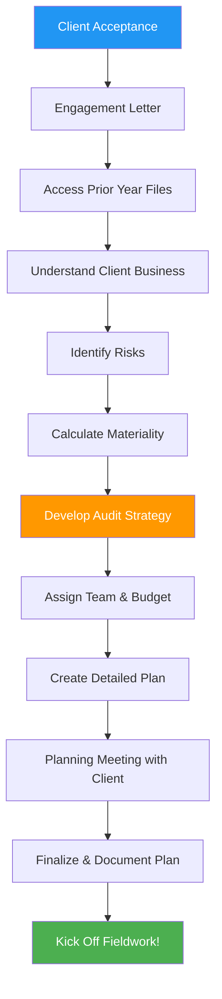
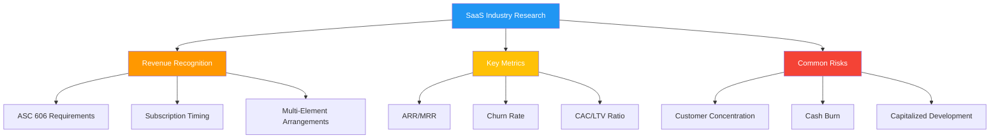

# 📋 Engagement Planning Process

## Overview

Engagement planning is where audit success begins. This critical phase transforms a client acceptance decision into a detailed roadmap for executing a high-quality, efficient audit. Proper planning prevents problems, identifies risks early, and sets clear expectations with the client and team.

:::info Process Duration
**Timeline:** 2-4 weeks before fieldwork begins  
**Primary Role:** <span className="role-badge manager">Manager</span>  
**Supporting Roles:** <span className="role-badge senior-auditor">Senior Auditor</span>, <span className="role-badge admin">Admin</span>  
**Key Output:** Audit Plan Document
:::

---

## 🎯 Planning Objectives

By the end of this process, you will have:

✅ **Understanding of client** business, industry, and risks  
✅ **Materiality** calculated and documented  
✅ **Audit strategy** defined (substantive vs. controls-based)  
✅ **Scope** clearly established and agreed with client  
✅ **Team** assigned with roles and responsibilities  
✅ **Budget** created with hour allocations  
✅ **Timeline** established with key milestones  
✅ **Procedures** tailored to client-specific risks

---

## 📊 Planning Process Flow



---

## 📋 Step-by-Step Planning Guide

### Step 1: Client Acceptance Decision

**Actor:** <span className="role-badge manager">Manager</span> + <span className="role-badge admin">Admin</span>

**Before Planning Begins:**

```
🔍 CLIENT ACCEPTANCE EVALUATION
━━━━━━━━━━━━━━━━━━━━━━━━━━━━━━━━━━━━━━━━━━━━━━

PROSPECTIVE CLIENT: TechStart Inc

BACKGROUND CHECK:
├── Business: SaaS software company
├── Founded: 2020 (5 years old)
├── Revenue: ~$12M (estimated)
├── Employees: 45 people
├── Location: Palo Alto, CA
└── Reason for Audit: Series A funding ($10M)

INDEPENDENCE CHECK:
✅ No family relationships
✅ No financial interests
✅ No employment relationships
✅ No recent former partners
✅ No contingent fees
✅ No advocacy relationships

COMPETENCE CHECK:
✅ We have SaaS industry experience
✅ Team has technology audit expertise
✅ Familiar with revenue recognition (ASC 606)
✅ Understanding of stock compensation
✅ Capacity available Q1 2026

CLIENT RISK ASSESSMENT:
├── Management Integrity: ✅ Strong (verified references)
├── Financial Stability: ✅ Good (reviewed financials)
├── Fraud Risk: ✅ Low (no red flags)
├── Engagement Risk: ✅ Moderate (first year, funding pressure)
├── Litigation Risk: ✅ Low (no pending litigation)
└── Overall Risk: ACCEPTABLE

PROFITABILITY ANALYSIS:
├── Estimated Hours: 200
├── Blended Rate: $150/hour
├── Expected Revenue: $30,000
├── Estimated Costs: $18,000
├── Expected Margin: 40%
└── Assessment: PROFITABLE

DECISION: ✅ ACCEPT CLIENT

Approved by: Jordan Martinez, CPA (Partner)
Date: November 15, 2025
```

---

### Step 2: Execute Engagement Letter

**Actor:** <span className="role-badge admin">Admin</span>

**Engagement Letter Process:**

```
📄 ENGAGEMENT LETTER
━━━━━━━━━━━━━━━━━━━━━━━━━━━━━━━━━━━━━━━━━━━━━━

ACME CPA FIRM
123 Main Street
San Francisco, CA 94105

November 20, 2025

Ms. Lisa Chen, CFO
TechStart Inc
456 Tech Avenue
Palo Alto, CA 94301

Re: Engagement Letter for Audit Services

Dear Lisa,

This letter confirms our understanding of the terms of 
our engagement to audit the financial statements of 
TechStart Inc.

SCOPE OF SERVICES:
We will audit the balance sheet of TechStart Inc as of 
December 31, 2025, and the related statements of income, 
changes in stockholders' equity, and cash flows for the 
year then ended.

OBJECTIVE:
Our audit will be conducted in accordance with auditing 
standards generally accepted in the United States of 
America (GAAS) with the objective of expressing an 
opinion on the financial statements.

MANAGEMENT'S RESPONSIBILITIES:
- Preparation and fair presentation of financial statements
- Design and implementation of internal controls
- Providing access to all relevant information
- Adjustment of financial statements for misstatements
- Affirming representations in writing

AUDITOR'S RESPONSIBILITIES:
- Plan and perform audit to obtain reasonable assurance
- Communicate significant findings to management
- Report on financial statements
- Maintain independence and professional skepticism

LIMITATIONS:
An audit has inherent limitations. Material misstatements 
may not be detected. This is not designed to detect fraud 
or illegal acts, though we will communicate any identified.

FEES:
Estimated fee: $30,000
Based on 200 estimated hours
Billing: Monthly as work is performed
Payment terms: Net 30 days

Please sign and return one copy of this letter to indicate 
your acknowledgment and agreement with the arrangements.

Sincerely,

Jordan Martinez, CPA
Managing Partner, Acme CPA Firm

ACCEPTED AND AGREED:

_____________________________     Date: ___________
Lisa Chen, CFO
TechStart Inc
```

**CloudAudit Pro Tracking:**

```
📊 ENGAGEMENT LETTER STATUS
━━━━━━━━━━━━━━━━━━━━━━━━━━━━━━━━━━━━━━━━━━━━━━

Client: TechStart Inc
Engagement: FY 2025 Audit

LETTER DETAILS:
├── Date Sent: November 20, 2025
├── Sent To: lisa@techstartinc.com
├── Sent By: jordan@acmecpa.com
├── Method: Email + Portal Upload
└── Signed Copy: ⏳ Pending

TRACKING:
Nov 20: Letter sent to Lisa Chen
Nov 21: Email opened by Lisa (9:45 AM)
Nov 21: Portal download by Lisa (10:12 AM)
Nov 22: Signed copy uploaded to portal ✓
Nov 22: Engagement officially begins!

STATUS: ✅ FULLY EXECUTED

[View Signed Letter] [Download PDF]
```

---

### Step 3: Access Prior Year Information

**Actor:** <span className="role-badge manager">Manager</span> (Mike)

**First-Year vs. Recurring Audit:**

```
📁 INFORMATION GATHERING
━━━━━━━━━━━━━━━━━━━━━━━━━━━━━━━━━━━━━━━━━━━━━━

CLIENT: TechStart Inc
AUDIT TYPE: First-Year Audit (no prior auditor)

AVAILABLE INFORMATION:

FINANCIAL INFORMATION:
✅ 2024 Tax Return (unaudited)
✅ 2024 Financial Statements (internally prepared)
✅ QuickBooks file (accounting records)
✅ Bank statements (2024 & 2025)
✅ Monthly financial reports (2025)

CORPORATE DOCUMENTS:
✅ Articles of Incorporation
✅ Bylaws
✅ Board meeting minutes (2024-2025)
✅ Stock ledger
✅ Capitalization table

AGREEMENTS & CONTRACTS:
✅ Customer contracts (top 10 customers)
✅ Vendor agreements
✅ Office lease
✅ Equipment leases
✅ Employment agreements (executives)
✅ Stock option plan documents

REGULATORY:
✅ Business licenses
✅ Sales tax permits
✅ Payroll tax filings
⚠️  No prior audit (first year)
⚠️  No prior internal control documentation

INDUSTRY INFORMATION:
✅ Industry research (SaaS software)
✅ Competitor analysis
✅ Market trends and risks
✅ Regulatory environment (ASC 606)

WHAT WE'RE MISSING (Normal for first year):
❌ Prior year audit workpapers
❌ Prior auditor communications
❌ Historical audit adjustments
❌ Previous management letter comments

PLAN: Request successor auditor letter 
(not applicable - no prior auditor)
```

---

### Step 4: Understand the Client Business

**Actor:** <span className="role-badge manager">Manager</span> + <span className="role-badge senior-auditor">Senior</span>

**Business Understanding Process:**

```
🏢 CLIENT BUSINESS UNDERSTANDING
━━━━━━━━━━━━━━━━━━━━━━━━━━━━━━━━━━━━━━━━━━━━━━

COMPANY: TechStart Inc

BUSINESS MODEL:
┌────────────────────────────────────────────────┐
│ PRODUCT: Project management SaaS platform      │
│ TARGET MARKET: Small to mid-size tech companies│
│ PRICING: $99-$499/month per team               │
│ REVENUE: Subscription-based (recurring)        │
│ CUSTOMERS: 800 active teams                    │
│ GROWTH: 50% YoY revenue growth                 │
└────────────────────────────────────────────────┘

ORGANIZATIONAL STRUCTURE:

CEO: David Park
├── CFO: Lisa Chen (our main contact)
│   ├── Accounting Manager: vacant
│   └── Accountant: 1 person
├── CTO: Engineering team (20 people)
├── VP Sales: Sales team (8 people)
├── VP Marketing: Marketing team (5 people)
└── VP Customer Success: Support (10 people)

KEY METRICS (2025):
├── Monthly Recurring Revenue (MRR): $1M
├── Annual Recurring Revenue (ARR): $12M
├── Customer Acquisition Cost: $2,500
├── Lifetime Value: $18,000
├── Churn Rate: 5% annually (good!)
├── Gross Margin: 85%
└── Cash Burn: $200K/month

REVENUE STREAMS:
├── Subscriptions: $10.8M (90%)
├── Implementation Services: $800K (7%)
└── Training Services: $400K (3%)

CRITICAL BUSINESS PROCESSES:
1. Sales → Contract → Subscription Setup
2. Monthly Billing → Payment Collection
3. Customer Usage → Revenue Recognition
4. Product Development → Capitalization
5. Hiring → Payroll → Stock Compensation

TECHNOLOGY STACK:
├── Product: AWS cloud infrastructure
├── Billing: Stripe payment processing
├── Accounting: QuickBooks Online
├── CRM: Salesforce
├── HR/Payroll: Gusto
└── Bank: Wells Fargo

SIGNIFICANT RISKS IDENTIFIED:
⚠️  Revenue recognition complexity (subscriptions)
⚠️  Stock-based compensation (complex valuations)
⚠️  Deferred revenue (timing of recognition)
⚠️  Customer concentration (top 10 = 40% revenue)
⚠️  First-year audit (no baseline)
⚠️  Funding pressure (investors want clean opinion)
⚠️  Limited accounting staff (Lisa + 1 person)
```

**Industry Research:**



---

### Step 5: Identify & Assess Risks

**Actor:** <span className="role-badge manager">Manager</span> (Mike) + <span className="role-badge senior-auditor">Senior</span> (Sarah)

**Risk Assessment:**

```
⚠️  RISK ASSESSMENT MATRIX
━━━━━━━━━━━━━━━━━━━━━━━━━━━━━━━━━━━━━━━━━━━━━━

ACCOUNT / AREA | INHERENT | CONTROL | DETECTION | AUDIT
               | RISK     | RISK    | RISK      | APPROACH
───────────────┼──────────┼─────────┼───────────┼─────────
REVENUE        | HIGH     | MEDIUM  | MEDIUM    | Substantive+
               | Complex  | Some    | First yr  | Heavy testing
               | ASC 606  | controls| unknown   | 
───────────────┼──────────┼─────────┼───────────┼─────────
RECEIVABLES    | MEDIUM   | MEDIUM  | LOW       | Substantive
               | 800      | Review  | Standard  | Confirmations
               | customers| process | procedures|
───────────────┼──────────┼─────────┼───────────┼─────────
DEFERRED REV   | HIGH     | MEDIUM  | MEDIUM    | Substantive+
               | Timing   | Auto    | Complex   | Heavy testing
               | critical | billing | calc      |
───────────────┼──────────┼─────────┼───────────┼─────────
STOCK COMP     | HIGH     | LOW     | HIGH      | Substantive+
               | Complex  | No      | Valuation | Expert needed
               | valuation| process | difficult |
───────────────┼──────────┼─────────┼───────────┼─────────
CAP DEV COSTS  | MEDIUM   | MEDIUM  | MEDIUM    | Substantive
               | Judgment | Some    | Tech      | Detailed test
               | required | tracking| expertise |
───────────────┼──────────┼─────────┼───────────┼─────────
CASH           | LOW      | MEDIUM  | LOW       | Substantive
               | Simple   | Bank    | Standard  | Recons +
               | accounts | recs    | procedures| confirms
───────────────┼──────────┼─────────┼───────────┼─────────
PAYROLL        | LOW      | HIGH    | LOW       | Controls
               | Gusto    | Auto    | Standard  | Light testing
               | automated| system  | procedures|
───────────────┼──────────┼─────────┼───────────┼─────────
EXPENSES       | MEDIUM   | MEDIUM  | LOW       | Substantive
               | Growing  | Approval| Standard  | Analytical
               | company  | process | procedures| + samples

SPECIAL CONSIDERATIONS:
🔴 Critical: Revenue recognition & Stock compensation
🟡 Significant: Deferred revenue & Capitalized development
🟢 Standard: Cash, AR, Payroll, Expenses

FRAUD RISKS:
⚠️  Management override (funding pressure)
⚠️  Revenue manipulation (investor pressure)
⚠️  Improper capitalization (improve metrics)

FRAUD PROCEDURES:
✅ Journal entry testing (unusual entries)
✅ Management estimates review (revenue, stock comp)
✅ Related party transactions review
```

---

### Step 6: Calculate Materiality

**Actor:** <span className="role-badge manager">Manager</span> (Mike)

**Materiality Calculation:**

```
💰 MATERIALITY CALCULATION
━━━━━━━━━━━━━━━━━━━━━━━━━━━━━━━━━━━━━━━━━━━━━━

CLIENT: TechStart Inc
PERIOD: FY 2025 (12/31/2025)

FINANCIAL BENCHMARKS (Preliminary):
├── Total Assets: $5,200,000
├── Total Revenue: $12,000,000
├── Pre-tax Income: $400,000 (projected)
├── Total Equity: $3,500,000
└── Total Expenses: $11,600,000

MATERIALITY BENCHMARK SELECTION:

Option 1: Revenue-Based
Revenue: $12,000,000 × 0.5% = $60,000
Rationale: Common for pre-profit/growth companies

Option 2: Asset-Based
Assets: $5,200,000 × 1% = $52,000
Rationale: Conservative approach

Option 3: Equity-Based
Equity: $3,500,000 × 3-5% = $105,000 - $175,000
Rationale: Venture-backed company focus

Option 4: Income-Based
Pre-tax Income: $400,000 × 5% = $20,000
Rationale: Too low for efficient audit (not used)

SELECTED BENCHMARK: Revenue ✓
Reasoning: TechStart is growth-stage, pre-profit company. 
Investors focus on revenue growth and ARR. Revenue is 
stable and predictable basis.

MATERIALITY LEVELS:

╔══════════════════════════════════════════════════╗
║  MATERIALITY DETERMINATION                       ║
╠══════════════════════════════════════════════════╣
║                                                  ║
║  OVERALL MATERIALITY (OM):                       ║
║  $60,000                                         ║
║  (0.5% of projected revenue)                     ║
║                                                  ║
║  PERFORMANCE MATERIALITY (PM):                   ║
║  $45,000                                         ║
║  (75% of OM - standard for moderate risk)        ║
║                                                  ║
║  CLEARLY TRIVIAL THRESHOLD (CTT):                ║
║  $3,000                                          ║
║  (5% of OM)                                      ║
║                                                  ║
║  SPECIFIC MATERIALITY:                           ║
║  Related Party Transactions: $3,000              ║
║  Executive Compensation: $10,000                 ║
║                                                  ║
╚══════════════════════════════════════════════════╝

WHAT THIS MEANS:

OVERALL MATERIALITY ($60,000):
- Threshold for opinion modification
- Aggregate of all uncorrected misstatements
- "Would this change a reasonable user's decision?"

PERFORMANCE MATERIALITY ($45,000):
- Working threshold for procedures
- Reduces risk that aggregate errors exceed OM
- Safety margin for undiscovered misstatements

CLEARLY TRIVIAL ($3,000):
- Don't document if less than this
- Accumulate if above this threshold
- Saves time on immaterial items

DOCUMENTATION:
✅ Calculation memo prepared
✅ Benchmark selection rationale documented
✅ Reviewed by partner (Jordan)
✅ Loaded into CloudAudit Pro
✅ Audit team notified
```

---

### Step 7: Develop Audit Strategy

**Actor:** <span className="role-badge manager">Manager</span> (Mike)

**Strategy Decision:**

```
📊 AUDIT STRATEGY
━━━━━━━━━━━━━━━━━━━━━━━━━━━━━━━━━━━━━━━━━━━━━━

CLIENT: TechStart Inc

STRATEGIC APPROACH OPTIONS:

1. SUBSTANTIVE APPROACH
   Focus: Detailed testing of transactions and balances
   When Used: Weak controls or first-year audits
   Effort: High testing, less control work
   
2. CONTROLS-BASED APPROACH
   Focus: Test and rely on internal controls
   When Used: Strong controls, recurring audits
   Effort: Control testing, less substantive work
   
3. COMBINED APPROACH
   Focus: Mix of both strategies
   When Used: Some strong controls, some weak
   Effort: Balanced testing

TECHSTART DECISION: SUBSTANTIVE APPROACH ✓

RATIONALE:
├── First-year audit (controls not previously tested)
├── Small accounting team (limited segregation of duties)
├── No formal control documentation
├── High-risk areas (revenue, stock comp)
├── Funding pressure (fraud risk)
├── More comfortable with detailed testing
└── Baseline for future years

APPROACH BY ACCOUNT:

┌────────────────┬──────────────┬────────────────────┐
│ ACCOUNT        │ STRATEGY     │ PRIMARY PROCEDURES │
├────────────────┼──────────────┼────────────────────┤
│ Cash           │ Substantive  │ • Bank confirms    │
│                │              │ • Reconciliations  │
│                │              │ • Cut-off testing  │
├────────────────┼──────────────┼────────────────────┤
│ AR             │ Substantive  │ • Confirmations    │
│                │              │ • Aging analysis   │
│                │              │ • Subsequent cash  │
├────────────────┼──────────────┼────────────────────┤
│ Revenue        │ Substantive+ │ • Contract review  │
│                │              │ • 606 analysis     │
│                │              │ • Detailed testing │
│                │              │ • Analytics        │
├────────────────┼──────────────┼────────────────────┤
│ Deferred Rev   │ Substantive+ │ • Recalculation    │
│                │              │ • Contract tie-out │
│                │              │ • Timing testing   │
├────────────────┼──────────────┼────────────────────┤
│ Stock Comp     │ Substantive+ │ • Valuation review │
│                │              │ • Expert consult   │
│                │              │ • Recalculation    │
├────────────────┼──────────────┼────────────────────┤
│ Expenses       │ Combined     │ • Analytics        │
│                │              │ • Sampling         │
│                │              │ • Cut-off          │
├────────────────┼──────────────┼────────────────────┤
│ Payroll        │ Combined     │ • Analytics        │
│                │              │ • System testing   │
│                │              │ • Samples          │
└────────────────┴──────────────┴────────────────────┘

KEY: 
Substantive = Detailed transaction testing
Substantive+ = Extra attention and procedures
Combined = Mix of controls and substantive
```

---

### Step 8: Assign Team & Create Budget

**Actor:** <span className="role-badge manager">Manager</span> (Mike) + <span className="role-badge admin">Admin</span> (Jordan)

**Team Assignment:**

```
👥 AUDIT TEAM ASSIGNMENT
━━━━━━━━━━━━━━━━━━━━━━━━━━━━━━━━━━━━━━━━━━━━━━

ENGAGEMENT: TechStart Inc FY 2025 Audit

TEAM STRUCTURE:

ENGAGEMENT PARTNER: Jordan Martinez
├── Role: Overall responsibility, quality review
├── Involvement: Planning, critical reviews, client meetings
└── Estimated Hours: 15 hours

ENGAGEMENT MANAGER: Mike Johnson ⭐ (You are here!)
├── Role: Day-to-day management, client relationship
├── Involvement: All phases, team coordination
└── Estimated Hours: 40 hours

SENIOR AUDITOR: Sarah Williams
├── Role: Fieldwork execution, complex procedures
├── Involvement: Planning support, fieldwork leadership
└── Estimated Hours: 70 hours

STAFF AUDITOR: Emma Thompson
├── Role: Procedure execution, detailed testing
├── Involvement: Fieldwork, standard procedures
└── Estimated Hours: 65 hours

INTERN: Tom Anderson (if available)
├── Role: Support tasks, learning
├── Involvement: Fieldwork support, file organization
└── Estimated Hours: 10 hours

TOTAL BUDGETED HOURS: 200 hours

WORKLOAD DISTRIBUTION:

Planning Phase (30 hours):
├── Partner: 5 hours (engagement letter, strategy)
├── Manager: 15 hours (planning memo, materiality, risk)
├── Senior: 8 hours (industry research, walkthroughs)
├── Staff: 2 hours (file setup, PBC list)

Interim Work (20 hours):
├── Manager: 3 hours (review)
├── Senior: 10 hours (walkthroughs, control docs)
├── Staff: 7 hours (assistance)

Fieldwork (120 hours):
├── Manager: 15 hours (reviews, client meetings)
├── Senior: 45 hours (complex procedures, reviews)
├── Staff: 50 hours (standard procedures)
├── Intern: 10 hours (support tasks)

Completion (30 hours):
├── Partner: 10 hours (final review, report signing)
├── Manager: 7 hours (wrap-up, findings)
├── Senior: 7 hours (adjustments, final items)
├── Staff: 6 hours (file completion)

ROLE-SPECIFIC ASSIGNMENTS:

SARAH (Senior) - Primary Areas:
✓ Revenue recognition (complex!)
✓ Stock-based compensation
✓ Deferred revenue
✓ Review Emma's work
✓ Client walkthroughs

EMMA (Staff) - Primary Areas:
✓ Cash and bank reconciliations
✓ Accounts receivable confirmations
✓ Accounts payable testing
✓ Expense analytics and sampling
✓ File organization

TIMELINE:
├── Planning: Dec 1-15, 2025
├── Interim: Dec 16-31, 2025
├── Fieldwork: Jan 5-30, 2026
└── Completion: Feb 1-15, 2026
```

**Budget Creation:**

```
💰 AUDIT BUDGET
━━━━━━━━━━━━━━━━━━━━━━━━━━━━━━━━━━━━━━━━━━━━━━

CLIENT: TechStart Inc
ENGAGEMENT: FY 2025 Financial Statement Audit

HOUR BUDGET BY ROLE:

┌──────────────┬───────┬──────────┬───────────┬──────────┐
│ ROLE         │ HOURS │ RATE     │ AMOUNT    │ % OF TOTAL│
├──────────────┼───────┼──────────┼───────────┼──────────┤
│ Partner      │  15   │ $300/hr  │  $4,500   │   15%    │
│ Manager      │  40   │ $200/hr  │  $8,000   │   27%    │
│ Senior       │  70   │ $150/hr  │ $10,500   │   35%    │
│ Staff        │  65   │ $100/hr  │  $6,500   │   22%    │
│ Intern       │  10   │  $50/hr  │    $500   │    2%    │
├──────────────┼───────┼──────────┼───────────┼──────────┤
│ TOTAL        │ 200   │ Blended  │ $30,000   │  100%    │
│              │       │ $150/hr  │           │          │
└──────────────┴───────┴──────────┴───────────┴──────────┘

BUDGET BY PHASE:

┌──────────────┬───────┬──────────┬───────────┬──────────┐
│ PHASE        │ HOURS │ % HOURS  │ AMOUNT    │ % AMOUNT │
├──────────────┼───────┼──────────┼───────────┼──────────┤
│ Planning     │  30   │   15%    │  $5,700   │   19%    │
│ Interim      │  20   │   10%    │  $3,200   │   11%    │
│ Fieldwork    │ 120   │   60%    │ $16,600   │   55%    │
│ Completion   │  30   │   15%    │  $4,500   │   15%    │
├──────────────┼───────┼──────────┼───────────┼──────────┤
│ TOTAL        │ 200   │  100%    │ $30,000   │  100%    │
└──────────────┴───────┴──────────┴───────────┴──────────┘

BUDGET BY ACCOUNT/AREA:

┌──────────────────┬───────┬──────────┬──────────┐
│ AREA             │ HOURS │ % HOURS  │ AMOUNT   │
├──────────────────┼───────┼──────────┼──────────┤
│ Planning/Admin   │  35   │  17.5%   │  $6,300  │
│ Revenue          │  45   │  22.5%   │  $6,300  │
│ Receivables      │  20   │  10.0%   │  $2,500  │
│ Cash             │  15   │   7.5%   │  $1,800  │
│ Deferred Revenue │  25   │  12.5%   │  $3,500  │
│ Stock Comp       │  20   │  10.0%   │  $2,800  │
│ Expenses         │  20   │  10.0%   │  $2,400  │
│ Other Areas      │  10   │   5.0%   │  $1,400  │
│ Completion/QC    │  10   │   5.0%   │  $3,000  │
├──────────────────┼───────┼──────────┼──────────┤
│ TOTAL            │ 200   │  100%    │ $30,000  │
└──────────────────┴───────┴──────────┴──────────┘

BILLING SCHEDULE:
├── Upon engagement: 25% ($7,500)
├── Interim completion: 25% ($7,500)
├── Fieldwork 50% done: 25% ($7,500)
└── Final report: 25% ($7,500)

PROFITABILITY ANALYSIS:
├── Revenue: $30,000
├── Direct Costs: $18,000 (salaries)
├── Overhead: $4,500 (15%)
├── Total Costs: $22,500
├── Gross Profit: $7,500
└── Margin: 25% ✓ Acceptable

VARIANCE TRACKING:
CloudAudit Pro will track actual vs. budget in real-time
Alerts when any area exceeds 110% of budget
Weekly budget review meetings with team
```

---

### Step 9: Create Detailed Audit Plan

**Actor:** <span className="role-badge manager">Manager</span> (Mike)

**Comprehensive Audit Plan Document:**

```
📋 AUDIT PLAN DOCUMENT
━━━━━━━━━━━━━━━━━━━━━━━━━━━━━━━━━━━━━━━━━━━━━━

CLIENT: TechStart Inc
PERIOD: December 31, 2025
PREPARED BY: Mike Johnson, Manager
REVIEWED BY: Jordan Martinez, Partner
DATE: December 1, 2025

══════════════════════════════════════════════════

TABLE OF CONTENTS:

1. Engagement Overview
2. Client Business Understanding
3. Risk Assessment
4. Materiality
5. Audit Strategy
6. Planned Procedures by Account
7. Team & Budget
8. Timeline & Milestones
9. Client Communication Plan
10. Quality Control Procedures

══════════════════════════════════════════════════

SECTION 6: PLANNED PROCEDURES (Sample)

REVENUE ($12,000,000 - HIGH RISK)
─────────────────────────────────────────────────

ASSERTIONS TESTED:
• Occurrence (revenue is real)
• Completeness (all revenue recorded)
• Accuracy (amounts are correct)
• Cut-off (recorded in right period)
• Classification (properly categorized)

PROCEDURES:

1. REVENUE RECOGNITION ANALYSIS
   Owner: Sarah (Senior)
   Hours: 15
   Description:
   - Review revenue recognition policy
   - Analyze contracts under ASC 606
   - Identify performance obligations
   - Document revenue timing
   - Test deferred revenue calculations
   
2. SUBSCRIPTION REVENUE TESTING
   Owner: Sarah (Senior)
   Hours: 12
   Sample: 30 subscription contracts
   Description:
   - Select sample of new subscriptions
   - Review contract terms
   - Verify performance obligations
   - Test monthly revenue recognition
   - Confirm accuracy of calculations
   
3. ANALYTICAL PROCEDURES
   Owner: Emma (Staff)
   Hours: 6
   Description:
   - MRR trend analysis
   - Customer count × avg price check
   - Compare to industry benchmarks
   - Investigate unusual fluctuations
   - Document explanations
   
4. CUT-OFF TESTING
   Owner: Emma (Staff)
   Hours: 4
   Sample: Last 5 days Dec, first 5 days Jan
   Description:
   - Review transactions near year-end
   - Verify proper period
   - Test deferred items
   - Check cancellations
   
5. CUSTOMER CONFIRMATIONS
   Owner: Sarah (Senior) + Emma (Staff)
   Hours: 8
   Sample: 25 customers
   Description:
   - Send confirmations to customers
   - Verify subscription details
   - Confirm payment status
   - Follow up on exceptions
   
TOTAL REVENUE HOURS: 45 hours
MATERIALITY THRESHOLD: $60,000
PERFORMANCE MATERIALITY: $45,000
SAMPLE SIZES: Based on PM ($45,000)

[Similar detail for each major account...]

══════════════════════════════════════════════════

SECTION 7: TIMELINE & MILESTONES

GANTT CHART:

Week 1 (Dec 1-7):   Planning ████████
Week 2 (Dec 8-14):  Planning ████████
Week 3 (Dec 15-21): Interim  ████████
Week 4 (Dec 22-31): Interim  ████████
Week 5 (Jan 5-11):  Fieldwork ████████
Week 6 (Jan 12-18): Fieldwork ████████
Week 7 (Jan 19-25): Fieldwork ████████
Week 8 (Jan 26-Feb1): Completion ████████
Week 9 (Feb 2-8):   Final Review ████████
Week 10 (Feb 9-15): Report ████████

KEY MILESTONES:
✓ Dec 1:  Planning begins
✓ Dec 15: Planning meeting with client
✓ Jan 5:  Fieldwork begins
✓ Jan 15: Interim review with partner
✓ Jan 30: Fieldwork substantially complete
✓ Feb 10: Draft report to client
✓ Feb 15: Final report issued

══════════════════════════════════════════════════

SIGN-OFF:

This audit plan has been reviewed and approved.

_____________________________     Date: ___________
Mike Johnson, CPA
Engagement Manager

_____________________________     Date: ___________
Jordan Martinez, CPA
Engagement Partner

Plan loaded into CloudAudit Pro: ✓
Team notified: ✓
Client copy sent: ✓
```

---

### Step 10: Planning Meeting with Client

**Actor:** <span className="role-badge manager">Manager</span> (Mike) + <span className="role-badge senior-auditor">Senior</span> (Sarah)

**Planning Meeting:**

```
🤝 CLIENT PLANNING MEETING
━━━━━━━━━━━━━━━━━━━━━━━━━━━━━━━━━━━━━━━━━━━━━━

DATE: December 15, 2025, 10:00 AM
LOCATION: TechStart Office, Palo Alto
ATTENDEES:
- Mike Johnson (Manager, Acme CPA)
- Sarah Williams (Senior, Acme CPA)
- Lisa Chen (CFO, TechStart)
- David Park (CEO, TechStart)

AGENDA:

1. INTRODUCTIONS & OVERVIEW (15 min)
   Mike presents:
   - Audit team introductions
   - Audit process overview
   - Timeline and key dates
   - Roles and responsibilities

2. BUSINESS DISCUSSION (30 min)
   Questions for David & Lisa:
   - Business developments in 2025
   - Significant transactions
   - New products/services
   - Major customers gained/lost
   - Changes in operations
   - Funding plans and timeline
   - Areas of concern

   Key Takeaways:
   ✓ Series A planned for March 2026
   ✓ New enterprise product launched (Q3)
   ✓ Hired 15 people in 2025
   ✓ One large customer (15% of revenue)
   ✓ Signed long-term AWS agreement

3. ACCOUNTING MATTERS (20 min)
   Mike discusses:
   - Revenue recognition approach
   - Stock compensation valuation
   - Capitalized development costs
   - Significant estimates
   - Related party transactions
   
   Lisa's concerns:
   😟 "Stock option valuation is confusing"
   😟 "Revenue recognition timing questions"
   😟 "Not sure about dev cost capitalization"
   
   Mike's response:
   "We'll help you work through all of these. 
   Sarah is an expert in SaaS accounting and will 
   guide you through the technical requirements."

4. DOCUMENT REQUESTS (15 min)
   Sarah presents:
   - PBC list overview (in portal)
   - Priority items needed first
   - Timeline for document delivery
   - Portal training reminder
   
   Lisa: "I've already uploaded bank statements 
   and some contracts. Will keep adding items 
   from the PBC list this week."

5. LOGISTICS (10 min)
   Mike covers:
   - On-site vs. remote work mix
   - Office space needs (conference room)
   - System access requirements
   - Key contact persons
   - Communication preferences
   
   Agreed approach:
   ✓ Week 1-2: Remote planning
   ✓ Week 3: On-site interim work (2 days)
   ✓ Week 4-6: Mix of on-site and remote
   ✓ Final week: Remote wrap-up

6. QUESTIONS & NEXT STEPS (10 min)
   
   David asks: "What's the biggest risk to 
   getting a clean opinion?"
   
   Mike: "Being honest, the revenue recognition 
   timing. We need to carefully review your 
   subscription contracts under ASC 606. If we 
   work together to understand and document it 
   properly, I'm confident we'll get there."
   
   Lisa: "What can I do to make this go smoothly?"
   
   Sarah: "Stay responsive to our questions, 
   upload documents promptly, and don't hesitate 
   to ask us questions. The portal makes it easy!"

MEETING CLOSE:

Mike: "Great discussion! We're excited to work 
with you. Next touchpoint is our interim visit 
starting January 5. Lisa, we'll be in touch via 
the portal before then."

David: "Thanks for coming out. Looking forward 
to working with you!"

ACTION ITEMS:
✓ Mike: Send meeting summary to Lisa (today)
✓ Sarah: Follow up on revenue questions (this week)
✓ Lisa: Complete PBC list uploads (by Dec 22)
✓ Mike: Schedule interim visit logistics (this week)
```

**Meeting Follow-Up:**

```
📧 MEETING SUMMARY EMAIL
━━━━━━━━━━━━━━━━━━━━━━━━━━━━━━━━━━━━━━━━━━━━━━

From: Mike Johnson <mike@acmecpa.com>
To: Lisa Chen <lisa@techstartinc.com>
CC: Sarah Williams <sarah@acmecpa.com>
Subject: TechStart Audit - Planning Meeting Summary

Hi Lisa,

Great meeting today! David and your team were very 
helpful. Here's a quick summary:

KEY TAKEAWAYS:
• Audit timeline confirmed (Jan 5 - Feb 15)
• Series A funding planned for March
• New enterprise product is significant development
• Stock option valuation needs attention
• Revenue recognition requires careful documentation

ACTION ITEMS:

FOR YOU:
□ Upload remaining PBC list items by Dec 22
□ Prepare list of all stock option grants (Sarah will send template)
□ Gather contracts for new enterprise customers
□ Compile development cost tracking for Q4

FOR US:
□ Provide stock option valuation guidance
□ Send revenue recognition memo
□ Coordinate interim visit logistics
□ Stay responsive to portal questions

NEXT STEPS:
1. We'll be working remotely through December
2. Interim visit: Jan 5-6 (Monday-Tuesday)
3. Lisa - please reserve conference room for us
4. We'll bring laptops, you provide WiFi access

Questions? Just message us in the portal or email.

Thanks again!

Mike Johnson, CPA
Engagement Manager
Acme CPA Firm
(555) 123-4567
```

---

## 📊 Planning Outputs & Deliverables

### What Gets Created During Planning

<div className="feature-grid">

<div className="card">
<h4>📄 Core Documents</h4>

**Created:**
- Engagement letter (signed)
- Audit plan document (25+ pages)
- Planning memo
- Materiality calculation
- Risk assessment matrix
- Team assignment
- Budget & timeline

**Where:**
CloudAudit Pro → Planning folder

</div>

<div className="card">
<h4>📋 Procedure Plans</h4>

**Prepared:**
- Procedure list by account
- Sample sizes calculated
- Testing approach defined
- Responsibilities assigned
- Hour estimates

**Status:**
Ready to execute in fieldwork

</div>

<div className="card">
<h4>📊 Client Materials</h4>

**Delivered:**
- PBC list (in portal)
- Timeline & milestones
- Team contact info
- Communication plan
- Meeting schedules

**Client Access:**
Via CloudAudit Pro portal

</div>

<div className="card">
<h4>💾 System Setup</h4>

**Configured:**
- Audit engagement created
- Team assigned & notified
- Budget loaded
- Materiality set
- Procedures template loaded
- Folder structure created

**Ready:**
For fieldwork execution

</div>

</div>

---

## 🎯 Success Metrics

### How to Know Planning Was Effective

```
✅ PLANNING SUCCESS INDICATORS
━━━━━━━━━━━━━━━━━━━━━━━━━━━━━━━━━━━━━━━━━━━━━━

DOCUMENTATION:
✅ Complete audit plan document
✅ Materiality calculated and documented
✅ Risk assessment comprehensive
✅ All team members understand roles
✅ Budget approved and loaded

CLIENT RELATIONSHIP:
✅ Planning meeting completed
✅ Client understands timeline
✅ Communication plan established
✅ PBC list delivered and acknowledged
✅ Concerns addressed

TEAM READINESS:
✅ Everyone knows their assignments
✅ Procedures tailored to client
✅ No confusion about approach
✅ Adequate time budgeted
✅ Resources available

EFFICIENCY:
✅ No delays starting fieldwork
✅ Documents ready when needed
✅ Team working efficiently
✅ Minimal surprises
✅ On budget through interim

RED FLAGS (Fix Before Fieldwork!):
❌ Unclear risk assessment
❌ Client not responding
❌ Team confused about assignments
❌ Unrealistic budget
❌ Materiality not documented
❌ Missing key information
```

---

## 💡 Planning Best Practices

:::tip Pro Tips from Experienced Managers

**1. Start Planning Early**
Begin 4-6 weeks before fieldwork. Rushed planning leads to inefficient fieldwork and budget overruns.

**2. Involve the Senior Early**
Get Sarah involved in planning, not just fieldwork. Her technical knowledge prevents surprises later.

**3. Face-to-Face Planning Meeting**
Always do this in person (or video) if possible. Email/phone doesn't build the relationship you need.

**4. Be Realistic with Budget**
First-year audits ALWAYS take longer. Budget 20-30% more than you think. Better to come in under budget!

**5. Document Everything**
If it's not documented, it didn't happen. Reviewers and regulators will ask for your planning documentation.

**6. Client-Specific Procedures**
Don't just use last year's program. Tailor procedures to THIS client's specific risks and business.

**7. Communicate Clearly with Client**
Set expectations early. Tell them what you need, when you need it, and why. Prevents frustration later.

**8. Get Partner Buy-In**
Review your plan with Jordan before the client meeting. Partner should agree with your approach.

**9. Technology is Your Friend**
Use CloudAudit Pro to organize everything. Don't rely on spreadsheets and email threads.

**10. Plan for Problems**
Build buffer time for unexpected issues. First-year audits ALWAYS have surprises!

:::

---

## 📚 Related Documentation

- [Risk Assessment Process](./risk-assessment) - Detailed risk assessment methodology
- [Company Setup Process](./company-setup) - How client engagement was created
- [Interim Testing Process](./interim-testing) - Next phase after planning
- [Manager Role](/docs/actors/manager) - Deep dive into manager responsibilities

---

*Good planning is the foundation of audit success. The hours you invest in planning save multiples of hours during fieldwork and completion!* 📋

---

*Last Updated: January 1, 2026*
