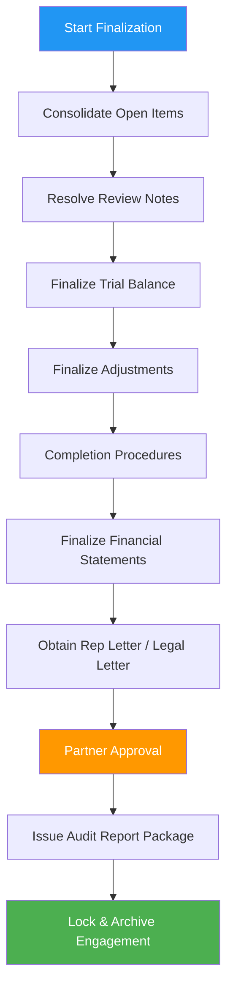

# 🧾 Finalization & Reporting Process

## Overview

Finalization & reporting is the controlled wrap-up phase where the team resolves open items, performs required completion procedures, finalizes financial statements and disclosures, obtains management representations, and issues the auditor’s report package.

This process ensures:
- All fieldwork conclusions are complete and review-ready
- All adjustments are resolved and posted (or evaluated if unposted)
- Required completion procedures are performed and documented
- Reporting outputs are consistent, complete, and approved

:::info Process Duration
**Timeline:** 3–7 business days after fieldwork completion  \
**Primary Role:** Manager  \
**Supporting Roles:** Senior Auditor, Staff Auditor, Admin  \
**Final Approval:** Partner  \
**Client Participants:** Client (CFO/Controller)
:::

---

## 🎯 Finalization Objectives

By the end of this process, you will have:

✅ **Cleared or dispositioned** all open review notes and pending requests  \
✅ **Completed completion procedures** (final analytics, subsequent events, going concern, etc.)  \
✅ **Finalized adjustments** (posted entries and unadjusted differences summary)  \
✅ **Final financial statements package** generated and internally validated  \
✅ **Required letters** obtained (management rep letter, legal letter where applicable)  \
✅ **Audit report** prepared, approved, and issued with correct dates  \
✅ **Documentation locked** for integrity and archiving

---

## ✅ Entry Criteria (Ready to Start)

Start Finalization & Reporting when:

- Fieldwork procedures are substantially complete and signed off at staff/senior level
- Review is underway and the “open items list” is defined
- Trial balance is updated to a near-final state (client has provided final postings)
- Materiality and risk decisions are up to date (any changes documented)

---

## 📦 Key Outputs

- Final Trial Balance (TB) + mapping to financial statements
- Summary of Adjustments:
  - Posted audit adjustments
  - Summary of unadjusted differences
- Completion procedures workpapers:
  - Final analytical review
  - Subsequent events evaluation
  - Going concern evaluation (if applicable)
  - Related party and disclosure completeness checks
- Signed management representation letter
- Legal letter response (if applicable)
- Final audit report package (PDF/Word) + release record
- Engagement closeout / archiving record

---

## 📊 Process Flow

---

## 📋 Step-by-Step Finalization Guide

### Step 1 — Consolidate Open Items (Day 0)

**Owner:** Manager (with Senior)

1. Export or compile the **open items list**:
   - Open PBC requests (documents still missing)
   - Open review notes (senior/manager/partner)
   - Incomplete procedures or missing sign-offs
   - Outstanding confirmations/third-party responses
2. Categorize items:
   - **Must clear before report issuance**
   - **Can clear after issuance** (rare; must be documented and approved)
   - **Client dependency** vs **internal dependency**
3. Assign owners and due dates.

**CloudAudit Pro actions (typical):**
- Review “Open Tasks / Open Requests” dashboard
- Ensure each open request has an owner and due date
- Add a single “Finalization Tracker” workpaper (living list)

---

### Step 2 — Resolve Review Notes (Days 0–3)

**Owner:** Senior; **Oversight:** Manager

Work down the review notes with a clear, audit-trail approach:

- For each note:
  1) Clarify question / issue
  2) Perform follow-up work or add missing documentation
  3) Update conclusion and cross-references
  4) Respond to the reviewer and re-route for re-review

**Good practice:**
- Avoid “cosmetic” edits until substantive issues are resolved.
- If a note changes risk/materiality conclusions, update the planning/risk documentation and affected procedures.

---

### Step 3 — Finalize Trial Balance (Days 1–3)

**Owner:** Senior

1. Obtain the client’s **final TB** (including any year-end close entries).
2. Confirm TB completeness:
   - All subledgers (AR/AP/FA) reconcile
   - Bank recs tie to TB
   - Rollforwards agree to prior year + activity
3. Re-run mapping / classification to FS lines.

**CloudAudit Pro actions (typical):**
- Import final TB version (preserve prior TB as an audit trail version)
- Re-run mapping validation and resolve mapping exceptions

---

### Step 4 — Finalize Adjustments & Unadjusted Differences (Days 1–4)

**Owner:** Manager

1. Confirm which proposed AJEs are:
   - **Posted by client**
   - **Not posted** (remain as unadjusted differences)
2. Ensure each adjustment has:
   - Clear rationale (standard/reference)
   - Quantification methodology
   - Reviewer sign-off
3. Perform a final **aggregate evaluation** of unadjusted differences vs materiality.

**Output:** “Summary of Adjustments” workpaper + client communication record.

---

### Step 5 — Completion Procedures (Days 2–5)

**Owner:** Senior; **Oversight:** Manager

Complete required wrap-up work (tailor by engagement):

#### 5A. Final Analytical Review
- Compare current year to prior year and expectations
- Investigate significant/unexpected variances
- Document explanations and corroborating evidence

#### 5B. Subsequent Events
- Define subsequent event window (through report date)
- Inquire of management
- Review minutes, legal matters updates, and post-year-end transactions as applicable

#### 5C. Going Concern (If Applicable)
- Evaluate management’s plans and cash forecasts
- Consider debt covenant compliance and liquidity
- Document conclusion and reporting implications

#### 5D. Disclosures & Presentation
- Use a disclosure checklist (framework-specific)
- Verify related party disclosures
- Confirm consistency with the TB and significant accounting policies

---

### Step 6 — Final Financial Statements Package (Days 3–6)

**Owner:** Manager

1. Generate the **financial statements package**.
2. Validate:
   - TB ties to statements (tie-out)
   - Footnote numbers and totals are consistent
   - Correct headings, periods, comparative presentation
   - Appropriate basis of accounting disclosures
3. Run a “final proof” read:
   - Spelling, references, consistent terminology
   - Correct entity name and period dates everywhere

**CloudAudit Pro actions (typical):**
- Generate FS from mapped TB
- Export draft package to PDF/Word for proofing
- Track proof changes as review notes until cleared

---

### Step 7 — Obtain Required Letters (Days 4–6)

**Owner:** Manager; **Support:** Admin

- **Management Representation Letter**
  - Confirm signatories
  - Ensure date aligns with report date
  - Ensure representations match engagement scope

- **Legal Letter** (if applicable)
  - Confirm client authorization sent
  - Track response and follow-up
  - Document evaluation of legal contingencies

---

### Step 8 — Partner Approval & Report Dating (Days 5–7)

**Owner:** Partner

Before issuance, confirm:
- All critical review notes cleared
- Completion procedures complete and signed off
- Adjustments finalized and evaluated
- FS package is final and ties out
- Report date is appropriate based on evidence obtained

---

### Step 9 — Issue Report Package & Close Engagement (Day 6–7)

**Owner:** Admin (release) + Manager (control)

1. Issue the final report package to the client using the approved delivery channel.
2. Record release details:
   - Date/time issued
   - Recipient(s)
   - Version identifier
3. Lock engagement artifacts:
   - Final TB version
   - Final FS package
   - Final report
   - Completion workpapers

**CloudAudit Pro actions (typical):**
- Mark engagement status as “Issued” / “Completed”
- Lock workpapers to preserve integrity
- Archive/export the final binder (if your policy requires)

---

## ✅ Finalization Checklist

Use this as a quick completion control:

- [ ] All procedures signed off (no incomplete steps)
- [ ] All review notes cleared or dispositioned
- [ ] Final TB imported and tie-out completed
- [ ] Adjustments posted or documented as unadjusted differences
- [ ] Aggregate evaluation of unadjusted differences documented
- [ ] Final analytics completed and concluded
- [ ] Subsequent events completed through report date
- [ ] Going concern assessed (if applicable)
- [ ] Disclosure checklist completed
- [ ] Rep letter signed and dated appropriately
- [ ] Legal letter obtained/evaluated (if applicable)
- [ ] Financial statements final proof completed
- [ ] Partner sign-off recorded
- [ ] Report issued and release recorded
- [ ] Engagement locked/archived per policy

---

## 🧠 Common Pitfalls (And How to Avoid Them)

- **Pitfall: Late TB changes after tie-out** → Freeze the TB version used for issuance; document any post-freeze changes and partner approval.
- **Pitfall: Rep letter/report date misalignment** → Confirm dates early; schedule signing meeting.
- **Pitfall: “Open note” sprawl** → Keep a single source of truth (Finalization Tracker) with owners and due dates.
- **Pitfall: Rushed disclosures** → Use a checklist and tie every disclosure back to evidence.

---

## 🔗 Related Process Docs

- Year-End Fieldwork Process
- Review & Quality Control Process
- Client Communication Process (Document 8)

---

## 📎 Suggested Templates (Optional)

- Open Items / Finalization Tracker
- Summary of Adjustments & Unadjusted Differences
- Final Analytics Memo
- Subsequent Events Memo
- Going Concern Memo
- Rep Letter Request Email
