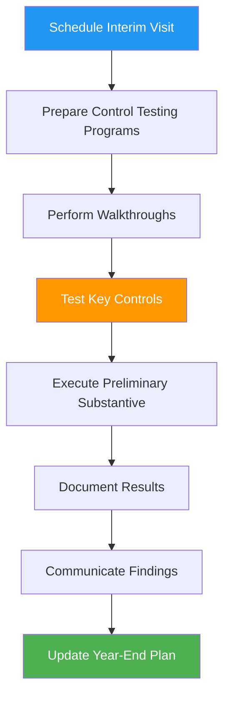

# 🔄 Interim Testing Process

## Overview

Interim testing occurs between the planning phase and year-end fieldwork, typically 2-3 months before the fiscal year-end. This process allows auditors to test controls, identify issues early, and spread audit work more evenly throughout the engagement.

:::info Process Duration
**Timeline:** 1-2 weeks, typically September-October for December year-end  
**Primary Role:** <span className="role-badge senior-auditor">Senior Auditor</span>  
**Supporting Roles:** <span className="role-badge staff-auditor">Staff Auditor</span>  
**Key Output:** Control test results and preliminary substantive work
:::

---

## 🎯 Interim Testing Objectives

✅ **Test operating effectiveness** of internal controls  
✅ **Identify control deficiencies** early (time to remediate)  
✅ **Perform preliminary substantive procedures** (reduce year-end work)  
✅ **Update risk assessment** based on actual control performance  
✅ **Build client relationship** through walkthroughs and interaction  
✅ **Spread audit work** more evenly (budget management)

---

## 📊 Interim Work Process Flow



---

## 📋 What Gets Done at Interim

### Controls-Based Approach Work

```
🛡️ INTERIM CONTROL TESTING
━━━━━━━━━━━━━━━━━━━━━━━━━━━━━━━━━━━━━━━━━━━━━━

FOR TECHSTART (Substantive Approach):
Limited control testing since not relying on controls.
Focus: Walkthroughs to understand processes

TYPICAL CONTROLS-BASED AUDIT WOULD TEST:
• Revenue cycle controls
• Purchasing and disbursement controls  
• Payroll processing controls
• IT general controls
• Financial reporting controls

SAMPLE SIZES:
25-40 items per control (for annual testing)
```

### Preliminary Substantive Procedures

```
📊 INTERIM SUBSTANTIVE WORK
━━━━━━━━━━━━━━━━━━━━━━━━━━━━━━━━━━━━━━━━━━━━━━

WHAT CAN BE DONE EARLY:

ACCOUNTS THAT DON'T CHANGE MUCH:
✅ Fixed assets (test additions through Oct 31)
✅ Debt agreements (review terms, test compliance)
✅ Equity transactions (stock issuances, options)
✅ Related party identification
✅ Legal matters review

PARTIAL TESTING:
✅ Revenue testing (Jan-Oct transactions)
✅ Expense analytics (10 months of data)
✅ Payroll testing (first 10 months)
✅ Cash testing (through Oct 31)

PLANNING WORK:
✅ Confirm materiality still appropriate
✅ Update risk assessment
✅ PBC list review and follow-up
✅ Fraud risk discussion with management

CANNOT BE DONE UNTIL YEAR-END:
❌ Final balances (need Dec 31 data)
❌ Cut-off testing (need year-end transactions)
❌ Subsequent events (happen after year-end)
❌ Final analytical procedures
❌ Management representation letter
```

---

## 👥 TechStart Interim Visit Example

### Day 1: Walkthroughs

**Date:** October 15, 2025  
**Location:** TechStart office  
**Team:** Sarah (Senior) + Emma (Staff)

```
🏢 INTERIM VISIT - DAY 1
━━━━━━━━━━━━━━━━━━━━━━━━━━━━━━━━━━━━━━━━━━━━━━

8:30 AM - Arrival & Setup
Conference room setup, connect to WiFi

9:00 AM - Kickoff with Lisa
Sarah: "Thanks for having us! Today we'll walk through 
your key processes - revenue, expenses, payroll. Tomorrow 
we'll do some preliminary testing. Should be wrapped up 
by end of day tomorrow."

Lisa: "Sounds good. I have the documents you requested 
ready to go."

9:30 AM - REVENUE PROCESS WALKTHROUGH

Sarah walks through entire process with Lisa:

STEP 1: Customer Signs Up
Lisa: "Customer completes signup form on our website. 
Automatically creates account in Salesforce."

Sarah: [documents in notes] "Who approves pricing?"

Lisa: "Standard tiers are automatic. Custom enterprise 
deals require my approval."

STEP 2: Billing Setup
Lisa: "Salesforce triggers Stripe to set up subscription. 
Monthly billing on anniversary date."

Sarah: [testing] "Can you show me an example?"

Lisa demonstrates: Customer ABC signed up Oct 1, 
Stripe bill will auto-generate Nov 1.

STEP 3: Payment Processing
Lisa: "Stripe charges card automatically. Payment hits 
our bank account 2-3 days later."

Sarah: "What if payment fails?"

Lisa: "Stripe auto-retries 3 times. If still fails, 
we send email and may suspend service."

STEP 4: Revenue Recognition
Lisa: "This is where it gets complex. For monthly 
subscriptions, we recognize revenue monthly. For annual 
subscriptions paid upfront, we defer and recognize over 
12 months."

Sarah: "Walk me through the journal entry."

Lisa shows:
Monthly: Dr. Cash $99, Cr. Revenue $99
Annual: Dr. Cash $990, Cr. Deferred Revenue $990
Then monthly: Dr. Deferred Revenue $82.50, Cr. Revenue $82.50

Sarah: [documents process] "How do you track the deferred 
amount?"

Lisa: "I have a spreadsheet that tracks each contract 
start date and monthly amount to recognize."

Sarah: [red flag - manual process] "Can I get a copy of 
that spreadsheet?"

Lisa: "Sure, I'll send it over."

STEP 5: Reconciliation
Lisa: "Monthly, I reconcile Stripe revenue to QuickBooks. 
Make sure everything matches."

Sarah: "Who reviews your reconciliation?"

Lisa: "Honestly? Nobody. It's just me and one accountant. 
I know we need more segregation."

Sarah: "That's good to acknowledge. We'll note that 
in our management letter with recommendations."

11:30 AM - EXPENSE PROCESS WALKTHROUGH

Emma takes lead on this one:

Emma: "Walk me through how expenses get approved and paid."

Lisa: "Employees submit expenses via Expensify. Manager 
approves. Then I approve for payment. AP is paid via 
bill.com twice a week."

Emma: "What's your approval limit?"

Lisa: "I approve everything over $1,000. Managers can 
approve up to $1,000."

Emma documents the process...

[Similar walkthroughs for Payroll, Cash, etc.]

4:30 PM - Debrief
Sarah and Emma discuss findings:

Sarah: "Main takeaway - revenue process is heavily manual. 
Lisa's spreadsheet for deferred revenue is the key control. 
We need to test that thoroughly at year-end."

Emma: "Expense process seems pretty good. Expensify and 
bill.com provide good documentation trail."

Sarah: "Agreed. Let's update our audit program based on 
what we learned."
```

### Day 2: Preliminary Testing

```
🔍 INTERIM TESTING - DAY 2
━━━━━━━━━━━━━━━━━━━━━━━━━━━━━━━━━━━━━━━━━━━━━━

9:00 AM - Fixed Assets Testing

Emma: Tests all asset additions through October:
• Reviews invoices for laptops, monitors, furniture
• Verifies assets exist (physical observation)
• Tests depreciation calculations
• Updates fixed asset schedule

Result: No issues identified ✓

10:30 AM - Stock Option Review

Sarah: Reviews stock option grants through October:
• Board minutes for grant approvals
• Option agreements
• Vesting schedules
• Fair value calculations

Finding: One grant in July missing board approval 
documentation

Sarah to Lisa: "Do you have board minutes for July 15 
meeting? I don't see approval for the 50K options granted 
that month."

Lisa: "Oh! David (CEO) sent email approval but we didn't 
have formal board meeting. Let me get that email."

Sarah: "Perfect. Email approval should be fine, just need 
to document it."

12:00 PM - Lunch Break

1:00 PM - Preliminary Revenue Testing

Sarah: Tests sample of 15 subscription contracts from 
Jan-Oct:
• Reviews customer contracts
• Verifies pricing
• Tests revenue recognition timing
• Checks deferred revenue calculation

Finding: 2 annual contracts had revenue recognized 
entirely upfront instead of deferred

Sarah to Lisa: "These two annual contracts - ABC Corp 
and XYZ Inc - looks like revenue was recognized fully 
when they should have been deferred."

Lisa: "Oh no! Let me check... Yes, you're right. I 
missed those when setting up the spreadsheet. They're 
both from January."

Sarah: "No problem, that's why we're here! Can you 
adjust these before year-end? It's about $15,000 that 
needs to be deferred."

Lisa: "Absolutely. I'll fix it this week. Thank you for 
catching that!"

3:00 PM - Wrap-Up Meeting

Sarah: "Overall, things look good. We identified a few 
items:

FINDINGS:
1. Two revenue contracts need adjustment ($15K deferred)
2. One stock option grant needs email approval documented
3. Deferred revenue spreadsheet needs review (we found errors)

RECOMMENDATIONS:
1. Consider more robust deferred revenue tracking (maybe 
   upgrade from spreadsheet)
2. Formalize board approval process for stock options
3. Hire controller to provide independent review of Lisa's work

None of these are major issues. We'll follow up at 
year-end."

Lisa: "Thanks for the feedback. I'll implement these 
adjustments and work on the recommendations."

4:00 PM - Return to Office

Sarah and Emma head back to Acme CPA office to document 
findings and update year-end plan.
```

---

## 📊 Interim Work Benefits

### Why Interim Testing Matters

<div className="feature-grid">

<div className="card">
<h4>⏰ Time Management</h4>

**Spreads Work:**
- Reduces year-end crunch
- More billable hours in slower months
- Better staff utilization
- Manageable deadlines

**TechStart Example:**
- 20 hours at interim (Oct)
- Saves 10 hours at year-end
- More focused year-end work

</div>

<div className="card">
<h4>🔍 Early Issue Identification</h4>

**Find Problems Early:**
- Client has time to fix
- Reduces year-end surprises  
- Better audit quality
- Smoother completion

**TechStart Example:**
- Found $15K revenue error
- Lisa fixed before year-end
- No year-end adjustment needed

</div>

<div className="card">
<h4>🤝 Client Relationship</h4>

**Builds Trust:**
- Shows audit as helpful process
- Not just "gotcha" at year-end
- Partnership mentality
- Continuous improvement

**TechStart Example:**
- Lisa appreciated finding errors early
- Implemented recommendations
- Trusts audit team more

</div>

<div className="card">
<h4>📋 Better Planning</h4>

**Refines Approach:**
- Updates risk assessment
- Adjusts year-end procedures
- Confirms budget realistic
- Identifies scope changes

**TechStart Example:**
- Confirmed revenue is high risk
- Added deferred revenue procedures
- Adjusted year-end budget up 10 hours

</div>

</div>

---

## 📋 Interim Testing Checklist

```
☑️ INTERIM WORK COMPLETION CHECKLIST
━━━━━━━━━━━━━━━━━━━━━━━━━━━━━━━━━━━━━━━━━━━━━━

PREPARATION:
□ Schedule interim visit with client
□ Prepare walkthrough programs
□ Review prior year workpapers (if applicable)
□ Prepare PBC list for interim
□ Coordinate team availability

WALKTHROUGHS:
□ Revenue cycle walkthrough complete
□ Purchasing/AP cycle walkthrough complete
□ Payroll cycle walkthrough complete
□ Cash management walkthrough complete
□ Financial reporting process walkthrough complete
□ IT systems walkthrough complete

CONTROL TESTING (if applicable):
□ Identify key controls to test
□ Determine sample sizes
□ Perform control tests
□ Document results
□ Evaluate control effectiveness

PRELIMINARY SUBSTANTIVE:
□ Fixed assets (additions through interim date)
□ Stock transactions (through interim date)
□ Debt agreements reviewed
□ Legal matters discussed
□ Related parties identified
□ Partial revenue testing
□ Partial expense testing

FINDINGS & COMMUNICATION:
□ Document control deficiencies
□ Identify accounting errors
□ Communicate findings to client
□ Follow up on management's remediation
□ Update risk assessment
□ Adjust year-end audit plan

DOCUMENTATION:
□ Walkthrough memos complete
□ Test results documented
□ Findings summarized
□ Client responses obtained
□ Updated audit program
□ Time charged to engagement

FOLLOW-UP:
□ Ensure client makes agreed-upon adjustments
□ Verify recommendations implemented
□ Update year-end planning
□ Brief team on interim findings
```

---

## 💡 Interim Testing Best Practices

:::tip Pro Tips from Experienced Auditors

**1. Schedule Early**
Book interim visit months in advance. Clients appreciate predictability and you avoid scheduling conflicts.

**2. Focus on Value-Add**
Use walkthroughs as teaching opportunities. Help client understand why controls matter.

**3. Document Everything**
Walkthrough notes are your roadmap for year-end. Detailed notes now save time later.

**4. Test What Matters**
Don't test controls you're not relying on. TechStart uses substantive approach, so limited control testing makes sense.

**5. Communicate Findings Immediately**
Don't wait for year-end to tell client about issues. Real-time feedback is most helpful.

**6. Update Your Plan**
Interim should ALWAYS result in updated risk assessment and year-end plan. You learned something - adjust accordingly.

**7. Build Relationships**
Interim is less stressful than year-end. Use it to build rapport with client team.

**8. Don't Overstay**
Get in, get your work done, get out. Respect client's time. TechStart visit was 2 days - perfect.

:::

---

## 📚 Related Documentation

- [Engagement Planning Process](./engagement-planning) - How interim fits into overall plan
- [Risk Assessment Process](./risk-assessment) - Updating risk assessment based on interim
- [Year-End Fieldwork Process](./year-end-fieldwork) - What comes next
- [Review & Quality Control](./review-quality-control) - Reviewing interim work

---

*Interim testing: where you turn plans into action and build the foundation for year-end success!* 🔄

---

*Last Updated: January 1, 2026*
