# ✅ Review & Quality Control Process

## Overview

Review and quality control are the safety nets that catch errors before they reach the client or public. This multi-layered process ensures that audit work meets professional standards, conclusions are supported, and the final product is accurate and complete.

:::info Process Duration
**Timeline:** 1-2 weeks during and after fieldwork  
**Primary Roles:** All levels review work below them  
**Final Review:** <span className="role-badge admin">Engagement Partner</span>  
**Key Output:** Quality-assured audit file ready for report issuance
:::

---

## 🎯 Review Objectives

✅ **Verify procedures were performed** as planned  
✅ **Ensure evidence supports conclusions** drawn  
✅ **Identify errors or omissions** before finalization  
✅ **Confirm compliance** with audit standards  
✅ **Assess overall audit quality** and sufficiency  
✅ **Document review findings** and resolutions  
✅ **Obtain sign-off** at each review level

---

## 📊 Review Hierarchy

```mermaid
graph TD
    A[Staff Prepares Workpaper] --> B[Staff Self-Review]
    B --> C[Senior Reviews]
    C --> D{Issues Found?}
    D -->|Yes| E[Return to Staff]
    E --> B
    D -->|No| F[Manager Reviews]
    F --> G{Issues Found?}
    G -->|Yes| H[Return to Senior/Staff]
    H --> C
    G -->|No| I[Partner Reviews]
    I --> J{Issues Found?}
    J -->|Yes| K[Return to Manager]
    K --> F
    J -->|No| L[Workpaper Approved ✓]
    
    style A fill:#2196f3,color:#fff
    style L fill:#4caf50,color:#fff
```



---

## 📋 Review Levels Explained

### Level 1: Preparer Self-Review

**Who:** <span className="role-badge staff-auditor">Staff Auditor</span> (Emma)

```
📝 STAFF SELF-REVIEW CHECKLIST
━━━━━━━━━━━━━━━━━━━━━━━━━━━━━━━━━━━━━━━━━━━━━━

BEFORE submitting to Senior, Emma checks:

PROCEDURES:
□ All planned procedures completed
□ Sample selections properly documented
□ Tick marks explained in legend
□ Calculations verified (footed/cross-footed)
□ Source documents referenced

DOCUMENTATION:
□ Workpaper has clear objective
□ Procedures performed are listed
□ Results/findings documented
□ Exceptions noted and explained
□ Conclusion stated clearly

EVIDENCE:
□ Support attached or referenced
□ Cross-references to other workpapers
□ Electronic files saved properly
□ Hard copies scanned if applicable

PROFESSIONAL:
□ Spell-check completed
□ Professional language used
□ No unexplained abbreviations
□ Date and signature included
□ Hours charged

Emma's typical self-review time: 15-30 min per workpaper
```

**Example - Emma's Cash Workpaper:**

```
Emma's thought process before submitting:

"Let me review this cash workpaper before sending to Sarah...

✓ Bank confirmation attached - check
✓ Bank rec tested - check
✓ Tick marks all explained - check
✓ Math verified (I footed the rec) - check
✓ Conclusion stated - check
✓ Wait... I didn't note the confirmation response date

[Emma adds: Response received Jan 8, 2026]

✓ Now it's complete. Submitting to Sarah."
```

---

### Level 2: Senior Review

**Who:** <span className="role-badge senior-auditor">Senior Auditor</span> (Sarah)

```
🔍 SENIOR REVIEW PROCESS
━━━━━━━━━━━━━━━━━━━━━━━━━━━━━━━━━━━━━━━━━━━━━━

SARAH'S REVIEW APPROACH:

For EACH workpaper from Emma, Sarah reviews:

SUBSTANTIVE REVIEW:
□ Procedures appropriate for risk assessed
□ Sample size adequate
□ Testing method sound
□ Evidence supports conclusion
□ Exceptions properly investigated
□ Alternative procedures performed if needed

TECHNICAL REVIEW:
□ Accounting treatment correct
□ Standards compliance (GAAP, GAAS)
□ Assertions addressed
□ Materiality considered
□ Professional judgment reasonable

DOCUMENTATION REVIEW:
□ Workpaper clear and understandable
□ Cross-references work
□ Sufficient detail for review
□ Meets firm standards
□ Audit trail complete

REVIEW NOTES:
Sarah uses CloudAudit Pro review note feature:
- Green comments: Suggestions (optional)
- Yellow comments: Questions (need response)
- Red comments: Issues (must fix)

Sarah's review time: 30-60 min per complex workpaper
                    10-20 min per simple workpaper
```

**Example - Sarah Reviews Emma's AR Workpaper:**

```
📧 CLOUDAUDIT PRO REVIEW NOTES
━━━━━━━━━━━━━━━━━━━━━━━━━━━━━━━━━━━━━━━━━━━━━━

WORKPAPER: Accounts Receivable Confirmations
PREPARER: Emma Thompson
REVIEWER: Sarah Williams
DATE: January 19, 2026

SARAH'S REVIEW NOTES:

🟢 COMMENT 1 (Suggestion):
"Nice work on the confirmation follow-up. Your 
documentation is very clear."

🟡 COMMENT 2 (Question):
"For the ABC Industries exception ($32K), you noted 
payment in Undeposited Funds. Did you verify this 
was the correct payment amount and customer?"

Emma's Response: "Yes - reviewed remittance advice 
from ABC, confirms $32K for Invoice #1234. Tie-out 
verified."

Sarah: "Perfect, thanks for clarifying."

🔴 COMMENT 3 (Issue):
"For alternative procedures on non-responses, you 
noted 'subsequent payment' for Customer A but didn't 
document the date or amount of payment. Please add."

Emma's Response: "Added - Payment of $42,000 received 
1/15/26, reviewed bank deposit #45678."

Sarah: "Good, issue resolved."

🟡 COMMENT 4 (Question):
"Sample size is 25 customers covering 82%. Given AR 
balance is $1.2M and PM is $45K, this seems adequate. 
Can you document why this coverage is sufficient?"

Emma's Response: "Added note: Sample covers 82% of 
total AR balance. Coverage exceeds 75% threshold 
per firm policy. Remaining 18% ($212K) is well below 
PM and consists of 322 small balances averaging $660 
each. Risk assessed as low."

Sarah: "Excellent reasoning. Documented nicely."

OVERALL ASSESSMENT:
Good work, Emma. A few documentation issues but 
substantively sound. Approved with comments addressed.

SIGN-OFF:
Reviewed by: Sarah Williams, Senior Auditor
Date: January 19, 2026
Status: ✅ APPROVED (with comments resolved)
```

---

### Level 3: Manager Review

**Who:** <span className="role-badge manager">Manager</span> (Mike)

```
📊 MANAGER REVIEW FOCUS
━━━━━━━━━━━━━━━━━━━━━━━━━━━━━━━━━━━━━━━━━━━━━━

MIKE'S REVIEW RESPONSIBILITIES:

STRATEGIC REVIEW:
□ Overall audit strategy executed as planned
□ Risk assessment still appropriate
□ Audit objectives achieved
□ Significant findings identified
□ Client communication adequate

TECHNICAL REVIEW:
□ Complex accounting issues resolved properly
□ Significant estimates reasonable
□ Disclosure requirements addressed
□ Going concern assessment adequate
□ Subsequent events procedures complete

FINANCIAL STATEMENT REVIEW:
□ Draft financial statements reviewed
□ Tie to trial balance verified
□ Disclosures complete and accurate
□ Presentation per GAAP
□ Numbers make sense (overall analytics)

FILE COMPLETION:
□ All required workpapers present
□ Review notes cleared
□ Deficiencies communicated
□ Adjustments proposed/posted
□ Summary memos complete

Mike's review: 15-20 hours total for full engagement
Timing: During and after fieldwork
```

**Example - Mike's Revenue Review:**

```
💬 MIKE'S REVIEW CONVERSATION WITH SARAH
━━━━━━━━━━━━━━━━━━━━━━━━━━━━━━━━━━━━━━━━━━━━━━

DATE: January 25, 2026
TOPIC: Revenue workpapers review

Mike: "Sarah, I've reviewed your revenue work. Really 
thorough job on the ASC 606 analysis. A few things..."

Sarah: "Sure, what questions do you have?"

Mike: "The $78K revenue adjustment - walk me through 
how you found that."

Sarah: "I reviewed all 40 contracts. Three contracts 
had annual subscriptions starting in December. Client 
recognized full year revenue in December instead of 
deferring 11 months into 2026."

Mike: "And you're confident this wasn't intentional?"

Sarah: "I don't think so. Lisa seemed genuinely 
surprised when I showed her. She immediately agreed 
to adjust. Her spreadsheet formula didn't catch 
December start dates properly."

Mike: "Okay, good. That's an important distinction 
for fraud risk assessment. What's your recommendation 
to prevent this?"

Sarah: "I suggested she add a monthly check - review 
new contracts that month and verify deferred revenue 
setup. Also recommended revenue recognition software 
to automate this."

Mike: "Good. Make sure that's in the management letter. 
Next question - your sample of 40 contracts covered 
how much revenue?"

Sarah: "65% of total subscription revenue. All multi-year 
contracts plus top 20 customers."

Mike: "And the remaining 35%?"

Sarah: "Smaller monthly subscriptions. I performed 
analytics on those - trend analysis looked reasonable, 
no spikes or anomalies."

Mike: "Comfortable that's sufficient?"

Sarah: "Yes. The risk is in multi-year contracts and 
timing, which we tested extensively. Monthly subscriptions 
are straightforward and automated through Stripe."

Mike: "Agreed. One last thing - cut-off testing. You 
tested 2 weeks each side of year-end. Why 2 weeks 
instead of our standard 1 week?"

Sarah: "Revenue is a significant risk, and I wanted 
extra assurance. Also, their billing cycles are monthly, 
so 2 weeks captures more of the billing cycle."

Mike: "Smart. Okay, I'm comfortable with your revenue 
work. Document this conversation in your summary memo 
and we're good."

Sarah: "Will do. Thanks Mike."

MIKE'S SIGN-OFF:
Reviewed revenue workpapers. Extensive testing performed, 
appropriate conclusions reached. One material adjustment 
identified and posted by client. Approved for partner review.

Reviewed by: Mike Johnson, Manager
Date: January 25, 2026
Status: ✅ APPROVED
```

---

### Level 4: Partner Review

**Who:** <span className="role-badge admin">Engagement Partner</span> (Jordan)

```
👔 PARTNER REVIEW - HIGHEST LEVEL
━━━━━━━━━━━━━━━━━━━━━━━━━━━━━━━━━━━━━━━━━━━━━━

JORDAN'S REVIEW RESPONSIBILITIES:

ENGAGEMENT ACCEPTANCE:
□ Independence maintained throughout
□ Resources adequate for engagement
□ No scope limitations identified
□ Client integrity still acceptable

AUDIT APPROACH:
□ Planning appropriate for risks
□ Materiality reasonable
□ Audit strategy sound
□ Procedures responsive to risks
□ Sufficient appropriate evidence obtained

SIGNIFICANT MATTERS:
□ Critical accounting judgments
□ Significant unusual transactions
□ Difficult/contentious issues with management
□ Disagreements with client
□ Consultations documented

FINANCIAL STATEMENTS:
□ Complete and accurate
□ Comply with GAAP
□ Disclosures adequate
□ Presentation appropriate
□ Ready for opinion

AUDIT REPORT:
□ Opinion appropriate
□ Wording correct
□ Dates proper
□ Modifications needed (if any)

GOING CONCERN:
□ Assessment documented
□ Evidence supports conclusion
□ Disclosures adequate (if needed)

QUALITY CONTROL:
□ Firm policies followed
□ Review standards met
□ Documentation complete
□ File ready for archival

Jordan's review: 10-15 hours
Timing: After manager review complete
```

**Example - Jordan's Final Review:**

```
📋 PARTNER REVIEW MEETING
━━━━━━━━━━━━━━━━━━━━━━━━━━━━━━━━━━━━━━━━━━━━━━

DATE: February 5, 2026, 2:00 PM
LOCATION: Acme CPA office
ATTENDEES: Jordan (Partner), Mike (Manager)

JORDAN'S REVIEW PROCESS:

1. INDEPENDENT REVIEW (8 hours)
Jordan spends 2 days reviewing entire file:
- All significant risk areas (revenue, stock comp)
- Financial statements
- Adjustments and summary memos
- Client correspondence
- Significant judgments

2. REVIEW MEETING WITH MIKE (2 hours)

Jordan: "Mike, good work on this engagement. I have 
some questions..."

DISCUSSION POINT #1: Materiality

Jordan: "You used revenue as the benchmark for 
materiality. Walk me through that decision."

Mike: "TechStart is pre-profit, growing company. 
Revenue is what investors care about. Using income 
would give us too low a materiality ($20K) for an 
efficient audit."

Jordan: "I agree with the approach. 0.5% of revenue 
seems reasonable. Did you re-evaluate materiality 
after finding the $78K revenue adjustment?"

Mike: "Yes - final revenue was $12.22M, so materiality 
would be $61K. We kept it at $60K. Still appropriate."

Jordan: "Good. Documented?"

Mike: "Yes, in the planning memo and final summary memo."

DISCUSSION POINT #2: Revenue Adjustment

Jordan: "The $78K revenue adjustment - significant 
amount. Talk me through the fraud risk assessment."

Mike: "We considered it. The amount is material, and 
there's funding pressure. However:
- Lisa immediately agreed when Sarah found it
- Appears to be error, not intentional manipulation
- Corrected in same year before close
- No pattern of aggressive accounting
- Other revenue testing didn't find similar issues"

Jordan: "I reviewed Sarah's workpaper. The error was 
in Lisa's spreadsheet formula, not manual manipulation?"

Mike: "Correct. The formula didn't handle December 
start dates properly. Systematic error, not selective."

Jordan: "And our recommendation?"

Mike: "Management letter includes recommendation for 
revenue recognition software and formal policy."

Jordan: "I'm comfortable this was error, not fraud. 
But it does highlight the control deficiency - Lisa 
has too much responsibility without review."

Mike: "Agreed. That's also in the management letter."

DISCUSSION POINT #3: Stock-Based Compensation

Jordan: "Stock comp is complex. Sarah tested it, but 
did we consider using a specialist?"

Mike: "We discussed it. Sarah reviewed the 409A 
valuation, which was done by a reputable firm 
(ValuationCo). Their methodology is sound - option 
pricing model with reasonable assumptions."

Jordan: "And Sarah's comfortable with the valuation?"

Mike: "Yes. She has experience with SaaS valuations. 
The assumptions (volatility, discount rate) are within 
industry norms. We also tested the math - calculations 
are correct."

Jordan: "Okay. If this were more complex or the amounts 
were larger, I'd want a specialist. But for $500K with 
a third-party valuation already performed, I think 
Sarah's review is sufficient."

DISCUSSION POINT #4: Going Concern

Jordan: "They're burning $200K/month with 12 months 
runway. Did you assess going concern?"

Mike: "Yes. They have:
- 12 months of cash
- Series A signed term sheet ($10M)
- Expected close in March 2026
- Strong revenue growth (customer retention)

We concluded no substantial doubt. Disclosed the Series A 
in subsequent events note."

Jordan: "What if the Series A falls through?"

Mike: "We discussed with Lisa. They have contingency - 
could cut burn rate to $100K/month if needed. That 
extends runway to 24 months. Also have other investor 
interest."

Jordan: "Documented in the going concern memo?"

Mike: "Yes, including management's plans if Series A 
doesn't close."

Jordan: "Good."

DISCUSSION POINT #5: Financial Statements

Jordan: "I reviewed the financial statements. A few 
questions on disclosures..."

[Reviews each footnote]

"Note 2 - Significant Accounting Policies - needs to 
include revenue recognition policy. Can you add that?"

Mike: "Yes, I'll draft it today."

"Note 8 - Subsequent Events - Series A is disclosed. 
Looks good."

"Note 6 - Stock-Based Compensation - might add the 
valuation assumptions (volatility %, discount rate). 
More transparency for investors."

Mike: "Good idea. I'll add that."

FINAL ASSESSMENT:

Jordan: "Overall, I'm satisfied with the audit quality. 
Good work by the team. A few minor disclosure tweaks, 
but nothing major.

I'm prepared to sign the report once:
1. Revenue recognition policy added to footnotes
2. Stock comp valuation assumptions added
3. Management representation letter obtained
4. Final review notes cleared

Target for final report: February 15."

Mike: "I'll get those done this week."

Jordan: "Great. Let's plan to deliver the report to 
Lisa on February 15, then meet with her and David to 
present on February 17."

SIGN-OFF:
Partner review complete. Audit quality is acceptable. 
Minor disclosure enhancements needed. File approved 
subject to completion of items noted above.

Reviewed by: Jordan Martinez, CPA - Engagement Partner
Date: February 5, 2026
Status: ✅ APPROVED (subject to noted items)
```

---

## 📊 Review Documentation

### Review Notes in CloudAudit Pro

```
🔔 REVIEW NOTE TRACKING SYSTEM
━━━━━━━━━━━━━━━━━━━━━━━━━━━━━━━━━━━━━━━━━━━━━━

TECHSTART FY2025 AUDIT - REVIEW NOTE SUMMARY

TOTAL REVIEW NOTES: 47
RESOLVED: 45 (96%)
OPEN: 2 (4%)

BY REVIEWER:
Sarah (Senior): 32 notes to Emma
Mike (Manager): 12 notes to Sarah/Emma
Jordan (Partner): 3 notes to Mike

BY SEVERITY:
🟢 Suggestions: 18 (optional improvements)
🟡 Questions: 22 (need clarification)
🔴 Issues: 7 (must fix)

BY STATUS:
✅ Resolved: 45
⏳ In Progress: 2
❌ Open: 0

OPEN ITEMS (as of Feb 5):

REVIEW NOTE #46 (Jordan → Mike):
"Add revenue recognition policy to Note 2"
Status: ⏳ In Progress
Target: February 8

REVIEW NOTE #47 (Jordan → Mike):
"Add stock comp valuation assumptions to Note 6"
Status: ⏳ In Progress
Target: February 8

RESOLUTION TARGET: February 8, 2026
FILE ARCHIVE TARGET: February 20, 2026
```

---

## ✅ Quality Control Checklist

```
☑️ ENGAGEMENT QUALITY CONTROL CHECKLIST
━━━━━━━━━━━━━━━━━━━━━━━━━━━━━━━━━━━━━━━━━━━━━━

PLANNING:
□ Engagement letter signed
□ Independence confirmed
□ Team assigned appropriately
□ Planning memo complete
□ Risk assessment documented
□ Materiality calculated
□ Audit program tailored to risks

EXECUTION:
□ All procedures completed per program
□ Sufficient appropriate evidence obtained
□ Sampling properly documented
□ Exceptions investigated
□ Alternative procedures performed (if needed)
□ Adjustments proposed and resolved
□ Client communication documented

REVIEW:
□ Staff self-review performed
□ Senior review complete (all workpapers)
□ Manager review complete (all workpapers)
□ Partner review complete (entire file)
□ All review notes resolved
□ Sign-offs obtained at each level

FINANCIAL STATEMENTS:
□ Agree to trial balance
□ GAAP compliance verified
□ Disclosures complete
□ Presentation appropriate
□ Cross-references verified
□ Reviewed by partner

SIGNIFICANT MATTERS:
□ Fraud risk assessment documented
□ Significant risks addressed
□ Going concern evaluated
□ Subsequent events reviewed
□ Related parties identified
□ Litigation/claims assessed

COMPLETION:
□ Management representation letter obtained
□ Final analytical procedures performed
□ Adjustments posted by client
□ Final trial balance obtained
□ Quality control review complete
□ File ready for archival

COMMUNICATIONS:
□ Deficiencies communicated to management
□ Management letter prepared
□ Required communications made
□ Client satisfaction confirmed

FINAL SIGN-OFF:
□ Engagement partner approval obtained
□ Report dated and signed
□ File archived (retention: 7 years)
□ Billing completed

COMPLETION DATE: ______________
PARTNER SIGNATURE: ______________
```

---

## 💡 Review Best Practices

:::tip Quality Control Tips

**1. Review Daily, Not Weekly**
Sarah should review Emma's work each day, not batch it at the end. Catches issues early.

**2. Use Review Notes Effectively**
Be specific in comments. "See me" is not helpful. "Please document the source of this number" is clear.

**3. Don't Review Defensively**
Seniors: Don't just check boxes. Really think about whether procedures make sense.

**4. Ask "Why?" Frequently**
Managers/Partners: If something seems odd, ask why. Don't assume the team thought it through.

**5. Document Verbal Discussions**
If you discuss something significant verbally, document it. "Per discussion with Sarah on 1/25..."

**6. Independent Mindset**
Partners: Don't just rely on team's work. Independently think through significant judgments.

**7. Timely Reviews**
Don't let workpapers pile up. Emma waiting 2 weeks for review feedback is inefficient.

**8. Balance Perfectionism and Pragmatism**
Strive for quality, but don't nitpick immaterial formatting issues.

**9. Clear Resolution**
When review note is resolved, explicitly state "Resolved - [explanation]" not just ✓

**10. Learn from Reviews**
Staff: Don't just fix issues, understand WHY they were issues. Prevents repeat mistakes.

:::

---

## 📚 Related Documentation

- [Year-End Fieldwork Process](./year-end-fieldwork) - What's being reviewed
- [Finalization & Reporting](./finalization-reporting) - Next steps after review
- [Manager Role](/docs/actors/manager) - Manager review responsibilities
- [Senior Auditor Role](/docs/actors/senior-auditor) - Senior review responsibilities

---

*Quality control isn't about finding mistakes - it's about preventing them from reaching the client!* ✅

---

*Last Updated: January 1, 2026*
