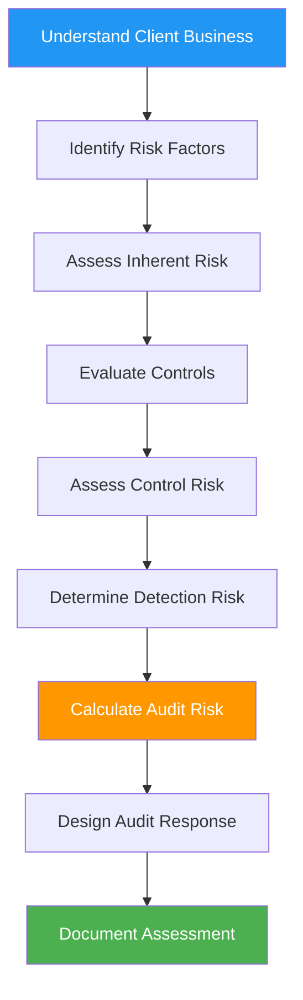

# ⚠️ Risk Assessment Process

## Overview

Risk assessment is the foundation of an effective audit. This process identifies where things could go wrong in a client's financial statements and helps auditors focus their efforts on the areas that matter most. A thorough risk assessment leads to an efficient, high-quality audit.

:::info Process Duration
**Timeline:** 1-2 weeks during planning phase  
**Primary Role:** <span className="role-badge manager">Manager</span> + <span className="role-badge senior-auditor">Senior Auditor</span>  
**Key Output:** Risk Assessment Matrix and Audit Response  
**Standards:** AU-C 315 (Understanding the Entity and Its Environment)
:::

---

## 🎯 Risk Assessment Objectives

By the end of this process, you will have:

✅ **Identified** significant risks in the financial statements  
✅ **Assessed** likelihood and magnitude of potential misstatements  
✅ **Evaluated** internal controls related to key risks  
✅ **Determined** appropriate audit responses  
✅ **Documented** risk assessment procedures and conclusions  
✅ **Communicated** risks to audit team and client management  
✅ **Tailored** audit procedures to address identified risks

---

## 📊 Risk Assessment Framework



---

## 🔍 Understanding Audit Risk Components

### The Audit Risk Model

```
AUDIT RISK = Inherent Risk × Control Risk × Detection Risk

WHERE:
• Audit Risk (AR) = Risk of issuing wrong opinion
• Inherent Risk (IR) = Risk before considering controls
• Control Risk (CR) = Risk controls won't prevent/detect errors
• Detection Risk (DR) = Risk auditor won't detect errors

TARGET: Keep AR at acceptably low level (typically 5%)
```

**Visual Representation:**

```
╔══════════════════════════════════════════════════╗
║  AUDIT RISK MODEL - TechStart Revenue Example    ║
╠══════════════════════════════════════════════════╣
║                                                  ║
║  INHERENT RISK: High (80%)                       ║
║  Why: Complex ASC 606, subscription timing       ║
║                                                  ║
║  CONTROL RISK: Medium (50%)                      ║
║  Why: Automated billing but manual review        ║
║                                                  ║
║  ACCEPTABLE AUDIT RISK: Low (5%)                 ║
║  Why: Funding pressure, first year audit         ║
║                                                  ║
║  REQUIRED DETECTION RISK:                        ║
║  DR = AR ÷ (IR × CR)                             ║
║  DR = 5% ÷ (80% × 50%)                           ║
║  DR = 5% ÷ 40% = 12.5%                           ║
║                                                  ║
║  AUDIT RESPONSE:                                 ║
║  Detection risk of 12.5% requires EXTENSIVE      ║
║  substantive testing to achieve low audit risk.  ║
║                                                  ║
╚══════════════════════════════════════════════════╝
```

---

## 📋 Step-by-Step Risk Assessment

### Step 1: Understand the Entity

**Actor:** <span className="role-badge manager">Manager</span> (Mike) + <span className="role-badge senior-auditor">Senior</span> (Sarah)

**Information Gathering:**

```
🏢 ENTITY UNDERSTANDING - TechStart Inc
━━━━━━━━━━━━━━━━━━━━━━━━━━━━━━━━━━━━━━━━━━━━━━

INDUSTRY ANALYSIS:

SaaS Software Industry:
├── Market Conditions: High growth, competitive
├── Technology Changes: Rapid innovation cycle
├── Regulatory Environment: ASC 606, data privacy
├── Economic Sensitivity: Sensitive to tech spending
├── Competitive Pressures: High customer acquisition costs
└── Key Success Factors: Retention, growth, innovation

Industry Risks:
⚠️  Revenue recognition complexity (subscriptions)
⚠️  Customer concentration
⚠️  Capitalization of development costs (judgment)
⚠️  Rapid cash burn (pre-profit phase)
⚠️  Cybersecurity and data breaches
⚠️  Customer churn affecting ARR

BUSINESS MODEL ANALYSIS:

Revenue Streams:
├── Monthly Subscriptions: 85% (Predictable)
├── Annual Subscriptions: 10% (Upfront payment)
├── Implementation Services: 3% (Variable)
└── Training/Support: 2% (Ad hoc)

Cost Structure:
├── Cloud Infrastructure (AWS): 15% of revenue
├── Personnel: 60% of revenue (largest cost)
├── Sales & Marketing: 40% of revenue (CAC)
├── R&D: 25% of revenue (product development)
└── G&A: 10% of revenue

Cash Flow Characteristics:
├── Collections: Generally good (Stripe automation)
├── Burn Rate: $200K/month
├── Runway: 12 months (before Series A)
├── Working Capital: Tight but manageable
└── Funding Dependency: High (need Series A)

ORGANIZATIONAL STRUCTURE:

Management Team:
├── CEO (David Park): Strong technical background
├── CFO (Lisa Chen): 15 yrs experience, first SaaS role
├── CTO: Product focused, less financial involvement
├── VP Sales: Aggressive growth targets
└── Board: 3 founders + 2 seed investors

Accounting Department:
├── CFO: Lisa Chen (very hands-on)
├── Accountant: 1 person (recently hired)
├── Controller: VACANT (Lisa covering this role)
└── Assessment: UNDERSTAFFED for complexity

Governance:
├── Board Meetings: Quarterly
├── Audit Committee: None (too small)
├── Financial Reporting: Monthly to board
├── Budget Process: Annual with quarterly updates
└── Internal Audit: None

TECHNOLOGY & SYSTEMS:

Accounting System: QuickBooks Online
├── Adequacy: Marginal for growth stage
├── Integration: Limited with other systems
├── Controls: Basic user permissions
├── Reporting: Good for size, but manual effort
└── Risk: May need upgrade soon

Key Business Systems:
├── Billing: Stripe (well integrated)
├── CRM: Salesforce (subscription tracking)
├── Payroll: Gusto (automated)
├── Expense Management: Expensify
├── Banking: Wells Fargo (online access)
└── Overall: Adequate but fragmented

RECENT DEVELOPMENTS:

2025 Highlights:
├── 50% revenue growth (great!)
├── Hired 15 new employees
├── Launched enterprise product tier
├── Signed largest customer ($1.8M ARR)
├── Expanded to 3-year contracts
├── Started capitalizing development costs
└── Preparing for Series A funding

Changes in Accounting:
├── Implemented ASC 606 (mid-year)
├── Started tracking deferred revenue systematically
├── New stock option grants (valuation needed)
├── Development cost capitalization policy created
└── Hired first full-time accountant
```

---

### Step 2: Identify Risk Factors

**Fraud Risk Factors (Red Flags):**

```
🚨 FRAUD RISK ASSESSMENT
━━━━━━━━━━━━━━━━━━━━━━━━━━━━━━━━━━━━━━━━━━━━━━

FRAUD TRIANGLE ANALYSIS:

INCENTIVE/PRESSURE:
🔴 High Risk:
   ✓ Series A funding pending (March 2026)
   ✓ Investors expecting clean audit
   ✓ Revenue growth targets (pressure on sales)
   ✓ Cash runway limited (12 months)
   
🟡 Moderate Risk:
   ✓ Executive compensation tied to valuation
   ✓ Board quarterly revenue reviews
   
🟢 Low Risk:
   ✓ No personal financial distress observed
   ✓ No debt covenants

OPPORTUNITY:
🔴 High Risk:
   ✓ CFO has override capability (small team)
   ✓ Weak segregation of duties (2-person team)
   ✓ Manual journal entry controls weak
   
🟡 Moderate Risk:
   ✓ Revenue recognition requires judgment
   ✓ Development cost capitalization subjective
   ✓ Stock option valuation estimates
   
🟢 Low Risk:
   ✓ Automated billing system (Stripe)
   ✓ Bank reconciliations performed

RATIONALIZATION/ATTITUDE:
🟢 Low Risk:
   ✓ Management appears honest (reference checks)
   ✓ No history of aggressive accounting
   ✓ Responsive to questions
   ✓ No prior SEC issues or litigation
   ✓ Strong reputation in industry

OVERALL FRAUD RISK: MODERATE
Primary Concerns: Revenue manipulation, capitalization

FRAUD PROCEDURES REQUIRED:
✅ Journal entry testing (unusual entries)
✅ Revenue cut-off testing (period manipulation)
✅ Management estimates scrutiny (caps, stock comp)
✅ Related party transaction review
✅ Management interviews re: fraud
✅ Analytical procedures for unusual trends

FRAUD DISCUSSION WITH TEAM:
Date: December 10, 2025
Attendees: Mike, Sarah, Emma
Topics: Revenue pressure, override risk, JE testing plan
Documentation: Fraud brainstorming memo in audit file
```

---

### Step 3: Assess Inherent Risk by Account

**Inherent Risk Matrix:**

```
📊 INHERENT RISK ASSESSMENT BY ACCOUNT
━━━━━━━━━━━━━━━━━━━━━━━━━━━━━━━━━━━━━━━━━━━━━━

┌────────────────┬──────────┬──────────────┬─────────────┐
│ ACCOUNT        │ BALANCE  │ INHERENT     │ KEY FACTORS │
│                │          │ RISK         │             │
├────────────────┼──────────┼──────────────┼─────────────┤
│ CASH           │ $800K    │ 🟢 LOW       │ • Simple    │
│                │          │              │ • Verifiable│
│                │          │              │ • Good ctrl │
├────────────────┼──────────┼──────────────┼─────────────┤
│ ACCOUNTS       │ $1.2M    │ 🟡 MODERATE  │ • Volume    │
│ RECEIVABLE     │          │              │ • 800 cust  │
│                │          │              │ • Some aging│
├────────────────┼──────────┼──────────────┼─────────────┤
│ DEFERRED       │ $200K    │ 🔴 HIGH      │ • Complex   │
│ COSTS          │          │              │ • Judgment  │
│                │          │              │ • New policy│
├────────────────┼──────────┼──────────────┼─────────────┤
│ FIXED          │ $400K    │ 🟢 LOW       │ • Minimal   │
│ ASSETS         │          │              │ • Laptops   │
│                │          │              │ • Simple    │
├────────────────┼──────────┼──────────────┼─────────────┤
│ ACCOUNTS       │ $600K    │ 🟡 MODERATE  │ • Volume    │
│ PAYABLE        │          │              │ • Cut-off   │
│                │          │              │ • Accruals  │
├────────────────┼──────────┼──────────────┼─────────────┤
│ DEFERRED       │ $3.5M    │ 🔴 HIGH      │ • Material  │
│ REVENUE        │          │              │ • ASC 606   │
│                │          │              │ • Timing    │
├────────────────┼──────────┼──────────────┼─────────────┤
│ STOCK-BASED    │ $500K    │ 🔴 HIGH      │ • Valuation │
│ COMP LIABILITY │          │              │ • Complex   │
│                │          │              │ • Estimates │
├────────────────┼──────────┼──────────────┼─────────────┤
│ REVENUE        │ $12M     │ 🔴 HIGH      │ • Complex   │
│                │          │              │ • ASC 606   │
│                │          │              │ • Fraud risk│
├────────────────┼──────────┼──────────────┼─────────────┤
│ COST OF        │ $1.8M    │ 🟡 MODERATE  │ • AWS costs │
│ REVENUE        │          │              │ • Allocation│
│                │          │              │ • Matching  │
├────────────────┼──────────┼──────────────┼─────────────┤
│ OPERATING      │ $9.8M    │ 🟡 MODERATE  │ • Volume    │
│ EXPENSES       │          │              │ • Variety   │
│                │          │              │ • Accruals  │
└────────────────┴──────────┴──────────────┴─────────────┘

RISK LEVEL DEFINITIONS:
🔴 HIGH: Complex, judgmental, fraud risk, or material
🟡 MODERATE: Some complexity, volume, or cut-off issues
🟢 LOW: Simple, routine, easily verified

HIGH RISK ACCOUNTS REQUIRE:
• More experienced staff (Sarah, not just Emma)
• Increased sample sizes
• Additional procedures
• Enhanced documentation
• Partner review
```

**Detailed Risk Analysis - Revenue Example:**

```
🎯 DETAILED RISK ASSESSMENT: REVENUE
━━━━━━━━━━━━━━━━━━━━━━━━━━━━━━━━━━━━━━━━━━━━━━

ACCOUNT: Revenue
BALANCE: $12,000,000 (100% of total revenue)
MATERIALITY: $60,000 (overall materiality)
INHERENT RISK: 🔴 HIGH

WHAT COULD GO WRONG?

1. OCCURRENCE RISK (Revenue isn't real):
   Likelihood: Low-Moderate
   Impact: Material
   
   Scenarios:
   • Fictitious subscriptions recorded
   • Services not actually delivered
   • Premature revenue recognition
   • Round-tripping arrangements
   
   Why it could happen:
   • Funding pressure (need growth for Series A)
   • Sales team incentives (aggressive targets)
   • Manual revenue adjustments possible
   
   Mitigating factors:
   ✓ Stripe automated billing (hard to fake)
   ✓ Customer confirmations possible
   ✓ Cash collections strong (98% collected)

2. COMPLETENESS RISK (Revenue not recorded):
   Likelihood: Low
   Impact: Moderate
   
   Scenarios:
   • Subscriptions not billed
   • Implementation services not recognized
   • Free trials converted but not recorded
   
   Why it could happen:
   • System errors or manual tracking gaps
   • New enterprise tier (manual setup)
   
   Mitigating factors:
   ✓ Automated Stripe billing
   ✓ Salesforce tracking
   ✓ Finance review process

3. ACCURACY RISK (Wrong amounts):
   Likelihood: Moderate
   Impact: Material
   
   Scenarios:
   • Incorrect pricing applied
   • Discounts not recorded
   • Currency conversion errors
   • Proration calculations wrong
   
   Why it could happen:
   • Manual pricing for enterprise tier
   • Mid-month start dates (proration)
   • Custom contract terms
   
   Mitigating factors:
   ✓ Standard pricing tiers
   ✓ Automated calculation in Stripe
   ✓ Lisa reviews monthly

4. CUT-OFF RISK (Wrong period):
   Likelihood: HIGH ⚠️
   Impact: Material
   
   Scenarios:
   • Annual subscriptions recognized upfront
   • December renewals in wrong period
   • Deferred revenue calculation errors
   • Multi-year contracts timing wrong
   
   Why it could happen:
   • ASC 606 newly implemented (mid-2025)
   • Complex timing rules
   • Judgment required
   • Lisa still learning ASC 606
   
   This is our #1 concern!
   
   Mitigating factors:
   ⚠️  Limited - mainly Lisa's review
   ⚠️  No formal policy documentation
   ⚠️  First year applying ASC 606

5. CLASSIFICATION RISK (Wrong category):
   Likelihood: Moderate
   Impact: Immaterial
   
   Scenarios:
   • Services vs. subscription revenue
   • Professional services categorization
   
   Why it could happen:
   • Bundle arrangements
   
   Mitigating factors:
   ✓ Simple revenue streams
   ✓ Good chart of accounts

OVERALL ASSESSMENT:

Primary Risk: CUT-OFF (ASC 606 timing)
Secondary Risk: ACCURACY (custom contracts)
Fraud Risk: OCCURRENCE (funding pressure)

AUDIT RESPONSE NEEDED:
1. Extensive revenue cut-off testing
2. Detailed ASC 606 contract reviews
3. Deferred revenue recalculation
4. Enhanced analytical procedures
5. Customer confirmations
6. Cash receipts testing
7. Journal entry testing

ASSIGNED TO: Sarah (Senior) - 45 hours budgeted
SAMPLE SIZE: 40 contracts (increased from typical 25)
PROCEDURES: 8 detailed procedures designed
REVIEW: Partner review required
```

---

### Step 4: Evaluate Internal Controls

**Actor:** <span className="role-badge senior-auditor">Senior</span> (Sarah)

**Control Environment Assessment:**

```
🛡️ INTERNAL CONTROL EVALUATION
━━━━━━━━━━━━━━━━━━━━━━━━━━━━━━━━━━━━━━━━━━━━━━

CONTROL ENVIRONMENT (Tone at the Top):

INTEGRITY & ETHICAL VALUES:
Rating: 🟢 STRONG
Evidence:
✓ Code of conduct documented
✓ Management emphasizes honesty
✓ No pressure to manipulate results (observed)
✓ Whistleblower hotline available
✓ Background checks on all employees

Concern: Funding pressure could test this

COMMITMENT TO COMPETENCE:
Rating: 🟡 MODERATE
Evidence:
✓ CFO well-qualified (CPA, 15 years)
✓ Technical training provided
⚠️  Accounting team understaffed (2 people)
⚠️  Lisa stretched thin (CFO + Controller duties)
⚠️  Accountant recently hired (learning curve)

MANAGEMENT PHILOSOPHY:
Rating: 🟢 STRONG
Evidence:
✓ Conservative approach observed
✓ Willing to ask questions
✓ Open to recommendations
✓ Reasonable risk tolerance

ORGANIZATIONAL STRUCTURE:
Rating: 🟡 MODERATE
Evidence:
✓ Clear reporting lines
✓ Defined responsibilities
⚠️  Small team (limited segregation)
⚠️  No internal audit function
⚠️  No audit committee

HUMAN RESOURCES:
Rating: 🟢 STRONG
Evidence:
✓ Competitive compensation
✓ Background checks performed
✓ Professional development supported
✓ Low turnover (good sign)

OVERALL CONTROL ENVIRONMENT: 🟡 MODERATE
Strong tone at top, but limited resources

━━━━━━━━━━━━━━━━━━━━━━━━━━━━━━━━━━━━━━━━━━━━━━

CONTROL ACTIVITIES BY PROCESS:

REVENUE PROCESS:

Automated Controls:
✅ Stripe automatically bills customers
✅ Payment processing automated
✅ Failed payments auto-retry
✅ Email confirmations sent
EFFECTIVENESS: 🟢 HIGH

Manual Controls:
✅ Lisa reviews monthly revenue report
✅ Salesforce to Stripe reconciliation (monthly)
⚠️  No independent review of Lisa's work
⚠️  Manual adjustments not documented well
EFFECTIVENESS: 🟡 MODERATE

Risk: Segregation of duties weak (Lisa does it all)

CASH PROCESS:

Bank Reconciliations:
✅ Performed monthly by accountant
✅ Reviewed by Lisa
✅ Supporting documentation retained
EFFECTIVENESS: 🟢 HIGH

Cash Disbursements:
✅ Dual signatures required over $10K
✅ Expense reports require approval
⚠️  Lisa has override capability
EFFECTIVENESS: 🟡 MODERATE

PAYROLL PROCESS:

✅ Gusto automated system
✅ Payroll reports reviewed by Lisa
✅ New hire approvals required
✅ Termination process followed
EFFECTIVENESS: 🟢 HIGH

PURCHASING PROCESS:

⚠️  No formal purchase order system
⚠️  Approval limits not well-defined
⚠️  Invoice matching manual
✅ Lisa approves all significant purchases
EFFECTIVENESS: 🟡 MODERATE

FINANCIAL REPORTING PROCESS:

✅ Monthly close checklist used
✅ Journal entries require Lisa approval
✅ Account reconciliations performed
⚠️  No independent review of Lisa's entries
⚠️  Trial balance to QBO automated but not verified
EFFECTIVENESS: 🟡 MODERATE

━━━━━━━━━━━━━━━━━━━━━━━━━━━━━━━━━━━━━━━━━━━━━━

CONTROL RISK ASSESSMENT BY ACCOUNT:

┌─────────────────┬──────────────┬──────────────────┐
│ ACCOUNT         │ CONTROL RISK │ REASONING        │
├─────────────────┼──────────────┼──────────────────┤
│ Cash            │ 🟢 LOW       │ Good recons,     │
│                 │              │ bank controls    │
├─────────────────┼──────────────┼──────────────────┤
│ AR              │ 🟡 MODERATE  │ Stripe good,     │
│                 │              │ aging review weak│
├─────────────────┼──────────────┼──────────────────┤
│ Revenue         │ 🟡 MODERATE  │ Billing auto,    │
│                 │              │ timing manual    │
├─────────────────┼──────────────┼──────────────────┤
│ Deferred Rev    │ 🔴 HIGH      │ Manual calc,     │
│                 │              │ no review        │
├─────────────────┼──────────────┼──────────────────┤
│ Expenses        │ 🟡 MODERATE  │ Approval good,   │
│                 │              │ accruals manual  │
├─────────────────┼──────────────┼──────────────────┤
│ Payroll         │ 🟢 LOW       │ Gusto automated, │
│                 │              │ good reviews     │
├─────────────────┼──────────────┼──────────────────┤
│ Stock Comp      │ 🔴 HIGH      │ No formal        │
│                 │              │ process/controls │
└─────────────────┴──────────────┴──────────────────┘

CONTROL DEFICIENCIES IDENTIFIED:

🔴 SIGNIFICANT DEFICIENCY #1:
Issue: Weak segregation of duties in accounting
Impact: Lisa can initiate, record, and review transactions
Recommendation: Hire controller or senior accountant
Management Response: Planned for Q2 2026

🟡 DEFICIENCY #2:
Issue: No formal revenue recognition policy documented
Impact: Inconsistent ASC 606 application risk
Recommendation: Document policy, train team
Management Response: Will work with auditors

🟡 DEFICIENCY #3:
Issue: Manual journal entries not independently reviewed
Impact: Error or fraud could go undetected
Recommendation: Implement review process
Management Response: Acknowledged, will implement

COMMUNICATED TO MANAGEMENT: December 18, 2025
MANAGEMENT LETTER: Will include recommendations
```

---

### Step 5: Assess Specific Risks

**Significant Risks (Require Special Attention):**

```
🎯 SIGNIFICANT RISK IDENTIFICATION
━━━━━━━━━━━━━━━━━━━━━━━━━━━━━━━━━━━━━━━━━━━━━━

Per AU-C 315, significant risks require special 
audit consideration and enhanced procedures.

SIGNIFICANT RISK #1: Revenue Recognition Timing
━━━━━━━━━━━━━━━━━━━━━━━━━━━━━━━━━━━━━━━━━━━━━━

WHY SIGNIFICANT:
✓ Meets "fraud risk" presumption (revenue)
✓ High degree of judgment (ASC 606)
✓ First year applying standard
✓ Material to financial statements ($12M)
✓ Funding pressure (motivation to manipulate)
✓ Manual processes involved

SPECIFIC RISKS:
• Annual subscriptions recognized upfront vs. ratably
• Multi-year contracts timing allocation
• Implementation services vs. subscription separation
• Contract modifications not properly analyzed
• Deferred revenue calculations incorrect

AUDIT RESPONSE:
1. Sarah to review ALL significant contracts
2. Test 100% of multi-year contracts (not sampling)
3. Recalculate deferred revenue independently
4. Detailed ASC 606 5-step analysis for new products
5. Extensive cut-off testing (2 weeks before/after year-end)
6. Customer confirmations with terms verification
7. Partner review of all revenue workpapers

HOURS ALLOCATED: 45 (23% of total budget)
ASSIGNED TO: Sarah (Senior) + Emma support
REVIEW LEVEL: Partner review required

━━━━━━━━━━━━━━━━━━━━━━━━━━━━━━━━━━━━━━━━━━━━━━

SIGNIFICANT RISK #2: Stock-Based Compensation Valuation
━━━━━━━━━━━━━━━━━━━━━━━━━━━━━━━━━━━━━━━━━━━━━━

WHY SIGNIFICANT:
✓ High estimation uncertainty (valuation models)
✓ Complex accounting (ASC 718)
✓ Material to financials ($500K liability)
✓ Significant to investors (cap table impact)
✓ Management bias possible (affects valuation)
✓ Technical expertise required

SPECIFIC RISKS:
• Fair value estimates unreasonable
• Vesting terms not properly tracked
• Expense recognition timing incorrect
• Forfeiture rate assumptions inappropriate
• Dilution impact not disclosed

AUDIT RESPONSE:
1. Engage valuation specialist if needed
2. Test option grants independently
3. Recalculate expense using auditor model
4. Verify vesting schedules and terms
5. Test forfeiture assumptions
6. Review board minutes for grant approvals
7. Assess reasonableness of fair value estimates

HOURS ALLOCATED: 20 (10% of total budget)
ASSIGNED TO: Sarah (Senior) with specialist consult
REVIEW LEVEL: Partner review required

━━━━━━━━━━━━━━━━━━━━━━━━━━━━━━━━━━━━━━━━━━━━━━

SIGNIFICANT RISK #3: Management Override of Controls
━━━━━━━━━━━━━━━━━━━━━━━━━━━━━━━━━━━━━━━━━━━━━━

WHY SIGNIFICANT:
✓ ALWAYS a significant risk (AU-C 240)
✓ Small accounting team (limited segregation)
✓ Lisa has override capability
✓ Funding pressure exists
✓ Manual journal entries possible

SPECIFIC RISKS:
• Inappropriate journal entries
• Bias in accounting estimates
• Unusual transactions near year-end

AUDIT RESPONSE:
1. Test journal entries (particularly unusual/year-end)
2. Review accounting estimates for bias
3. Test related party transactions
4. Analytical procedures for unusual trends
5. Interview management re: fraud risks

HOURS ALLOCATED: 15 (8% of total budget)
ASSIGNED TO: Sarah + Emma
REVIEW LEVEL: Manager review

━━━━━━━━━━━━━━━━━━━━━━━━━━━━━━━━━━━━━━━━━━━━━━

DOCUMENTATION:
✅ Significant risks documented in planning memo
✅ Team notified of special procedures required
✅ Client informed of enhanced testing
✅ Budget includes additional hours
```

---

### Step 6: Determine Audit Response

**Overall Audit Strategy:**

```
📋 AUDIT RESPONSE STRATEGY
━━━━━━━━━━━━━━━━━━━━━━━━━━━━━━━━━━━━━━━━━━━━━━

Based on risk assessment, our audit approach:

OVERALL APPROACH: Substantive (first-year audit)

RATIONALE:
• First year (controls not previously tested)
• Small accounting team (control weaknesses)
• Significant risks identified (revenue, stock comp)
• More comfortable with detailed testing
• Establishes baseline for future years

BY ACCOUNT/AREA:

HIGH RISK AREAS (Extensive Procedures):
━━━━━━━━━━━━━━━━━━━━━━━━━━━━━━━━━━━━━━━━━━━━━━

REVENUE ($12M):
Strategy: Substantive+
Sample Size: 40 contracts (67% coverage)
Procedures:
✓ Contract review (ASC 606 analysis)
✓ Detailed testing of recognition timing
✓ Customer confirmations (25 customers)
✓ Cut-off testing (2 weeks each side)
✓ Analytical procedures (trend analysis)
✓ Cash receipts testing
✓ Journal entry testing
✓ Deferred revenue recalculation
Hours: 45
Staff: Sarah (Senior) primarily

DEFERRED REVENUE ($3.5M):
Strategy: Substantive+
Sample Size: All significant contracts
Procedures:
✓ Recalculate from scratch
✓ Tie to contracts
✓ Test timing allocation
✓ Verify performance obligations
✓ Test completeness
Hours: 25
Staff: Sarah (Senior)

STOCK-BASED COMPENSATION ($500K):
Strategy: Substantive+ (with specialist)
Sample Size: All option grants
Procedures:
✓ Test all grants
✓ Recalculate fair value
✓ Verify vesting schedules
✓ Test forfeiture assumptions
✓ Recalculate expense
✓ Specialist consultation if needed
Hours: 20
Staff: Sarah (Senior)

MODERATE RISK AREAS (Standard Procedures):
━━━━━━━━━━━━━━━━━━━━━━━━━━━━━━━━━━━━━━━━━━━━━━

ACCOUNTS RECEIVABLE ($1.2M):
Strategy: Substantive
Sample Size: 25 customers
Procedures:
✓ Confirmations
✓ Aging analysis
✓ Subsequent cash receipts
✓ Allowance testing
Hours: 20
Staff: Emma (Staff)

ACCOUNTS PAYABLE ($600K):
Strategy: Substantive
Sample Size: 30 transactions
Procedures:
✓ Sample testing
✓ Search for unrecorded liabilities
✓ Cut-off testing
✓ Analytical procedures
Hours: 15
Staff: Emma (Staff)

EXPENSES ($9.8M):
Strategy: Combined (analytics + sampling)
Sample Size: 25-30 items
Procedures:
✓ Analytical procedures
✓ Sample testing by category
✓ Related party review
✓ Payroll analytics (via Gusto)
Hours: 20
Staff: Emma (Staff) + Sarah review

LOW RISK AREAS (Minimal Procedures):
━━━━━━━━━━━━━━━━━━━━━━━━━━━━━━━━━━━━━━━━━━━━━━

CASH ($800K):
Strategy: Substantive (but efficient)
Procedures:
✓ Bank confirmations (3 accounts)
✓ Bank reconciliations (test Dec 31)
✓ Cut-off testing
Hours: 15
Staff: Emma (Staff)

FIXED ASSETS ($400K):
Strategy: Substantive (but minimal)
Procedures:
✓ Review additions
✓ Test depreciation
✓ Physical observation
Hours: 8
Staff: Emma (Staff)

━━━━━━━━━━━━━━━━━━━━━━━━━━━━━━━━━━━━━━━━━━━━━━

TOTAL HOURS: 200 (as budgeted)

RESOURCE ALLOCATION:
High Risk Areas: 90 hours (45%)
Moderate Risk: 55 hours (28%)
Low Risk: 23 hours (12%)
Planning/Admin: 32 hours (16%)
```

---

## 📊 Risk Documentation

### Risk Assessment Matrix

```
📋 COMPREHENSIVE RISK MATRIX
━━━━━━━━━━━━━━━━━━━━━━━━━━━━━━━━━━━━━━━━━━━━━━

┌────────────┬─────────┬──────────┬─────────┬──────────┬─────────────┬─────────┐
│ ACCOUNT/   │ BALANCE │ INHERENT │ CONTROL │ COMBINED │ DETECTION   │ AUDIT   │
│ ASSERTION  │         │ RISK     │ RISK    │ RISK     │ RISK TARGET │ HOURS   │
├────────────┼─────────┼──────────┼─────────┼──────────┼─────────────┼─────────┤
│ Revenue    │ $12.0M  │ HIGH     │ MEDIUM  │ HIGH     │ LOW         │ 45      │
│ - Occur    │         │ Medium   │ Medium  │ Medium   │ Low         │         │
│ - Complete │         │ Low      │ Medium  │ Low      │ Medium      │         │
│ - Accuracy │         │ Medium   │ Medium  │ Medium   │ Low         │         │
│ - Cut-off  │         │ HIGH     │ HIGH    │ HIGH     │ VERY LOW    │         │
│ - Class    │         │ Low      │ Low     │ Low      │ Medium      │         │
├────────────┼─────────┼──────────┼─────────┼──────────┼─────────────┼─────────┤
│ AR         │ $1.2M   │ MEDIUM   │ MEDIUM  │ MEDIUM   │ MEDIUM      │ 20      │
│ - Exist    │         │ Low      │ Low     │ Low      │ Medium      │         │
│ - Complete │         │ Medium   │ Medium  │ Medium   │ Medium      │         │
│ - Valuation│         │ Medium   │ Medium  │ Medium   │ Medium      │         │
├────────────┼─────────┼──────────┼─────────┼──────────┼─────────────┼─────────┤
│ Def Rev    │ $3.5M   │ HIGH     │ HIGH    │ HIGH     │ LOW         │ 25      │
│ - Complete │         │ HIGH     │ HIGH    │ HIGH     │ VERY LOW    │         │
│ - Accuracy │         │ HIGH     │ MEDIUM  │ HIGH     │ LOW         │         │
│ - Cut-off  │         │ HIGH     │ HIGH    │ HIGH     │ VERY LOW    │         │
├────────────┼─────────┼──────────┼─────────┼──────────┼─────────────┼─────────┤
│ Stock Comp │ $500K   │ HIGH     │ HIGH    │ HIGH     │ LOW         │ 20      │
│ - Accuracy │         │ HIGH     │ HIGH    │ HIGH     │ VERY LOW    │         │
│ - Valuation│         │ HIGH     │ HIGH    │ HIGH     │ VERY LOW    │         │
├────────────┼─────────┼──────────┼─────────┼──────────┼─────────────┼─────────┤
│ Cash       │ $800K   │ LOW      │ LOW     │ LOW      │ HIGH        │ 15      │
│ - Exist    │         │ LOW      │ LOW     │ LOW      │ HIGH        │         │
│ - Complete │         │ LOW      │ LOW     │ LOW      │ HIGH        │         │
├────────────┼─────────┼──────────┼─────────┼──────────┼─────────────┼─────────┤
│ Expenses   │ $9.8M   │ MEDIUM   │ MEDIUM  │ MEDIUM   │ MEDIUM      │ 20      │
│ - Occur    │         │ Low      │ Low     │ Low      │ Medium      │         │
│ - Complete │         │ Medium   │ Medium  │ Medium   │ Medium      │         │
│ - Cut-off  │         │ Medium   │ Medium  │ Medium   │ Medium      │         │
└────────────┴─────────┴──────────┴─────────┴──────────┴─────────────┴─────────┘

LEGEND:
HIGH = Significant risk requiring enhanced procedures
MEDIUM = Normal risk requiring standard procedures
LOW = Minimal risk allowing reduced procedures
```

---

## 💬 Communicating Risks

### Team Communication

```
📧 RISK ASSESSMENT MEETING - TEAM BRIEFING
━━━━━━━━━━━━━━━━━━━━━━━━━━━━━━━━━━━━━━━━━━━━━━

DATE: December 12, 2025
ATTENDEES: Mike (Manager), Sarah (Senior), Emma (Staff)
DURATION: 90 minutes
LOCATION: Acme CPA office

MIKE'S AGENDA:

1. OVERVIEW (10 min)
   "We've completed our risk assessment for TechStart. 
   I want to walk you through what we found and how it 
   affects your work."

2. CLIENT BACKGROUND (15 min)
   • SaaS business model explained
   • Key metrics (ARR, MRR, churn)
   • Funding situation (Series A pending)
   • Management team (Lisa Chen, CFO - main contact)

3. FRAUD RISK DISCUSSION (20 min)
   
   Mike: "Let's talk fraud triangle. We have:
   
   INCENTIVE: Series A funding pressure. Investors 
   want to see strong growth and clean financials.
   
   OPPORTUNITY: Small accounting team. Lisa has 
   override capability. Manual journal entries.
   
   ATTITUDE: Low concern. Management seems honest 
   and forthcoming.
   
   Bottom line: Moderate fraud risk, mostly around 
   revenue manipulation."
   
   Sarah: "What specific procedures?"
   
   Mike: "Journal entry testing - I want you to look 
   for unusual entries, especially in Q4. Also scrutinize 
   any revenue adjustments Lisa made manually."

4. SIGNIFICANT RISKS (30 min)
   
   RISK #1: Revenue Recognition
   
   Mike: "This is our biggest risk. Sarah, you're 
   taking the lead on this. Here's why it's significant:
   
   • ASC 606 is new to them (implemented mid-year)
   • Subscription timing is complex
   • Multi-year contracts require judgment
   • Deferred revenue calculation is manual
   • Lisa is still learning the standard
   
   I need you to basically re-perform their entire 
   revenue recognition analysis. Not just test it - 
   re-do it from scratch."
   
   Sarah: "Got it. 45 hours budgeted. I'll review 
   every significant contract and recalculate deferred 
   revenue independently."
   
   ---
   
   RISK #2: Stock-Based Compensation
   
   Mike: "Sarah, also yours. Stock option valuations 
   are complex. They used a third-party firm for the 
   409A valuation, but we need to assess reasonableness."
   
   Sarah: "Do we need a specialist?"
   
   Mike: "Possibly. Let's start with your review. If 
   you're uncomfortable, we'll bring in Jordan or an 
   external specialist."
   
   ---
   
   RISK #3: Management Override
   
   Mike: "This is why we're testing journal entries. 
   Emma, you'll help Sarah with this. We're looking 
   for unusual entries, especially:
   • Large manual adjustments
   • Entries to revenue or deferred revenue
   • Year-end entries
   • Entries without good documentation"

5. ACCOUNT-BY-ACCOUNT REVIEW (15 min)
   
   Mike walks through each account:
   
   "Emma, you're taking cash, AR, AP, and most 
   expenses. These are lower risk but still important.
   
   Cash: Simple. Bank confirmations and reconciliations.
   
   AR: Moderate risk due to volume. Confirmations 
   to 25 customers. Follow up on any discrepancies.
   
   AP: Watch for cut-off issues. Are December invoices 
   recorded? Are January invoices excluded?
   
   Expenses: Analytics first. If trends look good, 
   limited sampling. If something's off, expand testing."
   
   Emma: "What's my total hour budget?"
   
   Mike: "65 hours for you. Should be manageable if 
   you stay organized."

6. QUESTIONS (10 min)
   
   Emma: "What if I find something unusual?"
   
   Mike: "Don't try to solve it yourself. Bring it to 
   Sarah immediately. If Sarah's uncomfortable, she'll 
   escalate to me. We're a team."
   
   Sarah: "Timeline for revenue work?"
   
   Mike: "Start as soon as you get contracts from Lisa. 
   I want revenue substantially complete by end of 
   January. It's our longest lead-time item."

TAKEAWAYS:
✓ Team understands high-risk areas
✓ Roles and responsibilities clear
✓ Escalation process established
✓ Timeline expectations set

FOLLOW-UP:
Mike sends risk assessment memo to team via CloudAudit Pro
```

---

### Client Communication

```
📧 RISK COMMUNICATION TO CLIENT
━━━━━━━━━━━━━━━━━━━━━━━━━━━━━━━━━━━━━━━━━━━━━━

From: Mike Johnson <mike@acmecpa.com>
To: Lisa Chen <lisa@techstartinc.com>
Subject: TechStart Audit - Areas of Focus

Hi Lisa,

As we complete our audit planning, I wanted to give 
you a heads-up on the areas where we'll be spending 
extra time and attention.

AREAS OF AUDIT FOCUS:

1. Revenue Recognition (ASC 606)
   Why: This is complex for SaaS companies, and we 
   want to make sure everything is documented properly 
   for your investors.
   
   What we'll need:
   • All customer contracts (Sarah will review)
   • Your revenue recognition policy documentation
   • Deferred revenue calculation support
   • Walkthrough of how you handle multi-year contracts
   
   Our approach: Sarah will essentially re-perform your 
   ASC 606 analysis to make sure it's solid. Think of 
   it as a second pair of eyes.

2. Stock-Based Compensation
   Why: Option valuations are technical and important 
   to investors.
   
   What we'll need:
   • All option grant documentation
   • Board minutes approving grants
   • 409A valuation report
   • Vesting schedules
   
   Our approach: Review your calculations and assess 
   reasonableness of the valuation.

3. General Controls Review
   Why: First-year audit means we need to understand 
   your processes.
   
   What we'll do:
   • Walkthroughs of key processes
   • Review of your month-end close procedures
   • Testing of journal entries
   
   This is standard for first-year audits.

WHAT THIS MEANS FOR YOU:

Time Commitment: Sarah will need several hours with 
you to walk through revenue recognition. Beyond that, 
most items can be handled through the portal.

Documentation: More thorough documentation than you 
might expect. This is good - it'll help with future 
audits and investor due diligence.

Questions: We'll have a lot of questions, especially 
on revenue. Don't worry - this is normal! We're here 
to help you work through everything.

POSITIVE NOTE:

From what we've seen so far, your accounting is in 
good shape. These focus areas are driven by the 
complexity of SaaS accounting and first-year audit 
requirements, not by concerns about your work.

Questions? Let's discuss on our call Thursday.

Thanks,
Mike

P.S. - Sarah will be reaching out this week to 
schedule time to review contracts. She's great at 
explaining ASC 606 in plain English!
```

---

## 📋 Risk Assessment Checklist

```
☑️ RISK ASSESSMENT COMPLETION CHECKLIST
━━━━━━━━━━━━━━━━━━━━━━━━━━━━━━━━━━━━━━━━━━━━━━

UNDERSTANDING THE ENTITY:
□ Industry research completed
□ Business model documented
□ Organizational structure understood
□ Key personnel identified
□ Recent developments noted
□ Technology/systems reviewed
□ Prior year information analyzed (if available)

RISK IDENTIFICATION:
□ Fraud risk factors assessed (fraud triangle)
□ Account-level risks identified
□ Process-level risks evaluated
□ Management bias considered
□ Related party transactions identified
□ Significant unusual transactions noted

INHERENT RISK ASSESSMENT:
□ Risk assessed by account/assertion
□ Material accounts identified
□ Complex areas documented
□ Judgment areas noted
□ Risk levels assigned (High/Medium/Low)

CONTROL EVALUATION:
□ Control environment assessed
□ Control activities identified
□ Walkthroughs performed (or planned)
□ Control effectiveness evaluated
□ Control deficiencies documented
□ Segregation of duties assessed

SIGNIFICANT RISKS:
□ Significant risks identified
□ Fraud risks documented
□ Management override considered
□ Revenue fraud presumption addressed
□ Special audit procedures designed

AUDIT RESPONSE:
□ Overall audit strategy determined
□ Procedures designed for each account
□ Sample sizes calculated
□ Staff assigned to areas
□ Hours allocated
□ Review levels determined

DOCUMENTATION:
□ Risk assessment memo prepared
□ Risk matrix completed
□ Fraud discussion documented
□ Significant risks detailed
□ Audit program updated
□ Planning materiality confirmed

COMMUNICATION:
□ Risks communicated to audit team
□ Team briefing completed
□ Client informed of focus areas
□ Partner review obtained
□ Documented in audit file

TOTAL ESTIMATED TIME: 40 hours
COMPLETED BY: Manager + Senior
REVIEW: Partner approval required
```

---

## 💡 Risk Assessment Best Practices

:::tip Expert Tips from Senior Auditors

**1. Start Broad, Then Narrow**
Begin with industry and business understanding. Don't jump straight to account-level risks. Context matters!

**2. Talk to People**
Best risk insights come from conversations with management, not just reading documents. Ask "what keeps you up at night?"

**3. Think Like a Fraudster**
Literally ask yourself "If I wanted to manipulate these financials, how would I do it?" Uncomfortable but effective.

**4. Don't Ignore "Soft" Factors**
Tone at the top, management integrity, pressure - these matter as much as account balances.

**5. First-Year Audits = Higher Risk**
Always. Budget more hours, plan more procedures. You don't know what you don't know yet.

**6. Update Throughout Audit**
Risk assessment isn't done once in planning. Update it as you learn more during fieldwork.

**7. Document Your Thinking**
Future you (or a regulator) will want to know WHY you assessed risk the way you did. Write it down!

**8. Use Professional Skepticism**
Question management assertions. Trust but verify. Funding pressure creates temptation.

**9. Link Risks to Procedures**
Every identified risk should have a corresponding audit procedure. No risk should go unaddressed.

**10. Get Partner Input Early**
Don't wait until you've finished to get Jordan's perspective. Partners have seen more and can spot risks you might miss.

:::

---

## 📚 Related Documentation

- [Engagement Planning Process](./engagement-planning) - How risk assessment fits into planning
- [Interim Testing Process](./interim-testing) - Testing controls during interim
- [Year-End Fieldwork Process](./year-end-fieldwork) - Substantive procedures responding to risks
- [Fraud Risk Standards](https://www.aicpa.org) - AU-C 240 guidance

---

*Risk assessment is where audit quality begins. Get this right, and everything else follows!* ⚠️

---

*Last Updated: January 1, 2026*
