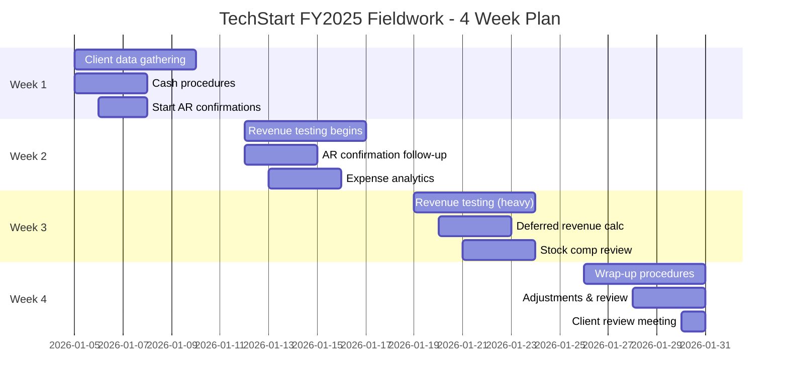

# 📊 Year-End Fieldwork Process

## Overview

Year-end fieldwork is the heart of the audit - where auditors execute planned procedures, gather evidence, test account balances, and draw conclusions. This intensive phase transforms planning and risk assessment into concrete audit work that supports the audit opinion.

:::info Process Duration
**Timeline:** 3-4 weeks in January (for December year-end)  
**Primary Roles:** <span className="role-badge senior-auditor">Senior Auditor</span> + <span className="role-badge staff-auditor">Staff Auditor</span>  
**Oversight:** <span className="role-badge manager">Manager</span>  
**Key Output:** Completed audit procedures with sufficient appropriate evidence
:::

---

## 🎯 Fieldwork Objectives

By the end of fieldwork, you will have:

✅ **Obtained sufficient appropriate evidence** for all material accounts  
✅ **Tested account balances** as of year-end date  
✅ **Performed analytical procedures** to identify unusual trends  
✅ **Completed cut-off testing** for proper period recognition  
✅ **Identified and communicated adjustments** to client  
✅ **Documented all findings** in workpapers  
✅ **Assessed going concern** and subsequent events  
✅ **Prepared for partner review** and completion phase

---

## 📊 Fieldwork Timeline



---

## 📋 Fieldwork Execution - Step by Step

### Week 1: Foundation & Simple Procedures

**Day 1 - Monday, January 5, 2026**

```
📅 FIELDWORK DAY 1 - KICKOFF
━━━━━━━━━━━━━━━━━━━━━━━━━━━━━━━━━━━━━━━━━━━━━━

LOCATION: TechStart office (on-site)
TEAM: Sarah (Senior), Emma (Staff)
CLIENT CONTACT: Lisa Chen (CFO)

8:30 AM - ARRIVAL & SETUP
━━━━━━━━━━━━━━━━━━━━━━━━━━━━━━━━━━━━━━━━━━━━━━

Emma and Sarah arrive at TechStart office
Conference room setup with laptops, files, supplies
Connect to WiFi, access CloudAudit Pro

9:00 AM - KICKOFF MEETING WITH LISA
━━━━━━━━━━━━━━━━━━━━━━━━━━━━━━━━━━━━━━━━━━━━━━

Sarah: "Good morning Lisa! Ready to dive in?"

Lisa: "As ready as I'll ever be! I uploaded the final 
trial balance to the portal last night."

Sarah: "Perfect. Here's our game plan for this week:

WEEK 1 PRIORITIES:
• Cash procedures (today-Wednesday)
• Send AR confirmations (today)
• Fixed assets (Wednesday-Thursday)
• Start expense testing (Thursday-Friday)

We'll be on-site Monday-Wednesday, then remote rest of 
the week unless we need to come back."

Lisa: "Sounds good. I'll be around all week if you need 
anything."

9:30 AM - OBTAIN FINAL TRIAL BALANCE
━━━━━━━━━━━━━━━━━━━━━━━━━━━━━━━━━━━━━━━━━━━━━━

Emma downloads December 31, 2025 trial balance from portal

TECHSTART INC - TRIAL BALANCE
As of December 31, 2025

ASSETS:
Cash - Operating          $   620,000
Cash - Payroll                150,000
Cash - Savings                 30,000
Accounts Receivable         1,180,000
Allowance for Doubtful         (25,000)
Prepaid Expenses               45,000
Deferred Costs                220,000
Fixed Assets                  480,000
Accumulated Depreciation     (180,000)
                          ___________
Total Assets              $ 2,520,000

LIABILITIES:
Accounts Payable          $   580,000
Accrued Expenses              125,000
Deferred Revenue            3,620,000
Stock Comp Liability          485,000
                          ___________
Total Liabilities         $ 4,810,000

EQUITY:
Common Stock              $    50,000
Additional Paid-in Capital  2,100,000
Retained Earnings          (4,440,000)
                          ___________
Total Equity              $(2,290,000)

TOTAL L + E               $ 2,520,000

REVENUE:
Subscription Revenue      $(11,800,000)
Implementation Revenue       (320,000)
Training Revenue             (180,000)
                          ____________
Total Revenue             $(12,300,000)

EXPENSES:
Cost of Revenue           $  1,920,000
Sales & Marketing            4,850,000
R&D                          3,100,000
G&A                          1,680,000
Stock Compensation             485,000
Depreciation                   95,000
                          ____________
Total Expenses            $ 12,130,000

NET INCOME (LOSS)         $  (170,000)

Emma: "Trial balance received. Total assets $2.52M, 
total revenue $12.3M. Within 3% of our preliminary 
materiality calculation."

Sarah: "Good. Let's confirm materiality is still 
appropriate before we go too far."

10:00 AM - FOOT & CROSS-FOOT TRIAL BALANCE
━━━━━━━━━━━━━━━━━━━━━━━━━━━━━━━━━━━━━━━━━━━━━━

Emma performs basic mathematical accuracy tests:

PROCEDURE: Foot Trial Balance
- Sum all debit balances: $2,520,000 ✓
- Sum all credit balances: $2,520,000 ✓
- Verify debits = credits: Equal ✓

PROCEDURE: Agree TB to General Ledger
- Export GL from QuickBooks
- Tie each account to GL
- All amounts agree ✓

Time: 0.5 hours
Result: TB mathematically accurate
```

**Cash Procedures - Days 1-2:**

```
💰 CASH AUDIT PROCEDURES
━━━━━━━━━━━━━━━━━━━━━━━━━━━━━━━━━━━━━━━━━━━━━━

EMMA'S WORKPAPER: Cash - Operating Account

CLIENT: TechStart Inc
PERIOD: December 31, 2025
ACCOUNT: Cash - Operating (Wells Fargo #4523)

BALANCE PER CLIENT TB: $620,000

PROCEDURES PERFORMED:
━━━━━━━━━━━━━━━━━━━━━━━━━━━━━━━━━━━━━━━━━━━━━━

1. BANK CONFIRMATION

Sent confirmation to: Wells Fargo Bank
Date sent: January 5, 2026
Response received: January 8, 2026 ✓

Bank confirmation shows:
Account #: ****4523
Balance: $620,000 as of 12/31/25 ∞

Agreed to client balance ✓

2. BANK RECONCILIATION TEST

Obtained client's December 31 bank reconciliation:

Balance per bank               $620,000 ®
Add: Deposits in transit        45,000 Δ
Less: Outstanding checks       (45,000) Δ
                              ________
Balance per books              $620,000 √

Tested deposits in transit:
- $45K deposit dated 12/31, cleared bank 1/2/26 ✓

Tested outstanding checks:
- Reviewed January bank statement
- All outstanding checks cleared in January ✓
- No checks outstanding > 6 months ✓

3. CUT-OFF TESTING

Selected last 5 days of December + first 5 days of January:

December receipts:
12/27: $125,000 - Stripe batch (monthly billing) ✓
12/28: $ 42,000 - Wire from Enterprise customer ✓
12/29: $ 18,000 - Stripe batch ✓
12/30: $ 85,000 - Annual subscription (ABC Corp) ✓
12/31: $ 45,000 - In transit, cleared 1/2 ✓

All December receipts properly recorded in December ✓

January receipts (first 5 days):
1/2: $38,000 - Stripe batch (recorded in Jan) ✓
1/3: $22,000 - Customer payment (recorded in Jan) ✓
1/4: $95,000 - Large annual renewal (recorded in Jan) ✓

No December receipts recorded in January ✓
No January receipts recorded in December ✓

Cut-off is proper ✓

4. KITING TEST

Reviewed transfers between bank accounts near year-end:
- No unusual transfers identified
- No evidence of kiting ✓

CONCLUSION:
━━━━━━━━━━━━━━━━━━━━━━━━━━━━━━━━━━━━━━━━━━━━━━

Cash balance of $620,000 for Operating account is 
fairly stated as of December 31, 2025.

No exceptions noted.

TICK MARKS:
® = Obtained from client
∞ = Agreed to bank confirmation
Δ = Agreed to January bank statement
√ = Footed/calculated
✓ = Verified

Prepared by: Emma Thompson, Staff Auditor
Date: January 6, 2026
Time: 2.5 hours

Reviewed by: Sarah Williams, Senior Auditor
Date: January 7, 2026
```

---

### Week 2: Volume Testing & Confirmations

**Accounts Receivable Confirmations:**

```
📧 AR CONFIRMATION PROCESS
━━━━━━━━━━━━━━━━━━━━━━━━━━━━━━━━━━━━━━━━━━━━━━

EMMA'S PROCEDURE: AR Confirmations

CLIENT: TechStart Inc
BALANCE: $1,180,000 (gross AR)

SAMPLE SELECTION:
━━━━━━━━━━━━━━━━━━━━━━━━━━━━━━━━━━━━━━━━━━━━━━

Total customers with AR balance: 347
Sample size: 25 customers
Selection method: Random sample, stratified by size

STRATIFICATION:
Large (>$50K): 8 customers = $685,000 (58%)
Medium ($10K-$50K): 10 customers = $245,000 (21%)
Small (<$10K): 7 customers = $42,000 (4%)
                              ________
Total sample coverage:        $972,000 (82%)

CONFIRMATION PROCESS:
━━━━━━━━━━━━━━━━━━━━━━━━━━━━━━━━━━━━━━━━━━━━━━

DAY 1 (Jan 5): Prepare confirmation letters
- Emma drafts letters in CloudAudit Pro
- Sarah reviews
- Lisa approves sending

DAY 2 (Jan 6): Send confirmations
- Sent via email through portal
- 25 confirmations sent

DAY 8 (Jan 12): First responses received
- 15 responses received (60%)
- 12 confirmations agree ✓
- 3 confirmations have exceptions (noted below)

DAY 12 (Jan 16): Second request sent
- Sent to 10 non-responders
- 6 additional responses received (24%)

DAY 15 (Jan 19): Final follow-up
- Called 4 remaining non-responders
- 2 more responses via phone (8%)
- 2 still non-responsive (8%)

FINAL RESULTS:
Total sent: 25
Confirmed with agreement: 18 (72%)
Confirmed with exceptions: 3 (12%)
Non-responses (alt procedures): 4 (16%)

EXCEPTIONS ANALYSIS:
━━━━━━━━━━━━━━━━━━━━━━━━━━━━━━━━━━━━━━━━━━━━━━

EXCEPTION #1: Customer XYZ Corp
Our balance: $45,000
Customer balance: $40,000
Difference: $5,000

Investigation:
- Reviewed December billing
- Found $5K credit memo issued 12/30 for service issue
- Credit memo properly recorded in TechStart books
- Customer hadn't processed credit yet (timing)

Resolution: Timing difference, no adjustment needed ✓

EXCEPTION #2: Customer ABC Industries  
Our balance: $32,000
Customer balance: $0
Difference: $32,000

Investigation:
- Customer claims they paid on 12/28
- Reviewed cash receipts
- Found $32K deposit on 12/28, but not applied to AR
- Payment sitting in Undeposited Funds account

Resolution: Adjustment needed! ⚠️

PROPOSED ADJUSTMENT:
Dr. AR - ABC Industries    $32,000
   Cr. Undeposited Funds           $32,000

To properly classify payment received 12/28

Impact: Reduces AR by $32K (less than PM of $45K)
Communicated to Lisa: Yes, approved adjustment

EXCEPTION #3: Customer DEF LLC
Our balance: $18,000  
Customer balance: $18,000 ✓
BUT: Customer notes invoice is "under dispute"

Investigation:
- Called Lisa to discuss
- Customer claims implementation incomplete
- TechStart position: Work completed, invoice valid
- Potential collection issue

Resolution: No adjustment to balance, but add to 
allowance for doubtful accounts analysis

ALTERNATIVE PROCEDURES (Non-responses):
━━━━━━━━━━━━━━━━━━━━━━━━━━━━━━━━━━━━━━━━━━━━━━

For 4 non-responses totaling $87,000:

Customer A ($42,000):
- Reviewed subsequent cash receipt in January ✓
- $42K paid in full on 1/15/26
- Valid receivable

Customer B ($28,000):
- Reviewed invoice and contract
- Reviewed email correspondence
- Customer active on platform (usage data)
- Valid receivable

Customer C ($12,000):
- Reviewed subsequent payment (partial $6K on 1/20)
- Reviewed aging (current, not past due)
- Valid receivable

Customer D ($5,000):
- Reviewed invoice
- Subsequent payment $5K on 1/8/26
- Valid receivable

All alternative procedures satisfactory ✓

CONCLUSION:
━━━━━━━━━━━━━━━━━━━━━━━━━━━━━━━━━━━━━━━━━━━━━━

Gross AR of $1,180,000 is fairly stated, subject to:
1. Adjustment for $32K misclassification (ABC Industries)
2. Consideration in allowance analysis (DEF LLC dispute)

Adjusted AR: $1,148,000

Prepared by: Emma Thompson
Reviewed by: Sarah Williams
Time: 12 hours over 2 weeks
```

---

### Week 3: Complex & High-Risk Areas

**Revenue Recognition Testing (Sarah's Work):**

```
💰 REVENUE TESTING - SIGNIFICANT RISK AREA
━━━━━━━━━━━━━━━━━━━━━━━━━━━━━━━━━━━━━━━━━━━━━━

SARAH'S WORKPAPER: Revenue Recognition

CLIENT: TechStart Inc
PERIOD: Year ended December 31, 2025
BALANCE: $12,300,000

RISK ASSESSMENT: 🔴 SIGNIFICANT RISK
- Complex ASC 606 application
- Subscription timing judgment
- First year applying standard
- Material to financial statements
- Funding pressure (fraud risk)

AUDIT APPROACH: Substantive+
Hours budgeted: 45 hours
Actual hours: 48 hours (6% over budget)

PROCEDURES PERFORMED:
━━━━━━━━━━━━━━━━━━━━━━━━━━━━━━━━━━━━━━━━━━━━━━

1. REVENUE RECOGNITION POLICY REVIEW

Obtained and reviewed TechStart's revenue policy:
- Subscription revenue: Recognized ratably over term
- Annual subscriptions: Deferred and recognized monthly
- Implementation services: Recognized upon completion
- Training: Recognized when delivered

Assessment: Policy appears reasonable under ASC 606

However: Policy documentation is informal (Word doc, 
not formally approved by board)

Recommendation: Formalize policy with board approval

2. CONTRACT REVIEW (ASC 606 5-STEP ANALYSIS)

Sample: 40 contracts selected (increased from typical 25)
- All multi-year contracts (15 contracts) = 100%
- Top 20 customers by revenue
- Random sample of 5 additional contracts

For each contract, performed ASC 606 analysis:

STEP 1: Identify the contract
STEP 2: Identify performance obligations
STEP 3: Determine transaction price
STEP 4: Allocate price to performance obligations
STEP 5: Recognize revenue when obligations satisfied

EXAMPLE - ABC CORP CONTRACT:

Contract Date: January 15, 2025
Contract Term: 3 years (Jan 2025 - Dec 2027)
Total Value: $180,000 ($5,000/month)
Payment: Annual upfront ($60,000/year)

ASC 606 ANALYSIS:
Step 1: Valid contract ✓ (signed by both parties)
Step 2: Performance obligation = SaaS platform access
Step 3: Transaction price = $180,000 over 3 years
Step 4: Single obligation, no allocation needed
Step 5: Recognize $5,000/month over 36 months

CLIENT'S TREATMENT:
Year 1 revenue recognized: $60,000 (12 months × $5K) ✓
Deferred revenue 12/31/25: $120,000 ✓

AUDIT CONCLUSION: Proper recognition ✓

[Similar analysis for all 40 contracts...]

FINDINGS FROM CONTRACT REVIEW:
━━━━━━━━━━━━━━━━━━━━━━━━━━━━━━━━━━━━━━━━━━━━━━

FINDING #1: Revenue recognized too early (3 contracts)

Contracts: DEF Industries, GHI Corp, JKL LLC
Issue: Annual subscriptions recognized entirely upfront 
instead of deferred

Example - DEF Industries:
Contract date: December 15, 2025
Term: 12 months (Dec 2025 - Nov 2026)
Payment: $36,000 paid upfront
Client treatment: Recognized $36,000 in December 2025

Correct treatment: 
December 2025: $3,000 (1 month)
Deferred: $33,000 (11 months in 2026)

Total error across 3 contracts: $78,000 over-recognized

PROPOSED ADJUSTMENT #1:
Dr. Revenue                    $78,000
   Cr. Deferred Revenue                $78,000

To defer revenue for subscriptions extending into 2026

Impact: Material! ($78K > PM of $45K)
Client notification: Discussed with Lisa 1/22/26
Client response: Agrees, will post adjustment

━━━━━━━━━━━━━━━━━━━━━━━━━━━━━━━━━━━━━━━━━━━━━━

FINDING #2: Implementation revenue timing

2 contracts with implementation services bundled

Example - MNO Enterprises:
Contract: $120,000 total
- Subscription: $100,000 (annual)
- Implementation: $20,000 (one-time)

Client treatment: All $120K recognized in Q1 2025

Correct treatment:
- Implementation: $20K upon completion (3/15/25) ✓
- Subscription: $100K ratably over 12 months ✓

Review: Client treatment correct ✓

━━━━━━━━━━━━━━━━━━━━━━━━━━━━━━━━━━━━━━━━━━━━━━

3. CUT-OFF TESTING

Tested last 2 weeks of December + first 2 weeks of Jan:

DECEMBER REVENUE (Last 2 weeks):
- Reviewed 28 transactions totaling $1.2M
- All properly recorded in December ✓
- No premature recognition identified

JANUARY REVENUE (First 2 weeks):
- Reviewed 32 transactions totaling $980K
- All properly recorded in January ✓
- No December revenue delayed into January

Cut-off testing: No exceptions ✓

4. ANALYTICAL PROCEDURES

Month-over-month trend analysis:

    MRR (Monthly Recurring Revenue):
    Jan: $980K
    Feb: $985K
    Mar: $992K
    Apr: $1.01M
    May: $1.03M
    Jun: $1.04M
    Jul: $1.06M
    Aug: $1.08M
    Sep: $1.09M
    Oct: $1.11M
    Nov: $1.13M
    Dec: $1.15M

Analysis: Consistent growth, no unusual spikes ✓

Compared to customer count growth:
Jan: 720 customers
Dec: 805 customers
Growth: 12% customer increase

Revenue growth: 17% ($980K → $1.15M MRR)
Explanation: Customer growth + price increases ✓

Comparison to industry (SaaS benchmarks):
TechStart revenue growth: 50% YoY
Industry avg: 40-60% for Series A stage
Assessment: Within normal range ✓

5. CUSTOMER CONFIRMATIONS

(See AR confirmation workpaper)
25 customers confirmed balances and subscription terms
No revenue recognition exceptions from confirmations ✓

CONCLUSION:
━━━━━━━━━━━━━━━━━━━━━━━━━━━━━━━━━━━━━━━━━━━━━━

Revenue is fairly stated, subject to adjustment:

Reported revenue: $12,300,000
Adjustment #1:       (78,000) - Defer to 2026
                   __________
Adjusted revenue:  $12,222,000

Remaining audit difference: $78,000 (passed to 
summary of uncorrected misstatements)

Actually, no - client agreed to adjust. So:

Adjusted revenue: $12,222,000 ✓

SIGNIFICANT DEFICIENCY IDENTIFIED:
Informal revenue recognition process and documentation
Recommendation: Implement formal policy, board approval, 
systematic contract review process

Prepared by: Sarah Williams, Senior Auditor
Date: January 24, 2026
Time: 48 hours
Reviewed by: Mike Johnson, Manager
Date: January 25, 2026
```

---

### Week 4: Wrap-Up & Adjustments

**Final Week Activities:**

```
🏁 FIELDWORK WRAP-UP - WEEK 4
━━━━━━━━━━━━━━━━━━━━━━━━━━━━━━━━━━━━━━━━━━━━━━

MONDAY 1/26 - REMAINING PROCEDURES
━━━━━━━━━━━━━━━━━━━━━━━━━━━━━━━━━━━━━━━━━━━━━━

Sarah completes stock-based compensation review
Emma finishes expense testing
Both complete final analytical procedures

TUESDAY 1/27 - SUBSEQUENT EVENTS
━━━━━━━━━━━━━━━━━━━━━━━━━━━━━━━━━━━━━━━━━━━━━━

Sarah performs subsequent events procedures:

1. REVIEW POST-YEAR-END TRANSACTIONS
   - Reviewed Jan 1-27 transactions
   - No unusual items identified
   
2. INQUIRE OF MANAGEMENT
   
   Sarah to Lisa: "Any significant events since year-end?"
   
   Lisa: "Actually yes - we signed the Series A term sheet 
   last week! $10M investment, should close in March."
   
   Sarah: "Congratulations! That's great news. We'll need 
   to disclose that in the notes to the financial statements."
   
3. REVIEW BOARD MINUTES
   - Reviewed January board meeting minutes
   - Series A discussions documented
   - No other significant matters
   
4. SEARCH FOR LITIGATION
   - Reviewed legal invoices
   - Inquiry of management
   - No pending litigation identified

SUBSEQUENT EVENTS CONCLUSION:
One disclosure required: Series A funding ($10M)
No Type 1 events requiring adjustment

WEDNESDAY 1/28 - ADJUSTMENTS REVIEW
━━━━━━━━━━━━━━━━━━━━━━━━━━━━━━━━━━━━━━━━━━━━━━

Sarah prepares summary of proposed adjustments:

SUMMARY OF AUDIT ADJUSTMENTS
Client: TechStart Inc

PROPOSED ADJUSTMENTS (Client to record):

AJE #1: Revenue Cut-off
Dr. Revenue                    $78,000
   Cr. Deferred Revenue                $78,000
To defer revenue for contracts extending into 2026
Impact: Decreases revenue, increases deferred revenue
Status: AGREED by client ✓

AJE #2: AR Reclassification  
Dr. AR - ABC Industries        $32,000
   Cr. Undeposited Funds               $32,000
To properly classify payment received 12/28
Impact: Increases AR, decreases cash equiv
Status: AGREED by client ✓

AJE #3: Stock Compensation Accrual
Dr. Stock Compensation Expense $12,000
   Cr. Stock Comp Liability            $12,000
To record Q4 vesting not accrued
Impact: Increases expense and liability
Status: AGREED by client ✓

TOTAL IMPACT ON NET INCOME:
Revenue adjustment:    $(78,000)
Stock comp adjustment: $(12,000)
                       ________
Total impact:          $(90,000)

Pre-adjustment net loss:  $(170,000)
Post-adjustment net loss: $(260,000)

Sarah emails to Lisa for review

THURSDAY 1/29 - CLIENT ADJUSTMENT POSTING
━━━━━━━━━━━━━━━━━━━━━━━━━━━━━━━━━━━━━━━━━━━━━━

Lisa posts adjustments in QuickBooks

Lisa to Sarah: "All three adjustments posted. Updated 
trial balance uploaded to portal."

Sarah downloads and reviews:
- All adjustments properly recorded ✓
- Trial balance still foots ✓
- Amounts agree to audit workpapers ✓

FRIDAY 1/30 - FINAL CLIENT MEETING
━━━━━━━━━━━━━━━━━━━━━━━━━━━━━━━━━━━━━━━━━━━━━━

ATTENDEES:
- Mike Johnson (Manager, Acme CPA)
- Sarah Williams (Senior, Acme CPA)
- Lisa Chen (CFO, TechStart)
- David Park (CEO, TechStart)

AGENDA:

1. FIELDWORK RECAP (Mike)
   
   "We've completed our fieldwork. Overall, your 
   financials are in good shape. We identified three 
   adjustments, which Lisa has posted."

2. ADJUSTMENTS REVIEW (Sarah)
   
   Walks through each adjustment with explanations
   
   David: "The revenue adjustment - that's concerning. 
   How did we miss that?"
   
   Sarah: "ASC 606 is complex, and you're in your first 
   year applying it. This is exactly why you have an 
   audit - to catch these things before they become issues 
   with investors."
   
   Lisa: "I've already updated my spreadsheet to prevent 
   this going forward."

3. FINDINGS & RECOMMENDATIONS (Mike)
   
   CONTROL DEFICIENCY #1:
   Weak segregation of duties (small team)
   Recommendation: Hire controller
   
   CONTROL DEFICIENCY #2:
   Informal revenue recognition policy
   Recommendation: Formalize with board approval
   
   CONTROL DEFICIENCY #3:
   Manual deferred revenue tracking
   Recommendation: Consider revenue recognition software
   
   David: "We're planning to hire a controller in Q2 
   with the Series A funds. Good to know that's validated 
   by the audit."

4. NEXT STEPS (Mike)
   
   "We're moving into our final review phase. Jordan 
   (partner) will review everything over the next week. 
   We should have a draft report to you by February 10.
   
   One thing we'll need: Management representation letter. 
   I'll send you a draft next week to review."

5. QUESTIONS
   
   Lisa: "When will the final report be ready?"
   
   Mike: "Targeting February 15. That gives you time 
   before your Series A closes in March."
   
   David: "Perfect. Thanks for all your work on this."

MEETING END: 11:30 AM

Fieldwork substantially complete! ✓
```

---

## 📊 Fieldwork Completion Summary

### Final Statistics

```
📈 FIELDWORK METRICS - TECHSTART FY2025
━━━━━━━━━━━━━━━━━━━━━━━━━━━━━━━━━━━━━━━━━━━━━━

HOURS SUMMARY:
┌─────────────────┬──────────┬────────┬──────────┐
│ ROLE            │ BUDGETED │ ACTUAL │ VARIANCE │
├─────────────────┼──────────┼────────┼──────────┤
│ Partner         │    15    │   16   │  +1 (7%) │
│ Manager         │    40    │   42   │  +2 (5%) │
│ Senior          │    70    │   78   │ +8 (11%) │
│ Staff           │    65    │   61   │  -4 (6%) │
├─────────────────┼──────────┼────────┼──────────┤
│ TOTAL           │   190    │  197   │  +7 (4%) │
└─────────────────┴──────────┴────────┴──────────┘

Budget variance: 4% over (acceptable)
Primary variance: Revenue testing (complex)

PROCEDURES COMPLETED:
✅ Cash: 3 accounts confirmed and tested
✅ AR: 25 confirmations sent, 21 responses
✅ Revenue: 40 contracts reviewed (ASC 606)
✅ Deferred Revenue: Recalculated independently
✅ Stock Compensation: All grants tested
✅ Fixed Assets: Additions verified, depreciation tested
✅ AP: 30 transactions tested, unrecorded search
✅ Expenses: Analytics + 28 samples
✅ Payroll: Analytics (via Gusto)
✅ Subsequent events: Reviewed through 1/27/26

ADJUSTMENTS IDENTIFIED:
3 proposed adjustments
Total impact: $(90,000) on net income
All adjustments AGREED by client ✓

CONTROL DEFICIENCIES:
3 deficiencies noted
Will be communicated in management letter
Management action plans obtained

SUBSEQUENT EVENTS:
1 disclosure required: Series A funding
Type 2 event (non-adjusting)

FIELDWORK STATUS: ✅ COMPLETE
READY FOR: Partner review and finalization
```

---

## 💡 Fieldwork Best Practices

:::tip Lessons from Experienced Auditors

**1. Stay Organized**
Use CloudAudit Pro to track progress daily. Nothing worse than scrambling at the end to figure out what's done.

**2. Communicate Early and Often**
Don't wait until the end to tell the client about findings. Real-time communication prevents surprises.

**3. Document As You Go**
Complete workpapers daily, not at the end. Your memory fades fast!

**4. Review Workpapers Daily**
Sarah should review Emma's work each evening. Catches errors early before they compound.

**5. Be Flexible But Focused**
Issues will come up. Adjust the plan but don't lose sight of objectives.

**6. Build Client Relationships**
Fieldwork is your chance to really understand the client's business. Ask questions beyond the audit.

**7. Watch the Budget**
Track hours daily. If going over, communicate to Mike immediately so he can adjust.

**8. Quality Over Speed**
Better to spend an extra day doing it right than to rush and miss something material.

**9. Take Breaks**
Fieldwork is intense. Regular breaks prevent burnout and improve work quality.

**10. Celebrate Progress**
Completing a big section like revenue? Take 5 minutes to acknowledge the accomplishment!

:::

---

## 📚 Related Documentation

- [Engagement Planning Process](./engagement-planning) - How fieldwork plan was developed
- [Risk Assessment Process](./risk-assessment) - Why we tested what we tested
- [Interim Testing Process](./interim-testing) - Work completed before year-end
- [Review & Quality Control](./review-quality-control) - What happens next
- [Finalization & Reporting](./finalization-reporting) - Final steps

---

*Fieldwork: where planning meets execution and audit evidence comes to life!* 📊

---

*Last Updated: January 1, 2026*
